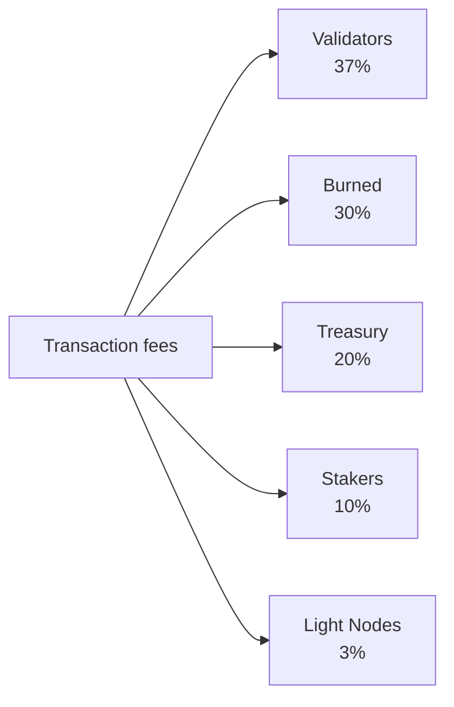

# トークノミクス

QoreChain は、ネイティブの **QOR** トークンを中心とした**固定供給型**の経済モデルを採用しています。時間とともに供給量をインフレーションさせるのではなく、ネットワークは有限の事前割り当て発行予算からステーキング報酬を賄い、その一方で、ネットワーク利用の拡大に伴って多チャネルのバーンエンジンが持続的なデフレ圧力を加えます。

---

## トークンの基本

| プロパティ            | 値                                                       |
| --------------------- | -------------------------------------------------------- |
| **表示トークン**       | QOR                                                      |
| **基本単位**           | uqor                                                     |
| **小数精度**           | 10^6 (1 QOR = 1,000,000 uqor)                            |
| **総供給量**           | 4,500,000,000 QOR (固定)                                 |
| **チェーン ID**        | `qorechain-vladi` (メインネット、EVM チェーン ID 9801)   |
| **Bech32 プレフィックス** | `qor` (アカウント: `qor1...`、バリデーター: `qorvaloper...`) |

:::note
このページの数値は、チェーンバージョン **v3.1.77** で 2026 年 6 月 7 日以降稼働している**メインネット** (`qorechain-vladi`、EVM チェーン ID **9801**) を説明しています。**`qorechain-diana`** テストネット (EVM チェーン ID **9800**) は同じ経済モデルを共有しています。
:::

---

## 供給と発行モデル

QoreChain は **4,500,000,000 QOR の固定総供給量**を持ちます。供給量をインフレーションさせるために新しい QOR がミントされることはありません。代わりに:

* **80,000,000 QOR (供給量の 1.78%)** がトークン生成イベント (TGE) でバーンされました。
* ステーキング報酬は、**590,000,000 QOR の有限の発行予算**から、逓減スケジュールに沿って時間をかけて取り崩される形で支払われます。

これは**有限の発行予算を持つ固定供給モデル**であり、供給量をインフレーションさせるモデルではありません。発行予算が枯渇すると、ガバナンスが残りの予算から割り当てる分を超えて、それ以上の報酬発行は発生しません。

### ステーキング報酬スケジュール {#staking-reward-schedule}

ステーキング報酬は、590,000,000 QOR の発行予算から逓減スケジュールに沿って分配されます:

| 期間        | 目標 APY                | 発行予算                          |
| ----------- | ----------------------- | -------------------------------- |
| 1 年目      | 8〜12% APY              | 127,500,000 QOR                  |
| 2 年目      | 6〜10% APY              | 106,250,000 QOR                  |
| 3〜4 年目   | 5〜8% APY               | 年あたり 85,000,000 QOR          |
| 5 年目以降  | ガバナンスによる決定    | 残り約 186,000,000 QOR           |

APY の範囲はボンド比率に依存する目標値です。発行予算の数値は、各期間にステーカーへ放出される QOR のハードキャップです。5 年目以降、残りの約 186,000,000 QOR はガバナンスが定めるレートで放出されます。

---

## x/burn — 多チャネルバーンエンジン

`x/burn` モジュールは、10 チャネルのトークンバーンシステムを実装しています。バーンされたすべてのトークンは流通供給量から恒久的に除去され、ネットワーク利用の拡大に伴って持続的なデフレ圧力を生み出します。

### バーンチャネル

| #  | チャネル            | ソース                     | 説明                                   |
| -- | ------------------ | -------------------------- | --------------------------------------------- |
| 1  | `gas_fee`          | トランザクション手数料           | すべてのガス手数料の 30% がバーンされる                |
| 2  | `contract_create`  | スマートコントラクトのデプロイ  | コントラクト作成ごとに一律 100 QOR の手数料をバーン |
| 3  | `ai_service`       | AI モジュール利用手数料         | AI サービス手数料の 50% をバーン                |
| 4  | `bridge_fee`       | クロスチェーンブリッジ手数料    | ブリッジ手数料の 100% をバーン                |
| 5  | `treasury_buyback` | トレジャリー運用             | トレジャリーからの定期的なバイバック＆バーン       |
| 6  | `failed_tx`        | 失敗したトランザクションのガス  | 失敗したトランザクションのガスの 10% をバーン    |
| 7  | `xqore_penalty`    | xQORE 早期退出ペナルティ | ペナルティ額をバーン経由でルーティング           |
| 8  | `auto_buyback`     | 自動バイバックプログラム  | プロトコルレベルの自動バーン        |
| 9  | `tge`              | トークン生成イベント     | 一度限りのジェネシスバーン (80,000,000 QOR)       |
| 10 | `rollup_create`    | ロールアップのデプロイ          | ロールアップ作成ステークの 1% をバーン            |

### 手数料の分配

ネットワークが徴収するすべてのトランザクション手数料は、以下のように 5 つの宛先に分配されます。シェアはオンチェーンで強制され、常に正確に 100% の合計になります。



ネットワークが徴収するすべてのトランザクション手数料は、5 つの宛先に分配されます:

| 受取先          | シェア | 説明                                                          |
| --------------- | ----- | -------------------------------------------------------------------- |
| **バリデーター**  | 37%   | アクティブなバリデーターセットにステークに比例して分配        |
| **バーン**      | 30%   | `gas_fee` バーンチャネルを通じて供給量から恒久的に除去       |
| **トレジャリー**    | 20%   | ガバナンス主導の支出のためにコミュニティトレジャリーに割り当て |
| **ステーカー**     | 10%   | すべての QOR ステーカーにデリゲーションに比例して分配         |
| **ライトノード** | 3%    | ネットワークデータを提供するライトノードに分配                  |

シェアはオンチェーンで強制され、常に正確に 100% の合計でなければなりません。

### バーンパラメータ

| パラメータ             | デフォルト                  | 説明                              |
| ---------------------- | -------------------------- | ---------------------------------------- |
| `gas_burn_rate`        | 0.30                       | バーンされるガス手数料の割合 (30%)        |
| `contract_create_fee`  | 100,000,000 uqor (100 QOR) | コントラクト作成の一律バーン手数料      |
| `ai_service_burn_rate` | 0.50                       | バーンされる AI サービス手数料の割合 (50%) |
| `bridge_burn_rate`     | 1.00                       | バーンされるブリッジ手数料の割合 (100%)    |
| `failed_tx_burn_rate`  | 0.10                       | バーンされる失敗 TX ガスの割合 (10%)   |

各バーンイベントは、そのソース、額、ブロックの高さ、関連するトランザクションハッシュとともにオンチェーンで記録されます。集計統計は、チャネルごとおよび合計でクエリ可能です。

---

## x/xqore — ロック型ステーキングとガバナンス増幅

`x/xqore` モジュールは、譲渡不可能なロック型ステーキング派生物である **xQORE** を導入します。ユーザーは QOR をロックして 1:1 の比率で xQORE をミントします。xQORE 保有者は、増幅されたガバナンスパワーと、再分配される退出ペナルティのシェアを受け取ります。

### ロックメカニズム

* **ロック**: QOR を xQORE モジュールに送って 1:1 の比率で xQORE をミントします。
* **ガバナンスウェイト**: xQORE 保有者は、標準的な QOR ステーカーと比較して **2 倍のガバナンス投票力**を受け取ります。
* **譲渡不可**: xQORE はアカウント間で送信できません。ロックしたアドレスに紐づけられます。

### 退出ペナルティスケジュール

xQORE からの早期引き出しには、ロック期間とともに減少するペナルティが課せられます:

| ロック期間     | ペナルティ率 | 説明                                |
| -------------- | ------------ | ------------------------------------------ |
| &lt; 30 日     | **50%**      | ロックした QOR の半分が没収される            |
| 30 〜 90 日    | **35%**      | 短期ロックに対する大きなペナルティ   |
| 90 〜 180 日   | **15%**      | 中期コミットメントに対する軽減されたペナルティ |
| > 180 日       | **0%**       | ペナルティなしで全額引き出し            |

### PvP リベース再分配

早期退出から徴収されたペナルティは、単純に破棄されるわけではありません。代わりに、PvP (プレイヤー対プレイヤー) リベースモデルに従います:

1. ペナルティ額の **50%** がバーンされます (`xqore_penalty` チャネル経由で `x/burn` を通じてルーティング)。
2. **50%** が残りのすべての xQORE 保有者に按分で再分配されます。

これにより、長期保有者にとってのプラスサムなダイナミクスが生まれます。早期退出が起こるたびに、残りの xQORE ポジションの実効価値が増加します。リベースは **100 ブロック**ごとに発生します。

### xQORE パラメータ

| パラメータ              | デフォルト             | 説明                               |
| ----------------------- | ---------------------- | ----------------------------------------- |
| `governance_multiplier` | 2.0                    | xQORE 保有者の投票力乗数 |
| `min_lock_amount`       | 1,000,000 uqor (1 QOR) | ロックに必要な最小 QOR              |
| `penalty_burn_rate`     | 0.50                   | バーンされる退出ペナルティの割合 (50%)   |
| `rebase_interval`       | 100 blocks             | PvP リベースイベント間のブロック数          |
| `enabled`               | true                   | モジュール有効化フラグ                    |

---

## x/inflation — 発行予算スケジュール

モジュール名にもかかわらず、`x/inflation` モジュールは総供給量をインフレーション**させません**。有限の **590,000,000 QOR** 発行予算からのステーキング報酬の放出を、逓減する[ステーキング報酬スケジュール](#staking-reward-schedule)に従って統制します。発行はエポックごとに計算され、ステーカーとバリデーターに分配され、新しい供給をミントするのではなく事前割り当て予算を取り崩します。

### エポックの仕組み

* **エポック長**: 17,280 ブロック (5 秒ブロックタイムで \~1 日)
* **年あたりのブロック数**: \~6,311,520
* 各エポックの開始時に、現在の期間の予定された発行が発行予算から放出され、ステーカーとバリデーターに分配されます。
* エポックトラッカーは、現在のエポック番号、現在の年、開始ブロック、発行予算から放出された累積 QOR、残りの予算を記録します。

### インフレーションパラメータ

| パラメータ      | デフォルト          | 説明                                                |
| -------------- | ---------------- | ---------------------------------------------------------- |
| `schedule`     | declining        | 期間インデックス化された発行予算 (ステーキング報酬スケジュールを参照) |
| `epoch_length` | 17,280 blocks    | 発行エポックあたりのブロック数                                  |
| `enabled`      | true             | モジュール有効化フラグ                                       |

---

## デフレダイナミクス

供給量が固定され、発行が有限予算から取り崩されるため、QoreChain の純トークンダイナミクスは、採用が拡大するにつれてデフレ傾向になります:

```
Years 1-2:  Larger scheduled emissions from the budget offset burns → near-neutral supply
Years 3-4:  Scheduled emissions decline; burn volume grows with usage → convergence
Year 5+:    Emission budget is largely drawn down; burn channels (gas, bridge,
            contracts, rollups) scale with transaction volume → net deflationary
```

10 のバーンチャネルにより、すべての主要なネットワーク活動が供給からトークンを除去することが保証されます。トランザクション量、ブリッジ利用、AI サービス呼び出し、ロールアップのデプロイが増加するにつれて、累積バーンが加速する一方で、予定された発行は有限予算の終わりに向けて減少します。

---

## モジュールライフサイクルの順序

経済モジュールは、各ブロックの `EndBlocker` 中に特定の順序で実行されます:

```
x/burn → x/xqore → x/inflation → x/rlconsensus
```

1. **x/burn** — 保留中のバーンレコードを処理し、集計統計を更新します。
2. **x/xqore** — PvP リベースを実行し (`rebase_interval` ブロックごと)、ペナルティをバーンにルーティングします。
3. **x/inflation** — エポック境界で予算から予定されたステーキング報酬の発行を放出します。
4. **x/rlconsensus** — PRISM の強化学習シグナルに基づいてコンセンサスパラメータを調整します。

この順序により、リベースの前にバーンがファイナライズされ、予定された発行が放出される前にリベースが完了することが保証され、一貫した経済状態遷移が維持されます。

## 関連項目

* [チェーンパラメータ](/appendix/chain-parameters) — 正規の経済およびコンセンサスのデフォルト値。
* [ステーキングとデリゲーション](/user-guide/staking-and-delegation) — QOR をデリゲートして報酬を獲得します。
* [xQORE ステーキング](/user-guide/xqore-staking) — PvP リベースステーキングメカニズム。
* [ライトノード報酬](/light-node/rewards-and-monitoring) — ライトノードの報酬シェア。
