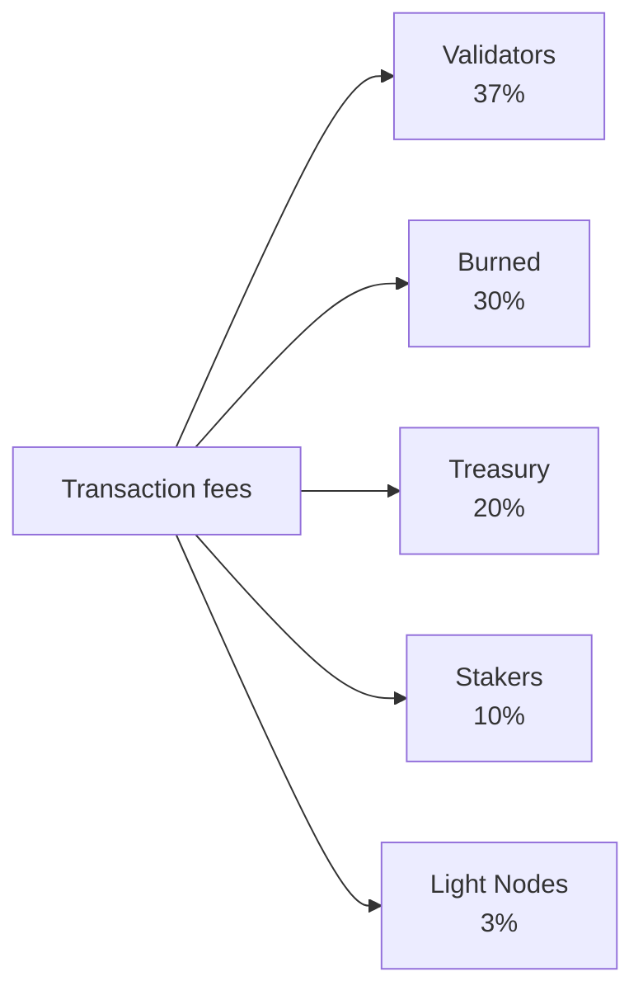

# トークノミクス

QoreChain は、ネイティブトークンである **QOR** を中心とした**固定供給**型の経済モデルを採用しています。時間の経過とともに供給量を増加させるのではなく、ネットワークは有限で事前に割り当てられたエミッション予算からステーキング報酬を賄い、同時にマルチチャネルのバーンエンジンがネットワーク利用の拡大に伴って持続的なデフレ圧力を生み出します。

---

## トークンの基本情報

| プロパティ              | 値                                                    |
| --------------------- | -------------------------------------------------------- |
| **表示トークン**     | QOR                                                      |
| **基本デノミネーション** | uqor                                                     |
| **小数精度** | 10^6（1 QOR = 1,000,000 uqor）                            |
| **総供給量**      | 4,500,000,000 QOR（固定）                                |
| **チェーンID**          | `qorechain-vladi`（メインネット、EVM チェーンID 9801）          |
| **Bech32 プレフィックス**     | `qor`（アカウント：`qor1...`、バリデーター：`qorvaloper...`） |

:::note
このページに記載されている数値は、2026年6月7日から稼働しているチェーンバージョン **v3.1.97** の**メインネット**（`qorechain-vladi`、EVM チェーンID **9801**）に関するものです。**`qorechain-diana`** テストネット（EVM チェーンID **9800**）も同じ経済モデルを共有しています。
:::

---

## 供給とエミッションモデル

QoreChain の総供給量は **4,500,000,000 QOR に固定**されています。供給量を増やすために新規に QOR がミントされることはありません。代わりに:

* トークン生成イベント（TGE）時に **80,000,000 QOR（供給量の 1.78%）**がバーンされました。
* ステーキング報酬は、時間の経過とともに逓減するスケジュールで引き出される**有限のエミッション予算 590,000,000 QOR** から支払われます。

これは**有限のエミッション予算を伴う固定供給モデル**であり、供給量のインフレモデルではありません。エミッション予算が使い果たされると、ガバナンスが残りの予算から割り当てる分を除き、それ以上の報酬エミッションは発生しません。

### ステーキング報酬スケジュール {#staking-reward-schedule}

:::note エミッションは2026年8月26日にガバナンスによって上限が設定されました
以下の逓減スケジュールは、供給量の大部分がボンドされた成熟したネットワークを対象とした当初の設計でした。実際のネットワークの状態（ボンドされた QOR は約 680万 QOR で、目標を大きく下回る水準）と比較すると、*1日あたり*ボンド済みステークの約20%が支払われている状態でした。ガバナンス提案 #4 はボンド済みステークの100%の賛成で可決され、ブロック高 2,122,074（2026-08-26 03:27 UTC、チェーンバージョン v3.1.94）で適用されました。エポックごとのエミッションは 2,153,583 QOR から **16,239 QOR** に引き下げられ、このモジュールに対して新たに **114,285,714 QOR** の厳格な累積上限が設けられました――これはバグ修正ではなく設計上の決定です。上限が発効した時点で、旧スケジュールの下ですでに **104,680,531 QOR（91.6%）がエミッション済み**でした。新しいレートでは、残りの残高はおよそあと**1年11か月**もつと見込まれており、その後このモジュールは恒久的にエミッションを停止し、バリデーター/ステーカー報酬は取引手数料のみから賄われるようになります（下記の[手数料分配](#fee-distribution)を参照）。以下の表は当初の設計上の参考値として残されていますが、現在の実際の支払いレートを表すものではありません。
:::

ステーキング報酬は、590,000,000 QOR のエミッション予算から逓減スケジュールに従って分配されます。

| 期間      | 目標 APY              | エミッション予算                  |
| ----------- | ----------------------- | -------------------------------- |
| 1年目      | 8〜12% APY               | 127,500,000 QOR                  |
| 2年目      | 6〜10% APY               | 106,250,000 QOR                  |
| 3〜4年目   | 5〜8% APY                | 年間 85,000,000 QOR          |
| 5年目以降     | ガバナンスによる決定   | 残り約186,000,000 QOR       |

APY の範囲は当初の期間ごとの設計目標であり、上記のとおりエミッションに上限が設けられた現在の実際の支払いレートではありません。QoreChain は現時点でライブの APY 数値を計算するためのクエリエンドポイントを提供していません。このページを含め、これまでに提示された具体的なステーキング利回りのパーセンテージは、現在のチェーンに対して検証不能な値として扱い、計画の根拠にしないでください。

---

## x/burn — マルチチャネルバーンエンジン

`x/burn` モジュールは、10チャネルのトークンバーンシステムを実装しています。バーンされたトークンはすべて流通供給から永久に除去され、ネットワーク利用の拡大に伴って持続的なデフレ圧力が生み出されます。

### バーンチャネル

| # | チャネル            | ソース                     | 説明                                   |
| -- | ------------------ | -------------------------- | --------------------------------------------- |
| 1  | `gas_fee`          | 取引手数料           | すべてのガス手数料の30%がバーンされる                |
| 2  | `contract_create`  | スマートコントラクトのデプロイ  | コントラクト作成ごとに定額100 QORの手数料がバーンされる |
| 3  | `ai_service`       | AI モジュール利用手数料       | AI サービス手数料の50%がバーンされる                 |
| 4  | `bridge_fee`       | クロスチェーンブリッジ手数料    | ブリッジ手数料の100%がバーンされる                    |
| 5  | `treasury_buyback` | トレジャリー運用        | トレジャリーからの定期的なバイバック＆バーン       |
| 6  | `failed_tx`        | 失敗した取引のガス     | 失敗した取引のガスの10%がバーンされる    |
| 7  | `xqore_penalty`    | xQORE の早期解約ペナルティ | ペナルティ額はバーンを経由してルーティングされる |
| 8  | `auto_buyback`     | 自動バイバックプログラム  | プロトコルレベルの自動バーン              |
| 9  | `tge`              | トークン生成イベント     | ジェネシス時の一回限りのバーン（80,000,000 QOR）       |
| 10 | `rollup_create`    | ロールアップのデプロイ          | ロールアップ作成ステークの1%がバーンされる             |

### 手数料分配 {#fee-distribution}

ネットワークが徴収するすべての取引手数料は、以下に示す5つの配分先に分割されます。この配分比率はオンチェーンで強制され、常に合計が正確に100%になります。


```mermaid
flowchart LR
    F["Transaction fees"]
    F --> V["Validators<br/>37%"]
    F --> B["Burned<br/>30%"]
    F --> T["Treasury<br/>20%"]
    F --> S["Stakers<br/>10%"]
    F --> L["Light Nodes<br/>3%"]
```

ネットワークが徴収するすべての取引手数料は、以下の5つの配分先に分割されます。

| 受取先       | 割合 | 説明                                                          |
| --------------- | ----- | ---------------------------------------------------------------------- |
| **バリデーター**  | 37%   | ステーク量に比例してアクティブなバリデーターセットに分配される        |
| **バーン**      | 30%   | `gas_fee` バーンチャネルを通じて供給から永久に除去される       |
| **トレジャリー**    | 20%   | ガバナンスが指示する支出のためコミュニティトレジャリーに割り当てられる |
| **ステーカー**     | 10%   | デレゲーション量に比例してすべての QOR ステーカーに分配される         |
| **ライトノード** | 3%    | ネットワークデータの提供に対してライトノードに分配される                  |

この配分比率はオンチェーンで強制され、常に合計が正確に100%になる必要があります。

:::note これらは設定済みの配分比率であり、確認済みのライブ計測値ではありません
上記の表は `x/burn` の設定済みパラメーターを反映したものです。実際のチェーン状態に対する計測作業では、バリデーターとステーカーの2行が合計する47%よりも、実際に両者に到達している実効的な合計割合が低いことが判明しました。この乖離についてはまだ独自に検証・整合を取れていないため、このページではどちらの数値も確認済みのライブ値として断定せず、設計上の設定値を記載しています。正確な現在の配分比率に依存する用途では、直接 `x/burn` のパラメーターと統計をクエリしてください（[REST/gRPC エンドポイント](/api-reference/rest-grpc-endpoints)を参照）。
:::

### バーンパラメーター

| パラメーター              | デフォルト値                    | 説明                              |
| ---------------------- | -------------------------- | ---------------------------------------- |
| `gas_burn_rate`        | 0.30                       | バーンされるガス手数料の割合（30%）        |
| `contract_create_fee`  | 100,000,000 uqor（100 QOR） | コントラクト作成に対する定額バーン手数料      |
| `ai_service_burn_rate` | 0.50                       | バーンされる AI サービス手数料の割合（50%） |
| `bridge_burn_rate`     | 1.00                       | バーンされるブリッジ手数料の割合（100%）    |
| `failed_tx_burn_rate`  | 0.10                       | バーンされる失敗取引ガスの割合（10%）   |

各バーンイベントは、そのソース、金額、ブロック高、および関連する取引ハッシュとともにオンチェーンで記録されます。集計統計はチャネルごとおよび合計でクエリ可能です。

---

## x/xqore — ロックステーキングとガバナンス増幅

`x/xqore` モジュールは、譲渡不可能なロックステーキング派生商品である **xQORE** を導入します。ユーザーは QOR をロックすることで、1:1 の比率で xQORE をミントします。xQORE 保有者は増幅されたガバナンス投票権と、再分配される解約ペナルティの分け前を受け取ります。

### ロックの仕組み

* **ロック**：QOR を xQORE モジュールに送ることで、1:1 の比率で xQORE をミントします。
* **ガバナンス重み**：xQORE 保有者は、標準的な QOR ステーカーと比較して **2倍のガバナンス投票権**を受け取ります。
* **譲渡不可**：xQORE はアカウント間で送金できません。ロックしたアドレスに紐付けられます。

### 解約ペナルティスケジュール

xQORE からの早期引き出しには、ロック期間が長いほど減少するペナルティが課されます。

| ロック期間  | ペナルティ率 | 説明                                |
| -------------- | ------------ | ------------------------------------------ |
| 30日未満   | **50%**      | ロックされた QOR の半分が没収される            |
| 30〜90日  | **35%**      | 短期ロックに対する高いペナルティ   |
| 90〜180日 | **15%**      | 中期コミットメントに対する軽減されたペナルティ |
| 180日超     | **0%**       | ペナルティなしの全額引き出し            |

### PvP リベース再分配

早期解約から徴収されたペナルティは、単純に消却されるわけではありません。代わりに、PvP（プレイヤー対プレイヤー）リベースモデルに従います。

1. ペナルティ額の **50%** がバーンされます（`xqore_penalty` チャネルを経由して `x/burn` にルーティングされます）。
2. **50%** が、残存するすべての xQORE 保有者に按分で再分配されます。

これは長期保有者にとってポジティブサムの力学を生み出します。早期解約が発生するたびに、残存する xQORE ポジションの実効価値が増加するのです。リベースは **100ブロック**ごとに発生します。

### xQORE パラメーター

| パラメーター               | デフォルト値                | 説明                               |
| ----------------------- | ---------------------- | ------------------------------------------ |
| `governance_multiplier` | 2.0                    | xQORE 保有者の投票権乗数 |
| `min_lock_amount`       | 1,000,000 uqor（1 QOR） | ロックに必要な最低 QOR 量              |
| `penalty_burn_rate`     | 0.50                   | バーンされる解約ペナルティの割合（50%）   |
| `rebase_interval`       | 100 ブロック             | PvP リベースイベント間のブロック数       |
| `enabled`               | true                   | モジュールの有効化フラグ                    |

---

## x/inflation — エミッション予算スケジュール

モジュール名にもかかわらず、`x/inflation` モジュールは総供給量を**インフレさせません**。このモジュールは、逓減する[ステーキング報酬スケジュール](#staking-reward-schedule)に従って、有限の **590,000,000 QOR** エミッション予算からステーキング報酬を放出することを管理します。エミッションはエポックごとに計算されてステーカーとバリデーターに分配され、新規供給をミントするのではなく、事前に割り当てられた予算を取り崩していきます。

### エポックの仕組み

* **エポック長**：17,280ブロック（ブロックタイム5秒で約1日）
* **年間ブロック数**：約6,311,520
* 各エポックの開始時に、現在の期間に予定されたエミッションがエミッション予算から放出され、ステーカーとバリデーターに分配されます。
* エポックトラッカーは、現在のエポック番号、現在の年、開始ブロック、エミッション予算から放出された累積 QOR、および残りの予算を記録します。

### インフレーションパラメーター

| パラメーター      | デフォルト値          | 説明                                                |
| -------------- | ---------------- | ---------------------------------------------------------- |
| `schedule`     | declining        | 期間ごとにインデックス化されたエミッション予算（ステーキング報酬スケジュールを参照） |
| `epoch_length` | 17,280 ブロック    | エミッションエポックあたりのブロック数                                  |
| `enabled`      | true             | モジュールの有効化フラグ                                     |

---

## デフレの力学

供給量が固定されており、エミッションが有限の予算から取り崩される仕組みであるため、採用が進むにつれて QoreChain の正味のトークン力学はデフレ方向に傾いていきます。

```
1〜2年目：  予算からのより大きな計画エミッションがバーンを相殺 → ほぼ供給が中立
3〜4年目：  計画エミッションが逓減し、利用拡大に伴いバーン量が増加 → 収斂
5年目以降： エミッション予算はほぼ取り崩され、バーンチャネル（ガス、ブリッジ、
            コントラクト、ロールアップ）が取引量に応じてスケール → 正味デフレ
```

10のバーンチャネルにより、主要なネットワーク活動のすべてがトークンを供給から除去することが保証されます。取引量、ブリッジ利用、AI サービス呼び出し、ロールアップのデプロイが増加するにつれて、有限予算の終盤に向けて計画エミッションが逓減する一方で、累積バーンは加速していきます。

---

## モジュールの実行順序

経済モジュールは、各ブロックの `EndBlocker` の中で特定の順序で実行されます。

```
x/burn → x/xqore → x/inflation → x/rlconsensus
```

1. **x/burn** — 保留中のバーン記録を処理し、集計統計を更新します。
2. **x/xqore** — （`rebase_interval` ブロックごとに）PvP リベースを実行し、ペナルティをバーンにルーティングします。
3. **x/inflation** — エポック境界で、予算から計画されたステーキング報酬エミッションを放出します。
4. **x/rlconsensus** — PRISM 強化学習シグナルに基づいてコンセンサスパラメーターを調整します。

この順序により、リベースの前にバーンが確定し、計画エミッションの放出の前にリベースが完了することが保証され、一貫した経済状態遷移が維持されます。

## 関連項目

* [チェーンパラメーター](/appendix/chain-parameters) — 経済およびコンセンサスの標準的なデフォルト値。
* [ステーキングとデレゲーション](/user-guide/staking-and-delegation) — QOR をデレゲートして報酬を得る。
* [xQORE ステーキング](/user-guide/xqore-staking) — PvP リベースステーキングの仕組み。
* [ライトノード報酬](/light-node/rewards-and-monitoring) — ライトノードの報酬分配。
