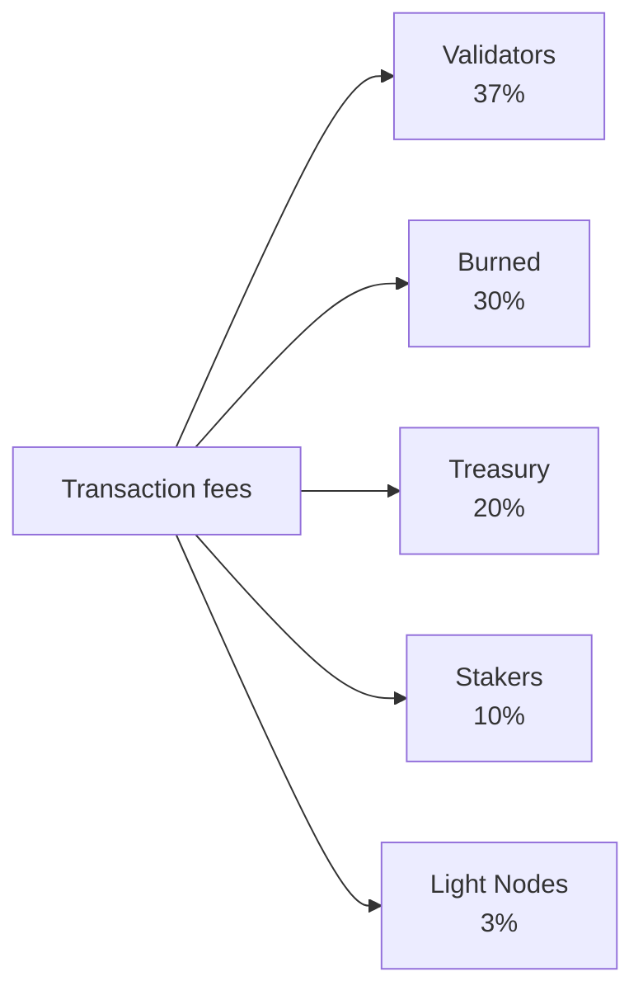

# トークノミクス

QoreChainは、ネイティブトークンである**QOR**を中心とした**固定供給量**の経済モデルを採用しています。時間の経過とともに供給量をインフレさせるのではなく、ネットワークは有限の事前割当済みエミッション予算からステーキング報酬を賄う一方、マルチチャネルのバーン(焼却)エンジンがネットワーク利用の拡大に伴って持続的なデフレ圧力を生み出します。

---

## トークンの基本情報

| プロパティ              | 値                                                    |
| --------------------- | -------------------------------------------------------- |
| **表示トークン**     | QOR                                                      |
| **基本デノミネーション** | uqor                                                     |
| **小数精度** | 10^6 (1 QOR = 1,000,000 uqor)                            |
| **総供給量**      | 4,500,000,000 QOR(固定)                                |
| **チェーンID**          | `qorechain-vladi`(メインネット、EVMチェーンID 9801)          |
| **Bech32プレフィックス**     | `qor`(アカウント: `qor1...`、バリデーター: `qorvaloper...`) |

:::note
本ページに記載する数値は、**メインネット**(`qorechain-vladi`、EVMチェーンID **9801**)のもので、2026年6月7日にチェーンバージョン**v3.1.95**で稼働開始しました。**`qorechain-diana`**テストネット(EVMチェーンID **9800**)も同じ経済モデルを採用しています。
:::

---

## 供給量とエミッションモデル

QoreChainの総供給量は**4,500,000,000 QORに固定**されています。供給量をインフレさせるために新たなQORが発行されることはありません。その代わりに:

* トークン生成イベント(TGE)時に**80,000,000 QOR(供給量の1.78%)**がバーンされました。
* ステーキング報酬は、**590,000,000 QORの有限エミッション予算**から支払われ、時間の経過とともに逓減するスケジュールで取り崩されます。

これは**インフレ供給モデルではなく、有限エミッション予算を伴う固定供給モデル**です。エミッション予算が枯渇した後は、残りの予算からガバナンスが割り当てる分を除き、それ以上の報酬エミッションは発生しません。

### ステーキング報酬スケジュール {#staking-reward-schedule}

:::note エミッションは2026年8月26日にガバナンスにより上限が設定されました
以下の逓減スケジュールは、供給量の大半がボンドされた成熟後のネットワークを想定した当初の設計でした。実際のネットワークの状態(ボンド量は約680万QORで、この目標を大きく下回る)に照らすと、ボンド済みステークの約20%が*1日あたり*で放出されている計算になっていました。ガバナンス提案#4はボンド済みステークの100%の賛成で可決され、ブロック高2,122,074(2026-08-26 03:27 UTC、チェーンバージョンv3.1.94)で適用されました。これにより、エポックあたりのエミッションは2,153,583 QORから**16,239 QOR**へ引き下げられ、このモジュールに対する新たな上限として**累計114,285,714 QOR**という恒久的なハードキャップが設けられました――これはバグ修正ではなく設計判断です。この上限が発効した時点で、旧スケジュールの下ですでに**104,680,531 QOR(91.6%)が放出済み**でした。新しい放出率のもとでは、残りの予算はおよそあと**1年11か月**で尽きる見込みであり、その後このモジュールは恒久的にエミッションを停止し、バリデーター/ステーカーの報酬はトランザクション手数料のみから支払われるようになります(下記の[手数料配分](#fee-distribution)を参照)。以下の表は当初の設計の参照値として残していますが、現在の実際の支払率を表すものではありません。
:::

ステーキング報酬は、590,000,000 QORのエミッション予算から、逓減するスケジュールに従って分配されます:

| 期間      | 目標APY              | エミッション予算                  |
| ----------- | ----------------------- | -------------------------------- |
| 1年目      | 8〜12% APY               | 127,500,000 QOR                  |
| 2年目      | 6〜10% APY               | 106,250,000 QOR                  |
| 3〜4年目   | 5〜8% APY                | 年間85,000,000 QOR          |
| 5年目以降     | ガバナンス決定制   | 残り約186,000,000 QOR       |

APYの範囲は各期間の当初設計上の目標値であり、上記のとおりエミッションに上限が設定された現在では、実際の支払率ではありません。QoreChainは現時点で、生きたAPY数値を算出するためのクエリエンドポイントを提供していません――このページを含め、これまでに引用された具体的なステーキング利回りの数値は、チェーン上で検証できないものとして扱い、計画の前提にしないでください。

---

## x/burn — マルチチャネル・バーンエンジン

`x/burn`モジュールは、10チャネルのトークンバーンシステムを実装しています。バーンされたトークンは流通供給量から永久に取り除かれ、ネットワーク利用の拡大に伴って持続的なデフレ圧力を生み出します。

### バーンチャネル

| #  | チャネル            | ソース                     | 説明                                   |
| -- | ------------------ | -------------------------- | --------------------------------------------- |
| 1  | `gas_fee`          | トランザクション手数料           | すべてのガス手数料の30%がバーンされる                |
| 2  | `contract_create`  | スマートコントラクトのデプロイ  | コントラクト作成ごとに定額100 QORの手数料がバーンされる |
| 3  | `ai_service`       | AIモジュール利用手数料       | AIサービス手数料の50%がバーンされる                 |
| 4  | `bridge_fee`       | クロスチェーンブリッジ手数料    | ブリッジ手数料の100%がバーンされる                    |
| 5  | `treasury_buyback` | トレジャリー運用        | トレジャリーからの定期的なバイバック・アンド・バーン       |
| 6  | `failed_tx`        | 失敗したトランザクションのガス     | 失敗したトランザクションのガスの10%がバーンされる    |
| 7  | `xqore_penalty`    | xQORE早期解約ペナルティ | ペナルティ額がバーンへ回される               |
| 8  | `auto_buyback`     | 自動バイバックプログラム  | プロトコルレベルでの自動バーン               |
| 9  | `tge`              | トークン生成イベント     | ジェネシス時の一回限りのバーン(80,000,000 QOR)       |
| 10 | `rollup_create`    | ロールアップのデプロイ          | ロールアップ作成ステークの1%がバーンされる            |

### 手数料配分 {#fee-distribution}

ネットワークが徴収するすべてのトランザクション手数料は、以下に示す5つの配分先に分割されます。各割合はオンチェーンで強制され、常に合計が100%になります。


```mermaid
flowchart LR
    F["Transaction fees"]
    F --> V["Validators<br/>37%"]
    F --> B["Burned<br/>30%"]
    F --> T["Treasury<br/>20%"]
    F --> S["Stakers<br/>10%"]
    F --> L["Light Nodes<br/>3%"]
```

ネットワークが徴収するすべてのトランザクション手数料は、以下の5つの配分先に分割されます:

| 配分先       | 割合 | 説明                                                          |
| --------------- | ----- | -------------------------------------------------------------------- |
| **バリデーター**  | 37%   | ステーク量に比例してアクティブなバリデーターセットへ分配される        |
| **バーン**      | 30%   | `gas_fee`バーンチャネルを通じて供給量から永久に取り除かれる       |
| **トレジャリー**    | 20%   | ガバナンスが采配するコミュニティトレジャリーへ割り当てられる |
| **ステーカー**     | 10%   | 委任量に比例してすべてのQORステーカーへ分配される         |
| **ライトノード** | 3%    | ネットワークデータを提供するライトノードへ分配される                  |

各割合はオンチェーンで強制され、常に合計が100%になる必要があります。

:::note これらは設定上の配分比率であり、実測で確認された値ではありません
上記の表は`x/burn`の設定パラメータを反映したものです。実際のチェーン状態に対する計測の結果、バリデーターとステーカーの両者に実際に届いている実効的な合計配分は、この2行が合計する47%を下回っていることが判明しています。この乖離についてはまだ独自に突き合わせができていないため、本ページではどちらの数値が確定した実測値であるかを断定せず、設計上の設定値を記載しています。正確な現在の配分に依存するユースケースでは、`x/burn`のパラメータと統計を直接クエリしてください([REST/gRPCエンドポイント](/api-reference/rest-grpc-endpoints)を参照)。
:::

### バーンパラメータ

| パラメータ              | デフォルト値                    | 説明                              |
| ---------------------- | -------------------------- | ---------------------------------------- |
| `gas_burn_rate`        | 0.30                       | バーンされるガス手数料の割合(30%)        |
| `contract_create_fee`  | 100,000,000 uqor(100 QOR) | コントラクト作成に対する定額バーン手数料      |
| `ai_service_burn_rate` | 0.50                       | バーンされるAIサービス手数料の割合(50%) |
| `bridge_burn_rate`     | 1.00                       | バーンされるブリッジ手数料の割合(100%)    |
| `failed_tx_burn_rate`  | 0.10                       | バーンされる失敗トランザクションのガスの割合(10%)   |

各バーンイベントは、そのソース、金額、ブロック高、および関連するトランザクションハッシュとともにオンチェーンで記録されます。集計統計はチャネルごと、および合計で照会可能です。

---

## x/xqore — ロック型ステーキングとガバナンス増幅

`x/xqore`モジュールは、譲渡不可のロック型ステーキング派生商品である**xQORE**を導入します。ユーザーはQORをロックすることで、1:1の比率でxQOREをミントできます。xQOREホルダーは増幅されたガバナンス投票力と、再分配される解約ペナルティの一部を受け取ります。

### ロックの仕組み

* **ロック**: xQOREモジュールへQORを送金し、1:1の比率でxQOREをミントします。
* **ガバナンスの重み**: xQOREホルダーは、標準のQORステーカーと比較して**2倍のガバナンス投票力**を受け取ります。
* **譲渡不可**: xQOREはアカウント間で送金できません。ロックしたアドレスに紐付けられます。

### 解約ペナルティスケジュール

xQOREからの早期引き出しには、ロック期間に応じて逓減するペナルティが課されます:

| ロック期間  | ペナルティ率 | 説明                                |
| -------------- | ------------ | ------------------------------------------ |
| 30日未満   | **50%**      | ロックされたQORの半分が没収される            |
| 30〜90日  | **35%**      | 短期ロックに対する高いペナルティ   |
| 90〜180日 | **15%**      | 中期コミットメントに対する軽減されたペナルティ |
| 180日超     | **0%**       | ペナルティなしで全額引き出し可能            |

### PvPリベース再分配

早期解約から徴収されたペナルティは、単純に消却されるわけではありません。代わりに、PvP(プレイヤー対プレイヤー)リベースモデルに従います:

1. ペナルティ額の**50%**がバーンされる(`xqore_penalty`チャネルを通じて`x/burn`へ回される)。
2. **50%**が、残っているすべてのxQOREホルダーへ按分比例で再分配される。

これにより、長期保有者にとってポジティブサムの力学が生まれます。早期解約が発生するたびに、残っているxQOREポジションの実質価値が増加します。リベースは**100ブロック**ごとに発生します。

### xQOREパラメータ

| パラメータ               | デフォルト値                | 説明                               |
| ----------------------- | ---------------------- | ------------------------------------------ |
| `governance_multiplier` | 2.0                    | xQOREホルダーの投票力倍率 |
| `min_lock_amount`       | 1,000,000 uqor(1 QOR) | ロックに必要な最小QOR量              |
| `penalty_burn_rate`     | 0.50                   | バーンされる解約ペナルティの割合(50%)   |
| `rebase_interval`       | 100ブロック             | PvPリベースイベント間のブロック数          |
| `enabled`               | true                   | モジュールの有効化フラグ                    |

---

## x/inflation — エミッション予算スケジュール

`x/inflation`というモジュール名にもかかわらず、このモジュールは総供給量をインフレさせる**ことはありません**。有限の**590,000,000 QOR**エミッション予算からの、[ステーキング報酬スケジュール](#staking-reward-schedule)に沿った逓減するステーキング報酬の放出を管理します。エミッションはエポックごとに計算され、ステーカーとバリデーターへ分配され、新規供給を発行するのではなく事前割当済み予算を取り崩していきます。

### エポックの仕組み

* **エポック長**: 17,280ブロック(5秒ブロックタイムで約1日)
* **年間ブロック数**: 約6,311,520
* 各エポックの開始時に、現在の期間で予定されているエミッションがエミッション予算から放出され、ステーカーとバリデーターへ分配されます。
* エポックトラッカーは、現在のエポック番号、現在の年、開始ブロック、エミッション予算から放出された累積QOR、および残りの予算を記録します。

### インフレーションパラメータ

| パラメータ      | デフォルト値          | 説明                                                |
| -------------- | ---------------- | ---------------------------------------------------------- |
| `schedule`     | declining        | 期間ごとのエミッション予算(ステーキング報酬スケジュールを参照) |
| `epoch_length` | 17,280ブロック    | エミッションエポックあたりのブロック数                                  |
| `enabled`      | true             | モジュールの有効化フラグ                                     |

---

## デフレ的な力学

供給量が固定されており、エミッションが有限の予算から取り崩されるため、QoreChainの正味のトークン力学は、採用が拡大するにつれてデフレ傾向を強めます:

```
Years 1-2:  Larger scheduled emissions from the budget offset burns → near-neutral supply
Years 3-4:  Scheduled emissions decline; burn volume grows with usage → convergence
Year 5+:    Emission budget is largely drawn down; burn channels (gas, bridge,
            contracts, rollups) scale with transaction volume → net deflationary
```

10のバーンチャネルにより、主要なネットワーク活動のすべてが供給量からトークンを取り除くことが保証されます。トランザクション量、ブリッジ利用、AIサービス呼び出し、ロールアップのデプロイが増加するにつれて、累積バーン量は加速する一方、予定されたエミッションは有限予算の終盤に向けて減少していきます。

---

## モジュール実行順序

経済モジュールは、各ブロックの`EndBlocker`内で特定の順序で実行されます:

```
x/burn → x/xqore → x/inflation → x/rlconsensus
```

1. **x/burn** — 保留中のバーン記録を処理し、集計統計を更新します。
2. **x/xqore** — PvPリベースを実行し(`rebase_interval`ブロックごと)、ペナルティをバーンへ回します。
3. **x/inflation** — エポック境界において、予算から予定されているステーキング報酬エミッションを放出します。
4. **x/rlconsensus** — PRISM強化学習シグナルに基づいてコンセンサスパラメータを調整します。

この順序により、バーンが確定してからリベースが行われ、リベースが完了してから予定されたエミッションが放出されることが保証され、一貫した経済状態遷移が維持されます。

## 関連ページ

* [チェーンパラメータ](/appendix/chain-parameters) — 経済およびコンセンサスの標準デフォルト値。
* [ステーキングとデリゲーション](/user-guide/staking-and-delegation) — QORを委任して報酬を得る。
* [xQOREステーキング](/user-guide/xqore-staking) — PvPリベース・ステーキングの仕組み。
* [ライトノード報酬](/light-node/rewards-and-monitoring) — ライトノードの報酬配分。
