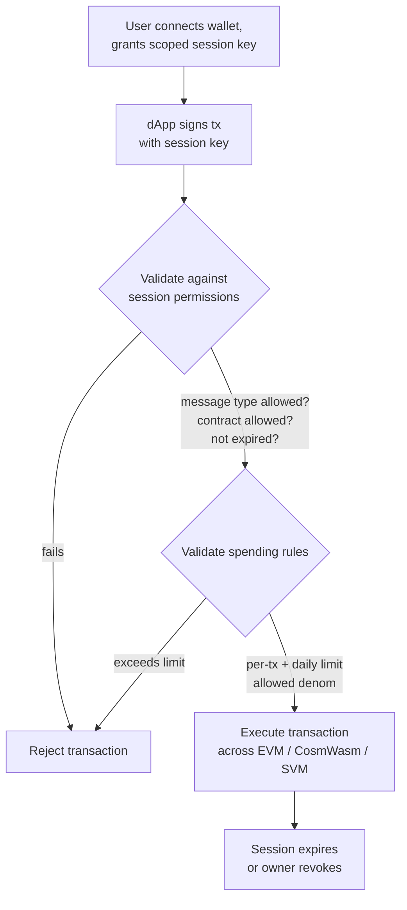

# アカウント抽象化

QoreChain は `x/abstractaccount` モジュールを通じて**プロトコルレベルのアカウント抽象化**を提供します。これにより、柔軟な認証ルール、セッションキー、支出制限、ソーシャルリカバリーを備えたプログラマブルなアカウントが、外部のスマートコントラクトインフラを必要とせずに実現できます。

:::note
以下のコマンドは、2026 年 6 月 7 日より稼働しチェーンバージョン **v3.1.80** を実行している **`qorechain-vladi`** メインネットを使用します。テストネットの場合は `--chain-id qorechain-diana` に置き換えてください。
:::

## 概要

従来のブロックチェーンアカウントは、単一の秘密鍵で制御されます。アカウント抽象化は、「誰がトランザクションを承認できるか」という概念を単一の暗号鍵から切り離し、次のことを可能にします。

* 設定可能なしきい値署名を備えた**マルチシグアカウント**
* ガーディアンベースの鍵リカバリーを備えた**ソーシャルリカバリーアカウント**
* dApp 向けに、きめ細かく時間制限のある権限を備えた**セッションベースアカウント**

`x/abstractaccount` モジュールはこれらの機能をプロトコル層で実装しており、3 つのすべての VM（EVM、CosmWasm、SVM）にわたって動作し、ネイティブなガス効率の恩恵を受けられます。

*セッションベースの dApp フロー: スコープ付きのセッションキーがトランザクションに署名し、モジュールがそれをセッションおよび支出ルールに照らして検証してから実行します。*



## アカウントの種類

| 種類              | 説明                             | ユースケース                       |
| ----------------- | --------------------------------------- | ------------------------------ |
| `multisig`        | M-of-N しきい値署名                | DAO トレジャリー、共有ウォレット |
| `social_recovery` | ガーディアン支援による鍵リカバリー          | コンシューマー向けウォレット、オンボーディング   |
| `session_based`   | 制約付きの委任されたセッションキー | dApp セッション、モバイルウォレット  |

## 抽象アカウントの作成

### セッションベースアカウント

```bash
qorechaind tx abstractaccount create \
  --account-type session_based \
  --from mykey \
  --gas auto \
  -y
```

### マルチシグアカウント

```bash
qorechaind tx abstractaccount create \
  --account-type multisig \
  --signers qor1alice...,qor1bob...,qor1carol... \
  --threshold 2 \
  --from mykey \
  --gas auto \
  -y
```

### ソーシャルリカバリーアカウント

```bash
qorechaind tx abstractaccount create \
  --account-type social_recovery \
  --guardians qor1guardian1...,qor1guardian2...,qor1guardian3... \
  --recovery-threshold 2 \
  --from mykey \
  --gas auto \
  -y
```

## セッションキー

セッションキーは `session_based` アカウントタイプの要です。これにより、副次的な鍵に**一時的でスコープ付きの権限**を付与できます。主鍵を公開したくない dApp とのやり取りに最適です。

### 主なプロパティ

| プロパティ              | 説明                                          |
| --------------------- | ---------------------------------------------------- |
| **権限**       | セッションキーが署名できるメッセージタイプ         |
| **有効期限**            | 設定可能な期間後に自動的に失効   |
| **支出制限**   | セッションキーが支出できる最大金額            |
| **許可コントラクト** | やり取りを特定のコントラクトアドレスに制限 |

### セッションキーを付与する

```bash
qorechaind tx abstractaccount grant-session \
  --session-key qor1sessionkey... \
  --permissions "bank/MsgSend,wasm/MsgExecuteContract" \
  --expiry "2026-03-01T00:00:00Z" \
  --allowed-contracts qor1contract1...,0x1234...abcd \
  --from mykey \
  -y
```

### セッションキーを取り消す

```bash
qorechaind tx abstractaccount revoke-session \
  --session-key qor1sessionkey... \
  --from mykey \
  -y
```

### アクティブなセッションを一覧表示する

```bash
qorechaind query abstractaccount sessions <account-address>
```

## 支出ルール

支出ルールは、アカウントの種類にかかわらず、抽象アカウントに財務上のガードレールを追加します。

| ルール             | 説明                                     |
| ---------------- | ----------------------------------------------- |
| `daily_limit`    | 24 時間のローリングウィンドウあたりの最大合計支出  |
| `per_tx_limit`   | 個々のトランザクションあたりの最大支出        |
| `allowed_denoms` | 支出可能なトークンの額面を制限 |

### 支出ルールを設定する

```bash
qorechaind tx abstractaccount update-spending-rules \
  --daily-limit 1000000000uqor \
  --per-tx-limit 100000000uqor \
  --allowed-denoms uqor \
  --from mykey \
  -y
```

### 現在のルールを照会する

```bash
qorechaind query abstractaccount spending-rules <account-address>
```

### レスポンスの例

```json
{
  "daily_limit": {
    "denom": "uqor",
    "amount": "1000000000"
  },
  "per_tx_limit": {
    "denom": "uqor",
    "amount": "100000000"
  },
  "allowed_denoms": ["uqor"],
  "daily_spent": {
    "denom": "uqor",
    "amount": "250000000"
  },
  "window_reset": "2026-02-27T00:00:00Z"
}
```

## 抽象アカウントの照会

### CLI

```bash
# Get full account configuration
qorechaind query abstractaccount account <address>

# List all abstract accounts (paginated)
qorechaind query abstractaccount list --limit 10
```

### JSON-RPC

```bash
curl -X POST http://localhost:8545 \
  -H "Content-Type: application/json" \
  -d '{
    "jsonrpc": "2.0",
    "method": "qor_getAbstractAccount",
    "params": ["0xYourAddress"],
    "id": 1
  }'
```

### アカウントレスポンスの例

```json
{
  "address": "qor1myaccount...",
  "account_type": "session_based",
  "owner": "qor1owner...",
  "active_sessions": 2,
  "spending_rules": {
    "daily_limit": "1000000000uqor",
    "per_tx_limit": "100000000uqor",
    "allowed_denoms": ["uqor"]
  },
  "created_at_height": 54321
}
```

## ソーシャルリカバリーのフロー

アカウント所有者が主鍵へのアクセスを失った場合、ガーディアンが鍵のローテーションを承認できます。

1. **所有者が鍵の紛失を報告する（またはガーディアンが開始する）:**

   ```bash
   qorechaind tx abstractaccount initiate-recovery \
     --account <account-address> \
     --new-owner qor1newkey... \
     --from guardian1 \
     -y
   ```

2. **追加のガーディアンが承認する**（`recovery_threshold` を満たす必要があります）:

   ```bash
   qorechaind tx abstractaccount approve-recovery \
     --account <account-address> \
     --recovery-id <recovery-id> \
     --from guardian2 \
     -y
   ```

3. しきい値が満たされると、**リカバリーが自動的に実行されます**。**タイムロック期間**（デフォルト: 48 時間）により、元の所有者は不正なリカバリー試行をキャンセルする機会を得られます。

## dApp との統合

セッションキーはシームレスな dApp 体験を可能にします。

1. **ユーザーがウォレットを接続**し、dApp のコントラクトにスコープを限定したセッションキーを作成する
2. **dApp がセッションキーを使用**し、ユーザーに代わってトランザクションを送信する
3. **署名の繰り返しが不要** — セッションキーがその権限の範囲内で承認を処理する
4. **セッションは自動的に失効**するか、ユーザーがいつでも取り消すことができる

このパターンは特に次の場合に有用です。

* 生体認証プロンプトの繰り返しが煩わしいモバイルウォレット
* 迅速なトランザクション署名を必要とするゲーム dApp
* 複数の連続した操作を実行する DeFi プロトコル

## 次のステップ

* [バリデーターの運用](/developer-guide/running-a-validator) — バリデーターノードのセットアップと運用
* [EVM 開発](/developer-guide/evm-development) — 抽象アカウントと Solidity dApp の統合
* [クロス VM 相互運用性](/developer-guide/cross-vm-interoperability) — 抽象アカウントを用いたクロス VM メッセージング
