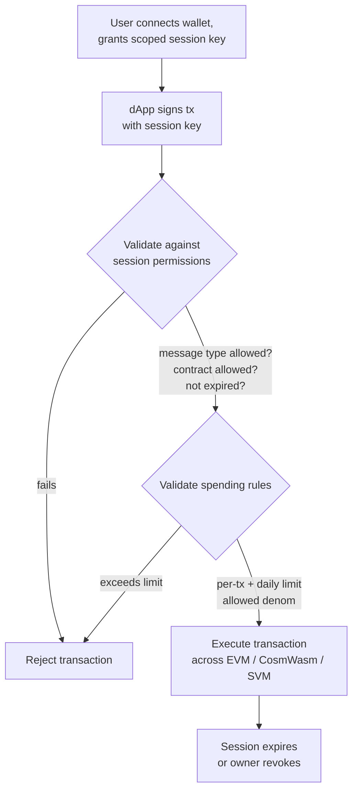

# アカウント抽象化

QoreChainは`x/abstractaccount`モジュールを通じて**プロトコルレベルのアカウント抽象化**を提供します。これにより、外部のスマートコントラクトインフラを必要とせずに、柔軟な認証ルール、セッションキー、支出上限、ソーシャルリカバリーを備えたプログラマブルなアカウントが実現します。

:::note
以下のコマンドは、2026年6月7日から稼働しているメインネット**`qorechain-vladi`**（チェーンバージョン**v3.1.95**）を使用しています。テストネットの場合は`--chain-id qorechain-diana`に置き換えてください。
:::

## 概要

従来のブロックチェーンアカウントは単一の秘密鍵によって制御されます。アカウント抽象化は、「誰がトランザクションを承認できるか」という概念を単一の暗号鍵から切り離し、以下を可能にします。

* **マルチシグアカウント** — 閾値署名を設定可能
* **ソーシャルリカバリーアカウント** — ガーディアンによる鍵の復旧
* **セッションベースのアカウント** — dApp向けの、細かく時間制限された権限

`x/abstractaccount`モジュールはこれらの機能をプロトコル層で実装しており、3つのVM（EVM、CosmWasm、SVM）すべてで動作し、ネイティブなガス効率の恩恵を受けます。

*セッションベースのdAppフロー: スコープの限定されたセッションキーがトランザクションに署名し、モジュールがそれをセッションおよび支出ルールに照らして検証したうえで実行する。*


```mermaid
flowchart TD
    A["User connects wallet,<br/>grants scoped session key"] --> B["dApp signs tx<br/>with session key"]
    B --> C{"Validate against<br/>session permissions"}
    C -- "message type allowed?<br/>contract allowed?<br/>not expired?" --> D{"Validate spending rules"}
    C -- "fails" --> R["Reject transaction"]
    D -- "per-tx + daily limit<br/>allowed denom" --> E["Execute transaction<br/>across EVM / CosmWasm / SVM"]
    D -- "exceeds limit" --> R
    E --> F["Session expires<br/>or owner revokes"]
```

## アカウントタイプ

| タイプ              | 説明                             | ユースケース                       |
| ----------------- | --------------------------------------- | ------------------------------ |
| `multisig`        | M-of-N閾値署名                | DAOトレジャリー、共有ウォレット |
| `social_recovery` | ガーディアン支援による鍵の復旧          | コンシューマーウォレット、オンボーディング   |
| `session_based`   | 制約付きの委任セッションキー | dAppセッション、モバイルウォレット  |

## アブストラクトアカウントの作成

### セッションベースアカウント

```bash
qorechaind tx abstractaccount create \
  --account-type session_based \
  --from mykey \
  --gas auto \
  -y
```

### マルチシグアカウント

```bash
qorechaind tx abstractaccount create \
  --account-type multisig \
  --signers qor1alice...,qor1bob...,qor1carol... \
  --threshold 2 \
  --from mykey \
  --gas auto \
  -y
```

### ソーシャルリカバリーアカウント

```bash
qorechaind tx abstractaccount create \
  --account-type social_recovery \
  --guardians qor1guardian1...,qor1guardian2...,qor1guardian3... \
  --recovery-threshold 2 \
  --from mykey \
  --gas auto \
  -y
```

## セッションキー

セッションキーは`session_based`アカウントタイプの中核をなすものです。副次的な鍵に対して**一時的でスコープの限定された権限**を付与できるため、プライマリキーを露出させたくないdAppとのやり取りに最適です。

### キーのプロパティ

| プロパティ              | 説明                                          |
| --------------------- | ---------------------------------------------------- |
| **権限**       | セッションキーが署名できるメッセージタイプ         |
| **有効期限**            | 設定可能な期間経過後の自動失効   |
| **支出上限**   | セッションキーが使用できる最大金額            |
| **許可コントラクト** | 特定のコントラクトアドレスへのやり取りに制限 |

### セッションキーの付与

```bash
qorechaind tx abstractaccount grant-session \
  --session-key qor1sessionkey... \
  --permissions "bank/MsgSend,wasm/MsgExecuteContract" \
  --expiry "2026-03-01T00:00:00Z" \
  --allowed-contracts qor1contract1...,0x1234...abcd \
  --from mykey \
  -y
```

### セッションキーの失効

```bash
qorechaind tx abstractaccount revoke-session \
  --session-key qor1sessionkey... \
  --from mykey \
  -y
```

### アクティブなセッションの一覧表示

```bash
qorechaind query abstractaccount sessions <account-address>
```

## 支出ルール

支出ルールは、アカウントタイプにかかわらず、アブストラクトアカウントに財務的なガードレールを追加します。

| ルール             | 説明                                     |
| ---------------- | ----------------------------------------------- |
| `daily_limit`    | 24時間のローリングウィンドウにおける最大合計支出額  |
| `per_tx_limit`   | 個々のトランザクションあたりの最大支出額        |
| `allowed_denoms` | 使用可能なトークンデノミネーションの制限 |

### 支出ルールの設定

```bash
qorechaind tx abstractaccount update-spending-rules \
  --daily-limit 1000000000uqor \
  --per-tx-limit 100000000uqor \
  --allowed-denoms uqor \
  --from mykey \
  -y
```

### 現在のルールの照会

```bash
qorechaind query abstractaccount spending-rules <account-address>
```

### レスポンス例

```json
{
  "daily_limit": {
    "denom": "uqor",
    "amount": "1000000000"
  },
  "per_tx_limit": {
    "denom": "uqor",
    "amount": "100000000"
  },
  "allowed_denoms": ["uqor"],
  "daily_spent": {
    "denom": "uqor",
    "amount": "250000000"
  },
  "window_reset": "2026-02-27T00:00:00Z"
}
```

## 連携ウォレットオーセンティケーター — 委任支出 {#authenticators}

チェーンバージョン**v3.1.85**（v3.1.84の権限モデルを土台とする）以降、**連携された外部ウォレットの鍵**——Phantom（ed25519）の鍵、またはMetaMask（secp256k1）のアカウント——が、最小権限・支出上限付き・失効可能な条件のもとで、**正規のポスト量子アカウントから支出**できるようになりました。外部鍵がML-DSA署名を生成することはなく、**リレイヤー**がトランザクションエンベロープを送信して手数料を負担します（リレイヤー自身のハイブリッドPQC署名がチェーンの署名要件を満たします）。一方、**ドメイン分離されたリプレイ耐性のある署名バイト**に対するオーセンティケーターの署名が、承認そのものとなります。

### オーセンティケーターの登録 {#register-authenticator}

アカウントの所有者は、`MsgRegisterAuthenticator`（通常のルートキーによるトランザクション）を使って外部鍵を登録し、スキーム、権限、有効期限、任意の支出上限を付与します。

```js
import { registerEthAuthenticatorMsg } from "@qorechain/wallet-adapter";

// Link a MetaMask account by its 20-byte address (EIP-191 verification):
const msg = registerEthAuthenticatorMsg({
  account: "qor1owner...",            // the canonical account
  ethAddress: "0xAbC...123",          // the MetaMask address to link
  permissions: ["evm"],               // least privilege — see the taxonomy below
  expirySeconds: 30 * 24 * 3600,      // ≤ 30 days recommended
  spendingRule: { perTxLimit: "100000000uqor", dailyLimit: "1000000000uqor" },
});
// Sign & broadcast this msg with the OWNER's normal hybrid-PQC signer.
```

Phantomの鍵も同じ方法で、`scheme: "ed25519"`とPhantomの公開鍵を使って登録します。失効は`MsgRevokeAuthenticator`により即座に行われます。

### 権限タクソノミー {#permission-taxonomy}

登録済みオーセンティケーターが実行できる操作は、11個の正規権限によって制御されます。このマッピングは**フェイルクローズ**であり、対応するマッピングのないメッセージタイプは拒否されます。

| 権限 | 付与される操作 |
| --- | --- |
| `send` | ネイティブレーンでの銀行送金 |
| `delegate` / `withdraw` / `vote` | ステーキング、報酬引き出し、ガバナンス |
| `evm` / `wasm` / `svm` | 各VMレーンでの実行 |
| `amm` / `ibc` / `deploy` | AMM操作、IBC送金、コントラクトデプロイ |
| `all` | *委任可能な*あらゆるメッセージ |

**鍵管理メッセージは決して委任できません**——`MsgRegisterAuthenticator`、`MsgRevokeAuthenticator`、PQC鍵の登録／移行、そして`MsgRotatePQCKey`は常にルートキーを必要とし、連携された鍵が自身の権限をエスカレーションすることはできません。

ハードコーディングするのではなく、（ドリフト検出用の`schema_version`付き）ライブのタクソノミーを参照してください。

```bash
curl -s https://api.qore.host/qorechain/abstractaccount/v1/permission_schema | jq
# or: qorechaind query abstractaccount permission-schema
```

### 連携された鍵での支出 {#execute-messages}

オーセンティケーターによって承認されたアクションは2つのメッセージで運ばれます。どちらの場合も、リレイヤーがトランザクションの署名者／手数料負担者であり、オーセンティケーターの署名はメッセージの内部に含まれます。

**`MsgExecuteEVM`** — **正規アカウントの`0x…`アドレスから**行われるEVMコールまたは送金。オーセンティケーターは`sha256("qorechain-evm-auth-v1" ‖ chainId ‖ account ‖ pubkey ‖ to ‖ value ‖ data ‖ nonce)`（すべてのフィールドは長さ接頭辞付き）に署名します。リプレイ対策はアカウント自身のEVMナンスです。

**`MsgExecuteCosmos`** — 正規アカウントからのネイティブレーンの銀行送金。オーセンティケーターは`sha256("qorechain-cosmos-auth-v1" ‖ chainId ‖ account ‖ pubkey ‖ to ‖ amount ‖ nonce)`に署名します。リプレイ対策は、モジュールが保持する**オーセンティケーターごとのシーケンス**です（銀行送金はアカウントのナンスを増やしません）。自分自身への送金は拒否されます。

:::caution ナンスに関するルール
* `MsgExecuteEVM.nonce`はアカウントの**現在の**EVMナンス（`eth_getTransactionCount(account0x, "latest")`）です。本番環境ではリレイヤーは*別の*アカウントであるため、+1を加算しては**いけません**。古いナンスで署名するとコード`11`が返されます。
* `MsgExecuteCosmos.nonce`は（アカウントのオーセンティケーター状態を照会して得られる）オーセンティケーターごとのシーケンスであり、アカウントのCosmosシーケンス**ではありません**。
:::

**Phantomの例**（ブラウザ: Phantomが署名し、バックエンドがリレーする）

```js
import { buildPhantomExecuteCosmos } from "@qorechain/wallet-adapter";

// In the dApp: Phantom signs the digest with ed25519 signMessage.
const msg = await buildPhantomExecuteCosmos({
  provider: window.solana,            // Phantom
  chainId: "qorechain-vladi",
  account: "qor1owner...",            // canonical account being spent from
  to: "qor1recipient...",
  amount: { denom: "uqor", amount: "900000" },
  nonce: authSequence,                // per-authenticator sequence
});
// Send `msg` to your relayer; the relayer wraps it in a tx it signs
// (hybrid PQC) and broadcasts. The transfer moves the OWNER's funds.
```

**MetaMaskの例**（連携された20バイトアドレスからのEIP-191 `personal_sign`）

```js
import { buildMetaMaskExecuteEvm } from "@qorechain/wallet-adapter";

const msg = await buildMetaMaskExecuteEvm({
  provider: window.ethereum,          // MetaMask (EIP-1193)
  chainId: "qorechain-vladi",
  account: "qor1owner...",
  to: "0xRecipient...",
  valueWei: 10n ** 16n,               // 0.01 QOR (18-dec EVM view)
  nonce: currentEvmNonce,             // eth_getTransactionCount(owner0x, "latest")
});
// Relay as above. The chain verifies the signature via EIP-191 + ecrecover
// against the registered 20-byte address.
```

同じビルダー関数は[QoreChain SDK](/sdk/guides/authenticators)にも5言語すべてで用意されており、CLIの相当コマンドも存在します。

```bash
# Produce the exact sign bytes the chain verifies (for custom signers):
qorechaind query abstractaccount auth-sign-cosmos <account> <to> <amount> <nonce>
qorechaind query abstractaccount auth-sign-evm <account> <to> <value> <data-hex> <nonce>

# Relay a pre-signed authorization:
qorechaind tx abstractaccount execute-cosmos <account> <to> <amount> <auth-pubkey> <auth-sig> <nonce> --from relayer -y
qorechaind tx abstractaccount execute-evm    <account> <to> <value> <data-hex> <auth-pubkey> <auth-sig> <nonce> --from relayer -y
```

### エラーコード {#authenticator-errors}

実施に失敗した場合、ウォレットが適切なメッセージを表示できるように、（コードスペース`abstractaccount`の）異なるコードが返されます。

| コード | 意味 | ウォレットのUX |
| --- | --- | --- |
| `5` | 支出上限超過（1回あたり、または1日あたり） | 残りの利用可能額を表示 |
| `6` | オーセンティケーターの期限切れ | 「期限切れです — ウォレットを再連携してください」 |
| `10` | 権限拒否（スコープ外、または委任不可のメッセージ） | 不足している権限を表示 |
| `11` | リプレイ拒否（古いナンス／シーケンス） | ナンスを再照会して再署名 |

（コードスペース`pqc`のコード`21` = ハイブリッド署名の検証失敗——これは承認の問題ではなく、リレイヤー側の署名の問題です。）

### RESTクエリ {#abstractaccount-rest}

**v3.1.85**以降、このモジュールの読み取りクエリはRESTでも提供されています。

```
GET /qorechain/abstractaccount/v1/config
GET /qorechain/abstractaccount/v1/accounts
GET /qorechain/abstractaccount/v1/accounts/{address}
GET /qorechain/abstractaccount/v1/permission_schema
```

## アブストラクトアカウントの照会

### CLI

```bash
# Get full account configuration
qorechaind query abstractaccount account <address>

# List all abstract accounts (paginated)
qorechaind query abstractaccount list --limit 10
```

### JSON-RPC

```bash
curl -X POST http://localhost:8545 \
  -H "Content-Type: application/json" \
  -d '{
    "jsonrpc": "2.0",
    "method": "qor_getAbstractAccount",
    "params": ["0xYourAddress"],
    "id": 1
  }'
```

### アカウントレスポンス例

```json
{
  "address": "qor1myaccount...",
  "account_type": "session_based",
  "owner": "qor1owner...",
  "active_sessions": 2,
  "spending_rules": {
    "daily_limit": "1000000000uqor",
    "per_tx_limit": "100000000uqor",
    "allowed_denoms": ["uqor"]
  },
  "created_at_height": 54321
}
```

## ソーシャルリカバリーのフロー

アカウントの所有者がプライマリキーへのアクセスを失った場合、ガーディアンが鍵のローテーションを承認できます。

1. **所有者が鍵の紛失を報告する（またはガーディアンが開始する）**

   ```bash
   qorechaind tx abstractaccount initiate-recovery \
     --account <account-address> \
     --new-owner qor1newkey... \
     --from guardian1 \
     -y
   ```

2. **追加のガーディアンが承認する**（`recovery_threshold`を満たす必要あり）

   ```bash
   qorechaind tx abstractaccount approve-recovery \
     --account <account-address> \
     --recovery-id <recovery-id> \
     --from guardian2 \
     -y
   ```

3. **閾値に達すると、リカバリーが自動的に実行されます。** **タイムロック期間**（デフォルト: 48時間）により、元の所有者には不正なリカバリー試行をキャンセルする猶予が与えられます。

## dAppとの連携

セッションキーはシームレスなdApp体験を実現します。

1. **ユーザーがウォレットを接続し**、dAppのコントラクトにスコープを限定したセッションキーを作成する
2. **dAppがセッションキーを使用**して、ユーザーに代わってトランザクションを送信する
3. **繰り返しの署名は不要**——セッションキーがその権限の範囲内で承認を処理する
4. **セッションは自動的に失効する**、またはユーザーがいつでも取り消せる

このパターンは特に以下の用途で有用です。

* 生体認証プロンプトの繰り返しが邪魔になるモバイルウォレット
* 迅速なトランザクション署名が必要なゲームdApp
* 複数の連続した操作を実行するDeFiプロトコル

## 次のステップ

* [バリデータの運用](/developer-guide/running-a-validator) — バリデータノードのセットアップと運用
* [EVM開発](/developer-guide/evm-development) — Solidity dAppとアブストラクトアカウントの統合
* [クロスVM相互運用性](/developer-guide/cross-vm-interoperability) — アブストラクトアカウントを用いたクロスVMメッセージング
