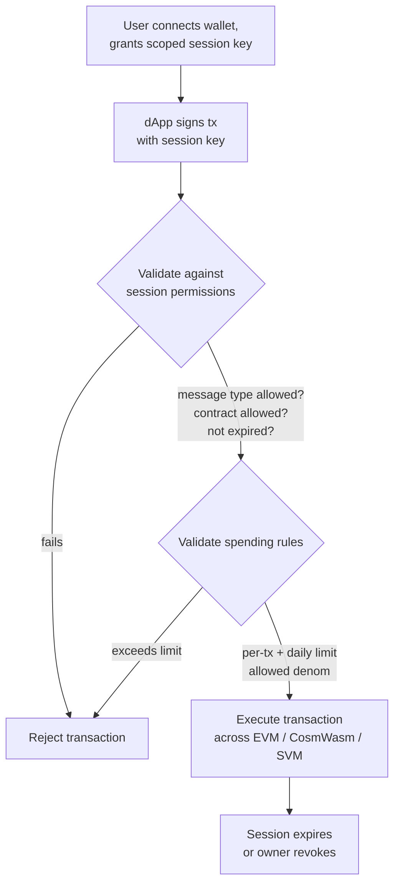

# アカウント抽象化

QoreChain は `x/abstractaccount` モジュールを通じて**プロトコルレベルのアカウント抽象化**を提供します。これにより、柔軟な認証ルール、セッションキー、支出上限、ソーシャルリカバリーを備えたプログラマブルなアカウントが、外部のスマートコントラクト基盤を必要とせずに実現できます。

:::note
以下のコマンドは、2026 年 6 月 7 日から稼働しているチェーンバージョン **v3.1.85** のメインネット **`qorechain-vladi`** を使用します。テストネットの場合は `--chain-id qorechain-diana` に置き換えてください。
:::

## 概要

従来のブロックチェーンアカウントは、単一の秘密鍵によって制御されます。アカウント抽象化は、「誰がトランザクションを承認できるか」という概念を単一の暗号鍵から切り離し、次のことを可能にします。

* 設定可能なしきい値署名を備えた**マルチシグアカウント**
* ガーディアンによる鍵復旧を備えた**ソーシャルリカバリーアカウント**
* dApp 向けに粒度の細かい時間制限付き権限を持つ**セッションベースアカウント**

`x/abstractaccount` モジュールはこれらの機能をプロトコル層で実装しているため、3 つの VM(EVM、CosmWasm、SVM)すべてで動作し、ネイティブのガス効率の恩恵を受けられます。

*セッションベースの dApp フロー: スコープ付きセッションキーがトランザクションに署名し、モジュールがセッションと支出ルールに照らして検証したうえで実行します。*


```mermaid
flowchart TD
    A["User connects wallet,<br/>grants scoped session key"] --> B["dApp signs tx<br/>with session key"]
    B --> C{"Validate against<br/>session permissions"}
    C -- "message type allowed?<br/>contract allowed?<br/>not expired?" --> D{"Validate spending rules"}
    C -- "fails" --> R["Reject transaction"]
    D -- "per-tx + daily limit<br/>allowed denom" --> E["Execute transaction<br/>across EVM / CosmWasm / SVM"]
    D -- "exceeds limit" --> R
    E --> F["Session expires<br/>or owner revokes"]
```

## アカウントタイプ

| タイプ | 説明 | ユースケース |
| ----------------- | --------------------------------------- | ------------------------------ |
| `multisig` | M-of-N しきい値署名 | DAO トレジャリー、共有ウォレット |
| `social_recovery` | ガーディアン支援による鍵復旧 | コンシューマー向けウォレット、オンボーディング |
| `session_based` | 制約付きの委任セッションキー | dApp セッション、モバイルウォレット |

## 抽象アカウントの作成

### セッションベースアカウント

```bash
qorechaind tx abstractaccount create \
  --account-type session_based \
  --from mykey \
  --gas auto \
  -y
```

### マルチシグアカウント

```bash
qorechaind tx abstractaccount create \
  --account-type multisig \
  --signers qor1alice...,qor1bob...,qor1carol... \
  --threshold 2 \
  --from mykey \
  --gas auto \
  -y
```

### ソーシャルリカバリーアカウント

```bash
qorechaind tx abstractaccount create \
  --account-type social_recovery \
  --guardians qor1guardian1...,qor1guardian2...,qor1guardian3... \
  --recovery-threshold 2 \
  --from mykey \
  --gas auto \
  -y
```

## セッションキー

セッションキーは `session_based` アカウントタイプの中核です。セカンダリキーに**一時的でスコープを限定した権限**を付与できるため、プライマリキーを晒したくない dApp とのやり取りに最適です。

### 主なプロパティ

| プロパティ | 説明 |
| --------------------- | ---------------------------------------------------- |
| **権限(Permissions)** | セッションキーが署名できるメッセージタイプ |
| **有効期限(Expiry)** | 設定可能な期間経過後の自動失効 |
| **支出上限(Spending limits)** | セッションキーが支出できる上限額 |
| **許可コントラクト(Allowed contracts)** | やり取りを特定のコントラクトアドレスに制限 |

### セッションキーの付与

```bash
qorechaind tx abstractaccount grant-session \
  --session-key qor1sessionkey... \
  --permissions "bank/MsgSend,wasm/MsgExecuteContract" \
  --expiry "2026-03-01T00:00:00Z" \
  --allowed-contracts qor1contract1...,0x1234...abcd \
  --from mykey \
  -y
```

### セッションキーの失効

```bash
qorechaind tx abstractaccount revoke-session \
  --session-key qor1sessionkey... \
  --from mykey \
  -y
```

### アクティブなセッションの一覧

```bash
qorechaind query abstractaccount sessions <account-address>
```

## 支出ルール

支出ルールは、アカウントタイプにかかわらず、抽象アカウントに金銭面のガードレールを追加します。

| ルール | 説明 |
| ---------------- | ----------------------------------------------- |
| `daily_limit` | 24 時間のローリングウィンドウあたりの合計支出上限 |
| `per_tx_limit` | トランザクション 1 件あたりの支出上限 |
| `allowed_denoms` | 支出可能なトークンデノミネーションの制限 |

### 支出ルールの設定

```bash
qorechaind tx abstractaccount update-spending-rules \
  --daily-limit 1000000000uqor \
  --per-tx-limit 100000000uqor \
  --allowed-denoms uqor \
  --from mykey \
  -y
```

### 現在のルールの照会

```bash
qorechaind query abstractaccount spending-rules <account-address>
```

### レスポンス例

```json
{
  "daily_limit": {
    "denom": "uqor",
    "amount": "1000000000"
  },
  "per_tx_limit": {
    "denom": "uqor",
    "amount": "100000000"
  },
  "allowed_denoms": ["uqor"],
  "daily_spent": {
    "denom": "uqor",
    "amount": "250000000"
  },
  "window_reset": "2026-02-27T00:00:00Z"
}
```

## リンク済みウォレット・オーセンティケーター — 委任支出 {#authenticators}

チェーンバージョン **v3.1.85**(v3.1.84 の権限モデルを基盤とする)以降、**リンク済みの外部ウォレットキー** — Phantom(ed25519)キーまたは MetaMask(secp256k1)アカウント — は、最小権限・支出上限付き・失効可能という条件のもとで、**正規のポスト量子アカウントから支出**できるようになりました。外部キーが ML-DSA 署名を生成することは決してありません。**リレイヤー**がトランザクションエンベロープを送信して手数料を支払い(リレイヤー自身のハイブリッド PQC 署名がチェーンの署名要件を満たします)、**ドメイン分離されリプレイ防止が組み込まれた署名バイト列**に対するオーセンティケーターの署名が承認の役割を果たします。

### オーセンティケーターの登録 {#register-authenticator}

アカウント所有者は `MsgRegisterAuthenticator`(通常のルートキートランザクション)で外部キーを登録し、スキーム、権限、有効期限、および任意の支出上限を設定します。

```js
import { registerEthAuthenticatorMsg } from "@qorechain/wallet-adapter";

// Link a MetaMask account by its 20-byte address (EIP-191 verification):
const msg = registerEthAuthenticatorMsg({
  account: "qor1owner...",            // the canonical account
  ethAddress: "0xAbC...123",          // the MetaMask address to link
  permissions: ["evm"],               // least privilege — see the taxonomy below
  expirySeconds: 30 * 24 * 3600,      // ≤ 30 days recommended
  spendingRule: { perTxLimit: "100000000uqor", dailyLimit: "1000000000uqor" },
});
// Sign & broadcast this msg with the OWNER's normal hybrid-PQC signer.
```

Phantom キーも同じ方法で、`scheme: "ed25519"` と Phantom の公開鍵を指定して登録します。失効は `MsgRevokeAuthenticator` により即時に行われます。

### 権限タクソノミー {#permission-taxonomy}

登録済みオーセンティケーターが実行できる操作は、11 個の正規権限によって制御されます。このマップは**フェイルクローズド**です。マッピングのないメッセージタイプは拒否されます。

| 権限 | 許可される操作 |
| --- | --- |
| `send` | ネイティブレーンの bank 送金 |
| `delegate` / `withdraw` / `vote` | ステーキング、報酬の引き出し、ガバナンス |
| `evm` / `wasm` / `svm` | 対応する VM レーンでの実行 |
| `amm` / `ibc` / `deploy` | AMM 操作、IBC 送金、コントラクトのデプロイ |
| `all` | *委任可能な*すべてのメッセージ |

**鍵管理メッセージは決して委任できません** — `MsgRegisterAuthenticator`、`MsgRevokeAuthenticator`、PQC 鍵の登録/移行、および `MsgRotatePQCKey` は常にルートキーを必要とするため、リンク済みキーが自らの権限を昇格させることはできません。

タクソノミーはハードコードせず、(ドリフト検出用の `schema_version` を含む)ライブ版を読み取ってください。

```bash
curl -s https://api.qore.host/qorechain/abstractaccount/v1/permission_schema | jq
# or: qorechaind query abstractaccount permission-schema
```

### リンク済みキーによる支出 {#execute-messages}

オーセンティケーターが承認したアクションは 2 つのメッセージで運ばれます。いずれの場合も、リレイヤーがトランザクションの署名者/手数料支払者であり、オーセンティケーターの署名はメッセージ内部に含まれます。

**`MsgExecuteEVM`** — **正規アカウントの `0x…` アドレスからの** EVM 呼び出しまたは送金。オーセンティケーターは `sha256("qorechain-evm-auth-v1" ‖ chainId ‖ account ‖ pubkey ‖ to ‖ value ‖ data ‖ nonce)`(すべてのフィールドは長さプレフィックス付き)に署名します。リプレイ防止はアカウント自身の EVM nonce です。

**`MsgExecuteCosmos`** — 正規アカウントからのネイティブレーン bank 送金。オーセンティケーターは `sha256("qorechain-cosmos-auth-v1" ‖ chainId ‖ account ‖ pubkey ‖ to ‖ amount ‖ nonce)` に署名します。リプレイ防止はモジュールが保持する**オーセンティケーターごとのシーケンス**です(bank 送金はアカウントの nonce を進めません)。自己宛て送金は拒否されます。

:::caution Nonce のルール
* `MsgExecuteEVM.nonce` = アカウントの**現在の** EVM nonce(`eth_getTransactionCount(account0x, "latest")`)。本番環境ではリレイヤーは*別の*アカウントであるため、+1 を**加算しないでください**。古い nonce で署名するとコード `11` が返されます。
* `MsgExecuteCosmos.nonce` = オーセンティケーターごとのシーケンス(アカウントのオーセンティケーター状態を照会して取得)であり、アカウントの Cosmos シーケンス**ではありません**。
:::

**Phantom の例**(ブラウザ: Phantom が署名し、バックエンドがリレー):

```js
import { buildPhantomExecuteCosmos } from "@qorechain/wallet-adapter";

// In the dApp: Phantom signs the digest with ed25519 signMessage.
const msg = await buildPhantomExecuteCosmos({
  provider: window.solana,            // Phantom
  chainId: "qorechain-vladi",
  account: "qor1owner...",            // canonical account being spent from
  to: "qor1recipient...",
  amount: { denom: "uqor", amount: "900000" },
  nonce: authSequence,                // per-authenticator sequence
});
// Send `msg` to your relayer; the relayer wraps it in a tx it signs
// (hybrid PQC) and broadcasts. The transfer moves the OWNER's funds.
```

**MetaMask の例**(リンク済み 20 バイトアドレスからの EIP-191 `personal_sign`):

```js
import { buildMetaMaskExecuteEvm } from "@qorechain/wallet-adapter";

const msg = await buildMetaMaskExecuteEvm({
  provider: window.ethereum,          // MetaMask (EIP-1193)
  chainId: "qorechain-vladi",
  account: "qor1owner...",
  to: "0xRecipient...",
  valueWei: 10n ** 16n,               // 0.01 QOR (18-dec EVM view)
  nonce: currentEvmNonce,             // eth_getTransactionCount(owner0x, "latest")
});
// Relay as above. The chain verifies the signature via EIP-191 + ecrecover
// against the registered 20-byte address.
```

同じビルダーは [QoreChain SDK](/sdk/guides/authenticators) で 5 言語すべてに用意されており、CLI にも同等のコマンドがあります。

```bash
# Produce the exact sign bytes the chain verifies (for custom signers):
qorechaind query abstractaccount auth-sign-cosmos <account> <to> <amount> <nonce>
qorechaind query abstractaccount auth-sign-evm <account> <to> <value> <data-hex> <nonce>

# Relay a pre-signed authorization:
qorechaind tx abstractaccount execute-cosmos <account> <to> <amount> <auth-pubkey> <auth-sig> <nonce> --from relayer -y
qorechaind tx abstractaccount execute-evm    <account> <to> <value> <data-hex> <auth-pubkey> <auth-sig> <nonce> --from relayer -y
```

### エラーコード {#authenticator-errors}

適用時の失敗は(コードスペース `abstractaccount` の)個別のコードを返すため、ウォレットは適切なメッセージを表示できます。

| コード | 意味 | ウォレット UX |
| --- | --- | --- |
| `5` | 支出上限超過(トランザクション単位または日次) | 残りの利用可能額を表示 |
| `6` | オーセンティケーターの期限切れ | 「期限切れ — ウォレットを再リンクしてください」 |
| `10` | 権限拒否(スコープ外または委任不可メッセージ) | 不足している権限を表示 |
| `11` | リプレイ拒否(古い nonce/シーケンス) | nonce を再照会して再署名 |

(コードスペース `pqc` のコード `21` = ハイブリッド署名の検証失敗 — これはリレイヤー側の署名の問題であり、承認の問題ではありません。)

### REST クエリ {#abstractaccount-rest}

**v3.1.85** 以降、このモジュールの読み取りクエリは REST 経由でも提供されます。

```
GET /qorechain/abstractaccount/v1/config
GET /qorechain/abstractaccount/v1/accounts
GET /qorechain/abstractaccount/v1/accounts/{address}
GET /qorechain/abstractaccount/v1/permission_schema
```

## 抽象アカウントの照会

### CLI

```bash
# Get full account configuration
qorechaind query abstractaccount account <address>

# List all abstract accounts (paginated)
qorechaind query abstractaccount list --limit 10
```

### JSON-RPC

```bash
curl -X POST http://localhost:8545 \
  -H "Content-Type: application/json" \
  -d '{
    "jsonrpc": "2.0",
    "method": "qor_getAbstractAccount",
    "params": ["0xYourAddress"],
    "id": 1
  }'
```

### アカウントレスポンスの例

```json
{
  "address": "qor1myaccount...",
  "account_type": "session_based",
  "owner": "qor1owner...",
  "active_sessions": 2,
  "spending_rules": {
    "daily_limit": "1000000000uqor",
    "per_tx_limit": "100000000uqor",
    "allowed_denoms": ["uqor"]
  },
  "created_at_height": 54321
}
```

## ソーシャルリカバリーフロー

アカウント所有者がプライマリキーへのアクセスを失った場合、ガーディアンが鍵のローテーションを承認できます。

1. **所有者が鍵の紛失を報告(またはガーディアンが開始):**

   ```bash
   qorechaind tx abstractaccount initiate-recovery \
     --account <account-address> \
     --new-owner qor1newkey... \
     --from guardian1 \
     -y
   ```

2. **追加のガーディアンが承認**(`recovery_threshold` を満たす必要があります):

   ```bash
   qorechaind tx abstractaccount approve-recovery \
     --account <account-address> \
     --recovery-id <recovery-id> \
     --from guardian2 \
     -y
   ```

3. しきい値に達すると、**リカバリーは自動的に実行されます**。**タイムロック期間**(デフォルト: 48 時間)により、元の所有者は不正なリカバリー試行をキャンセルする機会を得られます。

## dApp との統合

セッションキーはシームレスな dApp 体験を実現します。

1. **ユーザーがウォレットを接続**し、その dApp のコントラクトにスコープを限定したセッションキーを作成
2. **dApp がセッションキーを使用**して、ユーザーに代わってトランザクションを送信
3. **繰り返しの署名は不要** — セッションキーが権限の範囲内で承認を処理
4. **セッションは自動的に失効**し、ユーザーはいつでも失効させることが可能

このパターンは特に次の用途で有用です。

* 生体認証プロンプトの繰り返しが煩わしいモバイルウォレット
* 高速なトランザクション署名を必要とするゲーム dApp
* 複数の連続した操作を実行する DeFi プロトコル

## 次のステップ

* [バリデーターの運用](/developer-guide/running-a-validator) — バリデーターノードのセットアップと運用
* [EVM 開発](/developer-guide/evm-development) — Solidity dApp との抽象アカウント統合
* [クロス VM 相互運用性](/developer-guide/cross-vm-interoperability) — 抽象アカウントによるクロス VM メッセージング
