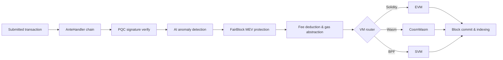

# アーキテクチャ概要

QoreChain は、3 つの主要プロセス（チェーンノード、AI サイドカー、ブロックインデクサー）で構成されるモジュラーなブロックチェーンノードであり、Postgres データベースを基盤とし、Prometheus と Grafana を介して監視されます。メインネット（`qorechain-vladi`、EVM チェーン ID **9801**）は、チェーンバージョン **v3.1.77** 上で 2026 年 6 月 7 日から稼働しており、並行してテストネット（`qorechain-diana`、EVM チェーン ID **9800**）も稼働しています。チェーンは Cosmos SDK v0.53 上に構築されています。次の図は、高レベルのコンポーネントレイアウトを示しています。

以下のトランザクションライフサイクルは、送信されたトランザクションがノードを通じてどのように流れるかを要約したものです。AnteHandler デコレーターチェーン（セキュリティおよび手数料チェック）から VM 実行とオンチェーン決済へと進みます:



```
┌────────────────────────────────────────────────────────────────────────────┐
│                            QoreChain Node                                  │
│                                                                            │
│  ┌──────────────────── Virtual Machines ──────────────────────┐           │
│  │  ┌───────┐    ┌──────────┐    ┌───────┐                   │           │
│  │  │  EVM  │    │ CosmWasm │    │  SVM  │                   │           │
│  │  │(Sol.) │◄──►│ (Wasm)   │◄──►│ (BPF) │                   │           │
│  │  └───┬───┘    └────┬─────┘    └───┬───┘                   │           │
│  │      └─────────┬───┘──────────────┘                       │           │
│  │           x/crossvm (bridge)                               │           │
│  └────────────────────────────────────────────────────────────┘           │
│                                                                            │
│  ┌────────────────────── Tokenomics ─────────────────────────┐           │
│  │  ┌──────┐   ┌───────┐   ┌───────────┐                    │           │
│  │  │x/burn│   │x/xqore│   │x/inflation│                    │           │
│  │  │10 ch.│   │lock/  │   │finite     │                    │           │
│  │  │37/30/│   │unlock │   │emission   │                    │           │
│  │  │20/10/│   │PvP    │   │590M       │                    │           │
│  │  │3     │   │       │   │budget     │                    │           │
│  │  └──────┘   └───────┘   └───────────┘                    │           │
│  └────────────────────────────────────────────────────────────┘           │
│                                                                            │
│  ┌──────────── IBC / Bridges ────────────────────────────────┐           │
│  │  ┌──────────┐  ┌──────────┐  ┌───────────┐  ┌──────────┐ │           │
│  │  │x/bridge  │  │x/babylon │  │x/abstract │  │x/gas     │ │           │
│  │  │37 QCB +  │  │BTC re-   │  │ account   │  │abstract. │ │           │
│  │  │8 IBC     │  │staking   │  │session key│  │multi-tok │ │           │
│  │  └────┬─────┘  └────┬─────┘  └───────────┘  └──────────┘ │           │
│  │  QCB Bridge     Babylon IBC   ERC-4337-like   ibc/USDC    │           │
│  │  PQC-signed     BTC finality  social recov.   ibc/ATOM    │           │
│  │  36 ext chains  checkpoint    spending rules  fee convert  │           │
│  │  ┌──────────┐                                              │           │
│  │  │x/fair    │  5-Lane Prioritization: PQC|MEV|AI|Def|Free │           │
│  │  │ block    │  tIBE encrypted mempool framework           │           │
│  │  └──────────┘                                              │           │
│  └────────────────────────────────────────────────────────────┘           │
│                                                                            │
│  ┌──── Rollup Development Kit ───────────────────────────────┐           │
│  │  ┌──────────┐  ┌──────────┐  ┌───────────┐  ┌──────────┐ │           │
│  │  │ x/rdk    │  │Settlement│  │ DA Router │  │ Profiles │ │           │
│  │  │ 4 modes: │  │Optimistic│  │ Native    │  │ defi     │ │           │
│  │  │ opt/zk/  │  │ZK/Based/ │  │ Celestia* │  │ gaming   │ │           │
│  │  │ based/   │  │Sovereign │  │ Both      │  │ nft      │ │           │
│  │  │ sovereign│  │          │  │           │  │ social/  │ │           │
│  │  │          │  │          │  │           │  │ general  │ │           │
│  │  └────┬─────┘  └────┬─────┘  └───────────┘  └──────────┘ │           │
│  │  Bank escrow    Auto-finalize  SHA-256 commit  AI-assisted │           │
│  │  Burn on create EndBlocker     Blob pruning    PRISM sugg. │           │
│  │  → x/multilayer (RegisterSidechain + AnchorState)          │           │
│  └────────────────────────────────────────────────────────────┘           │
│                                                                            │
│  ┌──────────────┐ ┌──────┐ ┌────────────┐ ┌─────┐                       │
│  │x/rlconsensus │ │ x/ai │ │x/reputation│ │x/qca│                       │
│  │  PRISM (RL)  │ │      │ │            │ │     │                       │
│  └──────┬───────┘ └──┬───┘ └────┬──────┘ └──┬──┘                       │
│   PPO MLP         AI Engine   Scoring    CPoS Pools                      │
│   Obs/Action      Fraud Det.  Decay      Bonding                         │
│   Circuit Brk     Fee Opt.    Sigmoid    Slashing                        │
│   Rollup Adv.     TEE/FL                 QDRW Gov                        │
│                                                                            │
│  ┌──────┐ ┌──────────┐                                                   │
│  │x/pqc │ │ x/multi  │                                                   │
│  └──┬───┘ └────┬─────┘                                                   │
│  Dilithium    Layer Router                                                │
│  ML-KEM       Sidechains                                                  │
│  Hybrid Sig   + Rollups                                                   │
│  SHAKE-256                                                                │
│                                                                            │
│  ┌──────┐ ┌───────┐                                                      │
│  │x/svm │ │x/cross│                                                      │
│  └──┬───┘ └───┬───┘                                                      │
│  BPF Exec   CrossVM Msg                                                   │
└────────┬──────┬───────────────────────────────────────┬───────────────────┘
         │      │                                       │
   ┌─────┴─────┐│                              ┌───────┴──────┐
   │libqorepqc ││                              │  Indexer     │
   │(Rust PQC) ││                              │  (Postgres)  │
   └───────────┘│                              └──────────────┘
   ┌───────────┐│  ┌──────────┐
   │libqoresvm ││  │AI Sidecar│
   │(Rust BPF) │└──│ (gRPC)   │
   └───────────┘   └──────────┘
```

## ノードコンポーネント

QoreChain は、それぞれ独自の Go モジュールとバイナリを持つ 3 つの協調するプロセスとして実行されます:

| コンポーネント     | 説明                                                                                                                                                                                                                                                                                                  | 場所                      |
| ------------------ | ------------------------------------------------------------------------------------------------------------------------------------------------------------------------------------------------------------------------------------------------------------------------------------------------------ | ------------------------- |
| **qorechain-node** | コアブロックチェーンノード。QoreChain コンセンサスエンジンを実行し、すべてのカスタムモジュールを実行し、3 つすべての VM ランタイムを管理し、RPC、REST、gRPC、JSON-RPC エンドポイントを公開します。                                                                                                       | `qorechain-core/`         |
| **ai-sidecar**     | QCAI バックエンドを基盤とした高度な AI 推論機能を提供する gRPC サービス。サイドカーは、自然言語分析や複雑なパターン認識など、オンチェーン RL エージェントの範囲を超える推論リクエストを処理します。ポート 50051 で gRPC を介してノードと通信します。                                                       | `qorechain-core/sidecar/` |
| **block-indexer**  | ノードの RPC エンドポイントから新しいブロックとトランザクションをサブスクライブする WebSocket リスナーであり、イベントを解析し、エクスプローラーや API による高速クエリのために構造化データを Postgres データベースに書き込みます。                                                                       | `qorechain-core/indexer/` |

## ポート

| ポート | プロトコル     | サービス                                                                          |
| ----- | -------------- | --------------------------------------------------------------------------------- |
| 26657 | HTTP/WebSocket | QoreChain コンセンサスエンジン RPC（ブロック、トランザクション、コンセンサス状態）  |
| 1317  | HTTP           | REST API（クエリエンドポイント、トランザクションブロードキャスト）                 |
| 9090  | gRPC           | gRPC クエリおよびトランザクションエンドポイント                                    |
| 8545  | HTTP           | EVM JSON-RPC（`eth_`、`web3_`、`net_`、`txpool_`、`qor_` 名前空間）               |
| 8546  | WebSocket      | EVM JSON-RPC（WebSocket サブスクリプション）                                       |
| 8899  | HTTP           | SVM JSON-RPC（Solana 互換: `getAccountInfo`、`getBalance`、`getSlot` など）        |
| 50051 | gRPC           | AI サイドカー（ノードからの推論リクエスト）                                        |
| 5432  | TCP            | Postgres（ブロックインデクサーストレージ）                                         |
| 9091  | HTTP           | Prometheus メトリクス                                                              |
| 3000  | HTTP           | Grafana ダッシュボード                                                             |

## モジュールマップ

QoreChain は、**20 以上のカスタムモジュールを含む 45 以上のジェネシスモジュール**を登録しており、機能別にグループ化されています:

**セキュリティ**

* `x/pqc` — ポスト量子暗号: Dilithium-5、ML-KEM-1024、ハイブリッド secp256k1（ECDSA）+ ML-DSA-87、SHAKE-256、アルゴリズムアジリティ

**AI と機械学習**

* `x/ai` — トランザクションルーティング、異常検知、不正検知、手数料最適化、TEE アテステーション、連合学習
* `x/reputation` — 時間的減衰を伴う多要素バリデーター評判スコアリング
* `x/rlconsensus` — オンチェーン RL エージェント（PPO MLP）、動的コンセンサスチューニング、サーキットブレーカー、ロールアップアドバイザリー — PRISM 最適化レイヤー

**コンセンサス**

* `x/qca` — QoreChain コンセンサスエンジン上のトリプルプール複合 PoS（RPoS/DPoS/PoS）、カスタムボンディングカーブ、累進的スラッシング、QDRW ガバナンス

**仮想マシン**

* `x/vm` — VM ルーティングとライフサイクル管理
* `x/svm` — SVM ランタイム: BPF デプロイ/実行、レント徴収、Solana 互換 RPC
* `x/crossvm` — クロス VM 通信: EVM-CosmWasm プリコンパイル + SVM 非同期イベント

**トークノミクスと流動性**

* `x/burn` — 10 のバーンチャネル、EndBlocker 手数料分配（37/30/20/10/3 の分割）
* `x/xqore` — ガバナンスブースト型ステーキング: ロック/アンロック、段階的離脱ペナルティ、PvP リベース
* `x/inflation` — 複数年スケジュールにわたる有限ステーキング報酬予算からの固定供給発行
* `x/amm` — オンチェーン流動性 / 自動マーケットメーカー

**ブリッジと相互運用性**

* `x/bridge` — あらゆる主要チェーンタイプにわたる 37 の QCB 設定（36 の外部チェーン + QoreChain ループバック）、PQC 署名アテステーション、サーキットブレーカー
* `x/babylon` — Babylon Protocol を介した BTC リステーキング、エポックチェックポイント
* `x/multilayer` — サイドチェーン/ペイチェーン/ロールアップレイヤー管理、状態アンカリング

**ガバナンスとライセンス拡張**

* `x/abstractaccount` — スマートアカウント: マルチシグ、ソーシャルリカバリー、セッションキー、支出ルール
* `x/fairblock` — MEV 保護: しきい値 IBE 暗号化メンプールフレームワーク
* `x/gasabstraction` — マルチトークンガス支払い: ibc/USDC、ibc/ATOM 手数料変換
* `x/license` — チェーンライセンス

**ロールアップ**

* `x/rdk` — Rollup Development Kit: 4 つの決済モード（optimistic、zk、based、sovereign）、プリセットプロファイル、ネイティブ DA、bank エスクロー

## AnteHandler チェーン

すべてのトランザクションは、実行前に次のデコレーターチェーンを通過します。デコレーターは順番に実行され、いずれのデコレーターもトランザクションを拒否できます。

```
SetUpContext
  → CircuitBreaker
    → PQCVerify
      → PQCHybridVerify
        → AIAnomaly
          → FairBlock
            → SVMComputeBudget
              → SVMDeductFee
                → Extension
                  → ValidateBasic
                    → TxTimeout
                      → Memo
                        → MinGasPrice
                          → ConsumeTxSize
                            → GasAbstraction
                              → DeductFee
                                → SetPubKey
                                  → ValidateSigCount
                                    → SigGasConsume
                                      → SigVerify
                                        → IncrementSequence
```

主要なデコレーターは次の順序で実行されます（各デコレーターは順番に実行され、トランザクションを拒否できます）:

1. **PQCVerify** — モジュール `x/pqc`。PQC フラグ付きトランザクションの Dilithium-5 署名を検証します。
2. **PQCHybridVerify** — モジュール `x/pqc`。デュアル secp256k1（ECDSA）+ ML-DSA-87 ハイブリッド署名を検証します。
3. **AIAnomaly** — モジュール `x/ai`。アイソレーションフォレスト異常検知とリスクスコアリングを実行します。
4. **FairBlock** — モジュール `x/fairblock`。MEV 保護のために tIBE 暗号化トランザクションを処理します。
5. **SVMComputeBudget** — モジュール `x/svm`。SVM プログラムの計算ユニットを検証し割り当てます。
6. **SVMDeductFee** — モジュール `x/svm`。SVM 固有の実行手数料を控除します。
7. **GasAbstraction** — モジュール `x/gasabstraction`。控除前に非ネイティブ手数料トークン（USDC、ATOM）を変換します。

## Docker Compose スタック

完全な開発スタックは、共有ブリッジネットワーク（`qorechain-net`）上の 6 サービスの Docker Compose デプロイとして実行されます:

| サービス         | イメージ                   | 目的                                                |
| ---------------- | -------------------------- | --------------------------------------------------- |
| `qorechain-node` | `qorechain-core:latest`    | すべてのモジュール、VM、RPC エンドポイントを備えたチェーンノード |
| `ai-sidecar`     | `qorechain-sidecar:latest` | AI 推論サービス（gRPC + QCAI バックエンド）          |
| `block-indexer`  | `qorechain-indexer:latest` | ブロック/トランザクションインデクサー（WebSocket + Postgres） |
| `postgres`       | `postgres:16-alpine`       | ブロックインデクサー用のデータベース                |
| `prometheus`     | `prom/prometheus:latest`   | メトリクスの収集と保存                              |
| `grafana`        | `grafana/grafana:latest`   | 監視ダッシュボードとアラート                        |

完全なスタックを起動します:

```bash
docker compose up -d
```

すべての永続データは、名前付き Docker ボリュームに保存されます: `node-data`、`postgres-data`、`prometheus-data`、`grafana-data`。

## 関連項目

* [Multilayer Architecture](/architecture/multilayer-architecture) — サイドチェーン登録と状態アンカリング。
* [Consensus Mechanism](/architecture/consensus-mechanism) — ブロック生成、ファイナリティ、スラッシング。
* [PRISM Consensus Engine](/architecture/prism-consensus-engine) — AI 駆動のパラメータ最適化。
* [Post-Quantum Security](/architecture/post-quantum-security) — スタック全体にわたる Dilithium-5 署名。
