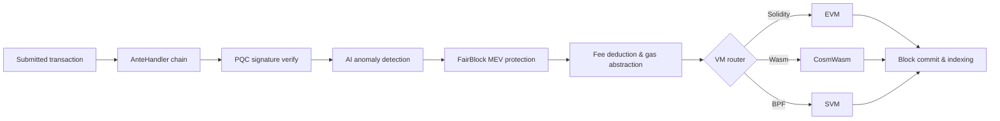

# アーキテクチャ概要

QoreChainは、チェーンノード、AIサイドカー、ブロックインデクサーという3つの主要プロセスで構成されたモジュール型ブロックチェーンノードであり、Postgresデータベースを裏側に持ち、PrometheusおよびGrafanaによって監視されています。メインネット（`qorechain-vladi`、EVMチェーンID **9801**）は2026年6月7日以降チェーンバージョン **v3.1.92** で稼働しており、並行してテストネット（`qorechain-diana`、EVMチェーンID **9800**）も運用されています。チェーンはCosmos SDK v0.53上に構築されています。以下の図はコンポーネントの高レベルな配置を示しています。

以下のトランザクションライフサイクルは、送信されたトランザクションがAnteHandlerデコレータチェーン（セキュリティおよび手数料チェック）からVM実行、オンチェーンでの確定に至るまで、ノードをどのように流れていくかを要約したものです。


```mermaid
flowchart LR
    Tx[Submitted transaction] --> Ante[AnteHandler chain]
    Ante --> PQC[PQC signature verify]
    PQC --> AI[AI anomaly detection]
    AI --> Fair[FairBlock MEV protection]
    Fair --> Fee[Fee deduction & gas abstraction]
    Fee --> Router{VM router}
    Router -->|Solidity| EVM[EVM]
    Router -->|Wasm| Wasm[CosmWasm]
    Router -->|BPF| SVM[SVM]
    EVM --> Commit[Block commit & indexing]
    Wasm --> Commit
    SVM --> Commit
```

```
┌────────────────────────────────────────────────────────────────────────────┐
│                            QoreChain Node                                  │
│                                                                            │
│  ┌──────────────────── Virtual Machines ──────────────────────┐           │
│  │  ┌───────┐    ┌──────────┐    ┌───────┐                   │           │
│  │  │  EVM  │    │ CosmWasm │    │  SVM  │                   │           │
│  │  │(Sol.) │◄──►│ (Wasm)   │◄──►│ (BPF) │                   │           │
│  │  └───┬───┘    └────┬─────┘    └───┬───┘                   │           │
│  │      └─────────┬───┘──────────────┘                       │           │
│  │           x/crossvm (bridge)                               │           │
│  └────────────────────────────────────────────────────────────┘           │
│                                                                            │
│  ┌────────────────────── Tokenomics ─────────────────────────┐           │
│  │  ┌──────┐   ┌───────┐   ┌───────────┐                    │           │
│  │  │x/burn│   │x/xqore│   │x/inflation│                    │           │
│  │  │10 ch.│   │lock/  │   │finite     │                    │           │
│  │  │37/30/│   │unlock │   │emission   │                    │           │
│  │  │20/10/│   │PvP    │   │590M       │                    │           │
│  │  │3     │   │       │   │budget     │                    │           │
│  │  └──────┘   └───────┘   └───────────┘                    │           │
│  └────────────────────────────────────────────────────────────┘           │
│                                                                            │
│  ┌──────────── IBC / Bridges ────────────────────────────────┐           │
│  │  ┌──────────┐  ┌──────────┐  ┌───────────┐  ┌──────────┐ │           │
│  │  │x/bridge  │  │x/babylon │  │x/abstract │  │x/gas     │ │           │
│  │  │37 QCB +  │  │BTC re-   │  │ account   │  │abstract. │ │           │
│  │  │8 IBC     │  │staking   │  │session key│  │multi-tok │ │           │
│  │  └────┬─────┘  └────┬─────┘  └───────────┘  └──────────┘ │           │
│  │  QCB Bridge     Babylon IBC   ERC-4337-like   ibc/USDC    │           │
│  │  PQC-signed     BTC finality  social recov.   ibc/ATOM    │           │
│  │  36 ext chains  checkpoint    spending rules  fee convert  │           │
│  │  ┌──────────┐                                              │           │
│  │  │x/fair    │  5-Lane Prioritization: PQC|MEV|AI|Def|Free │           │
│  │  │ block    │  tIBE encrypted mempool framework           │           │
│  │  └──────────┘                                              │           │
│  └────────────────────────────────────────────────────────────┘           │
│                                                                            │
│  ┌──── Rollup Development Kit ───────────────────────────────┐           │
│  │  ┌──────────┐  ┌──────────┐  ┌───────────┐  ┌──────────┐ │           │
│  │  │ x/rdk    │  │Settlement│  │ DA Router │  │ Profiles │ │           │
│  │  │ 4 modes: │  │Optimistic│  │ Native    │  │ defi     │ │           │
│  │  │ opt/zk/  │  │ZK/Based/ │  │ Celestia* │  │ gaming   │ │           │
│  │  │ based/   │  │Sovereign │  │ Both      │  │ nft      │ │           │
│  │  │ sovereign│  │          │  │           │  │ social/  │ │           │
│  │  │          │  │          │  │           │  │ general  │ │           │
│  │  └────┬─────┘  └────┬─────┘  └───────────┘  └──────────┘ │           │
│  │  Bank escrow    Auto-finalize  SHA-256 commit  AI-assisted │           │
│  │  Burn on create EndBlocker     Blob pruning    PRISM sugg. │           │
│  │  → x/multilayer (RegisterSidechain + AnchorState)          │           │
│  └────────────────────────────────────────────────────────────┘           │
│                                                                            │
│  ┌──────────────┐ ┌──────┐ ┌────────────┐ ┌─────┐                       │
│  │x/rlconsensus │ │ x/ai │ │x/reputation│ │x/qca│                       │
│  │  PRISM (RL)  │ │      │ │            │ │     │                       │
│  └──────┬───────┘ └──┬───┘ └────┬──────┘ └──┬──┘                       │
│   PPO MLP         AI Engine   Scoring    CPoS Pools                      │
│   Obs/Action      Fraud Det.  Decay      Bonding                         │
│   Circuit Brk     Fee Opt.    Sigmoid    Slashing                        │
│   Rollup Adv.     TEE/FL                 QDRW Gov                        │
│                                                                            │
│  ┌──────┐ ┌──────────┐                                                   │
│  │x/pqc │ │ x/multi  │                                                   │
│  └──┬───┘ └────┬─────┘                                                   │
│  Dilithium    Layer Router                                                │
│  ML-KEM       Sidechains                                                  │
│  Hybrid Sig   + Rollups                                                   │
│  SHAKE-256                                                                │
│                                                                            │
│  ┌──────┐ ┌───────┐                                                      │
│  │x/svm │ │x/cross│                                                      │
│  └──┬───┘ └───┬───┘                                                      │
│  BPF Exec   CrossVM Msg                                                   │
└────────┬──────┬───────────────────────────────────────┬───────────────────┘
         │      │                                       │
   ┌─────┴─────┐│                              ┌───────┴──────┐
   │libqorepqc ││                              │  Indexer     │
   │(Rust PQC) ││                              │  (Postgres)  │
   └───────────┘│                              └──────────────┘
   ┌───────────┐│  ┌──────────┐
   │libqoresvm ││  │AI Sidecar│
   │(Rust BPF) │└──│ (gRPC)   │
   └───────────┘   └──────────┘
```

## ノードコンポーネント

QoreChainは、それぞれが独自のGoモジュールとバイナリを持つ3つの協調プロセスとして動作します。

| コンポーネント          | 説明                                                                                                                                                                                                                                                                                                          | 場所                  |
| ------------------ | ---------------------------------------------------------------------------------------------------------------------------------------------------------------------------------------------------------------------------------------------------------------------------------------------------- | ------------------------- |
| **qorechain-node** | コアとなるブロックチェーンノード。QoreChain Consensus Engineを実行し、すべてのカスタムモジュールを実行し、3つすべてのVMランタイムを管理し、RPC、REST、gRPC、JSON-RPCの各エンドポイントを公開します。                                                                                                                      | `qorechain-core/`         |
| **ai-sidecar**     | QCAI Backendを背後に持つ、高度なAI推論機能を提供するgRPCサービス。このサイドカーは、オンチェーンのRLエージェントの守備範囲を超える推論リクエスト（自然言語解析や複雑なパターン認識など）を処理します。ノードとはポート50051上のgRPCで通信します。 | `qorechain-core/sidecar/` |
| **block-indexer**  | ノードのRPCエンドポイントから新しいブロックとトランザクションを購読するWebSocketリスナー。イベントを解析し、エクスプローラーやAPIによる高速なクエリのために構造化データをPostgresデータベースへ書き込みます。                                                                                                          | `qorechain-core/indexer/` |

## ポート

| ポート  | プロトコル       | サービス                                                                           |
| ----- | -------------- | --------------------------------------------------------------------------------- |
| 26657 | HTTP/WebSocket | QoreChain Consensus Engine RPC（ブロック、トランザクション、コンセンサス状態）            |
| 1317  | HTTP           | REST API（クエリエンドポイント、トランザクションのブロードキャスト）                                 |
| 9090  | gRPC           | gRPCクエリおよびトランザクションエンドポイント                                              |
| 8545  | HTTP           | EVM JSON-RPC（`eth_`、`web3_`、`net_`、`txpool_`、`qor_` の各名前空間）              |
| 8546  | WebSocket      | EVM JSON-RPC（WebSocketサブスクリプション）                                            |
| 8899  | HTTP           | SVM JSON-RPC（Solana互換：`getAccountInfo`、`getBalance`、`getSlot` など） |
| 50051 | gRPC           | AIサイドカー（ノードからの推論リクエスト）                                     |
| 5432  | TCP            | Postgres（ブロックインデクサーのストレージ）                                                |
| 9091  | HTTP           | Prometheusメトリクス                                                                |
| 3000  | HTTP           | Grafanaダッシュボード                                                                |

## モジュールマップ

QoreChainは **20以上のカスタムモジュールを含む45以上のジェネシスモジュール** を機能別にグループ化して登録しています。

**セキュリティ**

* `x/pqc` — ポスト量子暗号：Dilithium-5、ML-KEM-1024、secp256k1（ECDSA）+ ML-DSA-87のハイブリッド、SHAKE-256、アルゴリズムアジリティ

**AIと機械学習**

* `x/ai` — トランザクションルーティング、異常検知、不正検知、手数料最適化、TEEアテステーション、連合学習
* `x/reputation` — 時間的減衰を伴う多要素バリデータレピュテーションスコアリング
* `x/rlconsensus` — オンチェーンRLエージェント（PPO MLP）、動的コンセンサスチューニング、サーキットブレーカー、ロールアップアドバイザリ — PRISM最適化レイヤー

**コンセンサス**

* `x/qca` — QoreChain Consensus Engine上のトリプルプール複合PoS（RPoS/DPoS/PoS）、カスタムボンディングカーブ、段階的スラッシング、QDRWガバナンス

**仮想マシン**

* `x/vm` — VMルーティングとライフサイクル管理
* `x/svm` — SVMランタイム：BPFのデプロイ/実行、レント徴収、Solana互換RPC
* `x/crossvm` — クロスVM通信：EVM-CosmWasmプリコンパイル + SVM非同期イベント

**トークノミクスと流動性**

* `x/burn` — 10のバーンチャネル、EndBlockerでの手数料分配（37/30/20/10/3の配分）
* `x/xqore` — ガバナンスブーストステーキング：ロック/アンロック、段階的な出口ペナルティ、PvPリベース
* `x/inflation` — 複数年スケジュールの有限ステーキング報酬予算からの固定供給発行
* `x/amm` — オンチェーン流動性 / 自動マーケットメーカー

**ブリッジと相互運用性**

* `x/bridge` — あらゆる主要チェーンタイプにまたがる37のQCB設定（外部チェーン36 + QoreChainループバック）、PQC署名付きアテステーション、サーキットブレーカー
* `x/babylon` — Babylon ProtocolによるBTCリステーキング、エポックチェックポイント
* `x/multilayer` — サイドチェーン/ペイチェーン/ロールアップのレイヤー管理、状態アンカリング

**ガバナンスとライセンス拡張**

* `x/abstractaccount` — スマートアカウント：マルチシグ、ソーシャルリカバリー、セッションキー、支出ルール
* `x/fairblock` — MEV保護：しきい値IBE暗号化メンプールフレームワーク
* `x/gasabstraction` — マルチトークンガス支払い：ibc/USDC、ibc/ATOMの手数料変換
* `x/license` — チェーンライセンス

**ロールアップ**

* `x/rdk` — Rollup Development Kit：4つの決済モード（optimistic、zk、based、sovereign）、プリセットプロファイル、ネイティブDA、銀行エスクロー

## AnteHandlerチェーン

すべてのトランザクションは、実行前に以下のデコレータチェーンを通過します。デコレータは順番に実行され、いずれのデコレータもトランザクションを拒否できます。

```
SetUpContext
  → CircuitBreaker
    → PQCVerify
      → PQCHybridVerify
        → AIAnomaly
          → FairBlock
            → SVMComputeBudget
              → SVMDeductFee
                → Extension
                  → ValidateBasic
                    → TxTimeout
                      → Memo
                        → MinGasPrice
                          → ConsumeTxSize
                            → GasAbstraction
                              → DeductFee
                                → SetPubKey
                                  → ValidateSigCount
                                    → SigGasConsume
                                      → SigVerify
                                        → IncrementSequence
```

主要なデコレータは以下の順序で実行されます（各デコレータは順番に実行され、トランザクションを拒否できます）。

1. **PQCVerify** — モジュール `x/pqc`。PQCフラグ付きトランザクションのDilithium-5署名を検証します。
2. **PQCHybridVerify** — モジュール `x/pqc`。secp256k1（ECDSA）+ ML-DSA-87のデュアルハイブリッド署名を検証します。
3. **AIAnomaly** — モジュール `x/ai`。分離フォレストによる異常検知とリスクスコアリングを実行します。
4. **FairBlock** — モジュール `x/fairblock`。MEV保護のためtIBE暗号化トランザクションを処理します。
5. **SVMComputeBudget** — モジュール `x/svm`。SVMプログラム向けの計算ユニットを検証・割り当てます。
6. **SVMDeductFee** — モジュール `x/svm`。SVM固有の実行手数料を控除します。
7. **GasAbstraction** — モジュール `x/gasabstraction`。控除前に非ネイティブ手数料トークン（USDC、ATOM）を変換します。

## Docker Composeスタック

フル開発スタックは、共有ブリッジネットワーク（`qorechain-net`）上で6つのサービスからなるDocker Composeデプロイメントとして動作します。

| サービス          | イメージ                      | 用途                                             |
| ---------------- | -------------------------- | --------------------------------------------------- |
| `qorechain-node` | `qorechain-core:latest`    | すべてのモジュール、VM、RPCエンドポイントを備えたチェーンノード |
| `ai-sidecar`     | `qorechain-sidecar:latest` | AI推論サービス（gRPC + QCAI Backend）          |
| `block-indexer`  | `qorechain-indexer:latest` | ブロック/トランザクションインデクサー（WebSocket + Postgres）    |
| `postgres`       | `postgres:16-alpine`       | ブロックインデクサー用データベース                      |
| `prometheus`     | `prom/prometheus:latest`   | メトリクスの収集と保存                                 |
| `grafana`        | `grafana/grafana:latest`   | 監視ダッシュボードとアラート                            |

フルスタックを起動します。

```bash
docker compose up -d
```

すべての永続データは、名前付きDockerボリューム `node-data`、`postgres-data`、`prometheus-data`、`grafana-data` に保存されます。

## 関連ドキュメント

* [Multilayer Architecture](/architecture/multilayer-architecture) — サイドチェーンの登録と状態アンカリング
* [Consensus Mechanism](/architecture/consensus-mechanism) — ブロック生成、ファイナリティ、スラッシング
* [PRISM Consensus Engine](/architecture/prism-consensus-engine) — AI駆動のパラメータ最適化
* [Post-Quantum Security](/architecture/post-quantum-security) — スタック全体にわたるDilithium-5署名
