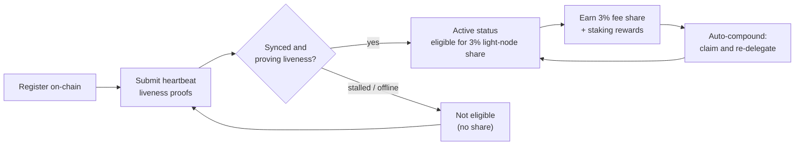

# 報酬と監視

ライトノードは**報酬を獲得する**と同時に、それを獲得し続けるために**健全な状態を保つ必要があります**。このページでは、3%のライトノード報酬シェア、委任ステーキングと自動複利運用の仕組み、そしてノードの監視方法を説明します。

## 3%のブロック報酬シェア

QoreChain の手数料分配は、ネットワークデータを提供する**ライトノード向けに固定の3%シェア**を確保しています。これは、プロトコルの報酬分割における5つの宛先のうちの1つです — バリデーター（37%）、バーン（30%）、トレジャリー（20%）、ステーカー（10%）、そして**ライトノード（3%）** — これらはオンチェーンで強制されます。完全な内訳については[トークノミクス](/architecture/tokenomics)を参照してください。

このシェアの対象となるには、ノードが**オンチェーンで登録され、ハートビート証明を通じて積極的に稼働を証明している**必要があります。登録されているがオフラインのノードはシェアを獲得しません。登録とハートビートの仕組みについては[登録とライセンス](/light-node/registration-and-licensing)を参照してください。

*報酬の対象条件: オンチェーンで登録し、ハートビートで稼働を証明してアクティブ状態に達し、3%シェアを獲得し、それをステークへ自動複利運用する。*



## 報酬の仕組み

ライトノードシェアに加えて、ノードは委任されたステークと、それが生み出すステーキング報酬を管理します。この挙動は `config.toml` の `[delegation]` セクションによって制御されます。

### マルチバリデーター分割による委任ステーキング

ステークを1つに集中させるのではなく、**複数のバリデーター**にまたがって委任できます。ノードは各委任と、各バリデーターに割り当てられたステークの割合を、設定可能な**分割ウェイト（split weights）**を使って追跡するため、セット全体にリスクを分散できます。

### 報酬の自動複利運用

ノードは、設定可能な間隔で**報酬を請求して自動的に再委任する**ことができます。デフォルトでは自動複利運用は `1h` 間隔で有効になっており、請求がトリガーされる前に蓄積されるべき最小報酬しきい値（`uqor` 単位）が設定されています。複利運用は、獲得した報酬を手動操作なしで追加のステークへと変えます。

### レピュテーションを考慮したリバランス

リバランスが有効な場合、ノードは設定可能な最小レピュテーションスコアを条件として、**より高いレピュテーションを持つバリデーターへ委任を自動的にシフト**できます。これにより、ステークが性能の劣化したバリデーターに留まるのではなく、良好に動作しているバリデーターで機能し続けるようになります。

### 報酬と委任の確認

SX エディションは、この状態を確認するためのコマンドを提供します。

```bash
lightnode-sx delegation   # current delegations and their split
lightnode-sx rewards      # pending staking rewards (uqor)
lightnode-sx validators   # the bonded validator set
```

UX エディションでは、**Delegation** ビューがブラウザ内で同じ委任および報酬情報を表示します。

## 監視

ノードを健全に保つことが、報酬の対象であり続けることにつながります。監視する価値のあるものは3つあります。

### テレメトリ

リアルタイムのテレメトリは、バリデーター、コンセンサス/ネットワーク、ブリッジ、トークノミクスをカバーし、それぞれが独自の間隔で更新されます（`config.toml` の `[telemetry]` の下で設定）。CLI からは次のとおりです。

```bash
lightnode-sx status    # node and light-client sync status
lightnode-sx network   # recent synced headers and latest height
```

UX エディションは、**Overview**、**Network**、**Bridge**、**Tokenomics** の各ビューにわたって同じデータをライブで表示します — [UX エディション](/light-node/ux-edition)を参照してください。

### 同期とハートビートの健全性

`status` コマンドは、チェーン ID、最新ブロック高さ、チェーンがキャッチアップ中かどうか、そしてライトクライアントの同期済み高さと同期状態を報告します。登録され、同期し、稼働しているノードは**ハートビートによる稼働証明**を提出し続け、報酬シェアの対象であり続けます。これらのハートビートは、チェーンの PQC 必須デフォルトと整合する**PQC で共署名されたトランザクションパイプライン**（ハイブリッド Dilithium-5 / ML-DSA-87）を通じて生成されます — パイプラインの仕組みとオンチェーンハートビートの有効化方法については[登録とライセンス](/light-node/registration-and-licensing#pqc-cosigned-heartbeat-pipeline)を参照してください。`status` がノードの停滞または非同期を示している場合、稼働証明に失敗している可能性があります — 対象資格に影響が出る前に調査してください。

### セルフテストの健全性

暗号スタックに問題があると思われる場合は、いつでも PQC セルフテストを実行できます。

```bash
lightnode-sx selftest
```

これは keygen → sign → verify → 改ざん検出（5つのチェック）を実行し、いずれかが失敗すると非ゼロで終了します。これは、ノードの問題を診断する際に、`libqorepqc` ライブラリの破損や欠落を除外する最も速い方法です。完全なセルフテストの内訳については[SX エディション](/light-node/sx-edition)を参照してください。

## 次に進む先

- [登録とライセンス](/light-node/registration-and-licensing) — 登録を済ませ、稼働を維持する。
- [トークノミクス](/architecture/tokenomics) — 完全な報酬およびバーンモデル。
