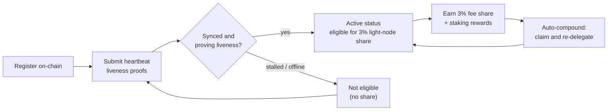

# 報酬とモニタリング

ライトノードは**報酬を得る**と同時に、それを得続けるために**健全な状態を保つ**必要があります。このページでは、ライトノード報酬シェア3%、委任ステーキングと自動複利の仕組み、そしてノードのモニタリング方法について説明します。

## ブロック報酬シェア3%

QoreChainの手数料分配は、ネットワークデータを提供するライトノードのために固定の**3%シェア**を確保しています。これはプロトコルの報酬配分における5つの分配先の1つで — バリデータ(37%)、バーン(30%)、トレジャリー(20%)、ステーカー(10%)、そして**ライトノード(3%)** — オンチェーンで強制されています。全体の内訳については[Tokenomics](/architecture/tokenomics)を参照してください。

このシェアの対象資格を得るには、自己申告ではなくオンチェーンで確認される3つの条件が必要です。有効な`lightnode_operator`ライセンス、最低**1,000 QORの委任**(これは委任先の全バリデータにわたる合計であり、バリデータごとではありません)、そして**1 QOR**のオンチェーン登録手数料です。参加はネットワーク全体で**10,000ライトノード**が上限となっています。登録とライセンスの仕組み、および現在の報酬プログラム登録状況については[Registration and Licensing](/light-node/registration-and-licensing)を参照してください。

登録と委任が済んだら、対象資格を維持するにはノードを稼働させ続けるだけです。ノードは最低**80%の稼働率**を維持し、およそ**1,000ブロック(約39分)間隔**でハートビート稼働証明を送信し続ける必要があります。

**送信ウィンドウは遅れ側だけでなく両端で狭くなっています。** ハートビートが受理されるのは、おおよそ**直前に受理されたハートビート+1,000ブロックから+1,100ブロックまで**の間(約4分間、約39分ごと)のみです — 早すぎても遅すぎても、同じように拒否されます。

**ウィンドウを逃しても失うのは稼働率であって、登録ではありません。** ウィンドウを逃したノードは非アクティブとマークされシェアの獲得を停止しますが、次に成功したハートビートで即座に再アクティブ化されます — 再登録は不要です。なお、デーモン内部の次回ハートビートに向けたカウンターは、送信の試行が失敗しても進み続け、再起動時にリセットされます。そのため、オペレーターに落ち度がなくてもノードが非アクティブとマークされることがあります。非アクティブの表示を設定ミスと決めつけず、`status`を確認してください。

:::note ハートビートが実際に証明していること
成功したハートビートが証明するのは、オペレーターのキーが時間内に署名したという事実だけであり、ノードがソフトウェア全体を継続的に実行していることを証明するものではありません。これは稼働の署名であり、「アクティブなノードとして検証済み」という意味ではないと捉えてください。
:::

:::note `last_heartbeat`はタイムスタンプではなくブロック高です
ノードのオンチェーン記録を直接クエリすると、`last_heartbeat`はブロック高であり、値が`0`の場合はそのノードがまだ一度もハートビートを送信していないことを意味します — この場合チェーンは代わりに`registered_at`の高さを報告します。これを単純な経過時間の計算として読み取ると、登録したばかりのノードが数百万ブロックも遅延しているように見えてしまいます。
:::

*報酬対象資格: 有効なオンチェーンライセンスと最低委任ステーク量を保持し、登録した上で、シェアが流れ続けるために必要な稼働率とハートビート間隔のしきい値を上回るよう、ハートビートによる稼働証明を継続してください。*


```mermaid
flowchart LR
    A["Register on-chain"] --> B["Submit heartbeat<br/>liveness proofs"]
    B --> C{"Synced and<br/>proving liveness?"}
    C -- "yes" --> D["Active status<br/>eligible for 3% light-node share"]
    C -- "stalled / offline" --> E["Not eligible<br/>(no share)"]
    E --> B
    D --> F["Earn 3% fee share<br/>+ staking rewards"]
    F --> G["Auto-compound:<br/>claim and re-delegate"]
    G --> D
```

## 報酬の仕組み

ライトノードシェアに加えて、ノードは委任ステークとそれが生み出すステーキング報酬を管理します。この挙動は`config.toml`の`[delegation]`セクションによって制御されます。

### マルチバリデータ分割による委任ステーキング

ステークを1つのバリデータに集中させるのではなく、**複数のバリデータ**にまたがって委任できます。ノードは各委任と、各バリデータに割り当てられたステークのシェアを、設定可能な**分割ウェイト**を使って追跡するため、リスクをセット全体に分散できます。

### 自動複利報酬

ノードは、設定可能な間隔で**報酬を請求し、自動的に再委任する**ことができます。デフォルトでは自動複利は`1h`間隔で有効になっており、請求がトリガーされるまでに蓄積が必要な最低報酬しきい値(`uqor`単位)が設定されています。複利化により、手動操作なしで獲得済みの報酬が追加のステークへと変換されます。

### レピュテーションを考慮したリバランス

リバランスが有効な場合、ノードは設定可能な最低レピュテーションスコアに従って、**より高レピュテーションのバリデータへ委任を自動的にシフト**できます。これにより、ステークはパフォーマンスが低下したバリデータに留まるのではなく、良好なパフォーマンスを発揮しているバリデータで働き続けます。

### 報酬と委任の確認

SXエディションでは、この状態を確認するためのコマンドが提供されています。

```bash
lightnode-sx delegation   # current delegations and their split
lightnode-sx rewards      # pending staking rewards (uqor)
lightnode-sx validators   # the bonded validator set
```

UXエディションでは、**Delegation**ビューがブラウザ上で同じ委任・報酬情報を表示します。

## モニタリング

ノードを健全な状態に保つことが、報酬の対象資格を維持することにつながります。監視すべきものは3つあります。

### テレメトリ

リアルタイムテレメトリは、バリデータ、コンセンサス/ネットワーク、ブリッジ、トークノミクスをカバーし、それぞれが独自の間隔(`config.toml`の`[telemetry]`配下で設定)で更新されます。CLIからは次のように確認できます。

```bash
lightnode-sx status    # node and light-client sync status
lightnode-sx network   # recent synced headers and latest height
```

UXエディションは、**Overview**、**Network**、**Bridge**、**Tokenomics**の各ビューで同じデータをライブで表示します — [UX Edition](/light-node/ux-edition)を参照してください。

### 同期とハートビートの健全性

`status`コマンドは、チェーンID、最新のブロック高、チェーンがキャッチアップ中かどうか、そしてライトクライアントの同期済み高さと同期状態を報告します。登録済みで、同期しており、稼働しているノードは**ハートビート稼働証明**の送信を継続し、報酬シェアの対象資格を維持します。これらのハートビートは**PQC共同署名トランザクションパイプライン**(ハイブリッドDilithium-5 / ML-DSA-87)を通じて生成され、チェーンのPQC必須のデフォルト方針と整合しています — パイプラインの仕組みとオンチェーンハートビートの有効化方法については[Registration and Licensing](/light-node/registration-and-licensing#pqc-cosigned-heartbeat-pipeline)を参照してください。`status`がノードの停滞や未同期を示している場合、稼働証明に失敗している可能性があります — 対象資格に影響が及ぶ前に調査してください。

### セルフテストの健全性

暗号スタックに問題があると疑われる場合は、いつでもPQCセルフテストを実行できます。

```bash
lightnode-sx selftest
```

これはkeygen → sign → verify → 改ざん検出(5つのチェック)を実行し、いずれかが失敗すると非ゼロで終了します。ノードの問題を診断する際、耐量子署名スタックの問題を除外する最も速い方法です。セルフテストの詳細な内訳については[SX Edition](/light-node/sx-edition)を参照してください。

## 次に読むべきページ

- [Registration and Licensing](/light-node/registration-and-licensing) — 登録を済ませ、稼働し続ける方法。
- [Tokenomics](/architecture/tokenomics) — 報酬とバーンの全体モデル。
