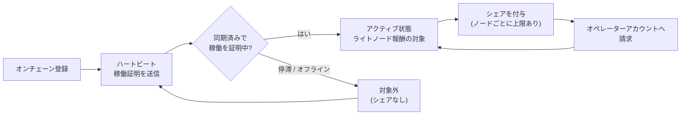

# 報酬とモニタリング

登録済みのライトノードには、ライトノード割り当ての一部が付与されますが、その対象資格を維持し続けるには**健全な状態を保つ**必要があります。このページでは、ライトノード報酬シェア3%、報酬の付与と請求の仕組み、ノードが委任に対して行うこと・行わないこと、そしてノードのモニタリング方法について説明します。

:::note このページの内容はいかなる収益の約束でもありません
登録は両方のネットワークで開放されています。現在の状況については[報酬プログラムの状況](/light-node/overview#reward-program-status)を参照してください。ノードに付与される額は、ライトノード割り当て、対象となるノードの数、それらのステークと稼働率、そして以下で説明するノードごとの上限によって決まります。
:::

## ブロック報酬シェア3%

QoreChainの手数料分配は、ネットワークデータを提供するライトノードのために固定の**3%シェア**を確保しています。これはプロトコルの報酬配分における5つの分配先の1つで — バリデータ(37%)、バーン(30%)、トレジャリー(20%)、ステーカー(10%)、そして**ライトノード(3%)** — オンチェーンで強制されています。全体の内訳については[Tokenomics](/architecture/tokenomics)を参照してください。

このシェアに参加するには、自己申告ではなくオンチェーンで確認される次の条件が必要です。有効な`lightnode_operator`ライセンス(登録時に確認されます)、**ボンド済みバリデータに委任された最低1,000 QOR**(これは委任先の全バリデータにわたる合計であり、バリデータごとではありません。jail されたバリデータやアンボンドされたバリデータへの委任はカウントされません。登録時に必須で、報酬が付与されるたびにステーキングから再度読み取られます)、そして登録時に一度だけ支払う**1 QOR**の登録手数料です。参加はネットワーク全体で**10,000ライトノード**が上限となっています。登録の仕組みについては[Registration and Licensing](/light-node/registration-and-licensing)を、現在の状況については[報酬プログラムの状況](/light-node/overview#reward-program-status)を参照してください。

3%とは、ライトノードモジュールに流れ込む分を指すものであり、ノードごとの受給権ではありません。対象となる各ノードには、蓄積された分のうちステーク加重のシェアが付与され、ノードごとに上限が設けられます。獲得されなかった分は、ガバナンス投票でのみ解放できるリザーブに入ります。チェーン v3.2.3 以降、ノードごとの上限は**30日あたり2,000 QOR**(`max_reward_per_month_per_node`)で、決済間に経過したブロック時間に応じて按分され、稼働率に応じてスケールされます(`lightnode-monthly-cap` ルール)。これは以前のブロック単位の上限(`max_reward_per_block_per_node`、1ブロックあたり`1713` uqor)に代わるものです。v3.2.4以降(メインネットでは2026年10月23日から、テストネットでは2026年10月19日から)は、ノードの上限は、前回の決済とそのノード自身の登録のうち遅い方から始まるため、新たに登録されたノードには、登録前の期間分は付与されません。[ライトノード報酬シェア3%](/light-node/overview#the-3-light-node-reward-share)を参照してください。

登録と委任が済んだら、対象資格を維持するにはノードを稼働させ続けるだけです。ノードは最低**80%の稼働率**を維持し、**1,000ブロック間隔**(メインネットでは実測の平均ブロック時間約3.1秒で約52分。テストネットでは1ブロックあたり約1.3秒で約22分)でハートビート稼働証明を送信し続ける必要があります。

**タイミングのルール。** チェーンは、**前回のハートビートから1,000ブロック未満**で送信されたハートビートを拒否します(`heartbeat submitted too early`)。登録後の最初のハートビートには、このような下限はありません。前回のハートビート(まだ送信していない場合は登録)から**1,000 + 100ブロック**(`heartbeat_interval`と`heartbeat_grace_period`の合計。メインネットでは約52分に、約5分の猶予を加えた時間)以内にハートビートが届かない場合、ノードは非アクティブとマークされ、報酬の付与が停止します。それ以降に送信されたハートビートも受理され、ノードは再アクティブ化されます。デーモンは、チェーン自身が記録しているノードの`last_heartbeat`から1,000ブロックが経過した時点で次のハートビートを送信し、60秒ごとに確認します。

**ウィンドウを逃しても失うのは稼働率であって、登録ではありません。** ウィンドウを逃したノードは非アクティブとマークされ、報酬の獲得を停止しますが、次に成功したハートビートで即座に再アクティブ化されます — 再登録は不要です。**稼働率**は、登録したブロック以降の、受信したハートビート数と期待されるハートビート数(1,000ブロックにつき1回)の累積比率であり、上限は1です。`min_uptime_for_rewards`のしきい値(`0.80`)を下回るノードは何も獲得できません。しきい値以上では、ノードごとの上限が稼働率に応じてスケールします。したがって長時間の停止は比率を下げ、その比率は期限内のハートビートが積み重なることでのみ回復します。ノードが非アクティブと表示される場合は`status`を確認してください。署名者、ライセンス、登録の状態が報告されます。

:::note ハートビートが実際に証明していること
成功したハートビートが証明するのは、オペレーターのキーが時間内に署名したという事実だけであり、ノードがソフトウェア全体を継続的に実行していることを証明するものではありません。これは稼働の署名であり、「アクティブなノードとして検証済み」という意味ではないと捉えてください。
:::

:::note `last_heartbeat`はタイムスタンプではなくブロック高です
ノードのオンチェーン記録を直接クエリすると、`last_heartbeat`はブロック高であり、値が`0`の場合はまだハートビートが記録されていないことを意味します — この場合チェーンは、ノードの`registered_at`の高さから非アクティブの期限を計測します。`0`を単純な経過時間の計算として読み取ると、登録したばかりのノードが数百万ブロックも遅延しているように見えてしまいます。
:::

*報酬対象資格: 有効なオンチェーンライセンスと最低ボンドステーク量を保持し、登録した上で、稼働率とハートビート間隔のしきい値を上回るよう、ハートビートによる稼働証明を継続してください。*


```mermaid
flowchart LR
    A["オンチェーン登録"] --> B["ハートビート<br/>稼働証明を送信"]
    B --> C{"同期済みで<br/>稼働を証明中?"}
    C -- "はい" --> D["アクティブ状態<br/>ライトノード報酬の対象"]
    C -- "停滞 / オフライン" --> E["対象外<br/>(シェアなし)"]
    E --> B
    D --> F["シェアを付与<br/>(ノードごとに上限あり)"]
    F --> G["オペレーターアカウントへ<br/>請求"]
    G --> D
```

## 報酬の仕組み {#how-rewards-work}

### 付与

100ブロックごとに、チェーンは対象となる各ノード(アクティブで、最低委任ステーク量と最低稼働率を満たすもの)に、蓄積された分のシェアを付与します。ノードごとの上限(前回の決済からの経過時間に応じて按分された、30日あたり最大2,000 QOR)は[ライトノード報酬シェア3%](/light-node/overview#the-3-light-node-reward-share)で説明されているとおりです。この額はノードの`accumulated_rewards`に加算されます。次のコマンドで確認できます。

```bash
curl -s https://api.qore.host/qorechain/lightnode/v1/rewards/<operator-address>
# or: qorechaind query lightnode rewards <operator-address>
```

(テストネットには`https://api-testnet.qore.host`を使用してください。)

### 請求

付与された報酬は、請求するまでノードの記録上に残ります。ノードに代わりに請求させることもできます。`[delegation]`の下で`auto_claim = true`を設定すると、デーモンは、蓄積されたライトノード報酬が`min_reward_claim`(デフォルトは`1000000` uqor、つまり1 QOR)を超えた時点でオペレーターアカウントへ請求します。確認は`compound_interval`(デフォルトは`1h`)ごとに行われます。請求はハートビートと同じ方法(ネイティブ、または`qorechaind`によるフォールバック)で署名されます。自動請求は**デフォルトでオフ**であり、請求のみを行います。ノードが再委任したりステークを移動したりすることはありません。

`qorechaind`で手動で請求するには(オペレーターキーを`qorechaind`のキーリングに置き、ポスト量子キーを`lightnode-sx keys export <key-name> --out ~/.qorechaind/pqc/<key-name>.dilithium`でエクスポートしたうえで)、「生成してから共同署名」の組み合わせを使用します。

```bash
qorechaind tx lightnode claim-rewards --from operator --chain-id <chain-id> --node https://rpc.qore.host --gas 300000 --fees 30000uqor --generate-only > claim.json
qorechaind tx pqc cosign claim.json --from operator --pqc-key <key-name> --chain-id <chain-id> --node https://rpc.qore.host
```

`qorechaind tx lightnode deregister`は登録を解除し、まだ付与されたままの分を支払います。登録手数料は返金されません。

### 委任の追跡とステークアラート {#delegation-alerts}

ノードは起動時、およびその後5分ごとに、オペレーターアカウントの委任をチェーンから反映します。ノードがステークを移動することはありません。委任の変更はご自身のウォレットから行ってください。どのような警告が出るかは、ライトノードのバージョンによって異なります。

- **3.1.11以降(`rebalance_enabled = true`、デフォルト)。** 委任先のバリデータがjailされたとき、アクティブセットに入っていないとき、そしてボンドされたステークが`min_delegated_stake`(1,000 QOR)を下回ったときに警告します。この3つのいずれの場合も、チェーンはノードへの付与を停止し、メッセージは出しません。警告は、発生したときにログに記録され、継続している間は1時間ごとに、解消されたときに1回記録されます。
- **レピュテーションスコア(3.1.12、現時点ではテストネットのみ)。** ノードは、委任先の各バリデータのスコアも`GET /qorechain/reputation/v1/validator/<valoper>`から読み取り、`min_reputation`(デフォルトは`0.5`)を下回ると警告します。チェーンがまだスコアを付けていないバリデータ(`404`)はスキップされます。このルートは現在テストネットで提供されています。**メインネットではv3.2.5の後でもまだ提供されていません(2026年10月30日に確認: このルートは「Not Implemented」を返します)。後のチェーンリリースから提供されます。** ルートが提供されるまでは、ノードはスコアが公開されていないことを1回記録し、6時間ごとに再度問い合わせます。
- **3.1.10以前。** レピュテーションチェックは機能していませんでした。5分ごとに「failed to check reputation」をログに記録するだけで、警告は出ませんでした。これらのバージョンではアラートに頼らないでください。3.1.12を手動で一度インストールしてください([SX Edition: アップデート](/light-node/sx-edition#updating)を参照)。

`[delegation]`の`validators`と`split_weights`オプションは受け付けられますが、現在は動作に反映されません。

### 報酬と委任の確認

```bash
lightnode-sx validators   # the bonded validator set
lightnode-sx delegation   # the operator account's delegations, as mirrored by the running daemon
lightnode-sx rewards      # the operator account's pending staking rewards
```

3.1.6以降、これらのコマンドとUXの**Delegation**ビューは、`operator_address`のアカウントを読み取ります。`rewards`が表示するのは委任から得られる**ステーキング**報酬であり、ライトノード報酬ではありません。すべてをチェーンから直接読み取るには、次を使用します。

```bash
curl -s https://api.qore.host/cosmos/staking/v1beta1/delegations/<operator-address>
curl -s https://api.qore.host/cosmos/distribution/v1beta1/delegators/<operator-address>/rewards
curl -s https://api.qore.host/qorechain/lightnode/v1/rewards/<operator-address>   # light-node rewards
```

## モニタリング

ノードを健全な状態に保つことが、報酬の対象資格を維持することにつながります。監視すべきものは3つあります。

### テレメトリ

リアルタイムテレメトリは、バリデータ、コンセンサス/ネットワーク、ブリッジ、トークノミクスをカバーし、それぞれが独自の間隔(`config.toml`の`[telemetry]`配下で設定)で更新されます。CLIからは次のように確認できます。

```bash
lightnode-sx status    # node and light-client sync status
lightnode-sx network   # recent synced headers and latest height
```

UXエディションは、**Overview**、**Network**、**Bridge**、**Tokenomics**の各ビューで同じデータをライブで表示します — [UX Edition](/light-node/ux-edition)を参照してください。

### 同期とハートビートの健全性

`status`コマンドは、チェーンID、最新のブロック高、チェーンがキャッチアップ中かどうか、ライトクライアントの同期済み高さと同期状態、`Signer`(ネイティブ、`qorechaind`、または理由付きで利用不可)、そして — `operator_address`が設定されている場合は — `Licence`と`Registration`の状態(ノードのステータスと最後のハートビートの高さを含む)を報告します。登録済みで、同期しており、稼働しているノードは**ハートビート稼働証明**の送信を継続し、報酬の対象資格を維持します。これらのハートビートは**PQC共同署名トランザクションパイプライン**(ハイブリッドDilithium-5 / ML-DSA-87)を通じて生成され、チェーンのPQC必須のデフォルト方針と整合しています — パイプラインの仕組みとノードが署名者を選択する方法については[Registration and Licensing](/light-node/registration-and-licensing#pqc-cosigned-heartbeat-pipeline)を参照してください。`status`がノードの停滞や未同期を示している場合、稼働証明に失敗している可能性があります — 対象資格に影響が及ぶ前に調査してください。

### セルフテストの健全性

暗号スタックに問題があると疑われる場合は、いつでもPQCセルフテストを実行できます。

```bash
lightnode-sx selftest
```

これはkeygen → sign → verify → 改ざん検出(5つのチェック)を実行し、いずれかが失敗すると非ゼロで終了します。ノードの問題を診断する際、ポスト量子署名スタックの問題を除外する最も速い方法です。セルフテストの詳細な内訳については[SX Edition](/light-node/sx-edition)を参照してください。

### チェーンクエリ {#chain-queries}

ベースURL: `https://api.qore.host`(メインネット)および `https://api-testnet.qore.host`(テストネット)。

| クエリ | 返される内容 |
| --- | --- |
| `GET /qorechain/lightnode/v1/params` | 登録手数料、ハートビート間隔と猶予、最低委任ステーク量、報酬シェア、最低稼働率、ノード数の上限。 |
| `GET /qorechain/lightnode/v1/stats` | 登録済みおよびアクティブなノード数、付与された報酬の合計。 |
| `GET /qorechain/lightnode/v1/node/{address}` | 1つのノードの記録(`status`、`last_heartbeat`、`total_heartbeats`、`expected_heartbeats`、`accumulated_rewards`)。 |
| `GET /qorechain/lightnode/v1/rewards/{address}` | 付与済みで未請求の報酬。 |
| `GET /qorechain/lightnode/v1/reward_pool` | モジュール残高が、リザーブ、付与済み報酬、次回の支払いにどう分割されているか。ノードごとの上限(`max_reward_per_month_per_node`、および以前の`max_reward_per_block_per_node`)も含みます。 |
| `GET /qorechain/license/v1/check/{address}/lightnode_operator` | アドレスが有効なライセンスを保有しているかどうか。 |

## 次に読むべきページ

- [Registration and Licensing](/light-node/registration-and-licensing) — 登録を済ませ、稼働し続ける方法。
- [Tokenomics](/architecture/tokenomics) — 報酬とバーンの全体モデル。
