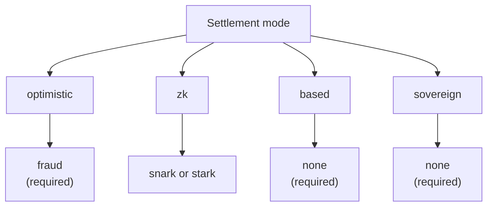

# ロールアップ概要

QoreChain の **Rollup Development Kit (RDK)** — `x/rdk` モジュール — を使うと、開発者は QoreChain 上で決済されるアプリケーション固有のロールアップを起動できます。各ロールアップは、独自のブロックタイム、仮想マシン、手数料モデル、シーケンシングを備えた独立した実行環境であり、同時に QoreChain のセキュリティ、ポスト量子暗号、データ可用性の保証を継承します。

:::caution
RDK およびロールアップ決済レイヤーは、現在も活発に進化している機能です。本セクション全体で説明される決済モード、証明システム、プリセット、機能ごとの成熟度は、変更される可能性のある設計意図として扱い、メインネット（**`qorechain-vladi`**、EVM チェーン ID **9801**、チェーンバージョン **v3.1.77**）を対象とする前に **`qorechain-diana`** テストネット上で任意のデプロイを検証してください。
:::

より低レベルのモジュールリファレンス（モジュールパラメータ、ライフサイクルの内部動作、burn 統合、マルチレイヤーアンカリング）については、アーキテクチャセクションの **[Rollup Development Kit](/architecture/rollup-development-kit)** ページを参照してください。このロールアップセクションは、開発者向けのハウツーです。RDK とは何か、どのパラダイムを選ぶか、どうデプロイするか、データ可用性がどう機能するか、そして引き出しが L2 から L1 へどう決済されるかを扱います。

---

## RDK が提供するもの

RDK を通じて作成されたロールアップは、設定可能な 4 つの関心事をまとめます:

| 関心事 | 制御する対象 | オプション |
| ------- | ---------------- | ------- |
| **決済モード** | ロールアップの状態遷移が QoreChain 上でどのように検証・確定されるか | `optimistic`、`zk`、`based`、`sovereign` |
| **証明システム** | 決済を裏付ける暗号的または経済的なメカニズム | `fraud`、`snark`、`stark`、`none` |
| **シーケンサーモード** | 決済前にトランザクションを順序付けるのは誰か | `dedicated`、`shared`、`based` |
| **データ可用性** | 誰でも状態を再構築できるよう、トランザクションデータがどこに公開されるか | `native`、`celestia`、`both` |

各ロールアップは一意の `rollup-id` で登録され、QOR でのステークボンドに裏付けられ、ライフサイクルステータス（`pending`、`active`、`paused`、`stopped`）が割り当てられます。作成からライフサイクルまでの完全なフローは **[ロールアップのデプロイ](/rollups/deploying-a-rollup)** を参照してください。

---

## QoreChain RDK の違い

あらゆるロールアップキットに共通する基本機能を超えて、QoreChain RDK は QoreChain のレイヤー 1 に依存する 3 つの機能を公開しています。これらは、ポスト量子でない、AI を備えないベースレイヤー上に構築されたキットでは提供できません。さらにウォッチタワーの自動チャレンジャーも備えています。RDK は 5 つの言語（TypeScript、Python、Go、Rust、Java）で提供されており、いずれも現在 **v0.4.0** です。

| 差別化要素 | 機能内容 |
| -------------- | ------------ |
| **[量子安全な決済レシート](/rollups/settlement-receipts)** | 決済アンカーを、ポスト量子（ML-DSA-87 / Dilithium-5）署名のもとで **完全オフライン** に検証可能な可搬レシートに変換します。5 つのクライアントすべてでバイト単位まで一致します。 |
| **[QCAI ロールアップ Copilot](/rollups/qcai-copilot)** | QoreChain のオンチェーン AI/RL サービス（手数料ポリシーエージェント、推奨事項、不正調査、サーキットブレーカー）を、1 つのロールアップ向けに読み取り専用かつ平易な言葉のアドバイザリーへ集約します。 |
| **[マルチVM クロスVM呼び出し](/rollups/multi-vm)** | クロスVMプリコンパイル（`0x…0901`）を介して、EVM/Solidity ロールアップコントラクトから CosmWasm コントラクトを呼び出します。 |
| **[ウォッチタワー](/rollups/watchtower)** | オプティミスティックロールアップ向けの自動チャレンジャーフレームワーク。新しいバッチとチャレンジウィンドウの期限を表面化し、妥当性述語に照らして無効なバッチにチャレンジします。 |

完全な根拠とコードサンプルは **[なぜ QoreChain RDK か](/rollups/why)** を参照してください。

---

## 4 つの決済パラダイム

QoreChain RDK は、それぞれ異なる信頼前提、ファイナリティ特性、証明要件を持つ 4 つの決済モードをサポートします。決済モードと証明システムの組み合わせはオンチェーンで検証され、互換性のないペアリングは作成時に拒否されます。以下の図は、各決済モードを有効な証明システムにマッピングしています。

### Optimistic

オプティミスティックロールアップは、提出されたバッチをデフォルトで有効と見なし、紛争解決を **不正証明（fraud proof）** に依存します。

* **証明システム**: `fraud` — インタラクティブな不正証明
* **シーケンサー**: `dedicated` または `shared`
* **ファイナリティ**: 設定可能なチャレンジウィンドウが、チャレンジ成功なしで満了するまで遅延
* **紛争**: ウィンドウ内であれば誰でも、提出されたバッチに対して不正証明によるチャレンジを提出できます。チャレンジが成功するとバッチは拒否されます

### ZK（ゼロ知識）

ZK ロールアップは各バッチに暗号的な妥当性証明を付加し、再実行なしで状態遷移の正しさを証明します。

* **証明システム**: `snark`（簡潔な証明）または `stark`（透明な証明、信頼されたセットアップ不要）
* **シーケンサー**: `dedicated` または `shared`
* **ファイナリティ**: 有効な証明の検証時 — チャレンジウィンドウは不要
* **成熟度**: ZK および STARK 検証はまだ成熟途上です。ZK 決済はまだ本番強化されていないものとして扱い、テストネット上で検証してください。詳細は **[ZK / STARK と引き出し](/rollups/zk-stark-withdrawals)** を参照してください。

### Based

Based ロールアップは、トランザクションのシーケンシングを QoreChain（L1）のプロポーザーに委譲し、ホストチェーンのライブネスと検閲耐性を継承します。

* **証明システム**: `none` — L1 プロポーザーが順序の真実の源泉
* **シーケンサー**: `based`（必須 — オンチェーン検証により強制）
* **ファイナリティ**: ホストチェーンの確認に従う
* **トレードオフ**: QoreChain バリデータがシーケンシングを処理するため最もシンプルな運用モデルですが、専用シーケンサーによるレイテンシ制御は犠牲になります

### Sovereign

ソブリンロールアップは独自のコンセンサスを実行し、自己シーケンシングを行います。検証可能性のために状態を QoreChain にアンカーしますが、ファイナリティについてはホストチェーンに依存しません。

* **証明システム**: `none`
* **シーケンサー**: ロールアップによる自己管理
* **ファイナリティ**: 独立 — ロールアップ自身のコンセンサスによって決定
* **状態アンカリング**: 透明性のために状態ルートが QoreChain に投稿されますが、ホストチェーンはそれらを強制しません

---

## 証明システムの互換性

決済モードによって、どの証明システムが有効かが制約されます。これらのペアリングはロールアップの作成時に強制されます。

| 決済モード | `fraud` | `snark` | `stark` | `none` |
| --------------- | :-----: | :-----: | :-----: | :----: |
| **optimistic**  | 必須 | — | — | — |
| **zk**          | — | サポート | サポート | — |
| **based**       | — | — | — | 必須 |
| **sovereign**   | — | — | — | 必須 |

---

## シーケンサーモード

シーケンサーは、決済前にロールアップブロック内でトランザクションを順序付けるのが誰かを決定します。

| モード | シーケンスする主体 | 備考 |
| ---- | ------------- | ----- |
| **`dedicated`** | 指定された単一のオペレーターアドレス | 最も低レイテンシ。ライブネスと公正な順序付けについてオペレーターへの信頼が必要 |
| **`shared`** | 共有シーケンサーセット | 順序付けがセット全体に分散。調整のオーバーヘッドがわずかに増加 |
| **`based`** | QoreChain L1 プロポーザー | ホストチェーンのバリデータセキュリティと検閲耐性を継承。`based` 決済には必須 |

---

## パラダイムの選択

| こうしたい場合... | 検討する選択肢 |
| -------------- | -------- |
| 最もシンプルな運用構成で、QoreChain バリデータがシーケンシングする | **based** |
| 暗号的保証を伴う高速ファイナリティ（成熟途上） | **zk**（`snark` / `stark`） |
| 経済的な紛争解決を備えた、よく理解されたモデル | **optimistic**（`fraud`） |
| 独自のコンセンサスによる完全な独立性、検証可能性のためにアンカー | **sovereign** |

どこから始めればよいか分かりませんか？RDK は、一般的なアプリケーションカテゴリ向けにこれらの選択をまとめた **プリセットプロファイル** を提供しています — **[プリセットプロファイル](/rollups/preset-profiles)** を参照してください。また、ユースケースの平易な言葉での説明から 1 つを推奨する `suggest-profile` クエリも提供しています。

開発者向けに、RDK は公開 TypeScript SDK **`@qorechain/rdk`** と **`create-qorechain-rollup`** スキャフォールダーとしても提供されており、いずれも同じオンチェーンモジュールをコードから駆動します — **[ロールアップのデプロイ](/rollups/deploying-a-rollup#deploy-with-the-typescript-rdk-qorechainrdk)** を参照してください。

## 関連項目

* [ロールアップのデプロイ](/rollups/deploying-a-rollup) — CLI または TypeScript RDK からロールアップを起動します。
* [プリセットプロファイル](/rollups/preset-profiles) — 一般的なアプリケーションカテゴリ向けのワンクリックバンドル。
* [データ可用性](/rollups/data-availability) — ネイティブ DA ルーターと blob ストレージ。
* [ZK / STARK 引き出し](/rollups/zk-stark-withdrawals) — 証明に裏付けられた引き出しフロー。
