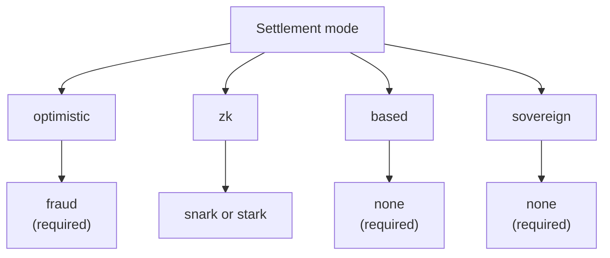

# ロールアップ概要

QoreChain の **Rollup Development Kit (RDK)** ―― `x/rdk` モジュール ―― を使うと、開発者は QoreChain 上で決済されるアプリケーション specific なロールアップを起動できます。各ロールアップは独自のブロックタイム、仮想マシン、手数料モデル、シーケンシングを持つ独立した実行環境でありながら、QoreChain のセキュリティ、耐量子暗号、データ可用性の保証を継承します。

:::caution
RDK およびロールアップ決済レイヤーは現在も積極的に進化している機能です。このセクションで説明する決済モード、証明システム、プリセット、機能ごとの成熟度は変更されうる設計意図として扱い、メインネットを対象にする前に必ず **`qorechain-diana`** テストネットでデプロイを検証してください（メインネット: **`qorechain-vladi`**、EVM チェーン ID **9801**、チェーンバージョン **v3.1.97**）。
:::

より低レベルなモジュールリファレンス ―― モジュールパラメータ、ライフサイクルの内部仕様、バーン統合、マルチレイヤーアンカリング ―― については、アーキテクチャセクションの **[Rollup Development Kit](/architecture/rollup-development-kit)** ページを参照してください。本ロールアップセクションは開発者向けのハウツーです。RDK とは何か、どのパラダイムを選ぶべきか、どのようにデプロイするか、データ可用性の仕組み、L2 から L1 への出金の決済方法を扱います。

---

## RDK が提供するもの

RDK を通じて作成されたロールアップは、4 つの設定可能な要素をまとめています。

| 要素 | 制御する内容 | 選択肢 |
| ------- | ---------------- | ------- |
| **決済モード** | ロールアップの状態遷移が QoreChain 上でどのように検証・確定されるか | `optimistic`、`zk`、`based`、`sovereign` |
| **証明システム** | 決済を裏付ける暗号学的または経済的メカニズム | `fraud`、`snark`、`stark`、`none` |
| **シーケンサーモード** | 決済前にトランザクションを並べる主体 | `dedicated`、`shared`、`based` |
| **データ可用性** | 誰もが状態を再構築できるようトランザクションデータを公開する場所 | `native`、`celestia`、`both` |

各ロールアップは一意の `rollup-id` で登録され、QOR によるステークボンドに裏付けられ、ライフサイクルステータス（`pending`、`active`、`paused`、`stopped`）が割り当てられます。作成とライフサイクルの完全なフローについては **[ロールアップのデプロイ](/rollups/deploying-a-rollup)** を参照してください。

---

## QoreChain RDK が他と異なる点

どのロールアップキットにも共通する基本機能に加えて、QoreChain RDK は QoreChain のレイヤー1に依存する 3 つの機能 ―― 耐量子・AI を基盤としない非対応のキットでは提供できないもの ―― と、ウォッチタワーの自動チャレンジャーを備えています。RDK は 5 つの言語（TypeScript、Python、Go、Rust、Java）で提供され、npm、PyPI、Maven Central 上でバージョンが **v0.4.4** に統一されています（crates.io では最新の公開リリースをインストールするか、リポジトリからビルドしてください）。v0.4.2 以降、`mainnet` と `testnet` のプリセットには公開の `qore.host` エンドポイントが組み込まれているため、`createRdkClient({ network })` は手動のエンドポイント設定なしでチェーンに到達できます。

| 差別化要素 | 機能 |
| -------------- | ------------ |
| **[耐量子決済レシート](/rollups/settlement-receipts)** | 決済アンカーを、耐量子（ML-DSA-87 / Dilithium-5）署名の下で**完全にオフラインで**検証可能な、持ち運び可能なレシートに変換します ―― 5 つのクライアント全てでバイト単位で一致します。 |
| **[QCAI ロールアップ・コパイロット](/rollups/qcai-copilot)** | QoreChain のオンチェーン AI/RL サービス（手数料ポリシーエージェント、レコメンデーション、不正調査、サーキットブレーカー）を、単一ロールアップに関する読み取り専用の平易な言葉によるアドバイザリに集約します。 |
| **[マルチ VM のクロス VM 呼び出し](/rollups/multi-vm)** | クロス VM プリコンパイル（`0x…0901`）を通じて、EVM/Solidity ロールアップのコントラクトから CosmWasm コントラクトを呼び出します。 |
| **[ウォッチタワー](/rollups/watchtower)** | オプティミスティックロールアップ向けの自動チャレンジャーフレームワークで、新しいバッチとチャレンジウィンドウの締め切りを検出し、あなたの正当性述語に反する無効なバッチにチャレンジします。 |

詳細な根拠とコードサンプルについては **[Why QoreChain RDK](/rollups/why)** を参照してください。

---

## 4 つの決済パラダイム

QoreChain RDK は、信頼の前提、ファイナリティの特性、証明要件がそれぞれ異なる 4 つの決済モードをサポートします。決済モードと証明システムの組み合わせはオンチェーンで検証され、互換性のない組み合わせは作成時に拒否されます。以下の図は各決済モードとその有効な証明システムの対応を示しています。

```mermaid
flowchart TD
    S["Settlement mode"]
    S --> O["optimistic"]
    S --> Z["zk"]
    S --> BA["based"]
    S --> SV["sovereign"]
    O --> OF["fraud<br/>(required)"]
    Z --> ZS["snark or stark"]
    BA --> BN["none<br/>(required)"]
    SV --> SN["none<br/>(required)"]
```

### Optimistic（オプティミスティック）

オプティミスティックロールアップは、提出されたバッチをデフォルトで有効とみなし、紛争解決には**不正証明（fraud proof）**を利用します。

* **証明システム**: `fraud` ―― インタラクティブな不正証明
* **シーケンサー**: `dedicated` または `shared`
* **ファイナリティ**: 設定可能なチャレンジウィンドウが成功したチャレンジなしに終了するまで遅延
* **紛争**: 誰でもウィンドウ内に提出されたバッチに対して不正証明のチャレンジを提出でき、チャレンジが成功するとそのバッチは拒否される

### ZK（ゼロ知識）

ZK ロールアップは各バッチに暗号学的な正当性証明を付与し、再実行なしに状態遷移の正しさを証明します。

* **証明システム**: `snark`（簡潔な証明）または `stark`（トラステッドセットアップ不要の透明な証明）
* **シーケンサー**: `dedicated` または `shared`
* **ファイナリティ**: 有効な証明の検証時 ―― チャレンジウィンドウは不要
* **成熟度**: ZK および STARK の検証はまだ発展途上です。ZK 決済はまだ本番運用に耐える段階ではないものとして扱い、テストネットで検証してください。詳細は **[ZK / STARK と出金](/rollups/zk-stark-withdrawals)** を参照してください。

### Based（ベースド）

ベースドロールアップはトランザクションのシーケンシングを QoreChain（L1）のプロポーザーに委任し、ホストチェーンのライブネスと検閲耐性を継承します。

* **証明システム**: `none` ―― L1 プロポーザーが順序の真実の源
* **シーケンサー**: `based`（必須 ―― オンチェーン検証によって強制される）
* **ファイナリティ**: ホストチェーンの確定に追従
* **トレードオフ**: QoreChain のバリデータがシーケンシングを担うため運用モデルは最もシンプルだが、専用シーケンサーによるレイテンシ制御は失われる

### Sovereign（ソブリン）

ソブリンロールアップは独自のコンセンサスを運用し、自己シーケンシングを行います。検証可能性のために状態を QoreChain にアンカーしますが、ファイナリティについてはホストチェーンに依存しません。

* **証明システム**: `none`
* **シーケンサー**: ロールアップによる自己管理
* **ファイナリティ**: 独立 ―― ロールアップ自身のコンセンサスによって決定される
* **状態アンカリング**: 状態ルートは透明性のために QoreChain に投稿されるが、ホストチェーンはそれを強制しない

---

## 証明システムの互換性

決済モードは、どの証明システムが有効かを制約します。これらの組み合わせはロールアップ作成時に強制されます。

| 決済モード | `fraud` | `snark` | `stark` | `none` |
| --------------- | :-----: | :-----: | :-----: | :----: |
| **optimistic**  | 必須 | — | — | — |
| **zk**          | — | 対応 | 対応 | — |
| **based**       | — | — | — | 必須 |
| **sovereign**   | — | — | — | 必須 |

---

## シーケンサーモード

シーケンサーは、決済前にロールアップブロック内でトランザクションを並べる主体を決定します。

| モード | 誰がシーケンシングするか | 備考 |
| ---- | ------------- | ----- |
| **`dedicated`** | 単一の指定されたオペレーターアドレス | レイテンシが最も低いが、ライブネスと公正な順序付けについてオペレーターへの信頼が必要 |
| **`shared`** | 共有シーケンサーセット | 順序付けがセット全体に分散し、調整オーバーヘッドがやや高い |
| **`based`** | QoreChain L1 プロポーザー | ホストチェーンのバリデータのセキュリティと検閲耐性を継承する。`based` 決済には必須 |

---

## パラダイムの選び方

| こんな場合には… | 検討すべきもの |
| -------------- | -------- |
| QoreChain バリデータがシーケンシングを行う、最もシンプルな運用構成を望む | **based** |
| 暗号学的な保証（発展途上）による高速なファイナリティを望む | **zk**（`snark` / `stark`） |
| 経済的な紛争解決を伴う、実績のあるモデルを望む | **optimistic**（`fraud`） |
| 独自のコンセンサスによる完全な独立性を望みつつ、検証可能性のためにアンカーしたい | **sovereign** |

どこから始めればよいか分からない場合は、RDK が一般的なアプリケーションカテゴリ向けにこれらの選択をまとめた**プリセットプロファイル**を提供しています ―― **[プリセットプロファイル](/rollups/preset-profiles)** を参照してください ―― また、ユースケースの平易な言葉による説明から推奨プロファイルを提示する `suggest-profile` クエリもあります。

開発者向けには、RDK は公開の TypeScript SDK である **`@qorechain/rdk`** と **`create-qorechain-rollup`** スキャフォールダーとしても提供されており、同じオンチェーンモジュールをコードから駆動します ―― **[ロールアップのデプロイ](/rollups/deploying-a-rollup#deploy-with-the-typescript-rdk-qorechainrdk)** を参照してください。

## 関連ページ

* [ロールアップのデプロイ](/rollups/deploying-a-rollup) ―― CLI または TypeScript RDK からロールアップを起動する。
* [プリセットプロファイル](/rollups/preset-profiles) ―― 一般的なアプリケーションカテゴリ向けのワンクリックバンドル。
* [データ可用性](/rollups/data-availability) ―― ネイティブ DA ルーターとブロブストレージ。
* [ZK / STARK 出金](/rollups/zk-stark-withdrawals) ―― 証明に裏付けられた出金フロー。
