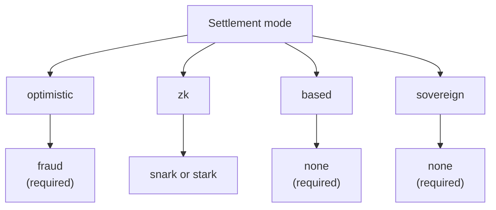

# ロールアップ概要

QoreChain の **Rollup Development Kit (RDK)** — `x/rdk` モジュール — を使うと、開発者は QoreChain 上で決済（セトルメント）を行うアプリケーション特化型ロールアップを立ち上げられます。各ロールアップは、独自のブロックタイム、仮想マシン、手数料モデル、シーケンシングを持つ独立した実行環境でありながら、QoreChain のセキュリティ、ポスト量子暗号、データ可用性の保証を継承します。

:::caution
RDK とロールアップ決済レイヤーは、現在も活発に進化している機能です。本セクション全体で説明する決済モード、証明システム、プリセット、および機能ごとの成熟度は、変更される可能性のある設計意図として扱ってください。また、メインネット（**`qorechain-vladi`**、EVM チェーン ID **9801**、チェーンバージョン **v3.1.85**）を対象とする前に、必ず **`qorechain-diana`** テストネットでデプロイを検証してください。
:::

より低レベルのモジュールリファレンス — モジュールパラメータ、ライフサイクルの内部動作、バーン統合、マルチレイヤーアンカリング — については、Architecture セクションの **[Rollup Development Kit](/architecture/rollup-development-kit)** ページを参照してください。この Rollups セクションは開発者向けのハウツーです。RDK とは何か、どのパラダイムを選ぶべきか、どのようにデプロイするか、データ可用性はどう機能するか、そして出金が L2 から L1 へどのように決済されるかを扱います。

---

## RDK が提供するもの

RDK で作成されたロールアップは、4 つの設定可能な要素をひとまとめにします。

| 要素 | 制御する内容 | 選択肢 |
| ------- | ---------------- | ------- |
| **決済モード** | ロールアップの状態遷移が QoreChain 上でどのように検証・確定されるか | `optimistic`、`zk`、`based`、`sovereign` |
| **証明システム** | 決済を裏付ける暗号学的または経済的メカニズム | `fraud`、`snark`、`stark`、`none` |
| **シーケンサーモード** | 決済前にトランザクションを誰が順序付けるか | `dedicated`、`shared`、`based` |
| **データ可用性** | 誰でも状態を再構築できるよう、トランザクションデータをどこに公開するか | `native`、`celestia`、`both` |

各ロールアップは一意の `rollup-id` で登録され、QOR によるステークボンドで裏付けられ、ライフサイクルステータス（`pending`、`active`、`paused`、`stopped`）が割り当てられます。作成とライフサイクルの完全なフローについては **[Deploying a Rollup](/rollups/deploying-a-rollup)** を参照してください。

---

## QoreChain RDK が他と違う点

あらゆるロールアップキットに共通する基本機能に加えて、QoreChain RDK は QoreChain の Layer 1 に依存する 3 つの機能を提供します。これらは、ポスト量子でも AI ベースでもない基盤レイヤー上に構築されたキットには提供できないものです — さらにウォッチタワー自動チャレンジャーも備えています。RDK は 5 つの言語（TypeScript、Python、Go、Rust、Java）で提供され、npm、PyPI、Maven Central 上でバージョン **v0.4.4** に揃えられています（crates.io では、公開されている最新リリースをインストールするか、リポジトリからビルドしてください）。v0.4.2 以降、`mainnet` と `testnet` のプリセットには公開 `qore.host` エンドポイントが組み込まれているため、`createRdkClient({ network })` は手動のエンドポイント設定なしでチェーンに到達できます。

| 差別化要素 | 機能 |
| -------------- | ------------ |
| **[量子耐性のある決済レシート](/rollups/settlement-receipts)** | 決済アンカーを、ポスト量子（ML-DSA-87 / Dilithium-5）署名の下で**完全にオフライン**で検証可能なポータブルレシートに変換 — 5 つのクライアントすべてでバイト単位で一致します。 |
| **[QCAI Rollup Copilot](/rollups/qcai-copilot)** | QoreChain のオンチェーン AI/RL サービス（手数料ポリシーエージェント、レコメンデーション、不正調査、サーキットブレーカー）を集約し、1 つのロールアップに対する読み取り専用の平易な言葉によるアドバイザリを提供します。 |
| **[マルチ VM クロス VM コール](/rollups/multi-vm)** | クロス VM プリコンパイル（`0x…0901`）を通じて、EVM/Solidity ロールアップコントラクトから CosmWasm コントラクトを呼び出せます。 |
| **[Watchtower](/rollups/watchtower)** | オプティミスティックロールアップ向けの自動チャレンジャーフレームワーク。新しいバッチとチャレンジウィンドウの期限を検出し、独自の有効性述語に照らして不正なバッチにチャレンジします。 |

完全な根拠とコードサンプルについては **[Why QoreChain RDK](/rollups/why)** を参照してください。

---

## 4 つの決済パラダイム

QoreChain RDK は 4 つの異なる決済モードをサポートしており、それぞれ信頼の前提、ファイナリティの特性、証明の要件が異なります。決済モードと証明システムの組み合わせはオンチェーンで検証され、互換性のない組み合わせは作成時に拒否されます。以下の図は、各決済モードと有効な証明システムの対応を示しています。

```mermaid
flowchart TD
    S["Settlement mode"]
    S --> O["optimistic"]
    S --> Z["zk"]
    S --> BA["based"]
    S --> SV["sovereign"]
    O --> OF["fraud<br/>(required)"]
    Z --> ZS["snark or stark"]
    BA --> BN["none<br/>(required)"]
    SV --> SN["none<br/>(required)"]
```

### Optimistic（オプティミスティック）

オプティミスティックロールアップは、提出されたバッチをデフォルトで有効とみなし、紛争解決には**フロード証明（fraud proof）**に依存します。

* **証明システム**: `fraud` — インタラクティブなフロード証明
* **シーケンサー**: `dedicated` または `shared`
* **ファイナリティ**: 設定可能なチャレンジウィンドウが、成功したチャレンジなしに満了するまで遅延
* **紛争**: ウィンドウ内であれば、誰でも提出済みバッチに対してフロード証明チャレンジを提出できます。チャレンジが成功するとバッチは拒否されます

### ZK（ゼロ知識）

ZK ロールアップは各バッチに暗号学的な有効性証明を添付し、再実行なしで状態遷移の正しさを証明します。

* **証明システム**: `snark`（簡潔な証明）または `stark`（トラステッドセットアップ不要の透明な証明）
* **シーケンサー**: `dedicated` または `shared`
* **ファイナリティ**: 有効な証明の検証時 — チャレンジウィンドウは不要
* **成熟度**: ZK および STARK の検証はまだ成熟の途上にあります。ZK 決済はまだ本番環境向けに堅牢化されていないものとして扱い、テストネットで検証してください。詳細は **[ZK / STARK & Withdrawals](/rollups/zk-stark-withdrawals)** を参照してください。

### Based（ベースド）

ベースドロールアップはトランザクションのシーケンシングを QoreChain（L1）のプロポーザーに委任し、ホストチェーンのライブネスと検閲耐性を継承します。

* **証明システム**: `none` — L1 プロポーザーが順序付けの信頼の源です
* **シーケンサー**: `based`（必須 — オンチェーン検証で強制されます）
* **ファイナリティ**: ホストチェーンの確認に従います
* **トレードオフ**: QoreChain のバリデーターがシーケンシングを担うため、運用モデルは最もシンプルですが、専用シーケンサーによるレイテンシ制御は失われます

### Sovereign（ソブリン）

ソブリンロールアップは独自のコンセンサスを実行し、自らシーケンシングを行います。検証可能性のために状態を QoreChain にアンカーしますが、ファイナリティについてはホストチェーンに依存しません。

* **証明システム**: `none`
* **シーケンサー**: ロールアップが自ら管理
* **ファイナリティ**: 独立 — ロールアップ自身のコンセンサスによって決定されます
* **状態アンカリング**: 透明性のためにステートルートが QoreChain に投稿されますが、ホストチェーンはそれらを強制しません

---

## 証明システムの互換性

決済モードによって、有効な証明システムが制約されます。これらの組み合わせは、ロールアップの作成時に強制されます。

| 決済モード | `fraud` | `snark` | `stark` | `none` |
| --------------- | :-----: | :-----: | :-----: | :----: |
| **optimistic**  | 必須 | — | — | — |
| **zk**          | — | サポート | サポート | — |
| **based**       | — | — | — | 必須 |
| **sovereign**   | — | — | — | 必須 |

---

## シーケンサーモード

シーケンサーは、決済前にロールアップブロック内でトランザクションを誰が順序付けるかを決定します。

| モード | シーケンシングの担当者 | 備考 |
| ---- | ------------- | ----- |
| **`dedicated`** | 指定された単一のオペレーターアドレス | 最低レイテンシ。ライブネスと公正な順序付けについてオペレーターへの信頼が必要 |
| **`shared`** | 共有シーケンサーセット | 順序付けはセット全体に分散。調整オーバーヘッドがやや増加 |
| **`based`** | QoreChain L1 プロポーザー | ホストチェーンのバリデーターセキュリティと検閲耐性を継承。`based` 決済では必須 |

---

## パラダイムの選び方

| 求めるもの | 検討すべきモード |
| -------------- | -------- |
| QoreChain のバリデーターがシーケンシングを担う、最もシンプルな運用構成 | **based** |
| 暗号学的保証による高速なファイナリティ（成熟途上） | **zk**（`snark` / `stark`） |
| 経済的な紛争解決を備えた、よく理解されたモデル | **optimistic**（`fraud`） |
| 独自のコンセンサスによる完全な独立性と、検証可能性のためのアンカリング | **sovereign** |

どこから始めるべきか迷っていますか？RDK には、一般的なアプリケーションカテゴリ向けにこれらの選択をまとめた**プリセットプロファイル**が用意されています — **[Preset Profiles](/rollups/preset-profiles)** を参照してください。また、ユースケースの平易な説明文からプロファイルを推奨する `suggest-profile` クエリもあります。

開発者向けには、RDK は公開 TypeScript SDK **`@qorechain/rdk`** および **`create-qorechain-rollup`** スキャフォルダーとしても提供されており、コードから同じオンチェーンモジュールを操作できます — **[Deploying a Rollup](/rollups/deploying-a-rollup#deploy-with-the-typescript-rdk-qorechainrdk)** を参照してください。

## 関連ページ

* [Deploying a Rollup](/rollups/deploying-a-rollup) — CLI または TypeScript RDK からロールアップを立ち上げる。
* [Preset Profiles](/rollups/preset-profiles) — 一般的なアプリケーションカテゴリ向けのワンクリックバンドル。
* [Data Availability](/rollups/data-availability) — ネイティブ DA ルーターとブロブストレージ。
* [ZK / STARK Withdrawals](/rollups/zk-stark-withdrawals) — 証明に裏付けられた出金フロー。
