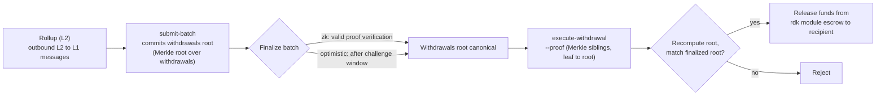

# ZK / STARK と出金

このページでは、関連する 2 つのトピックを取り上げます。ZK 決済ロールアップが使用する **ZK 証明システム**（`snark` と `stark`）と、バッチが確定した後にロールアップから QoreChain へ資金を戻す **L2 → L1 出金フロー** です。

:::caution
ZK および STARK の検証は、RDK の中でも活発に成熟が進んでいる部分です。ここで説明する証明システムと出金フローは設計意図として扱い、**`qorechain-diana`** テストネットで検証してください。また、メインネットでの本番強化された暗号学的保証はまだ前提にしないでください。
:::

---

## ZK 証明システム

ZK 決済ロールアップ（`zk` 決済モード）は、各決済バッチに有効性証明を添付し、ロールアップのトランザクションを再実行することなく、ステート遷移が正しいことを証明します。ZK 決済は 2 つの証明システムをサポートします。

| 証明システム | 特性 |
| ------------ | --------------- |
| **`snark`** | 簡潔な証明 |
| **`stark`** | 透明な証明 — トラステッドセットアップ不要 |

`zk` 決済モードは `snark` または `stark` のいずれかを必要とします。このペアリングは、ロールアップ作成時にオンチェーンで強制されます。対照的に、`optimistic` 決済は `fraud` 証明システムを使用し、`based` と `sovereign` 決済は `none` を使用します。完全な互換性マトリックスについては **[ロールアップ概要](/rollups/overview)** を参照してください。

### ファイナリティ

不正証明のチャレンジウィンドウを待つオプティミスティックロールアップとは異なり、ZK バッチは **有効な証明検証** によって確定でき、紛争ウィンドウを必要としません。これが ZK 決済の核心的なトレードオフです。証明生成のコストと複雑さと引き換えに、より強力で高速なファイナリティが得られます。

### 成熟度

ZK および STARK の証明検証はまだ成熟段階にあります。ZK 決済は **まだ本番強化されていない** ものとして扱ってください。テストネットでプロトタイプを作成して検証し、価値を伴うメインネットロールアップで依存する前に、完全な証明検証のステータスについて RDK のリリースノートを追跡してください。

---

## バッチが出金をどのように運ぶか

ロールアップがバッチを決済するとき、そのバッチはロールアップのアウトバウンドなクロスレイヤーメッセージ — その **L2 → L1 出金** — もコミットできます。概念的には次のとおりです。

* 確定したバッチは、その出金の集合へのコミットメント（バッチの出金メッセージに対する Merkle ルート）を運ぶことができます。
* 個々の出金は、そのルートの下にあるリーフであり、バッチインデックスと出金インデックスによって識別されます。
* バッチが確定すると、任意の当事者が、特定の出金リーフがコミットされたルートの下に含まれていることを証明し、支払いをトリガーできます。

これが、出金が決済に依存する理由です。出金は **確定した** バッチに対してのみ実行できます。なぜなら、コミットされた出金ルートを正規のものにするのは確定だからです。

バッチがどのように提出され確定されるか — オプティミスティックロールアップ向けの `submit-batch` と `challenge-batch` 紛争パスを含む — については、**[ロールアップのデプロイ](/rollups/deploying-a-rollup)** を参照してください。

---

## 出金の実行: `execute-withdrawal`

`execute-withdrawal` コマンドは、確定したバッチの出金ルートに対して L2 → L1 出金を確定します。出金リーフがそのルートにコミットされていることを証明し、rdk モジュールのエスクローから受取人に支払います。このアクションは **パーミッションレス** です — 誰でも有効な証明を提出できます。

```bash
qorechaind tx rdk execute-withdrawal \
  [rollup-id] [batch-index] [withdrawal-index] [recipient] [denom] [amount] \
  --proof <sibling-hash-1>,<sibling-hash-2>,... \
  --from mykey \
  --chain-id qorechain-diana \
  --fees 500uqor
```

**位置引数:**

| 引数 | 説明 |
| -------- | ----------- |
| `rollup-id` | 出金が属するロールアップ |
| `batch-index` | この出金を出金ルートにコミットしている確定済みバッチ |
| `withdrawal-index` | そのバッチ内の出金リーフのインデックス |
| `recipient` | 支払先のアドレス |
| `denom` | 支払う通貨単位 |
| `amount` | 支払う金額 |

**フラグ:**

| フラグ | 説明 |
| ---- | ----------- |
| `--proof` | リーフからルートへ順に並べた、カンマ区切りの 16 進 Merkle 兄弟ハッシュ。出金リーフがバッチの出金ルートにコミットされていることを証明します |

`--proof` の値は包含証明です。すなわち、出金リーフからバッチのコミットされた出金ルートまでのパスに沿った兄弟ハッシュです。モジュールはリーフと提供された兄弟からルートを再計算し、エスクローされた資金を解放する前に、確定済みバッチのコミットされたルートと照合します。

---

## エンドツーエンドの出金フロー

*L2 から L1 へのパス: 決済バッチが出金ルートをコミットし、バッチが確定し、その後パーミッションレスな包含証明が QoreChain 上でエスクローされた資金を解放します。*



1. **バッチを決済する。** ロールアップオペレーターは `submit-batch` で決済バッチを提出します。バッチは、そのアウトバウンドな L2 → L1 メッセージに対する出金ルートをコミットできます。
2. **確定する。** バッチは、ロールアップの決済モードに従って確定します。`zk` の場合は有効な証明検証時に、`optimistic` の場合はチャレンジウィンドウ後に（その間、`challenge-batch` がそれを争うことがあります）。
3. **証明して実行する。** 確定後、誰でも特定の出金リーフに対する Merkle 包含証明（`--proof`）を添えて `execute-withdrawal` を提出します。モジュールは確定済みバッチの出金ルートに対して包含を検証し、エスクローから受取人に支払います。

ステップ 3 はパーミッションレスかつ証明ベースであるため、出金を運ぶバッチが確定した後は、出金はロールアップオペレーターの協力に依存しません。

---

## 関連

* **[ロールアップ概要](/rollups/overview)** — 決済パラダイムと証明システムの互換性マトリックス。
* **[ロールアップのデプロイ](/rollups/deploying-a-rollup)** — `submit-batch` および `challenge-batch` オペレーターコマンド。
* **[ロールアップ開発キット](/architecture/rollup-development-kit)** — 低レベルのモジュールリファレンス。
