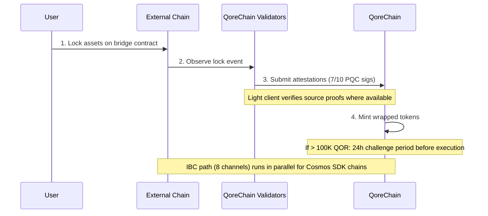

# 브리지 아키텍처

`x/bridge` 모듈은 **37개의 QCB(QoreChain Bridge) 체인 구성과 8개의 IBC(Inter-Blockchain Communication) 채널**을 통해 QoreChain을 더 넓은 블록체인 생태계에 연결하도록 설계되었습니다. 모든 브리지 작업은 포스트 양자 암호화로 보호됩니다.

:::caution
크로스체인 브리지는 **현재 테스트넷 상태이며 보류 중입니다 — 아직 프로덕션 시스템이 아닙니다**. 아래에 설명된 체인 구성, 라이트 클라이언트, 흐름은 설계된 대로 그리고 테스트넷에서 실행된 대로의 브리지를 반영합니다. 외부 연결은 점진적으로 출시되고 있으니, 모든 대상을 라이브 메인넷 보장이 아니라 설계 의도로 간주하십시오.
:::

## 연결 개요

QoreChain은 두 가지 브리지 프로토콜이 병렬로 작동하도록 설계되었습니다:

| 프로토콜 | 연결                 | 보안 모델                            | 사용 사례                               |
| -------- | -------------------- | ------------------------------------ | --------------------------------------- |
| **IBC**  | 8개 채널             | 표준 IBC + PQC 패킷 서명             | Cosmos SDK 호환 체인                    |
| **QCB**  | 37개 체인 구성       | 7-of-10 Dilithium-5 멀티시그         | 비-IBC 체인 (EVM, Solana, TON 등)       |

**37개의 QCB 체인 구성**에는 **36개의 외부 체인**과 네이티브/루프백 구성으로서의 **QoreChain 자체**(내부 라우팅 및 자기 참조 정산에 사용)가 포함됩니다. 8개의 IBC 채널은 Cosmos SDK 호환 체인에 연결됩니다.

## IBC 채널

QoreChain은 Hermes v1.x를 통해 릴레이되는 다음 8개 체인에 대한 IBC 연결을 유지하도록 설계되었습니다:

| 체인       | 설명                           |
| ---------- | ------------------------------ |
| Cosmos Hub | 기본 허브 연결                 |
| Osmosis    | DEX 유동성 라우팅              |
| Noble      | USDC 네이티브 발행             |
| Celestia   | 데이터 가용성 계층             |
| Stride     | 리퀴드 스테이킹                |
| Akash      | 탈중앙화 컴퓨팅                |
| Babylon    | BTC 리스테이킹 프로토콜        |
| Injective  | DeFi / 오더북 상호운용성       |

### IBC 릴레이어 구성

* **릴레이어 소프트웨어**: Hermes v1.x
* **클라이언트 업데이트**: 자동 라이트 클라이언트 갱신
* **부정 행위 탐지**: 활성화됨 — 릴레이어가 이중 서명(equivocation)을 모니터링합니다
* **패킷 클리어링**: 100블록마다 대기 중인 IBC 패킷이 클리어됩니다
* **PQC 강화**: QoreChain에서 발생하는 모든 IBC 패킷에는 미래의 양자 보안을 위한 선택적 Dilithium-5 서명이 포함됩니다. PQC 인식 수신 체인은 표준 IBC 검증과 함께 이 서명을 검증할 수 있습니다.

## QCB (QoreChain Bridge) 프로토콜

QCB 프로토콜은 포스트 양자 암호화로 보호되는 허브 앤 스포크(hub-and-spoke) 아키텍처를 사용합니다. QoreChain은 허브 역할을 하며, 각 외부 체인에 대한 스포크 구성과 QoreChain 자체에 대한 네이티브/루프백 구성을 갖습니다.

### 외부 체인 구성 (36)

QCB 프로토콜은 다음 36개의 외부 체인을 대상으로 하도록 설계되었습니다. QoreChain 자체의 네이티브/루프백 구성과 결합하면 **총 37개의 QCB 체인 구성(QoreChain 자체 포함)**이 됩니다.

**기준 체인 (10)**

Ethereum, Solana, TON, BSC, Avalanche, Polygon, Arbitrum, Optimism, Base, Sui.

**EVM 계열 체인 (14)**

zkSync Era, Linea, Scroll, Blast, Mantle, Hyperliquid, Berachain, Sonic, Sei, Monad, Plasma, Filecoin FVM, Cronos, Kaia.

**비-EVM 체인 (5)**

Starknet, XRP Ledger, Stellar, Hedera, Algorand.

**보류 중인 체인 (7)**

NEAR, Bitcoin, Cardano, Polkadot, Tezos, Tron, Aptos.

:::note
개수 확인: 기준 10 + EVM 계열 14 + 비-EVM 5 + 보류 중 7 = **36개의 외부 체인**. QoreChain 자체의 네이티브/루프백 구성을 추가하면 **37개의 QCB 체인 구성**이 됩니다.
:::

### 주소 형식

QCB 프로토콜은 대상 주소를 검증하기 위해 체인을 유형별로 분류합니다:

| 체인 유형    | 예시 체인                                                               | 주소 형식                                          |
| ------------ | ----------------------------------------------------------------------- | -------------------------------------------------- |
| `evm`        | Ethereum, BSC, Avalanche, Polygon, Arbitrum, Optimism, Base             | `0x` + 40개 16진수 문자                            |
| `solana`     | Solana                                                                  | Base58, 32-44 문자                                 |
| `ton`        | TON                                                                     | `EQ` + base64 인코딩                               |
| `sui_move`   | Sui                                                                     | `0x` + 64개 16진수 문자                            |
| `aptos_move` | Aptos                                                                   | `0x` + 64개 16진수 문자                            |
| `bitcoin`    | Bitcoin                                                                 | Bech32 (`bc1`), P2SH (`3...`), 또는 레거시 (`1...`) |
| `near`       | NEAR Protocol                                                           | `.near` 접미사 또는 암시적                         |
| `cardano`    | Cardano                                                                 | `addr1` (결제) 또는 `stake1` (스테이킹)            |
| `polkadot`   | Polkadot                                                                | SS58 인코딩                                         |
| `tezos`      | Tezos                                                                   | `tz1`/`tz2`/`tz3` (암시적) 또는 `KT1` (생성됨)     |
| `tron`       | TRON                                                                    | `T` + base58, 34 문자                              |

## 라이트 클라이언트

외부 체인 이벤트를 신뢰 없이 검증하기 위해, 브리지는 각 소스 체인의 합의 및 증명 시스템에 맞춘 온체인 라이트 클라이언트를 실행하도록 설계되었습니다. 이러한 라이트 클라이언트를 통해 QoreChain은 검증인 증명에만 의존하지 않고 입금과 출금을 검증할 수 있습니다.

| 라이트 클라이언트       | 소스 체인           | 검증 프리미티브                                                     |
| ----------------------- | ------------------- | ------------------------------------------------------------------- |
| **Ethereum 라이트 클라이언트** | Ethereum / EVM L1 | BLS12-381 서명 검증, SSZ 직렬화, MPT 상태 증명 |
| **Bitcoin SPV**         | Bitcoin             | 블록 헤더에 대한 간소화된 결제 검증(Simplified Payment Verification) |
| **Starknet STARK**      | Starknet            | Starknet 상태 전이의 STARK 증명 검증              |
| **Sui BLS**             | Sui                 | Sui 체크포인트의 BLS 집계 서명 검증             |
| **Wormhole / Solana VAA** | Solana (Wormhole 경유) | 검증된 액션 승인(VAA) 가디언 서명 검증     |

## 입금 흐름 (외부에서 QoreChain으로)

아래 시퀀스는 QCB 입금을 보여줍니다: 자산이 외부 체인에서 잠기고, QoreChain 검증인이 PQC 서명된 증명(7-of-10 Dilithium-5)을 제출하며, 래핑된 토큰이 발행됩니다. Cosmos SDK 호환 체인은 대신 병렬 IBC 경로(8개 채널, 선택적 Dilithium-5 패킷 서명 포함)를 사용합니다. 두 경로 모두 테스트넷/보류 중입니다.



```
External Chain          QoreChain Validators           QoreChain
     |                         |                          |
     | 1. Lock assets on       |                          |
     |    bridge contract      |                          |
     |------------------------>|                          |
     |                         | 2. Observe & attest      |
     |                         |    (7/10 PQC sigs)       |
     |                         |------------------------->|
     |                         |                          | 3. Mint wrapped
     |                         |                          |    tokens
     |                         |                          |
     |                         |    [If > 100K QOR]       |
     |                         |    24h challenge period   |
     |                         |    before execution       |
```

1. **잠금(Lock)** — 사용자가 외부 체인의 브리지 컨트랙트에 자산을 잠급니다.
2. **증명(Attest)** — 브리지 검증인이 잠금 트랜잭션을 관찰하고 Dilithium-5 서명된 증명을 제출합니다. 최소 **10개 중 7개**의 검증인 증명이 필요합니다. 소스 체인에 라이트 클라이언트가 있는 경우, 잠금 이벤트는 추가로 해당 체인 자체의 증명에 대해 검증됩니다.
3. **발행(Mint)** — 증명 임계값이 충족되면 QoreChain에서 래핑된 토큰이 발행됩니다.
4. **챌린지 기간(Challenge period)** — 100,000 QOR 상당을 초과하는 전송의 경우, 실행 전에 **24시간 챌린지 기간**이 적용됩니다. 이 기간 동안 검증인은 의심스러운 활동에 플래그를 지정할 수 있습니다.

## 출금 흐름 (QoreChain에서 외부로)

```
QoreChain               QoreChain Validators           External Chain
     |                         |                          |
     | 1. Burn wrapped tokens  |                          |
     |------------------------>|                          |
     |                         | 2. Attest burn           |
     |                         |    (7/10 PQC sigs)       |
     |                         |------------------------->|
     |                         |                          | 3. Unlock original
     |                         |                          |    assets
```

1. **소각(Burn)** — 사용자가 QoreChain에서 래핑된 토큰을 소각합니다.
2. **증명(Attest)** — 검증인이 Dilithium-5 서명으로 소각 이벤트를 증명합니다(7/10 임계값).
3. **잠금 해제(Unlock)** — 임계값에 도달하면 외부 체인에서 원본 자산이 잠금 해제됩니다.

출금 중 수집된 모든 브리지 수수료는 `bridge_fee` 소각 채널을 통해 `x/burn` 모듈로 라우팅됩니다(브리지 수수료의 100%가 소각됩니다).

### L2 → L1 출금 흐름 (롤업 정산)

브리지는 또한 **롤업(L2) 출금을 호스트 체인(L1)으로 다시 정산**하도록 설계되었습니다. [Rollup Development Kit](/architecture/rollup-development-kit)를 통해 배포된 롤업은 주기적으로 자신의 상태를 QoreChain에 앵커링합니다. 브리지는 이러한 확정된 앵커를 소비하여 롤업에서 호스트 체인으로의 출금을 승인합니다:

1. 사용자가 롤업(L2)에서 출금을 시작하고, 이는 정산 배치에 포함됩니다.
2. 배치가 QoreChain에 앵커링되고 롤업의 정산 모드에 따라 증명/확정됩니다(예: 낙관적 챌린지 기간이 만료된 후, 또는 유효한 증명 검증 시).
3. 앵커가 확정되면 출금이 청구 가능해지고, 표준 소각-및-증명 경로를 통해 호스트 체인(L1)에서 해당 자산이 해제됩니다.

이는 롤업 확정성을 호스트 체인 정산 보장에 직접 연결하여, 해당 L2 상태가 되돌릴 수 없게 정산되기 전에는 L2 출금이 해제될 수 없도록 합니다.

## 보안 아키텍처

### PQC 멀티시그

모든 QCB 브리지 작업에는 등록된 브리지 검증인으로부터의 Dilithium-5 포스트 양자 서명에 대한 **7-of-10 임계값**이 필요합니다. 각 브리지 검증인은 다음으로 등록합니다:

* QoreChain 검증인 주소
* Dilithium-5 공개 키 (2,592바이트)
* 지원되는 체인 목록
* 평판 점수 (`x/reputation`에 의해 유지됨)

### 서킷 브레이커

각 연결된 체인은 독립적인 서킷 브레이커 보호 기능을 갖습니다:

| 보호 기능                 | 설명                                                                                 |
| ------------------------- | ------------------------------------------------------------------------------------ |
| **단일 전송 한도**        | 체인별 개별 브리지 작업의 최대 금액                                                   |
| **일일 합계 한도**        | 24시간 기간당 체인별 총 거래량 상한                                                   |
| **수동 일시 중지**        | 거버넌스 또는 검증인이 트리거하는 체인별 긴급 중단                                     |
| **이상 탐지**             | 짧은 기간 내 작업이 50건을 초과하거나 거래량이 일일 한도의 5배를 초과하면 자동 일시 중지 |

서킷 브레이커 상태는 체인별로 추적되며 다음을 포함합니다: 최대 단일 전송, 일일 한도, 현재 일일 사용량, 마지막 재설정 높이, 사유가 포함된 일시 중지 상태.

### 챌린지 기간

대규모 전송(100,000 QOR 상당 초과, `large_transfer_threshold`를 통해 구성 가능)의 경우:

* 증명 임계값이 충족된 후 **24시간 챌린지 기간**(86,400초)이 적용됩니다.
* 이 기간 동안 모든 검증인이 작업에 플래그를 지정할 수 있습니다.
* 챌린지가 없으면 기간 만료 후 작업이 자동으로 실행됩니다.
* 챌린지가 제기된 작업은 거버넌스 검토를 위해 동결됩니다.

### AI 경로 최적화

브리지 모듈은 경로 최적화를 위해 AI 서브시스템과 통합됩니다. 여러 경로를 통과할 수 있는 전송(예: 중개자를 통한 체인 A에서 체인 B로)의 경우, 경로 최적화기는 다음을 평가합니다:

* 경로별 예상 수수료
* 예상 완료 시간
* 경로별 보안 점수
* 추정의 신뢰 수준

## 브리지 관리

### 배포 후 체인 활성화 (거버넌스 없음)

체인 버전 **v3.1.78**부터, 브리지 체인은 단일 서명된 트랜잭션으로 배포 후 활성화 및 재구성할 수 있습니다 — 거버넌스 제안 및 체인 업그레이드가 필요 없습니다. `bridge_admin` 키(제네시스의 `BridgeConfig.BridgeAdmin`에 설정됨) 또는 `qcb_bridge` 라이선스 보유자는 다음을 수행할 수 있습니다:

* **`tx bridge update-chain-config`** — 체인의 컨트랙트 주소, 확인 횟수, 아키텍처, 상태를 설정합니다 (`MsgUpdateChainConfig`).
* **`tx bridge set-verifier-bootstrap`** — 체인의 활성 검증기를 선택하고 신뢰 루트를 설치합니다 (`MsgSetVerifierBootstrap`).

이를 통해 운영자는 브리지 관리자 키에 대해 권한이 확인된 상태로 연결된 체인의 브리지를 직접 온라인 상태로 만들거나 검증기를 교체할 수 있습니다.

### 연결된 네트워크 검증

체인 버전 **v3.1.79**부터, 일치하는 `validator_<chain>`(또는 `qcb_bridge`) 라이선스를 보유한 검증인은 동일한 노드에서 외부 네트워크의 클라이언트를 실행할 수 있으며, 라이선스가 활성화되면 QoreChain의 오케스트레이션 하에 자동으로 프로비저닝됩니다. 드라이버는 37개의 모든 브리지 네트워크에 대해 제공되며, 참여 모델별로 분류됩니다(무허가 검증인, 상한/선출/승인, L2 풀 노드, 비스테이킹/신뢰 목록). 외부 네트워크의 스테이크 및 서명 키는 네트워크별로 운영자가 제공합니다. 운영자 단계는 [검증인 실행하기](/developer-guide/running-a-validator#connected-networks)를 참조하십시오.

## REST API 엔드포인트

체인 버전 **v3.1.77**부터, 브리지 상태는 `/qorechain/bridge/v1/...` 접두사 하에 grpc-gateway를 통해 **REST에서 읽기 전용으로** 쿼리할 수도 있습니다(`config`, `chains`, `chains/{chain_id}`, `validators`, `validators/{address}`, `operations`, `operations/{id}`) — 이전에는 gRPC 전용이었습니다. 이는 익스플로러 및 라이트 노드 텔레메트리를 위해 HTTP를 통해 실제 온체인 JSON을 제공합니다. 전체 목록은 [REST / gRPC 엔드포인트](/api-reference/rest-grpc-endpoints#bridge-module)를 참조하십시오.

| 메서드 | 엔드포인트                                          | 설명                                             |
| ------ | -------------------------------------------------- | ------------------------------------------------ |
| GET    | `/bridge/v1/chains`                                | 지원되는 모든 체인 구성 목록 조회                |
| GET    | `/bridge/v1/chains/{chain_id}`                     | 특정 체인의 구성 조회                            |
| GET    | `/bridge/v1/validators`                            | 등록된 모든 브리지 검증인 목록 조회             |
| GET    | `/bridge/v1/operations`                            | 모든 브리지 작업 목록 조회 (최신순)             |
| GET    | `/bridge/v1/operations/{operation_id}`             | 특정 작업의 세부 정보 조회                      |
| GET    | `/bridge/v1/locked/{chain}/{asset}`                | 체인/자산 쌍에 대한 잠긴/발행된 금액 조회       |
| GET    | `/bridge/v1/circuit-breakers`                      | 모든 서킷 브레이커 상태 목록 조회               |
| GET    | `/bridge/v1/estimate/{from}/{to}/{asset}/{amount}` | AI 최적화 경로 추정치 조회                      |

## 브리지 이벤트

브리지 모듈은 다음 온체인 이벤트를 발생시킵니다:

| 이벤트 유형                   | 설명                                            |
| ----------------------------- | ----------------------------------------------- |
| `bridge_deposit`              | 새 입금 작업 생성됨                             |
| `bridge_withdraw`             | 새 출금 작업 생성됨                             |
| `bridge_attestation`          | 검증인 증명 제출됨                              |
| `bridge_operation_executed`   | 작업 확정 및 실행됨                             |
| `bridge_circuit_breaker_trip` | 서킷 브레이커 활성화 또는 비활성화됨           |
| `bridge_validator_registered` | 새 브리지 검증인 등록됨                         |
| `bridge_pqc_verification`     | PQC 서명 검증 결과 (IBC 패킷)                   |

## 관련 항목

* [자산 브리징](/user-guide/bridging-assets) — 단계별로 체인 간 자산 이동.
* [대시보드 브리지](/dashboard/bridge) — 일반 사용자를 위한 브리지 인터페이스.
* [Babylon을 통한 BTC 리스테이킹](/architecture/btc-restaking-babylon) — Bitcoin 기반 보안.
* [포스트 양자 보안](/architecture/post-quantum-security) — IBC 패킷에 대한 PQC 검증.
