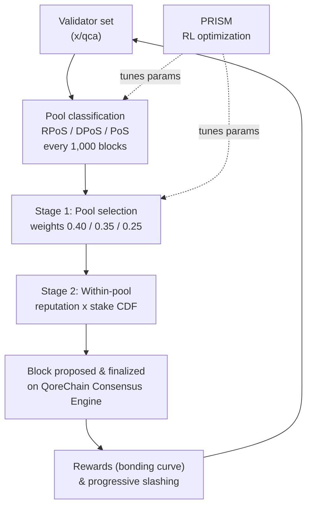

# 합의 메커니즘

QoreChain은 검증자를 세 개의 특화된 풀로 분류하고 평판 가중치 기반 선택을 사용하여 보안, 탈중앙화, 성능의 균형을 맞추는 합의 메커니즘인 **Triple-Pool Composite Proof-of-Stake (CPoS)**를 구현합니다. CPoS는 `x/qca` 모듈에서 구현되며 **QoreChain Consensus Engine** 위에서 동작합니다.

런타임에 합의 파라미터를 튜닝하는 강화학습 최적화 계층은 **PRISM**(Policy-driven Reinforcement-learning for Intelligent State Machines)이라는 브랜드로 명명됩니다. 자세한 내용은 [PRISM Consensus Engine](/architecture/prism-consensus-engine)을 참조하세요.

아래 다이어그램은 QoreChain Consensus Engine에서 Triple-Pool CPoS의 한 블록/합의 주기를 요약하며, PRISM이 튜닝 가능한 `x/qca` 파라미터로 어떻게 피드백되는지 보여줍니다.



---

## Triple-Pool 아키텍처

CPoS는 평판, 스테이크, 위임 지표를 기반으로 활성 검증자 집합을 세 개의 풀로 나눕니다. 각 풀은 합의 과정에서 고유한 역할을 수행합니다.

### 풀 분류

| 풀                                    | 기준                                                                      | 선택 가중치       |
| ------------------------------------ | ----------------------------------------------------------------------- | ---------------- |
| **RPoS** (Reputation Proof-of-Stake) | 평판 점수 >= 70번째 백분위수 **AND** 자체 본딩 스테이크 >= 중앙값                  | 40%              |
| **DPoS** (Delegated Proof-of-Stake)  | 총 위임량 >= 10,000 QOR                                                    | 35%              |
| **PoS** (Standard Proof-of-Stake)    | 나머지 모든 활성 검증자                                                       | 25%              |

분류는 다음 우선순위로 평가됩니다: **RPoS > DPoS > PoS**. RPoS와 DPoS 모두에 해당하는 검증자는 RPoS에 배정됩니다.

재분류는 **1,000 블록**마다 발생합니다. 각 재분류 에포크에서:

1. **평판 점수 수집** — 모든 활성 검증자에 대한 평판 점수가 `x/reputation` 모듈에서 수집됩니다.
2. **평판 임계값 계산** — 정렬된 점수 분포로부터 70번째 백분위수 평판 임계값이 계산됩니다.
3. **자체 본딩 스테이크 중앙값 계산** — 정렬된 스테이크 분포로부터 자체 본딩 스테이크의 중앙값이 계산됩니다.
4. **검증자 재배정** — 각 활성 검증자는 자격을 갖춘 가장 높은 우선순위의 풀로 재배정됩니다.
5. **기본 배정** — 분류되지 않은 검증자(아직 평가되지 않은 검증자)는 기본적으로 PoS 풀에 배정됩니다.

---

## 풀 가중치 기반 제안자 선택

블록 제안자 선택은 2단계 결정론적 프로세스를 따릅니다.

### Stage 1: 풀 선택

결정론적 난수 값이 다음 블록을 제안할 풀을 선택합니다:

```
seed = SHA256(lastBlockHash || height || "pool")
randVal = uint64(seed[:8]) / MaxUint64    // uniform in [0, 1)
```

풀은 `randVal`을 누적 가중치 임계값과 비교하여 선택됩니다:

* `randVal < 0.40` → RPoS 풀
* `0.40 <= randVal < 0.75` → DPoS 풀
* `randVal >= 0.75` → PoS 풀

### Stage 2: 풀 내부 선택

선택된 풀 내에서, 제안자는 **평판 × 스테이크 가중 CDF**를 통해 선택됩니다. 풀 내 각 검증자에 대해:

1. 평판 점수 `r`이 `x/reputation`에서 조회됩니다.
2. 복합 가중치는 `w = r * tokens`입니다.
3. 모든 복합 가중치로부터 누적 분포 함수(CDF)가 구성됩니다.
4. 블록 해시와 높이로 시드된 결정론적 난수 추출을 CDF에 대해 사용하여 제안자가 선택됩니다.

### 폴백 동작

선택된 풀이 비어 있으면 시스템은 PoS 풀로 폴백합니다. PoS 풀도 비어 있으면, 전체 활성 검증자 집합에 대한 평판 가중치 기반 선택으로 폴백합니다.

---

## 맞춤형 본딩 커브

검증자 보상은 장기적인 참여, 높은 평판, 프로토콜 성장 단계와의 정렬을 장려하는 다중 요소 본딩 커브를 사용하여 계산됩니다.

### 공식

```
R(v, t) = beta * S_v * (1 + alpha * ln(1 + L_v)) * Q(r_v) * P(t)
```

### 요소 정의

| 요소                    | 기호      | 설명                                                          | 기본값     |
| ---------------------- | -------- | ----------------------------------------------------------- | --------- |
| 기본 보상 배수            | `beta`   | 전체 보상 크기를 조정                                            | 1.0       |
| 자체 본딩 스테이크         | `S_v`    | 검증자의 자체 본딩 토큰 (uqor)                                    | --        |
| 충성도 민감도             | `alpha`  | 충성 기간이 보상을 얼마나 증폭시키는지 제어                          | 0.1       |
| 충성 기간                | `L_v`    | 검증자가 연속으로 활성 상태였던 블록 수                            | --        |
| 평판 품질                | `Q(r_v)` | 평판 `r`을 \[0.75, 1.25] 범위의 보상 배수로 매핑                  | --        |
| 프로토콜 단계             | `P(t)`   | 보상을 부트스트랩하거나 조절하기 위한 단계 의존적 배수              | 아래 참조  |

### 평판 품질 함수

```
Q(r) = 1 + 0.5 * (r - 0.5)
```

결과는 **\[0.75, 1.25]** 범위로 클램핑됩니다:

| 평판 점수          | Q(r)  |
| ---------------- | ----- |
| 0.0              | 0.75  |
| 0.25             | 0.875 |
| 0.5              | 1.0   |
| 0.75             | 1.125 |
| 1.0              | 1.25  |

### 프로토콜 단계 배수

| 단계     | P(t) | 설명                                          |
| ------- | ---- | --------------------------------------------- |
| Genesis | 1.5  | 검증자 집합을 부트스트랩하기 위한 더 높은 보상      |
| Growth  | 1.0  | 네트워크 확장 중의 표준 보상                      |
| Mature  | 0.8  | 네트워크가 안정화됨에 따른 발행 감소               |

### 결정론적 수학

`ln(1 + L_v)` 계산은 인수 축소(`TaylorLn1PlusX`)를 사용한 테일러 급수 근사를 사용하며, 전적으로 `LegacyDec` 고정 정밀도 소수에서 동작합니다. 합의에 중요한 보상 계산에는 부동소수점 연산이 사용되지 않습니다.

---

## 점진적 슬래싱

QoreChain은 고정 슬래싱 비율을 **점진적 페널티 모델**로 대체하여, 반복 위반자에 대한 결과를 점증시키는 동시에 위반이 시간이 지남에 따라 감쇠하도록 허용합니다.

### 공식

```
penalty = base_rate * escalation_factor^effective_count * severity_factor
```

### 시간적 감쇠

과거 위반은 유효 카운트에 감쇠하는 가중치로 기여합니다:

```
effective_count = SUM( 0.5^(blocks_since_i / decay_halflife) )
```

각 과거 위반 `i`에 대해, 그 기여도는 `decay_halflife` 블록(기본값: 100,000)마다 절반으로 줄어듭니다. 즉, 200,000 블록 전의 단일 오래된 위반은 유효 카운트에 0.25만 기여합니다.

### 심각도 요소

| 위반 유형             | 심각도 요소       |
| ------------------- | --------------- |
| Downtime            | 1.0             |
| Double Sign         | 2.0             |
| Light Client Attack | 3.0             |

### 최대 페널티

페널티는 검증자가 누적한 과거 위반 수와 관계없이 슬래시 이벤트당 **33%**로 상한이 설정됩니다.

### 예제 계산

2건의 사전 위반(하나는 50,000 블록 전, 하나는 150,000 블록 전)이 있는 검증자가 이중 서명을 범한 경우:

1. **감쇠 기여도**:
   * 위반 1: `0.5^(50000 / 100000) = 0.5^0.5 = 0.707`
   * 위반 2: `0.5^(150000 / 100000) = 0.5^1.5 = 0.354`
   * `effective_count = 0.707 + 0.354 = 1.061`
2. **점증**: `1.5^1.061 = 1.516`
3. **페널티**: `0.01 * 1.516 * 2.0 = 0.0303` (3.03%)

이를 초범자와 비교하면: `0.01 * 1.5^0 * 2.0 = 0.02` (2.0%).

---

## QDRW 거버넌스

QoreChain 거버넌스는 금권정치적 장악을 방지하면서 장기 네트워크 참여자에게 보상하기 위해 **Quadratic Delegation with Reputation Weighting (QDRW)**를 사용합니다.

### 투표권 공식

```
VP(v) = sqrt(staked + 2 * xQORE) * ReputationMultiplier(r)
```

여기서:

* `staked` = 투표자의 본딩된 QOR 토큰
* `xQORE` = 투표자의 xQORE 잔액(장기 스테이킹 파생물)
* `2` = xQORE 가중치 배수(거버넌스 구성 가능)
* `r` = `x/reputation`에서 가져온 투표자의 평판 점수

### 평판 배수

평판 배수는 시그모이드 커브를 통해 \[0, 1] 범위의 `r`을 \[0.5, 2.0] 범위의 배수로 매핑합니다:

```
ReputationMultiplier(r) = 0.5 + 1.5 * sigmoid(6 * (r - 0.5))
```

| 평판 점수          | 배수        |
| ---------------- | ---------- |
| 0.0              | 0.50       |
| 0.1              | 0.52       |
| 0.2              | 0.58       |
| 0.3              | 0.71       |
| 0.4              | 0.93       |
| 0.5              | 1.25       |
| 0.6              | 1.57       |
| 0.7              | 1.79       |
| 0.8              | 1.92       |
| 0.9              | 1.98       |
| 1.0              | 2.00       |

### 이차 스케일링

제곱근 함수는 투표권이 스테이크에 대해 선형 이하로 확장되도록 보장합니다. 다른 투표자의 4배 스테이크를 가진 투표자는 4배가 아니라 2배의 투표권만 받습니다. 이는 대규모 토큰 보유자가 거버넌스 결정을 지배하는 것을 방지합니다.

### 결정론적 수학

`IntegerSqrt`은 `LegacyDec` 정밀도로 뉴턴 방법을 사용합니다. `SigmoidApprox`은 12개 항을 가진 테일러 급수 `ExpApprox`를 사용합니다. 모든 거버넌스 수학은 모든 검증자 노드에서 완전히 결정론적입니다.

---

## QCA 파라미터

다음 표는 `x/qca` 모듈에서 거버넌스로 구성 가능한 모든 파라미터를 나열합니다:

### 핵심 파라미터

| 파라미터                    | 타입     | 기본값   | 설명                                               |
| -------------------------- | ------- | ------- | ------------------------------------------------- |
| `use_reputation_weighting` | bool    | `true`  | 평판 가중치 기반 제안자 선택 활성화                    |
| `min_reputation_score`     | float64 | `0.1`   | 활성 참여를 위한 최소 평판 점수                       |

### 풀 구성

| 파라미터                   | 타입       | 기본값            | 설명                                              |
| ------------------------- | --------- | ---------------- | ------------------------------------------------ |
| `classification_interval` | uint64    | `1000`           | 풀 재분류 사이의 블록 수                            |
| `weight_rpos`             | LegacyDec | `0.40`           | RPoS 풀 선택 가중치                                |
| `weight_dpos`             | LegacyDec | `0.35`           | DPoS 풀 선택 가중치                                |
| `min_delegation_dpos`     | uint64    | `10,000,000,000` | DPoS를 위한 최소 위임량 (uqor 단위 10,000 QOR)     |
| `rep_percentile_rpos`     | uint64    | `70`             | RPoS를 위한 평판 백분위수 임계값                    |

### 본딩 커브 구성

| 파라미터            | 타입       | 기본값  | 설명                                             |
| ------------------ | --------- | ------- | ------------------------------------------------ |
| `alpha`            | LegacyDec | `0.1`   | 충성도 민감도 계수                                 |
| `beta`             | LegacyDec | `1.0`   | 기본 보상 배수                                     |
| `phase_multiplier` | LegacyDec | `1.5`   | 프로토콜 단계 보상 배수 (Genesis 단계)             |

### 슬래싱 구성

| 파라미터             | 타입       | 기본값     | 설명                                    |
| ------------------- | --------- | --------- | -------------------------------------- |
| `base_rate`         | LegacyDec | `0.01`    | 기본 슬래시 비율 (1%)                    |
| `escalation_factor` | LegacyDec | `1.5`     | 점진적 점증 기준값                       |
| `max_penalty`       | LegacyDec | `0.33`    | 이벤트당 최대 페널티 (33%)               |
| `decay_halflife`    | uint64    | `100,000` | 위반 가중치 반감기 블록 수                |

### QDRW 거버넌스 구성

| 파라미터             | 타입       | 기본값  | 설명                                    |
| -------------------- | --------- | ------- | -------------------------------------- |
| `enabled`            | bool      | `false` | QDRW 거버넌스 집계 활성화                |
| `xqore_multiplier`   | LegacyDec | `2.0`   | 스테이크 토큰 대비 xQORE 가중치          |
| `rep_min_multiplier` | LegacyDec | `0.5`   | 최소 평판 배수                          |
| `rep_max_multiplier` | LegacyDec | `2.0`   | 최대 평판 배수                          |

## 관련 문서

* [PRISM Consensus Engine](/architecture/prism-consensus-engine) — 합의 파라미터를 튜닝하는 AI 계층.
* [Multilayer Architecture](/architecture/multilayer-architecture) — 사이드체인이 기본 계층에 앵커링되는 방식.
* [Running a Validator](/developer-guide/running-a-validator) — 체인을 보호하는 검증자 운영.
* [Tokenomics](/architecture/tokenomics) — 스테이킹 보상, 인플레이션, 슬래싱 경제학.
