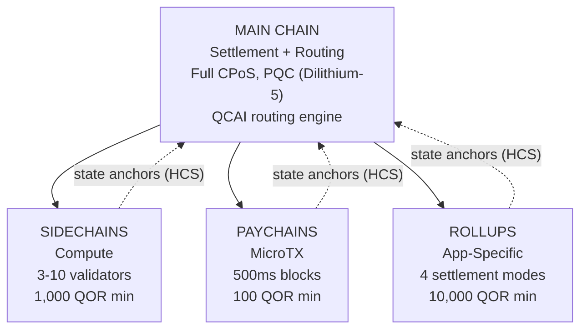

# 다계층 아키텍처

QoreChain은 `x/multilayer` 모듈을 통해 **4단계 계층형 체인 아키텍처**를 구현합니다. 메인 체인은 정산 및 신뢰 루트 역할을 하며, 하위 계층(사이드체인, 페이체인, 롤업)은 서로 다른 성능 및 보안 트레이드오프를 가진 특화된 워크로드를 처리합니다.

---

## 시스템 개요

아래의 4단계 계층 구조는 메인 체인을 정산 및 신뢰 루트로 보여주며, 세 가지 하위 계층 유형이 계층적 커밋먼트 스킴(HCS)을 통해 자신의 상태 루트를 메인 체인에 앵커링합니다.



```
                    +---------------------------+
                    |       MAIN CHAIN          |
                    |  (Settlement + Routing)   |
                    |  Full CPoS consensus      |
                    |  PQC-secured (Dilithium-5)|
                    |  QCAI routing engine       |
                    +------+------+------+------+
                           |      |      |
              +------------+      |      +------------+
              |                   |                    |
    +---------v--------+ +-------v--------+ +---------v---------+
    |   SIDECHAINS     | |   PAYCHAINS    | |     ROLLUPS       |
    |  (Compute)       | |  (MicroTX)     | |  (App-Specific)   |
    |  3-10 validators | |  500ms blocks  | |  4 settlement     |
    |  1,000 QOR min   | |  100 QOR min   | |    modes          |
    |  Max: 10         | |  Max: 50       | |  10,000 QOR min   |
    +------------------+ +----------------+ |  Max: 100         |
                                            +-------------------+
```

---

## 계층 유형

### 메인 체인

메인 체인은 전체 QoreChain 생태계의 신뢰 루트입니다.

| 속성        | 값                                                                             |
| ---------- | ------------------------------------------------------------------------------ |
| 합의        | 전체 Triple-Pool CPoS ([Consensus Mechanism](/architecture/consensus-mechanism) 참조) |
| 보안        | Dilithium-5 서명으로 PQC 보호                                                    |
| 역할        | 정산 계층, 상태 앵커 저장소, QCAI 라우팅 엔진, 신뢰 루트                            |
| 블록 시간   | \~5초                                                                          |

모든 하위 계층은 계층적 커밋먼트 스킴(HCS)을 통해 자신의 상태 루트를 메인 체인에 주기적으로 앵커링합니다.

### 사이드체인

사이드체인은 DeFi 프로토콜, 게임 엔진, IoT 데이터 처리와 같은 **연산 집약적 작업**을 처리합니다.

| 파라미터                  | 값                |
| ------------------------- | ----------------- |
| 최소 검증자               | 3                 |
| 최대 검증자               | 10                |
| 최소 생성자 스테이크       | 1,000 QOR         |
| 최대 활성 사이드체인        | 10                |
| 대상 도메인               | DeFi, Gaming, IoT |

### 페이체인

페이체인은 최소 지연 시간으로 **고빈도 마이크로트랜잭션**에 최적화되어 있습니다.

| 파라미터                 | 값                                       |
| ------------------------ | --------------------------------------- |
| 목표 블록 시간            | 500 ms                                  |
| 최대 활성 페이체인         | 50                                      |
| 최소 생성자 스테이크       | 100 QOR                                 |
| 대상 도메인               | 결제, 스트리밍, 마이크로 트랜잭션          |

### 롤업

롤업은 Rollup Development Kit(`x/rdk`)를 통해 배포되는 **애플리케이션 특화 체인**입니다. 이들은 multilayer 모듈 내에서 롤업 계층 유형으로 등록됩니다.

| 파라미터               | 값                                          |
| ---------------------- | ------------------------------------------- |
| 정산 모드              | 4 (optimistic, zk, based, sovereign)        |
| 최대 활성 롤업          | 100                                         |
| 최소 생성자 스테이크     | 10,000 QOR                                  |
| 계층 유형              | `rollup`                                    |
| 대상 도메인             | DeFi, Gaming, NFT, Enterprise               |

롤업 배포 및 구성은 [Rollup Development Kit](/architecture/rollup-development-kit)에서 자세히 다룹니다.

---

## QCAI 트랜잭션 라우팅

QCAI 라우터는 들어오는 각 트랜잭션에 대해 모든 활성 계층을 평가하고 4-요소 가중치 스코어링 모델을 사용하여 최적의 목적지를 선택합니다.

### 스코어링 공식

각 후보 계층은 복합 점수를 받습니다(높을수록 좋음):

```
Score = w_congestion * (1 - Congestion) + w_capability * Capability + w_cost * (1 - Cost) + w_latency * (1 - Latency)
```

| 요소        | 가중치  | 설명                                                                          |
| ---------- | ------ | --------------------------------------------------------------------------- |
| 혼잡도      | 0.30   | 현재 부하 수준(반전됨: 혼잡도가 낮을수록 점수가 높음)                            |
| 역량        | 0.40   | 계층이 트랜잭션 요구사항에 얼마나 잘 부합하는지                                 |
| 비용        | 0.20   | 메인 체인 대비 수수료 배수(반전됨: 비용이 낮을수록 점수가 높음)                  |
| 지연        | 0.10   | 최종성까지의 예상 시간(반전됨: 지연이 낮을수록 점수가 높음)                     |

### 신뢰도 임계값

라우터는 트랜잭션을 하위 계층으로 라우팅하기 전에 최소 신뢰도 점수 **0.6**을 요구합니다. 어떤 계층도 이 임계값을 충족하지 못하면, 트랜잭션은 기본적으로 메인 체인으로 향합니다.

선호 계층 힌트는 트랜잭션 발신자가 제공할 수 있습니다. 선호 계층이 신뢰도 임계값의 최소 80%(즉, 0.48)를 기록하면, 라우팅 대상으로 수락됩니다.

### 페이로드 휴리스틱

상세한 트랜잭션 메타데이터를 사용할 수 없을 때, 라우터는 페이로드 크기를 분류 신호로 사용합니다:

| 페이로드 크기      | 선호 계층        | 근거                                          |
| ----------------- | --------------- | -------------------------------------------- |
| &lt; 256 bytes    | Paychain        | 단순한 전송 또는 마이크로트랜잭션일 가능성       |
| 256 - 1,024 bytes | Main Chain      | 표준 트랜잭션 복잡도                            |
| > 1,024 bytes     | Sidechain       | 복잡한 컨트랙트 상호작용일 가능성                |

---

## 계층적 커밋먼트 스킴 (HCS)

하위 계층은 **상태 앵커**를 통해 자신의 상태를 메인 체인에 주기적으로 커밋합니다. 각 앵커는 특정 높이에서 하위 체인 상태의 암호화 증명을 포함합니다.

### 앵커 내용

| 필드                      | 설명                                                 |
| ------------------------- | ---------------------------------------------------- |
| `layer_id`                | 하위 계층의 식별자                                     |
| `layer_height`            | 하위 체인의 블록 높이                                  |
| `state_root`              | 하위 체인 상태 트리의 머클 루트                         |
| `validator_set_hash`      | 커밋먼트에 서명한 검증자 집합의 해시                    |
| `pqc_aggregate_signature` | 앵커 데이터에 대한 Dilithium-5 집계 서명                |
| `transaction_count`       | 마지막 앵커 이후의 트랜잭션 수                          |
| `compressed_state_proof`  | 압축된 상태 전이 증명                                  |

### 앵커 제출

앵커는 `MsgAnchorState`를 통해 메인 체인에 제출됩니다. 키퍼는 다음 단계에 따라 앵커를 검증합니다:

1. **계층이 존재하고 활성 상태** — 키퍼는 계층이 상태에 존재하고 현재 `active` 상태를 갖는지 확인합니다.
2. **최소 앵커 간격 경과** — 키퍼는 이 계층의 마지막 앵커 이후 최소 `min_anchor_interval` 블록(기본값: 100)이 경과했는지 확인합니다.
3. **PQC 집계 서명** — 키퍼는 PQC 집계 서명이 존재하고 앵커 데이터에 대해 유효한지 확인합니다.

### 챌린지 기간

각 앵커는 **24시간**(86,400초, 계층별로 구성 가능)의 **챌린지 기간**에 진입합니다. 이 기간 동안 누구나 `MsgChallengeAnchor`를 통해 사기 증명을 제출하여 앵커에 이의를 제기할 수 있습니다. 사기 증명이 유효하면, 앵커가 무효화되고 하위 체인의 상태가 이전 앵커로 롤백됩니다.

성공적인 이의 제기 없이 챌린지 기간이 만료되면, 앵커는 최종화된 것으로 간주됩니다.

---

## 교차 계층 수수료 번들링 (CLFB)

CLFB는 소스 계층에서의 단일 수수료 결제로 교차 계층 트랜잭션 경로의 여러 계층에 걸친 실행을 충당할 수 있게 합니다.

### 수수료 계산

```
avgMultiplier = sum(layer_multiplier_i) / num_layers
bundledFee = (totalGas / 1000) * avgMultiplier
```

여기서:

* `layer_multiplier_i`은 트랜잭션 경로의 각 계층에 대한 기본 수수료 배수입니다(메인 체인 = 1.0).
* `totalGas`은 모든 계층에 걸친 예상 총 가스 소비량입니다.
* 결과는 **uqor**로 표시되며 최소 수수료는 1 uqor입니다.

### 예제

교차 계층 트랜잭션이 세 계층에 걸칩니다: 메인 체인(배수 1.0), 사이드체인(배수 0.5), 페이체인(배수 0.1).

```
avgMultiplier = (1.0 + 0.5 + 0.1) / 3 = 0.533
bundledFee = (150,000 / 1000) * 0.533 = 80 uqor
```

CLFB는 `cross_layer_fee_bundling` 파라미터를 통해 전역적으로 활성화하거나 비활성화할 수 있으며, 개별 계층은 자신의 `cross_layer_fee_bundling_enabled` 구성 플래그를 통해 옵트아웃할 수 있습니다.

---

## 계층 수명 주기

각 하위 계층은 잘 정의된 수명 주기를 거칩니다:

```
Proposed --> Active --> Suspended --> Decommissioned
                  \                /
                   +-- Active <--+
```

| 상태               | 설명                                                                            | 허용되는 전이              |
| ------------------ | ------------------------------------------------------------------------------- | ------------------------- |
| **Proposed**       | 계층이 등록되었으나 아직 활성화되지 않음                                            | Active, Decommissioned    |
| **Active**         | 계층이 작동 중이며 트랜잭션을 수락함                                               | Suspended, Decommissioned |
| **Suspended**      | 계층이 일시적으로 중지됨(예: 유지보수 또는 보안 우려로 인해)                        | Active, Decommissioned    |
| **Decommissioned** | 계층이 영구적으로 종료됨(터미널 상태)                                              | 없음                      |

상태 전이는 키퍼에 의해 강제됩니다. 잘못된 전이(예: Decommissioned에서 Active로)는 거부됩니다.

---

## 파라미터

| 파라미터                        | 타입    | 기본값          | 설명                                                    |
| ------------------------------ | ------ | --------------- | ------------------------------------------------------- |
| `max_sidechains`               | uint64 | `10`            | 최대 활성 사이드체인 수                                   |
| `max_paychains`                | uint64 | `50`            | 최대 활성 페이체인 수                                     |
| `min_anchor_interval`          | uint64 | `100`           | 상태 앵커 사이의 최소 블록 수                             |
| `max_anchor_interval`          | uint64 | `1,000`         | 상태 앵커 사이의 최대 블록 수(강제 앵커)                  |
| `default_challenge_period`     | uint64 | `86,400`        | 기본 챌린지 기간(초 단위, 24시간)                        |
| `min_sidechain_stake`          | string | `1,000,000,000` | 사이드체인 생성을 위한 최소 스테이크(uqor 단위 1,000 QOR) |
| `min_paychain_stake`           | string | `100,000,000`   | 페이체인 생성을 위한 최소 스테이크(uqor 단위 100 QOR)     |
| `routing_enabled`              | bool   | `true`          | QCAI 기반 트랜잭션 라우팅 활성화                          |
| `routing_confidence_threshold` | string | `0.6`           | QCAI 라우팅 결정을 위한 최소 신뢰도                       |
| `cross_layer_fee_bundling`     | bool   | `true`          | 전역 교차 계층 수수료 번들링 활성화                       |
