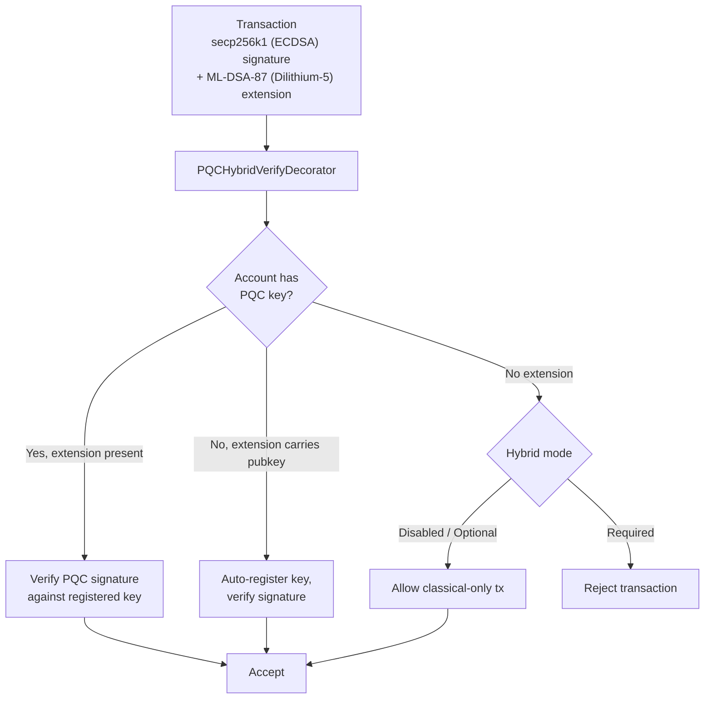

# 포스트 양자 보안

QoreChain은 **제네시스 단계부터 포스트 양자 암호화(PQC)**를 기반으로 구축되었으며 — 업그레이드로 사후 적용된 것이 아닙니다. `x/pqc` 모듈은 격자 기반 디지털 서명과 키 캡슐화를 기본 암호화 프리미티브로 제공하며, 장기적 회복력을 위한 거버넌스 제어 알고리즘 민첩성 프레임워크를 갖추고 있습니다.

전체 PQC 베이스라인 — **Dilithium-5 (서명) + ML-KEM-1024 (KEM) + SHAKE-256 (해시)** — 은 이제 완성되었으며 네트워크 기본값입니다. 현재 체인 버전(**v3.1.77**) 기준으로, cosmos 트랜잭션 경로에서 하이브리드 서명이 **기본적으로 필수**입니다: `hybrid_signature_mode = required` 및 `allow_classical_fallback = false`. 모든 cosmos 경로 트랜잭션은 고전적인 secp256k1 서명과 함께 Dilithium-5 서명을 포함해야 합니다; PQC 계정에서 발생한 고전적 전용 트랜잭션은 거부되며, 고전적 다운그레이드 경로는 닫혀 있습니다.

## 설계 원칙

* **PQC 기본 필수**: 포스트 양자 서명은 cosmos 경로에서 필수입니다. 고전적 secp256k1 서명만으로는 더 이상 충분하지 않습니다 — `allow_classical_fallback = false`.
* **기본 하이브리드**: cosmos 트랜잭션은 고전적 secp256k1 서명과 Dilithium-5 PQC 서명을 동시에 포함합니다. 고전적 전용 폴백은 닫혀 있습니다.
* **알고리즘 민첩성**: 암호화 알고리즘 레지스트리는 거버넌스 제어되어, 네트워크가 하드포크 없이 새로운 알고리즘을 채택하거나 손상된 알고리즘을 폐기할 수 있습니다.
* **결정론적 검증**: 모든 서명 검증은 결정론적이며 검증자 노드 전반에서 재현 가능합니다.

## 지원 알고리즘

| 알고리즘         | 표준                 | 카테고리          | NIST 레벨   | 공개 키      | 개인 키      | 서명 / 암호문            | 공유 비밀     |
| --------------- | -------------------- | ----------------- | ---------- | ----------- | ----------- | ---------------------- | ------------- |
| **Dilithium-5** | ML-DSA-87 (FIPS 204) | Signature         | 5          | 2,592 bytes | 4,896 bytes | 4,627 bytes            | --            |
| **ML-KEM-1024** | FIPS 203             | Key Encapsulation | 5          | 1,568 bytes | 3,168 bytes | 1,568 bytes            | 32 bytes      |

두 알고리즘 모두 표준화된 최고 보안 카테고리인 **NIST 보안 레벨 5**에서 동작하며, 고전적 및 양자 공격자 모두에 대해 AES-256과 동등한 보호를 제공합니다.

## 암호화 백엔드

PQC 작업은 격자 기반 서명, 검증, 키 캡슐화를 QoreChain 런타임에 노출하는 고성능 메모리 안전 암호화 백엔드에서 구현됩니다. 백엔드는 다음을 제공합니다:

알고리즘별 작업:

* Dilithium-5 키 생성, 서명, 검증
* ML-KEM-1024 키 생성, 캡슐화, 역캡슐화
* 결정론적 랜덤 비콘 생성 (`seed`, `epoch`)

알고리즘 인식 작업:

* `Keygen(algorithmID)` — 등록된 모든 알고리즘에 대한 키페어 생성
* `Sign(algorithmID, privkey, message)` — 서명 생성
* `Verify(algorithmID, pubkey, message, signature)` — 서명 검증
* `AlgorithmInfo(algorithmID)` — 키/출력 크기 조회
* `ListAlgorithms()` — 지원되는 모든 알고리즘 열거

모든 서명 및 검증 작업은 결정론적이며 모든 검증자 노드와 지원 플랫폼에서 동일한 결과를 생성합니다.

이와 동일한 프리미티브 — ML-DSA (FIPS-204), ML-KEM (FIPS-203), SHAKE-256 (FIPS-202) — 은 오픈소스 [**qorechain-pqc**](https://github.com/qorechain/qorechain-pqc) 라이브러리를 통해 지갑 및 통합자에게 제공되며, 이 라이브러리는 6개 언어(JavaScript/TypeScript, Rust, Go, C, Python, Java)에 걸쳐 일관되고 바이트 호환되는 단일 API를 제공합니다. [Post-Quantum Signing](/developer-guide/post-quantum-signing)을 참조하세요.

## 키 등록

계정은 `MsgRegisterPQCKey`(레거시, 기본값 Dilithium-5) 또는 `MsgRegisterPQCKeyV2`(알고리즘 인식)를 통해 PQC 키를 등록합니다. 각 메시지는 다음을 포함합니다:

* **Sender**: 키를 등록하는 계정 주소.
* **PublicKey**: PQC 공개 키 바이트.
* **AlgorithmID**: PQC 알고리즘 식별자(v2 전용).
* **KeyType**: 세 가지 등록 모드 중 하나:

| 키 유형           | 설명                                                                      |
| ---------------- | ------------------------------------------------------------------------ |
| `hybrid`         | 고전적(ECDSA) 및 PQC 키 모두. 트랜잭션은 이중 서명을 포함합니다.            |
| `pqc_only`       | PQC 키 전용. 고전적 서명은 필요하지 않습니다.                              |
| `classical_only` | 고전적 키 전용. PQC 보호 없음(권장하지 않음).                              |

## 하이브리드 서명

하이브리드 서명 시스템은 cosmos 경로 트랜잭션이 고전적 서명과 PQC 서명을 **둘 다** 동시에 포함하도록 요구합니다. 이는 심층 방어를 제공합니다: 한 기법이 깨지더라도 다른 기법이 트랜잭션을 보호합니다.

`hybrid_signature_mode = required`라는 네트워크 기본값에서, 모든 cosmos 경로 트랜잭션은 secp256k1 서명과 함께 Dilithium-5 확장을 포함해야 합니다. 유일한 예외(부트스트랩용)는 **제네시스 gentxs(높이 0)**와 **PQC 키 등록/마이그레이션 트랜잭션**(`MsgRegisterPQCKey`, `MsgRegisterPQCKeyV2`, `MsgMigratePQCKey`)으로, 계정이 첫 PQC 키를 등록할 수 있도록 고전적 전용이 허용됩니다.

**EVM 트랜잭션은 영향을 받지 않습니다.** EVM 트랜잭션은 별도의 `eth_secp256k1` ante 경로(QoreChain EVM Engine 경로)에서 인증되며 하이브리드 PQC 확장을 절대 요구하지 않습니다. 하이브리드 요구사항은 cosmos 트랜잭션 경로에만 적용됩니다.

### 공동 서명 흐름

규정에 맞는 cosmos 트랜잭션을 생성하려면, 고전적 secp256k1 서명이 표준 서명 바이트(PQC 확장을 제외함)에 대해 계산되고, Dilithium-5 서명이 계산되어 `PQCHybridSignature` 확장으로 첨부됩니다. 표준 CosmJS / 릴레이어 도구는 cosmos 경로에서 트랜잭션을 처리하기 위해 이 확장을 생성해야 합니다. 현재 이것은 다음을 통해 수행됩니다:

* `qorechaind tx pqc gen-key` — Dilithium-5 키를 생성합니다.
* `qorechaind tx pqc cosign` — Dilithium-5 공동 서명을 트랜잭션에 첨부합니다.
* QoreChain SDK의 하이브리드 서명 — `includePqcPublicKey`와 함께 `buildHybridTx`(첫 사용 시 자동 등록을 위해 PQC 공개 키를 임베드함).

*secp256k1(ECDSA)과 ML-DSA-87(Dilithium-5)로 서명된 트랜잭션은 체인 전체 강제 모드 하에서 ante 핸들러에 의해 검증됩니다.*



### TX 확장 형식

PQC 서명은 타입 URL `/qorechain.pqc.v1.PQCHybridSignature`를 가진 **TX 확장**으로 트랜잭션에 첨부됩니다:

```text
{
  "algorithm_id": 1,
  "pqc_signature": "<4627 bytes for Dilithium-5>",
  "pqc_public_key": "<2592 bytes, optional>"
}
```

`pqc_public_key` 필드는 선택 사항입니다. 존재하고 계정에 등록된 PQC 키가 없는 경우, ante 핸들러는 첫 사용 시 키를 **자동 등록**합니다.

### PQCHybridVerifyDecorator

`PQCHybridVerifyDecorator` ante 핸들러는 3방향 검증 로직으로 하이브리드 서명을 처리합니다:

| 시나리오  | 계정에 PQC 키 있음 | 확장 존재 | 확장 내 공개 키       | 결과                                                |
| -------- | ------------------- | ----------------- | ----------------------- | --------------------------------------------------- |
| Path 1   | 예                  | 예                | --                      | 등록된 키에 대해 PQC 서명 검증                        |
| Path 2   | 아니오              | 예                | 예                      | 키 자동 등록, 서명 검증                              |
| Path 3a  | 아니오              | 아니오            | --                      | **Optional 모드**: 고전적 전용 트랜잭션 허용         |
| Path 3b  | 아니오              | 아니오            | --                      | **Required 모드**: 트랜잭션 거부                     |
| Path 4   | 예                  | 아니오            | --                      | 표준 PQCVerifyDecorator에 의해 처리됨                |

### 하이브리드 서명 모드

체인 전체 하이브리드 강제 수준은 거버넌스로 구성 가능합니다. **현재 네트워크 기본값은 `required`**입니다:

| 모드         | ID | 기본값  | 동작                                                                                                              |
| ------------ | -- | ------- | ----------------------------------------------------------------------------------------------------------------- |
| **Disabled** | 0  | 아니오  | 고전적 서명만. PQC 확장은 무시됩니다.                                                                              |
| **Optional** | 1  | 아니오  | PQC 확장은 존재하면 검증됩니다. PQC 키가 없는 계정은 고전적 서명만으로 트랜잭션을 처리할 수 있습니다.                |
| **Required** | 2  | **예**  | 모든 cosmos 경로 트랜잭션은 고전적 서명과 PQC 서명을 모두 포함해야 합니다. PQC 확장이 없는 트랜잭션은 거부됩니다.    |

네트워크는 마이그레이션을 완료했습니다: **Optional**(제네시스) → **Required**(v3.1.71 이후 현재 기본값, `allow_classical_fallback = false`). 세 가지 모드는 거버넌스 제어 상태로 유지되며 제안을 통해 조정할 수 있습니다.

## 알고리즘 민첩성 프레임워크

알고리즘 민첩성 프레임워크는 PQC 알고리즘을 위한 거버넌스 제어 레지스트리를 제공하여, 네트워크가 새로운 알고리즘을 추가하고, 취약한 알고리즘을 폐기하고, 계정을 마이그레이션할 수 있게 합니다 — 모두 하드포크 없이.

### 알고리즘 수명 주기

각 등록된 알고리즘은 수명 주기 상태를 가집니다:

```
active --> migrating --> deprecated --> disabled
```

| 상태           | 설명                                                                                                                                         |
| -------------- | ------------------------------------------------------------------------------------------------------------------------------------------- |
| **Active**     | 완전히 작동. 새로운 키 등록 및 검증이 수락됩니다.                                                                                            |
| **Migrating**  | 이중 서명 기간이 활성 상태. 계정은 대체 알고리즘으로 마이그레이션하도록 권장됩니다. 이전 및 새 서명이 모두 수락됩니다.                          |
| **Deprecated** | 기존 서명은 여전히 검증될 수 있지만, 새로운 키 등록은 수락되지 않습니다.                                                                      |
| **Disabled**   | 긴급 킬 스위치. 알고리즘은 어떤 서명도 검증할 수 없습니다. 취약점이 발견되었을 때 사용됩니다.                                                 |

### 이중 서명 마이그레이션

알고리즘이 폐기되면, **마이그레이션 기간**이 시작됩니다(기본값: 1,000,000 블록, 블록당 6초 기준 약 69일). 이 기간 동안:

1. 폐기된 알고리즘을 사용하는 키를 가진 계정은 대체 알고리즘으로 마이그레이션해야 합니다.
2. 마이그레이션에는 이중 서명(`MsgMigratePQCKey`)이 필요합니다: 이전 키에서 하나, 새 키에서 하나로, 둘 다의 소유권을 증명합니다.
3. 마이그레이션 기간 내내 두 알고리즘 모두 검증을 위해 수락됩니다.

### 거버넌스 메시지

| 메시지                  | 설명                                                                                                                                                              |
| ----------------------- | ----------------------------------------------------------------------------------------------------------------------------------------------------------------- |
| `MsgAddAlgorithm`       | 레지스트리에 새 PQC 알고리즘 추가를 제안합니다. 전체 `AlgorithmInfo`(이름, 카테고리, NIST 레벨, 키 크기)를 포함합니다. 거버넌스를 통해 제출되어야 합니다.            |
| `MsgDeprecateAlgorithm` | 알고리즘에 대한 폐기 프로세스를 시작합니다. 대체 알고리즘과 블록 단위 마이그레이션 기간을 지정합니다.                                                                |
| `MsgDisableAlgorithm`   | 알고리즘을 즉시 긴급 비활성화합니다. 이유 문자열이 필요합니다. 암호화 취약점이 발견되었을 때 사용됩니다.                                                            |

### 확장성

새 알고리즘을 추가하려면 다음이 필요합니다:

1. 통합된 서명 및 검증 인터페이스 뒤에서 암호화 백엔드에 알고리즘을 구현.
2. 알고리즘 메타데이터와 함께 `MsgAddAlgorithm` 거버넌스 제안 제출.
3. 승인되면, 알고리즘이 키 등록 및 검증에 사용 가능해집니다.

## SHAKE-256 해시

v3.1.73 기준으로, **SHAKE-256**(SHA-3 확장 출력 함수)은 QoreChain 전반의 **기본 애플리케이션 해시**입니다 — `qorehash` 패키지가 제공하며 — Dilithium-5 서명 및 ML-KEM-1024 키 캡슐화와 함께 양자 저항 암호화 베이스라인을 완성합니다. `x/pqc` 모듈은 순수 Go SHAKE-256 유틸리티를 제공합니다:

| 함수                                | 설명                              | 출력             |
| ---------------------------------- | --------------------------------- | ---------------- |
| `SHAKE256Hash(data, outputLen)`    | 가변 길이 SHAKE-256 다이제스트     | 임의 길이        |
| `SHAKE256Hash32(data)`             | 표준 256비트 SHAKE-256 다이제스트  | 32 bytes         |
| `SHAKE256ConcatHash(left, right)`  | 연결된 입력의 해시                 | 32 bytes         |
| `SHAKE256DomainHash(domain, data)` | 도메인 분리 해시                   | 32 bytes         |

이러한 유틸리티는 기본 애플리케이션 해시를 뒷받침하며 다음에 사용됩니다:

* 머클 트리 노드 해싱
* 교차 계층 어테스테이션의 해시 커밋먼트
* 서로 다른 해시 컨텍스트를 위한 도메인 분리(예: `"leaf:"` 대 `"node:"`)

## 브리지 PQC

모든 교차 체인 브리지 어테스테이션과 상태 커밋먼트는 **Dilithium-5** 서명을 사용합니다. `x/multilayer` 모듈은 모든 `MsgAnchorState` 제출에 대해 PQC 집계 서명을 요구하며, ML-KEM 커밋먼트는 브리지 릴레이어 간의 키 교환 채널을 보호합니다.

이는 브리지 인프라에서 고전적 암호화를 사용함으로써 교차 체인 보안이 저하되지 않도록 보장하여, 전체 프로토콜 스택에 걸쳐 양자 저항성을 유지합니다.

## 모듈 파라미터

| 파라미터                    | 타입                 | 기본값            | 설명                                                  |
| -------------------------- | ------------------- | ----------------- | ----------------------------------------------------- |
| `pqc_primary`              | bool                | `true`            | PQC가 기본 서명 기법                                    |
| `allow_classical_fallback` | bool                | `false`           | 고전적 전용 폴백이 닫힘; cosmos 트랜잭션은 하이브리드여야 함 |
| `min_security_level`       | int32               | `5`               | 수락되는 알고리즘의 최소 NIST 보안 레벨                  |
| `default_migration_blocks` | int64               | `1,000,000`       | 기본 이중 서명 마이그레이션 기간(블록)                   |
| `default_signature_algo`   | AlgorithmID         | `1` (Dilithium-5) | 새 키 등록을 위한 기본 서명 알고리즘                     |
| `hybrid_signature_mode`    | HybridSignatureMode | `2` (Required)    | 체인 전체 하이브리드 서명 강제 수준                      |

## 관련 문서

* [Post-Quantum Signing](/developer-guide/post-quantum-signing) — 이러한 프리미티브와 하이브리드 서명을 위한 오픈소스 `qorechain-pqc` 라이브러리(6개 언어).
* [Wallet Setup](/getting-started/wallet-setup) — PQC 기반 계정 생성 및 관리.
* [SDK Accounts & PQC signing](/sdk/concepts/accounts-pqc) — 코드에서의 키 및 포스트 양자 서명.
* [Chain Parameters](/appendix/chain-parameters) — 기본 알고리즘 및 마이그레이션 설정.
* [Bridge Architecture](/architecture/bridge-architecture) — 교차 체인 패킷에서의 PQC 검증.
