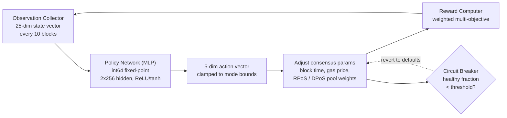

# PRISM Consensus Engine

QoreChain은 `x/rlconsensus` 모듈을 통해 강화학습 최적화 계층인 **PRISM**(Policy-driven Reinforcement-learning for Intelligent State Machines)을 합의 계층에 직접 내장합니다. PRISM은 N 블록마다 체인 지표를 관찰하고, 고정소수점 신경망을 통해 추론을 실행하며, 합의 파라미터 조정을 제안합니다 — 모두 결정론적으로, 합의에 중요한 경로에서 부동소수점 연산 없이.

*PRISM 최적화 루프: 체인 상태 관찰, 정책 추론 실행, 파라미터 변경 클램핑 및 적용, 그 결과를 다시 피드백.*



---

## 아키텍처 개요

PRISM은 네 가지 구성 요소로 이루어집니다:

1. **Observation Collector** — 구성 가능한 간격으로 25차원 체인 상태 벡터를 수집합니다.
2. **Policy Network (MLP)** — 관찰을 행동으로 매핑하는 Go 네이티브 다층 퍼셉트론.
3. **Reward Computer** — 가중 다중 목적 함수를 사용하여 파라미터 변경의 품질을 평가합니다.
4. **Circuit Breaker** — 체인 상태를 모니터링하고 불안정성이 감지되면 모든 PRISM 튜닝 파라미터를 되돌립니다.

모든 구성 요소는 ABCI 수명 주기 내에서 동작하며 모든 검증자 노드에서 결정론적이고 검증 가능한 출력을 생성합니다.

---

## Policy Network

정책 네트워크는 **int64 고정소수점 연산**(10^8로 스케일링됨)을 사용하여 전적으로 Go로 구현된 피드포워드 다층 퍼셉트론(MLP)입니다.

### 네트워크 아키텍처

| 속성                | 값                                 |
| ------------------- | ---------------------------------- |
| 입력 차원            | 25                                 |
| 은닉층              | 2                                  |
| 은닉층 크기          | 256, 256                           |
| 출력 차원            | 5                                  |
| 활성화(은닉)         | ReLU                               |
| 활성화(출력)         | tanh                               |
| 총 파라미터          | 73,733                             |
| 정밀도              | int64 고정소수점 (10^8로 스케일링)   |

### 파라미터 수 분석

```
Layer 1: 25 * 256 + 256   =  6,656  (input -> hidden_1)
Layer 2: 256 * 256 + 256   = 65,792  (hidden_1 -> hidden_2)
Layer 3: 256 * 5 + 5       =  1,285  (hidden_2 -> output)
Total:                       73,733
```

### 고정소수점 연산

모든 MLP 계산은 `FixedPointScale = 10^8`로 스케일링된 `int64` 값을 사용합니다. 이는 하드웨어 플랫폼 간 IEEE 754 부동소수점 반올림 차이로 인한 비결정성을 제거합니다.

* **곱셈**: `fixMul(a, b) = (a / SCALE) * b + (a % SCALE) * b / SCALE` (오버플로 방지를 위해 분할)
* **ReLU**: `relu(x) = max(0, x)`
* **tanh**: `|x| <= 2.5*SCALE`에 대해 파데 근사 `tanh(x) ~ x * (3*S - x^2) / (3*S + x^2)`, 그 외에는 +/- SCALE로 클램핑

정책 가중치는 평탄화된 `[]int64` 벡터로 온체인에 저장되며 거버넌스 제안을 통해 업데이트할 수 있습니다.

---

## 관찰 벡터

PRISM은 각 관찰 간격(기본값: 10 블록마다)에서 25차원 관찰 벡터를 수집합니다.

| 인덱스 | 차원                    | 설명                                             |
| ----- | ---------------------- | ------------------------------------------------ |
| 0     | `block_utilization`    | 블록 사용 가스 / 블록 가스 한도                    |
| 1     | `tx_count`             | 블록 내 트랜잭션 수                               |
| 2     | `avg_tx_size`          | 바이트 단위 평균 트랜잭션 크기                     |
| 3     | `block_time`           | 이전 블록 이후 시간(ms)                           |
| 4     | `block_time_delta`     | 블록 시간에서 목표 블록 시간을 뺀 값(ms)           |
| 5     | `gas_price_50th`       | 중앙값 가스 가격                                  |
| 6     | `gas_price_95th`       | 95번째 백분위수 가스 가격                         |
| 7     | `mempool_size`         | 대기 중인 트랜잭션 수                             |
| 8     | `mempool_bytes`        | 대기 중인 트랜잭션의 총 바이트                     |
| 9     | `validator_count`      | 활성 검증자 수                                   |
| 10    | `validator_gini`       | 검증자 권력 분포의 지니 계수                      |
| 11    | `missed_block_ratio`   | 서명을 놓친 검증자의 비율                         |
| 12    | `avg_commit_latency`   | 평균 커밋 라운드 지연(ms)                         |
| 13    | `max_commit_latency`   | 최대 커밋 라운드 지연(ms)                         |
| 14    | `precommit_ratio`      | 수신된 프리커밋의 비율                            |
| 15    | `failed_tx_ratio`      | 실패한 트랜잭션의 비율                            |
| 16    | `avg_gas_per_tx`       | 트랜잭션당 평균 소비 가스                         |
| 17    | `reward_per_validator` | 검증자당 평균 보상(uqor)                          |
| 18    | `slash_count`          | 관찰 윈도우 내 슬래싱 이벤트 수                    |
| 19    | `jail_count`           | 관찰 윈도우 내 jail 이벤트 수                     |
| 20    | `inflation_rate`       | 현재 발행률                                       |
| 21    | `bonded_ratio`         | 본딩된 토큰 / 총 공급량                           |
| 22    | `reputation_mean`      | 활성 검증자 전반의 평균 평판 점수                  |
| 23    | `reputation_stddev`    | 평판 점수의 표준 편차                             |
| 24    | `mev_estimate`         | 추정 추출 MEV(휴리스틱)                           |

모든 값은 `LegacyDec` 문자열 표현으로 저장되며 추론 전에 int64 고정소수점으로 변환됩니다.

---

## 행동 공간

MLP 출력은 5차원 행동 벡터로, 각 차원은 합의 파라미터에 대한 제안된 변경을 나타냅니다. tanh 활성화는 원시 출력을 \[-1, 1]로 제한하며, 이는 모드별 경계로 스케일링됩니다.

| 인덱스 | 행동 차원                   | 설명                                                                     |
| ----- | -------------------------- | ----------------------------------------------------------------------- |
| 0     | `block_time_delta`         | 목표 블록 시간에 대한 제안된 변경(ms)                                      |
| 1     | `gas_price_delta`          | 기본 가스 가격에 대한 제안된 변경                                          |
| 2     | `validator_set_size_delta` | 목표 검증자 집합 크기에 대한 제안된 변경(로깅만, 적용되지 않음)             |
| 3     | `pool_weight_rpos_delta`   | RPoS 풀 우선순위 가중치에 대한 제안된 변경                                 |
| 4     | `pool_weight_dpos_delta`   | DPoS 풀 우선순위 가중치에 대한 제안된 변경                                 |

행동은 적용 전에 현재 PRISM 모드가 정의한 최대 변경 경계로 **클램핑**됩니다.

---

## 보상 함수

보상 신호는 최근 파라미터 변경이 체인 성능을 얼마나 잘 개선했는지 평가합니다. 이는 다섯 가지 목적의 가중 합으로 계산됩니다:

```
R = 0.30 * delta_throughput
  + 0.25 * delta_finality
  + 0.20 * delta_decentralization
  - 0.15 * mev_estimate
  - 0.10 * failed_tx_ratio
```

| 구성 요소            | 가중치  | 방향      | 소스 지표                                     |
| ------------------- | ------ | --------- | --------------------------------------------- |
| 처리량              | +0.30  | 최대화     | 블록 사용률의 변화                             |
| 최종성              | +0.25  | 최대화     | 프리커밋 비율의 변화                           |
| 탈중앙화            | +0.20  | 최대화     | 검증자 지니 계수의 음의 변화                    |
| MEV                 | -0.15  | 최소화     | 현재 MEV 추정치                               |
| 실패한 트랜잭션      | -0.10  | 최소화     | 현재 실패한 트랜잭션 비율                       |

보상 가중치는 거버넌스로 구성 가능하며 정확히 1.0으로 합산되어야 합니다.

---

## PRISM 모드

PRISM은 거버넌스를 통해 제어 가능한 네 가지 모드 중 하나로 동작합니다:

| 모드             | ID | 최대 변경  | 동작                                                                                       |
| ---------------- | -- | ---------- | ------------------------------------------------------------------------------------------ |
| **Shadow**       | 0  | 0%         | 권장 사항을 관찰하고 로깅만 합니다. 파라미터는 변경되지 않습니다. 이것이 기본 모드입니다.      |
| **Conservative** | 1  | +/- 10%    | 엄격한 경계 내에서 파라미터 변경을 적용합니다. 초기 라이브 배포에 적합합니다.                  |
| **Autonomous**   | 2  | +/- 25%    | 더 넓은 경계 내에서 파라미터 변경을 적용합니다. 검증된 정책을 가진 성숙한 네트워크용입니다.    |
| **Paused**       | 3  | 0%         | PRISM이 완전히 유휴 상태입니다. 관찰이 수집되지 않고 추론이 실행되지 않습니다.                |

모드 전환에는 거버넌스 제안이 필요합니다. 권장 배포 경로는: Shadow → Conservative → Autonomous입니다.

---

## Circuit Breaker

서킷 브레이커는 체인 상태를 모니터링하고 불안정성이 감지되면 모든 PRISM 튜닝 파라미터를 자동으로 되돌리는 안전 메커니즘입니다.

### 감지 로직

서킷 브레이커는 마지막 **50 블록**(`circuit_breaker_window`를 통해 구성 가능)을 평가합니다:

1. **블록 시간 델타 계산** — 연속된 각 블록 타임스탬프 쌍에 대해 블록 시간 델타를 계산합니다.
2. **정상 블록 분류** — 블록은 그 델타가 양수이고 목표 블록 시간의 2배 이내이면 **정상**으로 간주됩니다.
3. **정상 비율 계산** — **정상 비율** = 정상 블록 / 총 델타를 계산합니다.

### 트리거 조건

정상 비율이 임계값(기본값: **50%**) 아래로 떨어지면, 서킷 브레이커가 작동합니다.

### 대응

작동하면, 서킷 브레이커는:

1. 모든 PRISM 적용 파라미터(블록 시간, 가스 가격, 풀 가중치)를 기본값으로 **되돌립니다**.
2. PRISM을 **일시 중지**합니다(`CircuitBreakerActive = true` 설정).
3. 새로운 재로드를 강제하기 위해 인메모리 정책을 **지웁니다**.
4. `circuit_breaker_triggered` 이벤트를 **방출합니다**.

서킷 브레이커는 후속 평가에서 정상 비율이 임계값 위로 회복되면 자동으로 해제됩니다.

---

## 롤업 자문 함수

PRISM은 롤업 파라미터 최적화를 위한 자문 함수를 제공합니다:

* **`SuggestRollupProfile`** — 현재 체인 조건을 분석하고 최적의 롤업 구성 파라미터(블록 시간, 가스 한도, 정산 빈도)를 제안합니다.
* **`OptimizeRollupGas`** — 메인 체인 혼잡 패턴을 기반으로 롤업 정산 트랜잭션에 대한 가스 가격 조정을 권장합니다.

이러한 함수는 정보 제공용일 뿐이며 체인 상태를 수정하지 않습니다.

---

## 결정론적 수학 라이브러리

모든 PRISM 계산은 표준 부동소수점 수학에 대한 결정론적 대안을 제공하는 `mathutil` 패키지를 사용합니다:

| 함수                       | 설명                         | 방법                                                       |
| ------------------------- | --------------------------- | --------------------------------------------------------- |
| `IntegerSqrt(x)`          | 제곱근                       | `LegacyDec`에 대한 뉴턴 방법, 100회 반복 수렴               |
| `TaylorLn1PlusX(x)`       | 자연로그 `ln(1+x)`           | 인수 축소 + 15개 항 테일러 급수                            |
| `ExpApprox(x)`            | 지수 `e^x`                  | 12개 항 테일러 급수                                       |
| `SigmoidApprox(x)`        | 시그모이드 `1/(1+e^-x)`     | 음수 입력에 대한 대칭성을 가진 `ExpApprox`                 |
| `ReputationMultiplier(r)` | \[0,1]을 \[0.5,2.0]으로 매핑 | 스케일과 오프셋을 가진 시그모이드                          |

모든 함수는 `cosmossdk.io/math.LegacyDec` 값에서 동작하여, 모든 하드웨어 플랫폼과 Go 컴파일러 버전에서 동일한 결과를 보장합니다.

---

## 파라미터

| 파라미터                          | 타입      | 기본값       | 설명                                                  |
| -------------------------------- | --------- | ------------ | ---------------------------------------------------- |
| `enabled`                        | bool      | `true`       | PRISM 활성화                                          |
| `observation_interval`           | uint64    | `10`         | 관찰 수집 사이의 블록 수                               |
| `agent_mode`                     | PrismMode | `0` (Shadow) | 현재 작동 모드                                        |
| `max_change_conservative`        | LegacyDec | `0.10`       | Conservative 모드에서의 최대 파라미터 변경             |
| `max_change_autonomous`          | LegacyDec | `0.25`       | Autonomous 모드에서의 최대 파라미터 변경              |
| `circuit_breaker_window`         | uint64    | `50`         | 서킷 브레이커가 모니터링하는 최근 블록 수              |
| `circuit_breaker_threshold`      | LegacyDec | `0.50`       | 트리거 전 최소 정상 블록 비율                          |
| `default_block_time_ms`          | int64     | `5000`       | 기본 목표 블록 시간(ms)                               |
| `default_base_gas_price`         | LegacyDec | `100`        | 기본 베이스 가스 가격                                  |
| `default_validator_set_size`     | uint64    | `100`        | 기본 목표 검증자 집합 크기                             |
| `reward_weight_throughput`       | LegacyDec | `0.30`       | 처리량 개선에 대한 보상 가중치                         |
| `reward_weight_finality`         | LegacyDec | `0.25`       | 최종성 개선에 대한 보상 가중치                         |
| `reward_weight_decentralization` | LegacyDec | `0.20`       | 탈중앙화 개선에 대한 보상 가중치                       |
| `reward_weight_mev`              | LegacyDec | `0.15`       | MEV 추출에 대한 페널티 가중치                          |
| `reward_weight_failed_txs`       | LegacyDec | `0.10`       | 실패한 트랜잭션에 대한 페널티 가중치                   |

## 관련 문서

* [Consensus Mechanism](/architecture/consensus-mechanism) — PRISM이 최적화하는 합의 계층.
* [AI Engine](/architecture/ai-engine) — 더 광범위한 온체인 AI 서비스 및 엔드포인트.
* [Tokenomics](/architecture/tokenomics) — RL 신호가 보상 및 파라미터 조정에 어떻게 반영되는지.
