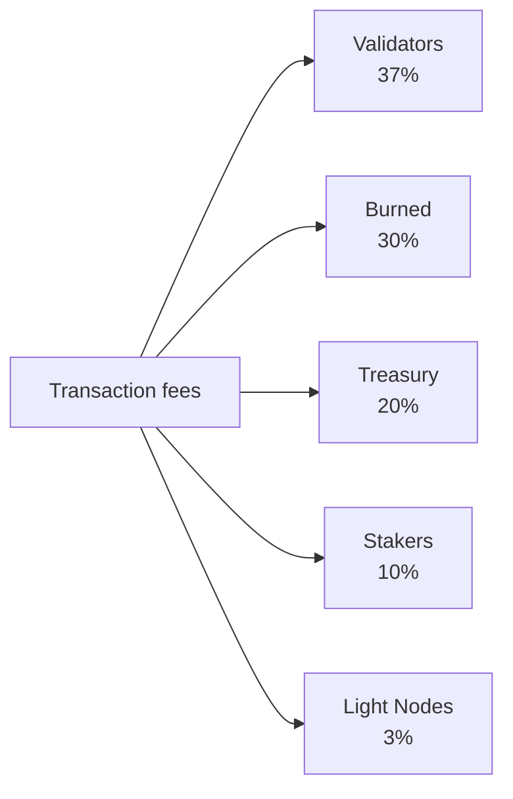

# 토크노믹스

QoreChain은 네이티브 **QOR** 토큰을 중심으로 하는 **고정 공급(fixed-supply)** 경제 모델을 사용합니다. 시간이 지남에 따라 공급량을 인플레이션시키는 대신, 네트워크는 유한하고 사전 할당된 발행 예산에서 스테이킹 보상을 조달하며, 다중 채널 소각 엔진이 네트워크 사용량이 증가함에 따라 지속적인 디플레이션 압력을 가합니다.

---

## 토큰 기본 사항

| 속성                  | 값                                                       |
| --------------------- | -------------------------------------------------------- |
| **표시 토큰**          | QOR                                                      |
| **기본 단위(denomination)** | uqor                                              |
| **소수 정밀도**        | 10^6 (1 QOR = 1,000,000 uqor)                            |
| **총 공급량**          | 4,500,000,000 QOR (고정)                                 |
| **체인 ID**            | `qorechain-vladi` (메인넷, EVM 체인 ID 9801)             |
| **Bech32 접두사**      | `qor` (계정: `qor1...`, 검증자: `qorvaloper...`)          |

:::note
이 페이지의 수치는 **메인넷**(`qorechain-vladi`, EVM 체인 ID **9801**)을 설명하며, 2026년 6월 7일부터 체인 버전 **v3.1.82**에서 라이브 상태입니다. **`qorechain-diana`** 테스트넷(EVM 체인 ID **9800**)은 동일한 경제 모델을 공유합니다.
:::

---

## 공급 및 발행 모델

QoreChain은 **4,500,000,000 QOR의 고정 총 공급량**을 가지고 있습니다. 공급량을 인플레이션시키기 위해 새로운 QOR가 발행되는 일은 결코 없습니다. 대신:

* **80,000,000 QOR(공급량의 1.78%)**가 토큰 생성 이벤트(TGE)에서 소각되었습니다.
* 스테이킹 보상은 **590,000,000 QOR의 유한한 발행 예산**에서 지급되며, 시간이 지남에 따라 감소하는 스케줄로 소진됩니다.

이는 공급량 인플레이션 모델이 아니라 **유한한 발행 예산을 가진 고정 공급 모델**입니다. 발행 예산이 소진되면, 거버넌스가 남은 예산에서 할당하는 것 외에 추가적인 보상 발행은 발생하지 않습니다.

### 스테이킹 보상 스케줄 {#staking-reward-schedule}

스테이킹 보상은 590,000,000 QOR 발행 예산에서 감소하는 스케줄로 분배됩니다:

| 기간        | 목표 APY                | 발행 예산                        |
| ----------- | ----------------------- | -------------------------------- |
| 1년 차      | 8–12% APY               | 127,500,000 QOR                  |
| 2년 차      | 6–10% APY               | 106,250,000 QOR                  |
| 3–4년 차    | 5–8% APY                | 연 85,000,000 QOR                |
| 5년 차 이상 | 거버넌스 결정           | ~186,000,000 QOR 잔여            |

APY 범위는 본딩 비율에 따라 달라지는 목표치입니다. 발행 예산 수치는 각 기간에 스테이커에게 방출되는 QOR의 엄격한 상한입니다. 5년 차부터는 남은 ~186,000,000 QOR가 거버넌스가 설정한 비율로 방출됩니다.

---

## x/burn — 다중 채널 소각 엔진

`x/burn` 모듈은 10채널 토큰 소각 시스템을 구현합니다. 소각된 모든 토큰은 유통 공급량에서 영구적으로 제거되어 네트워크 사용량이 증가함에 따라 지속적인 디플레이션 압력을 만듭니다.

### 소각 채널

| #  | 채널               | 출처                       | 설명                                          |
| -- | ------------------ | -------------------------- | --------------------------------------------- |
| 1  | `gas_fee`          | 트랜잭션 수수료            | 모든 가스 수수료의 30% 소각                    |
| 2  | `contract_create`  | 스마트 컨트랙트 배포       | 컨트랙트 생성당 정액 100 QOR 수수료 소각       |
| 3  | `ai_service`       | AI 모듈 사용 수수료        | AI 서비스 수수료의 50% 소각                    |
| 4  | `bridge_fee`       | 크로스체인 브리지 수수료   | 브리지 수수료의 100% 소각                      |
| 5  | `treasury_buyback` | 트레저리 운영              | 트레저리로부터의 주기적 바이백 및 소각          |
| 6  | `failed_tx`        | 실패한 트랜잭션 가스       | 실패한 트랜잭션 가스의 10% 소각                |
| 7  | `xqore_penalty`    | xQORE 조기 인출 페널티     | 페널티 금액이 소각을 통해 라우팅됨             |
| 8  | `auto_buyback`     | 자동 바이백 프로그램       | 프로토콜 수준의 자동 소각                      |
| 9  | `tge`              | 토큰 생성 이벤트           | 일회성 제네시스 소각(80,000,000 QOR)          |
| 10 | `rollup_create`    | 롤업 배포                  | 롤업 생성 스테이크의 1% 소각                   |

### 수수료 분배

네트워크가 수집하는 모든 트랜잭션 수수료는 아래와 같이 다섯 개의 목적지로 분할됩니다. 이 비율은 온체인에서 강제되며 항상 정확히 100%가 되어야 합니다.



네트워크가 수집하는 모든 트랜잭션 수수료는 다섯 개의 목적지로 분할됩니다:

| 수령자          | 비율  | 설명                                                                 |
| --------------- | ----- | -------------------------------------------------------------------- |
| **검증자**      | 37%   | 스테이크에 비례하여 활성 검증자 집합에 분배됨                          |
| **소각**        | 30%   | `gas_fee` 소각 채널을 통해 공급량에서 영구적으로 제거됨                |
| **트레저리**    | 20%   | 거버넌스가 지정하는 지출을 위해 커뮤니티 트레저리에 할당됨             |
| **스테이커**    | 10%   | 위임에 비례하여 모든 QOR 스테이커에게 분배됨                          |
| **라이트 노드** | 3%    | 네트워크 데이터를 제공하는 라이트 노드에 분배됨                       |

이 비율은 온체인에서 강제되며 항상 정확히 100%가 되어야 합니다.

### 소각 매개변수

| 매개변수               | 기본값                     | 설명                                     |
| ---------------------- | -------------------------- | ---------------------------------------- |
| `gas_burn_rate`        | 0.30                       | 소각되는 가스 수수료의 비율(30%)          |
| `contract_create_fee`  | 100,000,000 uqor (100 QOR) | 컨트랙트 생성에 대한 정액 소각 수수료      |
| `ai_service_burn_rate` | 0.50                       | 소각되는 AI 서비스 수수료의 비율(50%)     |
| `bridge_burn_rate`     | 1.00                       | 소각되는 브리지 수수료의 비율(100%)       |
| `failed_tx_burn_rate`  | 0.10                       | 소각되는 실패한 TX 가스의 비율(10%)       |

각 소각 이벤트는 출처, 금액, 블록 높이 및 관련 트랜잭션 해시와 함께 온체인에 기록됩니다. 집계 통계는 채널별 및 전체로 쿼리할 수 있습니다.

---

## x/xqore — 잠금 스테이킹 및 거버넌스 증폭

`x/xqore` 모듈은 양도 불가능한 잠금 스테이킹 파생물인 **xQORE**를 도입합니다. 사용자는 QOR를 잠가 1:1 비율로 xQORE를 발행합니다. xQORE 보유자는 증폭된 거버넌스 권한과 재분배된 인출 페널티의 몫을 받습니다.

### 잠금 메커니즘

* **잠금**: QOR를 xQORE 모듈에 보내 1:1 비율로 xQORE를 발행합니다.
* **거버넌스 가중치**: xQORE 보유자는 표준 QOR 스테이커에 비해 **2배의 거버넌스 투표권**을 받습니다.
* **양도 불가능**: xQORE는 계정 간에 전송할 수 없습니다. 잠금 주소에 바인딩됩니다.

### 인출 페널티 스케줄

xQORE에서의 조기 인출은 잠금 기간에 따라 감소하는 페널티를 발생시킵니다:

| 잠금 기간      | 페널티 비율 | 설명                                       |
| -------------- | ------------ | ------------------------------------------ |
| &lt; 30일      | **50%**      | 잠긴 QOR의 절반이 몰수됨                    |
| 30 -- 90일     | **35%**      | 단기 잠금에 대한 상당한 페널티             |
| 90 -- 180일    | **15%**      | 중기 약정에 대한 감소된 페널티             |
| > 180일        | **0%**       | 페널티 없는 전액 인출                      |

### PvP 리베이스 재분배

조기 인출에서 수집된 페널티는 단순히 소멸되지 않습니다. 대신 PvP(player-versus-player) 리베이스 모델을 따릅니다:

1. 페널티 금액의 **50%**가 소각됩니다(`xqore_penalty` 채널을 통해 `x/burn`으로 라우팅).
2. **50%**는 남은 모든 xQORE 보유자에게 비례 배분으로 재분배됩니다.

이는 장기 보유자에게 포지티브섬(positive-sum) 역학을 만듭니다: 모든 조기 인출은 남은 xQORE 포지션의 유효 가치를 증가시킵니다. 리베이스는 **100블록**마다 발생합니다.

### xQORE 매개변수

| 매개변수                | 기본값                 | 설명                                      |
| ----------------------- | ---------------------- | ----------------------------------------- |
| `governance_multiplier` | 2.0                    | xQORE 보유자에 대한 투표권 배수            |
| `min_lock_amount`       | 1,000,000 uqor (1 QOR) | 잠금에 필요한 최소 QOR                     |
| `penalty_burn_rate`     | 0.50                   | 소각되는 인출 페널티의 비율(50%)           |
| `rebase_interval`       | 100 blocks             | PvP 리베이스 이벤트 사이의 블록 수         |
| `enabled`               | true                   | 모듈 활성화 플래그                         |

---

## x/inflation — 발행 예산 스케줄

모듈 이름에도 불구하고, `x/inflation` 모듈은 총 공급량을 인플레이션시키지 **않습니다**. 이 모듈은 감소하는 [스테이킹 보상 스케줄](#staking-reward-schedule)에 따라 유한한 **590,000,000 QOR** 발행 예산에서 스테이킹 보상의 방출을 관리합니다. 발행량은 에포크별로 계산되어 스테이커와 검증자에게 분배되며, 새로운 공급을 발행하는 대신 사전 할당된 예산을 소진합니다.

### 에포크 메커니즘

* **에포크 길이**: 17,280 블록(5초 블록 시간 기준 \~1일)
* **연간 블록 수**: \~6,311,520
* 각 에포크 시작 시, 현재 기간에 대해 예정된 발행량이 발행 예산에서 방출되어 스테이커와 검증자에게 분배됩니다.
* 에포크 추적기는 현재 에포크 번호, 현재 연도, 시작 블록, 발행 예산에서 누적 방출된 QOR, 남은 예산을 기록합니다.

### 인플레이션 매개변수

| 매개변수       | 기본값           | 설명                                                       |
| -------------- | ---------------- | ---------------------------------------------------------- |
| `schedule`     | declining        | 기간 인덱스 발행 예산(스테이킹 보상 스케줄 참조)            |
| `epoch_length` | 17,280 blocks    | 발행 에포크당 블록 수                                       |
| `enabled`      | true             | 모듈 활성화 플래그                                          |

---

## 디플레이션 역학

공급량이 고정되어 있고 발행이 유한한 예산에서 인출되기 때문에, QoreChain의 순 토큰 역학은 채택이 증가함에 따라 디플레이션 경향을 보입니다:

```
Years 1-2:  Larger scheduled emissions from the budget offset burns → near-neutral supply
Years 3-4:  Scheduled emissions decline; burn volume grows with usage → convergence
Year 5+:    Emission budget is largely drawn down; burn channels (gas, bridge,
            contracts, rollups) scale with transaction volume → net deflationary
```

10개의 소각 채널은 모든 주요 네트워크 활동이 공급량에서 토큰을 제거하도록 보장합니다. 트랜잭션 볼륨, 브리지 사용량, AI 서비스 호출, 롤업 배포가 증가함에 따라 누적 소각이 가속화되는 한편 예정된 발행은 유한한 예산의 끝을 향해 감소합니다.

---

## 모듈 수명 주기 순서

경제 모듈은 각 블록의 `EndBlocker` 동안 특정 순서로 실행됩니다:

```
x/burn → x/xqore → x/inflation → x/rlconsensus
```

1. **x/burn** — 대기 중인 소각 레코드를 처리하고 집계 통계를 업데이트합니다.
2. **x/xqore** — PvP 리베이스를 실행하고(`rebase_interval` 블록마다) 페널티를 소각으로 라우팅합니다.
3. **x/inflation** — 에포크 경계에서 예정된 스테이킹 보상 발행을 예산에서 방출합니다.
4. **x/rlconsensus** — PRISM 강화 학습 신호를 기반으로 합의 매개변수를 조정합니다.

이 순서는 리베이스 전에 소각이 최종화되고, 예정된 발행이 방출되기 전에 리베이스가 완료되도록 보장하여 일관된 경제 상태 전이를 유지합니다.

## 관련 문서

* [체인 매개변수](/appendix/chain-parameters) — 표준 경제 및 합의 기본값.
* [스테이킹 및 위임](/user-guide/staking-and-delegation) — QOR를 위임하고 보상을 획득하세요.
* [xQORE 스테이킹](/user-guide/xqore-staking) — PvP 리베이스 스테이킹 메커니즘.
* [라이트 노드 보상](/light-node/rewards-and-monitoring) — 라이트 노드 보상 몫.
