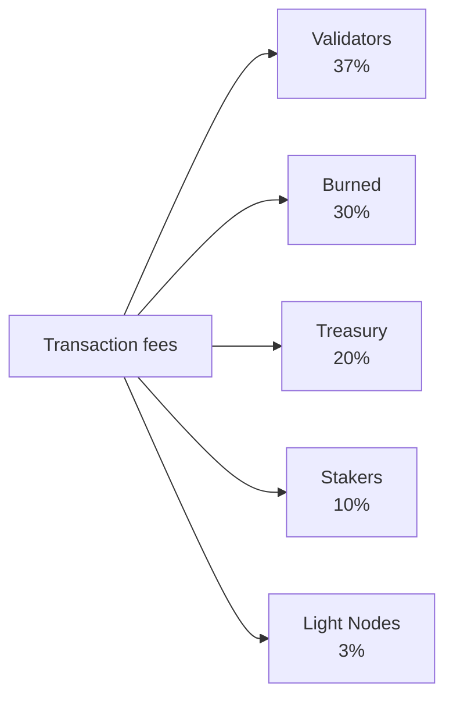

# 토크노믹스

QoreChain은 네이티브 **QOR** 토큰을 중심으로 하는 **고정 공급(fixed-supply)** 경제 모델을 사용합니다. 시간이 지남에 따라 공급량을 인플레이션시키는 대신, 네트워크는 유한하고 사전 할당된 발행 예산에서 스테이킹 보상을 조달하며, 다중 채널 소각 엔진이 네트워크 사용량이 증가함에 따라 지속적인 디플레이션 압력을 가합니다.

---

## 토큰 기본 사항

| Property              | Value                                                    |
| --------------------- | -------------------------------------------------------- |
| **표시 토큰**         | QOR                                                      |
| **기본 단위**         | uqor                                                     |
| **소수 정밀도**       | 10^6 (1 QOR = 1,000,000 uqor)                            |
| **총 공급량**         | 4,500,000,000 QOR (고정)                                 |
| **체인 ID**           | `qorechain-vladi` (mainnet, EVM chain ID 9801)          |
| **Bech32 접두사**     | `qor` (accounts: `qor1...`, validators: `qorvaloper...`) |

:::note
이 페이지의 수치는 **메인넷**(`qorechain-vladi`, EVM 체인 ID **9801**)을 설명하며, 2026년 6월 7일부터 체인 버전 **v3.1.95**에서 라이브 상태입니다. **`qorechain-diana`** 테스트넷(EVM 체인 ID **9800**)은 동일한 경제 모델을 공유합니다.
:::

---

## 공급 및 발행 모델

QoreChain은 **4,500,000,000 QOR의 고정 총 공급량**을 가지고 있습니다. 공급량을 인플레이션시키기 위해 새로운 QOR가 발행되는 일은 결코 없습니다. 대신:

* **80,000,000 QOR(공급량의 1.78%)**가 토큰 생성 이벤트(TGE)에서 소각되었습니다.
* 스테이킹 보상은 **590,000,000 QOR의 유한한 발행 예산**에서 지급되며, 시간이 지남에 따라 감소하는 스케줄에 따라 소진됩니다.

이는 공급량 인플레이션 모델이 아니라 **유한한 발행 예산을 가진 고정 공급 모델**입니다. 발행 예산이 소진되면, 거버넌스가 남은 예산에서 할당하는 것 외에 추가적인 보상 발행은 발생하지 않습니다.

### Staking Reward Schedule {#staking-reward-schedule}

:::note 발행량이 2026년 8월 26일 거버넌스에 의해 상한이 설정되었습니다
아래의 감소 스케줄은 원래 설계였으며, 공급량 대부분이 본딩된 성숙한 네트워크를 목표로 했습니다. 실제 네트워크 상태(본딩된 QOR 약 680만 개, 목표치를 크게 밑돎)와 비교하면, 이 스케줄은 본딩된 스테이크의 약 20%를 *하루 만에* 지급하고 있었습니다. 거버넌스 제안 #4가 본딩된 스테이크의 100% 찬성으로 통과되어 블록 높이 2,122,074(2026-08-26 03:27 UTC, 체인 버전 v3.1.94)에서 적용되었습니다: 에포크당 발행량이 2,153,583 QOR에서 **16,239 QOR**로 감소했으며, 이 모듈에 대해 **114,285,714 QOR**의 새로운 하드 누적 상한이 설정되었습니다 — 이는 버그 수정이 아니라 설계 결정입니다. 상한이 발효되는 시점까지 기존 스케줄에 따라 이미 **104,680,531 QOR(91.6%)가 발행**되었습니다. 새 비율에서는 남은 잔액이 약 **1년 11개월** 더 지속될 것으로 예상되며, 그 이후로는 이 모듈이 영구적으로 발행을 중단하고 검증자/스테이커 보상은 트랜잭션 수수료만으로 지급됩니다(아래 [수수료 분배](#fee-distribution) 참조). 아래 표는 원래 설계 참고용으로 남겨져 있으며, 더 이상 현재 지급 비율을 반영하지 않습니다.
:::

스테이킹 보상은 590,000,000 QOR 발행 예산에서 감소하는 스케줄에 따라 분배됩니다:

| Period      | Target APY              | Emission Budget                  |
| ----------- | ----------------------- | -------------------------------- |
| 1년 차      | 8–12% APY               | 127,500,000 QOR                  |
| 2년 차      | 6–10% APY               | 106,250,000 QOR                  |
| 3–4년 차    | 5–8% APY                | 연 85,000,000 QOR                |
| 5년 차 이상 | 거버넌스 결정            | 잔여 ~186,000,000 QOR            |

APY 범위는 원래 기간별 설계 목표치였으며, 위에서 설명한 대로 발행량에 상한이 설정된 지금은 실제 지급 비율이 아닙니다. QoreChain은 현재 실시간 APY 수치를 계산하는 쿼리 엔드포인트를 제공하지 않습니다 — 이 페이지를 포함해 어디에서든 인용되는 특정 스테이킹 수익률 수치는 오늘날 체인 상태로 검증할 수 없는 것으로 취급하고, 이를 근거로 계획을 세우지 마세요.

---

## x/burn — 다중 채널 소각 엔진

`x/burn` 모듈은 10개 채널로 구성된 토큰 소각 시스템을 구현합니다. 소각된 모든 토큰은 유통 공급량에서 영구적으로 제거되어, 네트워크 사용량이 증가함에 따라 지속적인 디플레이션 압력을 만들어냅니다.

### Burn Channels

| #  | Channel            | Source                     | Description                                   |
| -- | ------------------ | -------------------------- | --------------------------------------------- |
| 1  | `gas_fee`          | 트랜잭션 수수료            | 모든 가스 수수료의 30%가 소각됨               |
| 2  | `contract_create`  | 스마트 컨트랙트 배포       | 컨트랙트 생성당 정액 100 QOR 수수료 소각      |
| 3  | `ai_service`       | AI 모듈 사용 수수료        | AI 서비스 수수료의 50% 소각                   |
| 4  | `bridge_fee`       | 크로스체인 브리지 수수료   | 브리지 수수료의 100% 소각                     |
| 5  | `treasury_buyback` | 트레저리 운영              | 트레저리로부터의 주기적 바이백 후 소각        |
| 6  | `failed_tx`        | 실패한 트랜잭션 가스       | 실패한 트랜잭션 가스의 10% 소각               |
| 7  | `xqore_penalty`    | xQORE 조기 인출 페널티     | 페널티 금액이 소각 경로로 라우팅됨            |
| 8  | `auto_buyback`     | 자동 바이백 프로그램       | 프로토콜 수준의 자동 소각                     |
| 9  | `tge`              | 토큰 생성 이벤트           | 일회성 제네시스 소각 (80,000,000 QOR)         |
| 10 | `rollup_create`    | 롤업 배포                  | 롤업 생성 스테이크의 1% 소각                  |

### Fee Distribution {#fee-distribution}

네트워크가 수집한 모든 트랜잭션 수수료는 아래와 같이 다섯 개의 대상으로 분할됩니다. 각 비율은 온체인에서 강제되며 합계는 항상 정확히 100%입니다.


```mermaid
flowchart LR
    F["Transaction fees"]
    F --> V["Validators<br/>37%"]
    F --> B["Burned<br/>30%"]
    F --> T["Treasury<br/>20%"]
    F --> S["Stakers<br/>10%"]
    F --> L["Light Nodes<br/>3%"]
```

네트워크가 수집한 모든 트랜잭션 수수료는 다섯 개의 대상으로 분할됩니다:

| Recipient       | Share | Description                                                          |
| --------------- | ----- | -------------------------------------------------------------------- |
| **Validators**  | 37%   | 스테이크에 비례하여 활성 검증자 세트에 분배됨                        |
| **Burned**      | 30%   | `gas_fee` 소각 채널을 통해 공급량에서 영구적으로 제거됨               |
| **Treasury**    | 20%   | 거버넌스가 지정하는 지출을 위해 커뮤니티 트레저리에 배정됨            |
| **Stakers**     | 10%   | 위임 비율에 비례하여 모든 QOR 스테이커에게 분배됨                    |
| **Light Nodes** | 3%    | 네트워크 데이터를 제공하는 라이트 노드에 분배됨                      |

각 비율은 온체인에서 강제되며 합계는 항상 정확히 100%여야 합니다.

:::note 이는 설정된 분배 비율이며, 확인된 실측치가 아닙니다
위 표는 `x/burn`에 설정된 매개변수를 반영합니다. 라이브 체인 상태를 대상으로 한 측정 결과, 검증자와 스테이커가 실제로 함께 받는 유효 비율의 합이 이 두 항목의 합계인 47%보다 낮게 나타났습니다. 아직 이 불일치를 독자적으로 규명하지 못했으므로, 이 페이지에서는 두 수치 중 어느 쪽도 확인된 실측치로 단정하지 않고 설정된 설계 값을 명시합니다 — 정확한 현재 분배 비율에 의존하는 용도라면 `x/burn` 매개변수와 통계를 직접 조회하세요([REST/gRPC 엔드포인트](/api-reference/rest-grpc-endpoints) 참조).
:::

### Burn Parameters

| Parameter              | Default                    | Description                              |
| ---------------------- | --------------------------- | ---------------------------------------- |
| `gas_burn_rate`        | 0.30                       | 소각되는 가스 수수료 비율 (30%)           |
| `contract_create_fee`  | 100,000,000 uqor (100 QOR) | 컨트랙트 생성에 대한 정액 소각 수수료     |
| `ai_service_burn_rate` | 0.50                       | 소각되는 AI 서비스 수수료 비율 (50%)      |
| `bridge_burn_rate`     | 1.00                       | 소각되는 브리지 수수료 비율 (100%)        |
| `failed_tx_burn_rate`  | 0.10                       | 소각되는 실패 트랜잭션 가스 비율 (10%)    |

각 소각 이벤트는 출처, 금액, 블록 높이, 관련 트랜잭션 해시와 함께 온체인에 기록됩니다. 집계 통계는 채널별로도, 전체로도 조회할 수 있습니다.

---

## x/xqore — 잠금 스테이킹 및 거버넌스 증폭

`x/xqore` 모듈은 양도 불가능한 잠금 스테이킹 파생 자산인 **xQORE**를 도입합니다. 사용자는 QOR를 잠가 1:1 비율로 xQORE를 발행할 수 있습니다. xQORE 보유자는 증폭된 거버넌스 권한과 재분배된 조기 인출 페널티의 몫을 받습니다.

### Lock Mechanism

* **Lock**: QOR를 xQORE 모듈로 보내 1:1 비율로 xQORE를 발행합니다.
* **Governance weight**: xQORE 보유자는 일반 QOR 스테이커에 비해 **2배의 거버넌스 투표권**을 받습니다.
* **Non-transferable**: xQORE는 계정 간에 전송할 수 없습니다. 잠근 주소에 귀속됩니다.

### Exit Penalty Schedule

xQORE에서의 조기 인출은 잠금 기간이 길수록 낮아지는 페널티를 발생시킵니다:

| Lock Duration  | Penalty Rate | Description                                |
| -------------- | ------------ | ------------------------------------------ |
| &lt; 30 days   | **50%**      | 잠긴 QOR의 절반이 몰수됨                   |
| 30 -- 90 days  | **35%**      | 단기 잠금에 대한 상당한 페널티             |
| 90 -- 180 days | **15%**      | 중기 약정에 대한 완화된 페널티             |
| > 180 days     | **0%**       | 페널티 없이 전액 인출                      |

### PvP Rebase Redistribution

조기 인출로 걷힌 페널티는 그냥 소멸되지 않습니다. 대신 PvP(플레이어 대 플레이어) 리베이스 모델을 따릅니다:

1. 페널티 금액의 **50%**는 소각됩니다 (`xqore_penalty` 채널을 통해 `x/burn`으로 라우팅).
2. **50%**는 남아 있는 모든 xQORE 보유자에게 지분 비례로 재분배됩니다.

이는 장기 보유자에게 포지티브섬(positive-sum) 역학을 만들어 냅니다. 즉, 조기 인출이 일어날 때마다 남아 있는 xQORE 포지션의 실질 가치가 올라갑니다. 리베이스는 **100블록**마다 발생합니다.

### xQORE Parameters

| Parameter               | Default                | Description                               |
| ------------------------ | ---------------------- | ----------------------------------------- |
| `governance_multiplier` | 2.0                    | xQORE 보유자에 대한 투표권 배수           |
| `min_lock_amount`       | 1,000,000 uqor (1 QOR) | 잠금에 필요한 최소 QOR                    |
| `penalty_burn_rate`     | 0.50                   | 소각되는 조기 인출 페널티 비율 (50%)      |
| `rebase_interval`       | 100 blocks             | PvP 리베이스 이벤트 사이의 블록 수        |
| `enabled`               | true                   | 모듈 활성화 플래그                        |

---

## x/inflation — Emission Budget Schedule

모듈 이름과 달리, `x/inflation` 모듈은 총 공급량을 인플레이션시키지 **않습니다**. 이 모듈은 감소하는 [스테이킹 보상 스케줄](#staking-reward-schedule)에 따라 유한한 **590,000,000 QOR** 발행 예산에서 스테이킹 보상을 방출하는 역할을 합니다. 발행량은 에포크 단위로 계산되어 스테이커와 검증자에게 분배되며, 새 공급량을 발행하는 대신 사전 할당된 예산을 소진해 갑니다.

### Epoch Mechanics

* **Epoch length**: 17,280 블록 (5초 블록 시간 기준 약 1일)
* **Blocks per year**: 약 6,311,520
* 각 에포크가 시작될 때, 현재 기간에 예정된 발행량이 발행 예산에서 방출되어 스테이커와 검증자에게 분배됩니다.
* 에포크 트래커는 현재 에포크 번호, 현재 연차, 시작 블록, 발행 예산에서 누적 방출된 QOR, 남은 예산을 기록합니다.

### Inflation Parameters

| Parameter      | Default          | Description                                                |
| -------------- | ---------------- | ---------------------------------------------------------- |
| `schedule`     | declining        | 기간별 발행 예산 (스테이킹 보상 스케줄 참조)                |
| `epoch_length` | 17,280 blocks    | 발행 에포크당 블록 수                                       |
| `enabled`      | true             | 모듈 활성화 플래그                                          |

---

## Deflationary Dynamics

공급량이 고정되어 있고 발행이 유한한 예산에서 조달되기 때문에, QoreChain의 순 토큰 역학은 채택이 늘어날수록 디플레이션 쪽으로 기울어집니다:

```
Years 1-2:  Larger scheduled emissions from the budget offset burns → near-neutral supply
Years 3-4:  Scheduled emissions decline; burn volume grows with usage → convergence
Year 5+:    Emission budget is largely drawn down; burn channels (gas, bridge,
            contracts, rollups) scale with transaction volume → net deflationary
```

10개의 소각 채널은 주요 네트워크 활동마다 공급량에서 토큰이 제거되도록 보장합니다. 트랜잭션 볼륨, 브리지 사용량, AI 서비스 호출, 롤업 배포가 늘어날수록 누적 소각량은 가속화되는 반면, 예정된 발행량은 유한한 예산이 소진되어 감에 따라 줄어듭니다.

---

## Module Lifecycle Order

경제 관련 모듈들은 매 블록의 `EndBlocker`에서 정해진 순서로 실행됩니다:

```
x/burn → x/xqore → x/inflation → x/rlconsensus
```

1. **x/burn** — 대기 중인 소각 레코드를 처리하고 집계 통계를 갱신합니다.
2. **x/xqore** — (`rebase_interval` 블록마다) PvP 리베이스를 실행하고 페널티를 소각 경로로 라우팅합니다.
3. **x/inflation** — 에포크 경계에서 예정된 스테이킹 보상 발행량을 예산에서 방출합니다.
4. **x/rlconsensus** — PRISM 강화학습 신호를 바탕으로 합의 매개변수를 조정합니다.

이 순서는 리베이스가 일어나기 전에 소각이 확정되고, 예정된 발행이 방출되기 전에 리베이스가 완료되도록 보장하여 경제 상태 전이의 일관성을 유지합니다.

## Related

* [Chain Parameters](/appendix/chain-parameters) — 표준 경제 및 합의 기본값.
* [Staking and Delegation](/user-guide/staking-and-delegation) — QOR를 위임하고 보상을 받는 방법.
* [xQORE Staking](/user-guide/xqore-staking) — PvP 리베이스 스테이킹 메커니즘.
* [Light Node Rewards](/light-node/rewards-and-monitoring) — 라이트 노드 보상 몫.
