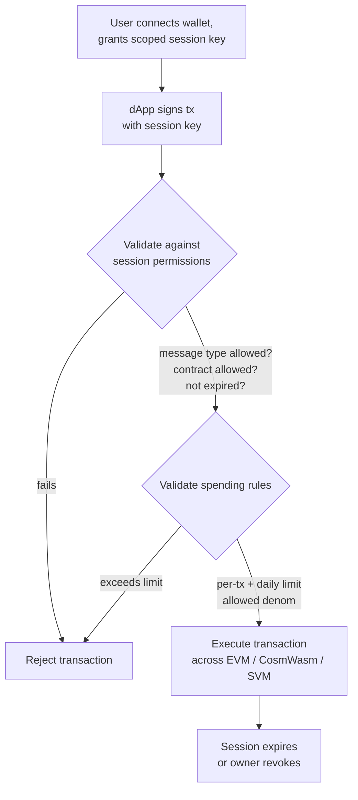

# 계정 추상화

QoreChain은 `x/abstractaccount` 모듈을 통해 **프로토콜 수준의 계정 추상화**를 제공합니다. 이를 통해 유연한 인증 규칙, 세션 키, 지출 한도, 소셜 복구를 갖춘 프로그래밍 가능한 계정을 외부 스마트 컨트랙트 인프라 없이 구현할 수 있습니다.

:::note
아래 명령은 2026년 6월 7일부터 운영 중이며 체인 버전 **v3.1.80**을 실행하는 **`qorechain-vladi`** 메인넷을 사용합니다. 테스트넷의 경우 `--chain-id qorechain-diana`로 대체하세요.
:::

## 개요

전통적인 블록체인 계정은 단일 개인 키로 제어됩니다. 계정 추상화는 "누가 트랜잭션을 승인할 수 있는가"라는 개념을 단일 암호화 키로부터 분리하여 다음을 가능하게 합니다:

* 구성 가능한 임계값 서명을 갖춘 **멀티시그 계정**
* 가디언 기반 키 복구를 갖춘 **소셜 복구 계정**
* dApp을 위한 세분화되고 시간 제한이 있는 권한을 갖춘 **세션 기반 계정**

`x/abstractaccount` 모듈은 이러한 기능을 프로토콜 계층에서 구현하므로, 세 가지 VM(EVM, CosmWasm, SVM) 전반에서 작동하며 네이티브 가스 효율성의 이점을 누립니다.

*세션 기반 dApp 흐름: 범위가 지정된 세션 키가 트랜잭션에 서명하고, 모듈이 이를 세션 및 지출 규칙에 대해 검증한 다음 실행합니다.*



## 계정 유형

| 유형              | 설명                             | 사용 사례                       |
| ----------------- | --------------------------------------- | ------------------------------ |
| `multisig`        | M-of-N 임계값 서명                | DAO 자금고, 공유 지갑 |
| `social_recovery` | 가디언 지원 키 복구          | 소비자 지갑, 온보딩   |
| `session_based`   | 제약 조건이 있는 위임된 세션 키 | dApp 세션, 모바일 지갑  |

## 추상 계정 생성

### 세션 기반 계정

```bash
qorechaind tx abstractaccount create \
  --account-type session_based \
  --from mykey \
  --gas auto \
  -y
```

### 멀티시그 계정

```bash
qorechaind tx abstractaccount create \
  --account-type multisig \
  --signers qor1alice...,qor1bob...,qor1carol... \
  --threshold 2 \
  --from mykey \
  --gas auto \
  -y
```

### 소셜 복구 계정

```bash
qorechaind tx abstractaccount create \
  --account-type social_recovery \
  --guardians qor1guardian1...,qor1guardian2...,qor1guardian3... \
  --recovery-threshold 2 \
  --from mykey \
  --gas auto \
  -y
```

## 세션 키

세션 키는 `session_based` 계정 유형의 핵심입니다. 보조 키에 **임시적이고 범위가 지정된 권한**을 부여할 수 있어, 기본 키를 노출하고 싶지 않은 dApp 상호작용에 완벽합니다.

### 키 속성

| 속성              | 설명                                          |
| --------------------- | ---------------------------------------------------- |
| **권한(Permissions)**       | 세션 키가 서명할 수 있는 메시지 유형         |
| **만료(Expiry)**            | 구성 가능한 기간 이후 자동 만료   |
| **지출 한도(Spending limits)**   | 세션 키가 지출할 수 있는 최대 금액            |
| **허용된 컨트랙트(Allowed contracts)** | 특정 컨트랙트 주소로 상호작용 제한 |

### 세션 키 부여

```bash
qorechaind tx abstractaccount grant-session \
  --session-key qor1sessionkey... \
  --permissions "bank/MsgSend,wasm/MsgExecuteContract" \
  --expiry "2026-03-01T00:00:00Z" \
  --allowed-contracts qor1contract1...,0x1234...abcd \
  --from mykey \
  -y
```

### 세션 키 취소

```bash
qorechaind tx abstractaccount revoke-session \
  --session-key qor1sessionkey... \
  --from mykey \
  -y
```

### 활성 세션 목록

```bash
qorechaind query abstractaccount sessions <account-address>
```

## 지출 규칙

지출 규칙은 계정 유형에 관계없이 추상 계정에 재정적 가드레일을 추가합니다:

| 규칙             | 설명                                     |
| ---------------- | ----------------------------------------------- |
| `daily_limit`    | 24시간 롤링 윈도우당 최대 총 지출  |
| `per_tx_limit`   | 개별 트랜잭션당 최대 지출        |
| `allowed_denoms` | 지출 가능한 토큰 단위 제한 |

### 지출 규칙 설정

```bash
qorechaind tx abstractaccount update-spending-rules \
  --daily-limit 1000000000uqor \
  --per-tx-limit 100000000uqor \
  --allowed-denoms uqor \
  --from mykey \
  -y
```

### 현재 규칙 조회

```bash
qorechaind query abstractaccount spending-rules <account-address>
```

### 응답 예시

```json
{
  "daily_limit": {
    "denom": "uqor",
    "amount": "1000000000"
  },
  "per_tx_limit": {
    "denom": "uqor",
    "amount": "100000000"
  },
  "allowed_denoms": ["uqor"],
  "daily_spent": {
    "denom": "uqor",
    "amount": "250000000"
  },
  "window_reset": "2026-02-27T00:00:00Z"
}
```

## 추상 계정 조회

### CLI

```bash
# Get full account configuration
qorechaind query abstractaccount account <address>

# List all abstract accounts (paginated)
qorechaind query abstractaccount list --limit 10
```

### JSON-RPC

```bash
curl -X POST http://localhost:8545 \
  -H "Content-Type: application/json" \
  -d '{
    "jsonrpc": "2.0",
    "method": "qor_getAbstractAccount",
    "params": ["0xYourAddress"],
    "id": 1
  }'
```

### 계정 응답 예시

```json
{
  "address": "qor1myaccount...",
  "account_type": "session_based",
  "owner": "qor1owner...",
  "active_sessions": 2,
  "spending_rules": {
    "daily_limit": "1000000000uqor",
    "per_tx_limit": "100000000uqor",
    "allowed_denoms": ["uqor"]
  },
  "created_at_height": 54321
}
```

## 소셜 복구 흐름

계정 소유자가 기본 키에 대한 접근 권한을 잃으면, 가디언이 키 교체를 승인할 수 있습니다.

1. **소유자가 키 분실을 신고합니다(또는 가디언이 시작합니다):**

   ```bash
   qorechaind tx abstractaccount initiate-recovery \
     --account <account-address> \
     --new-owner qor1newkey... \
     --from guardian1 \
     -y
   ```

2. **추가 가디언이 승인합니다**(`recovery_threshold`를 충족해야 함):

   ```bash
   qorechaind tx abstractaccount approve-recovery \
     --account <account-address> \
     --recovery-id <recovery-id> \
     --from guardian2 \
     -y
   ```

3. 임계값이 충족되면 **복구가 자동으로 실행됩니다**. **타임락 기간**(기본값: 48시간)은 원래 소유자가 부정한 복구 시도를 취소할 기회를 제공합니다.

## dApp과의 통합

세션 키는 매끄러운 dApp 경험을 가능하게 합니다:

1. **사용자가 지갑을 연결**하고 dApp의 컨트랙트로 범위가 지정된 세션 키를 생성합니다
2. **dApp이 세션 키를 사용**하여 사용자를 대신해 트랜잭션을 제출합니다
3. **반복 서명 없음** — 세션 키가 권한 범위 내에서 인증을 처리합니다
4. **세션이 자동으로 만료**되거나, 사용자가 언제든지 취소합니다

이 패턴은 특히 다음에 유용합니다:

* 반복적인 생체 인증 프롬프트가 방해가 되는 모바일 지갑
* 빠른 트랜잭션 서명이 필요한 게이밍 dApp
* 여러 순차적 작업을 실행하는 DeFi 프로토콜

## 다음 단계

* [밸리데이터 운영](/developer-guide/running-a-validator) — 밸리데이터 노드 설정 및 운영
* [EVM 개발](/developer-guide/evm-development) — Solidity dApp과 추상 계정 통합
* [크로스 VM 상호운용성](/developer-guide/cross-vm-interoperability) — 추상 계정을 활용한 크로스 VM 메시징
