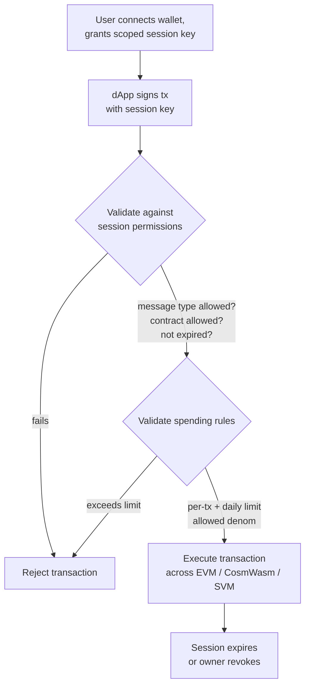

# 계정 추상화

QoreChain은 `x/abstractaccount` 모듈을 통해 **프로토콜 수준의 계정 추상화**를 제공합니다. 이를 통해 외부 스마트 컨트랙트 인프라 없이도 유연한 인증 규칙, 세션 키, 지출 한도, 소셜 복구 기능을 갖춘 프로그래머블 계정을 사용할 수 있습니다.

:::note
아래 명령어는 2026년 6월 7일부터 운영 중이며 체인 버전 **v3.1.92**를 실행하는 **`qorechain-vladi`** 메인넷을 기준으로 작성되었습니다. 테스트넷을 사용하려면 `--chain-id qorechain-diana`로 대체하십시오.
:::

## 개요

전통적인 블록체인 계정은 단일 개인 키로 제어됩니다. 계정 추상화는 "누가 트랜잭션을 승인할 수 있는가"라는 개념을 단일 암호화 키로부터 분리하여 다음을 가능하게 합니다.

* 임계값을 자유롭게 설정할 수 있는 **다중서명 계정**
* 보증인 기반 키 복구를 지원하는 **소셜 복구 계정**
* dApp을 위한 세분화된 시간 제한 권한을 갖춘 **세션 기반 계정**

`x/abstractaccount` 모듈은 이러한 기능을 프로토콜 계층에서 구현하므로, 세 가지 VM(EVM, CosmWasm, SVM) 전체에서 동작하며 네이티브 가스 효율성의 이점을 누릴 수 있습니다.

*세션 기반 dApp 흐름: 범위가 지정된 세션 키가 트랜잭션에 서명하면, 모듈이 이를 세션 및 지출 규칙에 대해 검증한 후 실행합니다.*


```mermaid
flowchart TD
    A["User connects wallet,<br/>grants scoped session key"] --> B["dApp signs tx<br/>with session key"]
    B --> C{"Validate against<br/>session permissions"}
    C -- "message type allowed?<br/>contract allowed?<br/>not expired?" --> D{"Validate spending rules"}
    C -- "fails" --> R["Reject transaction"]
    D -- "per-tx + daily limit<br/>allowed denom" --> E["Execute transaction<br/>across EVM / CosmWasm / SVM"]
    D -- "exceeds limit" --> R
    E --> F["Session expires<br/>or owner revokes"]
```

## 계정 유형

| 유형              | 설명                             | 사용 사례                       |
| ----------------- | --------------------------------------- | ------------------------------ |
| `multisig`        | M-of-N 임계값 서명                | DAO 자금, 공유 지갑 |
| `social_recovery` | 보증인 지원 키 복구          | 소비자 지갑, 온보딩   |
| `session_based`   | 제약 조건이 있는 위임된 세션 키 | dApp 세션, 모바일 지갑  |

## 추상 계정 생성

### 세션 기반 계정

```bash
qorechaind tx abstractaccount create \
  --account-type session_based \
  --from mykey \
  --gas auto \
  -y
```

### 다중서명 계정

```bash
qorechaind tx abstractaccount create \
  --account-type multisig \
  --signers qor1alice...,qor1bob...,qor1carol... \
  --threshold 2 \
  --from mykey \
  --gas auto \
  -y
```

### 소셜 복구 계정

```bash
qorechaind tx abstractaccount create \
  --account-type social_recovery \
  --guardians qor1guardian1...,qor1guardian2...,qor1guardian3... \
  --recovery-threshold 2 \
  --from mykey \
  --gas auto \
  -y
```

## 세션 키

세션 키는 `session_based` 계정 유형의 핵심입니다. 이를 통해 보조 키에 **일시적이고 범위가 지정된 권한**을 부여할 수 있으며, 기본 키를 노출하고 싶지 않은 dApp 상호작용에 적합합니다.

### 키 속성

| 속성              | 설명                                          |
| --------------------- | ---------------------------------------------------- |
| **권한**       | 세션 키가 서명할 수 있는 메시지 유형         |
| **만료**            | 설정 가능한 기간이 지나면 자동 만료   |
| **지출 한도**   | 세션 키가 지출할 수 있는 최대 금액            |
| **허용된 컨트랙트** | 특정 컨트랙트 주소로만 상호작용 제한 |

### 세션 키 부여

```bash
qorechaind tx abstractaccount grant-session \
  --session-key qor1sessionkey... \
  --permissions "bank/MsgSend,wasm/MsgExecuteContract" \
  --expiry "2026-03-01T00:00:00Z" \
  --allowed-contracts qor1contract1...,0x1234...abcd \
  --from mykey \
  -y
```

### 세션 키 취소

```bash
qorechaind tx abstractaccount revoke-session \
  --session-key qor1sessionkey... \
  --from mykey \
  -y
```

### 활성 세션 목록 조회

```bash
qorechaind query abstractaccount sessions <account-address>
```

## 지출 규칙

지출 규칙은 계정 유형과 관계없이 추상 계정에 재정적 안전장치를 추가합니다.

| 규칙             | 설명                                     |
| ---------------- | ----------------------------------------------- |
| `daily_limit`    | 24시간 롤링 윈도우당 최대 총 지출 금액  |
| `per_tx_limit`   | 개별 트랜잭션당 최대 지출 금액        |
| `allowed_denoms` | 지출 가능한 토큰 단위(denom) 제한 |

### 지출 규칙 설정

```bash
qorechaind tx abstractaccount update-spending-rules \
  --daily-limit 1000000000uqor \
  --per-tx-limit 100000000uqor \
  --allowed-denoms uqor \
  --from mykey \
  -y
```

### 현재 규칙 조회

```bash
qorechaind query abstractaccount spending-rules <account-address>
```

### 응답 예시

```json
{
  "daily_limit": {
    "denom": "uqor",
    "amount": "1000000000"
  },
  "per_tx_limit": {
    "denom": "uqor",
    "amount": "100000000"
  },
  "allowed_denoms": ["uqor"],
  "daily_spent": {
    "denom": "uqor",
    "amount": "250000000"
  },
  "window_reset": "2026-02-27T00:00:00Z"
}
```

## 연결된 지갑 인증자 — 위임된 지출 {#authenticators}

체인 버전 **v3.1.85**(v3.1.84의 권한 모델을 기반으로 함)부터, **연결된 외부 지갑 키** — Phantom(ed25519) 키 또는 MetaMask(secp256k1) 계정 — 는 최소 권한, 지출 한도 제한, 철회 가능한 조건 하에 **표준 계정(post-quantum account)에서 직접 지출**할 수 있습니다. 외부 키는 ML-DSA 서명을 생성하지 않습니다. **릴레이어**가 트랜잭션 봉투를 제출하고 수수료를 지불하며(릴레이어 자신의 하이브리드 PQC 서명이 체인의 서명 요구사항을 충족합니다), 인증자가 **도메인 분리되고 재전송 방지가 적용된 서명 바이트**에 대해 남긴 서명이 승인의 근거가 됩니다.

### 인증자 등록 {#register-authenticator}

계정 소유자는 `MsgRegisterAuthenticator`(일반적인 루트 키 트랜잭션)를 사용해 외부 키를 등록하며, 이때 방식(scheme), 권한, 만료 시점, 선택적 지출 한도를 지정합니다.

```js
import { registerEthAuthenticatorMsg } from "@qorechain/wallet-adapter";

// Link a MetaMask account by its 20-byte address (EIP-191 verification):
const msg = registerEthAuthenticatorMsg({
  account: "qor1owner...",            // the canonical account
  ethAddress: "0xAbC...123",          // the MetaMask address to link
  permissions: ["evm"],               // least privilege — see the taxonomy below
  expirySeconds: 30 * 24 * 3600,      // ≤ 30 days recommended
  spendingRule: { perTxLimit: "100000000uqor", dailyLimit: "1000000000uqor" },
});
// Sign & broadcast this msg with the OWNER's normal hybrid-PQC signer.
```

Phantom 키도 동일한 방식으로 `scheme: "ed25519"`와 Phantom 공개 키를 사용해 등록합니다. 철회는 `MsgRevokeAuthenticator`를 통해 즉시 이루어집니다.

### 권한 분류 체계 {#permission-taxonomy}

등록된 인증자가 수행할 수 있는 작업은 11가지 표준 권한으로 제어됩니다. 이 매핑은 **기본적으로 차단(fail-closed)** 방식이며, 매핑이 없는 메시지 유형은 거부됩니다.

| 권한 | 부여되는 작업 |
| --- | --- |
| `send` | 네이티브 레인 계좌 이체 |
| `delegate` / `withdraw` / `vote` | 스테이킹, 보상 인출, 거버넌스 |
| `evm` / `wasm` / `svm` | 해당 VM 레인에서의 실행 |
| `amm` / `ibc` / `deploy` | AMM 작업, IBC 전송, 컨트랙트 배포 |
| `all` | *위임 가능한* 모든 메시지 |

**키 관리 메시지는 절대 위임할 수 없습니다** — `MsgRegisterAuthenticator`, `MsgRevokeAuthenticator`, PQC 키 등록/마이그레이션, `MsgRotatePQCKey`는 항상 루트 키를 필요로 하므로, 연결된 키가 스스로 권한을 상승시킬 수 없습니다.

하드코딩하지 말고 실시간 분류 체계(드리프트 감지를 위한 `schema_version` 포함)를 조회하십시오.

```bash
curl -s https://api.qore.host/qorechain/abstractaccount/v1/permission_schema | jq
# or: qorechaind query abstractaccount permission-schema
```

### 연결된 키로 지출하기 {#execute-messages}

인증자가 승인한 작업은 두 가지 메시지로 전달됩니다. 두 경우 모두 릴레이어가 트랜잭션의 서명자/수수료 지불자이며, 인증자의 서명은 메시지 내부에 담겨 전달됩니다.

**`MsgExecuteEVM`** — 표준 계정의 `0x…` 주소에서 이루어지는 EVM 호출 또는 전송입니다. 인증자는 `sha256("qorechain-evm-auth-v1" ‖ chainId ‖ account ‖ pubkey ‖ to ‖ value ‖ data ‖ nonce)`(모든 필드는 길이 접두사 포함)에 서명합니다. 재전송 방지는 계정 자체의 EVM 논스를 통해 이루어집니다.

**`MsgExecuteCosmos`** — 표준 계정에서 이루어지는 네이티브 레인 계좌 이체입니다. 인증자는 `sha256("qorechain-cosmos-auth-v1" ‖ chainId ‖ account ‖ pubkey ‖ to ‖ amount ‖ nonce)`에 서명합니다. 재전송 방지는 모듈이 관리하는 **인증자별 시퀀스**를 통해 이루어집니다(계좌 이체는 계정 논스를 증가시키지 않습니다). 자기 자신에게 보내는 전송은 거부됩니다.

:::caution 논스 규칙
* `MsgExecuteEVM.nonce`는 계정의 **현재** EVM 논스(`eth_getTransactionCount(account0x, "latest")`)여야 합니다. 실제 운영 환경에서 릴레이어는 *다른* 계정이므로 +1을 더하지 **마십시오**. 오래된 논스로 서명하면 코드 `11`이 반환됩니다.
* `MsgExecuteCosmos.nonce`는 인증자별 시퀀스입니다(계정의 인증자 상태를 조회하십시오). 계정의 Cosmos 시퀀스가 **아닙니다**.
:::

**Phantom 예시**(브라우저: Phantom이 서명하고, 백엔드가 릴레이합니다):

```js
import { buildPhantomExecuteCosmos } from "@qorechain/wallet-adapter";

// In the dApp: Phantom signs the digest with ed25519 signMessage.
const msg = await buildPhantomExecuteCosmos({
  provider: window.solana,            // Phantom
  chainId: "qorechain-vladi",
  account: "qor1owner...",            // canonical account being spent from
  to: "qor1recipient...",
  amount: { denom: "uqor", amount: "900000" },
  nonce: authSequence,                // per-authenticator sequence
});
// Send `msg` to your relayer; the relayer wraps it in a tx it signs
// (hybrid PQC) and broadcasts. The transfer moves the OWNER's funds.
```

**MetaMask 예시**(연결된 20바이트 주소로부터의 EIP-191 `personal_sign`):

```js
import { buildMetaMaskExecuteEvm } from "@qorechain/wallet-adapter";

const msg = await buildMetaMaskExecuteEvm({
  provider: window.ethereum,          // MetaMask (EIP-1193)
  chainId: "qorechain-vladi",
  account: "qor1owner...",
  to: "0xRecipient...",
  valueWei: 10n ** 16n,               // 0.01 QOR (18-dec EVM view)
  nonce: currentEvmNonce,             // eth_getTransactionCount(owner0x, "latest")
});
// Relay as above. The chain verifies the signature via EIP-191 + ecrecover
// against the registered 20-byte address.
```

동일한 빌더 함수가 5개 언어 모두를 위한 [QoreChain SDK](/sdk/guides/authenticators)에도 제공되며, CLI에서도 동등한 기능을 사용할 수 있습니다.

```bash
# Produce the exact sign bytes the chain verifies (for custom signers):
qorechaind query abstractaccount auth-sign-cosmos <account> <to> <amount> <nonce>
qorechaind query abstractaccount auth-sign-evm <account> <to> <value> <data-hex> <nonce>

# Relay a pre-signed authorization:
qorechaind tx abstractaccount execute-cosmos <account> <to> <amount> <auth-pubkey> <auth-sig> <nonce> --from relayer -y
qorechaind tx abstractaccount execute-evm    <account> <to> <value> <data-hex> <auth-pubkey> <auth-sig> <nonce> --from relayer -y
```

### 오류 코드 {#authenticator-errors}

시행 실패는 지갑이 올바른 메시지를 표시할 수 있도록 구분된 코드(코드스페이스 `abstractaccount`)로 반환됩니다.

| 코드 | 의미 | 지갑 UX |
| --- | --- | --- |
| `5` | 지출 한도 초과(건당 또는 일일) | 남은 허용 한도를 표시 |
| `6` | 인증자 만료 | "만료됨 — 지갑을 다시 연결하십시오" |
| `10` | 권한 거부(범위 밖이거나 위임 불가능한 메시지) | 부족한 권한을 표시 |
| `11` | 재전송 거부(오래된 논스/시퀀스) | 논스를 다시 조회하고 재서명 |

(코드스페이스 `pqc` 코드 `21` = 하이브리드 서명 검증 실패 — 승인 문제가 아니라 릴레이어 측 서명 문제입니다.)

### REST 조회 {#abstractaccount-rest}

**v3.1.85**부터 모듈의 읽기 조회 기능도 REST를 통해 제공됩니다.

```
GET /qorechain/abstractaccount/v1/config
GET /qorechain/abstractaccount/v1/accounts
GET /qorechain/abstractaccount/v1/accounts/{address}
GET /qorechain/abstractaccount/v1/permission_schema
```

## 추상 계정 조회

### CLI

```bash
# Get full account configuration
qorechaind query abstractaccount account <address>

# List all abstract accounts (paginated)
qorechaind query abstractaccount list --limit 10
```

### JSON-RPC

```bash
curl -X POST http://localhost:8545 \
  -H "Content-Type: application/json" \
  -d '{
    "jsonrpc": "2.0",
    "method": "qor_getAbstractAccount",
    "params": ["0xYourAddress"],
    "id": 1
  }'
```

### 계정 응답 예시

```json
{
  "address": "qor1myaccount...",
  "account_type": "session_based",
  "owner": "qor1owner...",
  "active_sessions": 2,
  "spending_rules": {
    "daily_limit": "1000000000uqor",
    "per_tx_limit": "100000000uqor",
    "allowed_denoms": ["uqor"]
  },
  "created_at_height": 54321
}
```

## 소셜 복구 절차

계정 소유자가 기본 키에 대한 접근 권한을 잃은 경우, 보증인들이 키 교체를 승인할 수 있습니다.

1. **소유자가 키 분실을 신고(또는 보증인이 절차를 시작):**

   ```bash
   qorechaind tx abstractaccount initiate-recovery \
     --account <account-address> \
     --new-owner qor1newkey... \
     --from guardian1 \
     -y
   ```

2. **추가 보증인의 승인**(`recovery_threshold`를 충족해야 함):

   ```bash
   qorechaind tx abstractaccount approve-recovery \
     --account <account-address> \
     --recovery-id <recovery-id> \
     --from guardian2 \
     -y
   ```

3. **임계값이 충족되면 복구가 자동으로 실행됩니다.** **타임락 기간**(기본값: 48시간) 동안 원래 소유자는 사기성 복구 시도를 취소할 기회를 갖습니다.

## dApp과의 통합

세션 키는 원활한 dApp 경험을 가능하게 합니다.

1. **사용자가 지갑을 연결**하고 dApp의 컨트랙트로 범위가 지정된 세션 키를 생성합니다
2. **dApp이 세션 키를 사용**하여 사용자를 대신해 트랜잭션을 제출합니다
3. **반복적인 서명이 필요 없습니다** — 세션 키가 자신의 권한 범위 내에서 승인을 처리합니다
4. **세션이 자동으로 만료**되거나, 사용자가 언제든지 이를 취소할 수 있습니다

이 패턴은 특히 다음과 같은 경우에 유용합니다.

* 반복적인 생체 인증 요청이 사용성을 해치는 모바일 지갑
* 빠른 트랜잭션 서명이 필요한 게임 dApp
* 여러 개의 순차적 작업을 실행하는 DeFi 프로토콜

## 다음 단계

* [검증자 노드 운영](/developer-guide/running-a-validator) — 검증자 노드 설정 및 운영
* [EVM 개발](/developer-guide/evm-development) — Solidity dApp과 추상 계정 통합
* [크로스-VM 상호운용성](/developer-guide/cross-vm-interoperability) — 추상 계정을 활용한 크로스-VM 메시징
