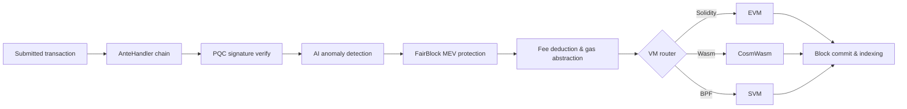

# 아키텍처 개요

QoreChain은 세 가지 주요 프로세스 — 체인 노드, AI 사이드카, 블록 인덱서 — 로 구성된 모듈식 블록체인 노드이며, Postgres 데이터베이스로 뒷받침되고 Prometheus 및 Grafana를 통해 모니터링됩니다. 메인넷(`qorechain-vladi`, EVM 체인 ID **9801**)은 2026년 6월 7일부터 체인 버전 **v3.1.77**로 가동 중이며, 병렬 테스트넷(`qorechain-diana`, EVM 체인 ID **9800**)이 함께 운영됩니다. 체인은 Cosmos SDK v0.53 위에 구축되었습니다. 다음 다이어그램은 고수준 컴포넌트 레이아웃을 보여줍니다.

아래의 트랜잭션 생명주기는 제출된 트랜잭션이 노드를 통해 어떻게 흐르는지 요약합니다 — AnteHandler 데코레이터 체인(보안 및 수수료 검사)에서 VM 실행과 온체인 정산에 이르기까지입니다.



```
┌────────────────────────────────────────────────────────────────────────────┐
│                            QoreChain Node                                  │
│                                                                            │
│  ┌──────────────────── Virtual Machines ──────────────────────┐           │
│  │  ┌───────┐    ┌──────────┐    ┌───────┐                   │           │
│  │  │  EVM  │    │ CosmWasm │    │  SVM  │                   │           │
│  │  │(Sol.) │◄──►│ (Wasm)   │◄──►│ (BPF) │                   │           │
│  │  └───┬───┘    └────┬─────┘    └───┬───┘                   │           │
│  │      └─────────┬───┘──────────────┘                       │           │
│  │           x/crossvm (bridge)                               │           │
│  └────────────────────────────────────────────────────────────┘           │
│                                                                            │
│  ┌────────────────────── Tokenomics ─────────────────────────┐           │
│  │  ┌──────┐   ┌───────┐   ┌───────────┐                    │           │
│  │  │x/burn│   │x/xqore│   │x/inflation│                    │           │
│  │  │10 ch.│   │lock/  │   │finite     │                    │           │
│  │  │37/30/│   │unlock │   │emission   │                    │           │
│  │  │20/10/│   │PvP    │   │590M       │                    │           │
│  │  │3     │   │       │   │budget     │                    │           │
│  │  └──────┘   └───────┘   └───────────┘                    │           │
│  └────────────────────────────────────────────────────────────┘           │
│                                                                            │
│  ┌──────────── IBC / Bridges ────────────────────────────────┐           │
│  │  ┌──────────┐  ┌──────────┐  ┌───────────┐  ┌──────────┐ │           │
│  │  │x/bridge  │  │x/babylon │  │x/abstract │  │x/gas     │ │           │
│  │  │37 QCB +  │  │BTC re-   │  │ account   │  │abstract. │ │           │
│  │  │8 IBC     │  │staking   │  │session key│  │multi-tok │ │           │
│  │  └────┬─────┘  └────┬─────┘  └───────────┘  └──────────┘ │           │
│  │  QCB Bridge     Babylon IBC   ERC-4337-like   ibc/USDC    │           │
│  │  PQC-signed     BTC finality  social recov.   ibc/ATOM    │           │
│  │  36 ext chains  checkpoint    spending rules  fee convert  │           │
│  │  ┌──────────┐                                              │           │
│  │  │x/fair    │  5-Lane Prioritization: PQC|MEV|AI|Def|Free │           │
│  │  │ block    │  tIBE encrypted mempool framework           │           │
│  │  └──────────┘                                              │           │
│  └────────────────────────────────────────────────────────────┘           │
│                                                                            │
│  ┌──── Rollup Development Kit ───────────────────────────────┐           │
│  │  ┌──────────┐  ┌──────────┐  ┌───────────┐  ┌──────────┐ │           │
│  │  │ x/rdk    │  │Settlement│  │ DA Router │  │ Profiles │ │           │
│  │  │ 4 modes: │  │Optimistic│  │ Native    │  │ defi     │ │           │
│  │  │ opt/zk/  │  │ZK/Based/ │  │ Celestia* │  │ gaming   │ │           │
│  │  │ based/   │  │Sovereign │  │ Both      │  │ nft      │ │           │
│  │  │ sovereign│  │          │  │           │  │ social/  │ │           │
│  │  │          │  │          │  │           │  │ general  │ │           │
│  │  └────┬─────┘  └────┬─────┘  └───────────┘  └──────────┘ │           │
│  │  Bank escrow    Auto-finalize  SHA-256 commit  AI-assisted │           │
│  │  Burn on create EndBlocker     Blob pruning    PRISM sugg. │           │
│  │  → x/multilayer (RegisterSidechain + AnchorState)          │           │
│  └────────────────────────────────────────────────────────────┘           │
│                                                                            │
│  ┌──────────────┐ ┌──────┐ ┌────────────┐ ┌─────┐                       │
│  │x/rlconsensus │ │ x/ai │ │x/reputation│ │x/qca│                       │
│  │  PRISM (RL)  │ │      │ │            │ │     │                       │
│  └──────┬───────┘ └──┬───┘ └────┬──────┘ └──┬──┘                       │
│   PPO MLP         AI Engine   Scoring    CPoS Pools                      │
│   Obs/Action      Fraud Det.  Decay      Bonding                         │
│   Circuit Brk     Fee Opt.    Sigmoid    Slashing                        │
│   Rollup Adv.     TEE/FL                 QDRW Gov                        │
│                                                                            │
│  ┌──────┐ ┌──────────┐                                                   │
│  │x/pqc │ │ x/multi  │                                                   │
│  └──┬───┘ └────┬─────┘                                                   │
│  Dilithium    Layer Router                                                │
│  ML-KEM       Sidechains                                                  │
│  Hybrid Sig   + Rollups                                                   │
│  SHAKE-256                                                                │
│                                                                            │
│  ┌──────┐ ┌───────┐                                                      │
│  │x/svm │ │x/cross│                                                      │
│  └──┬───┘ └───┬───┘                                                      │
│  BPF Exec   CrossVM Msg                                                   │
└────────┬──────┬───────────────────────────────────────┬───────────────────┘
         │      │                                       │
   ┌─────┴─────┐│                              ┌───────┴──────┐
   │libqorepqc ││                              │  Indexer     │
   │(Rust PQC) ││                              │  (Postgres)  │
   └───────────┘│                              └──────────────┘
   ┌───────────┐│  ┌──────────┐
   │libqoresvm ││  │AI Sidecar│
   │(Rust BPF) │└──│ (gRPC)   │
   └───────────┘   └──────────┘
```

## 노드 컴포넌트

QoreChain은 각각 자체 Go 모듈과 바이너리를 갖춘 세 개의 협력 프로세스로 실행됩니다.

| 컴포넌트           | 설명                                                                                                                                                                                                                                                                                                  | 위치                      |
| ------------------ | -------------------------------------------------------------------------------------------------------------------------------------------------------------------------------------------------------------------------------------------------------------------------------------------------- | ------------------------- |
| **qorechain-node** | 핵심 블록체인 노드입니다. QoreChain 합의 엔진을 실행하고, 모든 사용자 지정 모듈을 실행하며, 세 가지 VM 런타임을 모두 관리하고, RPC, REST, gRPC, JSON-RPC 엔드포인트를 노출합니다.                                                                                                                       | `qorechain-core/`         |
| **ai-sidecar**     | QCAI 백엔드로 뒷받침되는 고급 AI 추론 기능을 제공하는 gRPC 서비스입니다. 사이드카는 자연어 분석 및 복잡한 패턴 인식과 같이 온체인 RL 에이전트의 범위를 초과하는 추론 요청을 처리합니다. 포트 50051에서 gRPC를 통해 노드와 통신합니다. | `qorechain-core/sidecar/` |
| **block-indexer**  | 노드의 RPC 엔드포인트에서 새 블록과 트랜잭션을 구독하고, 이벤트를 파싱하며, 익스플로러와 API에 의한 빠른 쿼리를 위해 구조화된 데이터를 Postgres 데이터베이스에 기록하는 WebSocket 리스너입니다.                                                                                       | `qorechain-core/indexer/` |

## 포트

| 포트  | 프로토콜       | 서비스                                                                            |
| ----- | -------------- | --------------------------------------------------------------------------------- |
| 26657 | HTTP/WebSocket | QoreChain 합의 엔진 RPC (블록, 트랜잭션, 합의 상태)                                |
| 1317  | HTTP           | REST API (쿼리 엔드포인트, 트랜잭션 브로드캐스트)                                  |
| 9090  | gRPC           | gRPC 쿼리 및 트랜잭션 엔드포인트                                                   |
| 8545  | HTTP           | EVM JSON-RPC (`eth_`, `web3_`, `net_`, `txpool_`, `qor_` 네임스페이스)            |
| 8546  | WebSocket      | EVM JSON-RPC (WebSocket 구독)                                                     |
| 8899  | HTTP           | SVM JSON-RPC (Solana 호환: `getAccountInfo`, `getBalance`, `getSlot` 등)          |
| 50051 | gRPC           | AI 사이드카 (노드로부터의 추론 요청)                                               |
| 5432  | TCP            | Postgres (블록 인덱서 저장소)                                                      |
| 9091  | HTTP           | Prometheus 메트릭                                                                  |
| 3000  | HTTP           | Grafana 대시보드                                                                   |

## 모듈 맵

QoreChain은 **20개 이상의 사용자 지정 모듈을 포함하여 45개 이상의 제네시스 모듈**을 등록하며, 기능별로 그룹화됩니다.

**보안**

* `x/pqc` — 포스트 양자 암호화: Dilithium-5, ML-KEM-1024, 하이브리드 secp256k1 (ECDSA) + ML-DSA-87, SHAKE-256, 알고리즘 민첩성

**AI 및 머신러닝**

* `x/ai` — 트랜잭션 라우팅, 이상 탐지, 사기 탐지, 수수료 최적화, TEE 어테스테이션, 연합 학습
* `x/reputation` — 시간적 감쇠를 갖춘 다중 요인 검증자 평판 점수 산정
* `x/rlconsensus` — 온체인 RL 에이전트(PPO MLP), 동적 합의 튜닝, 회로 차단기, 롤업 권고 — PRISM 최적화 계층

**합의**

* `x/qca` — QoreChain 합의 엔진 상의 트리플 풀 복합 PoS (RPoS/DPoS/PoS), 사용자 지정 본딩 커브, 점진적 슬래싱, QDRW 거버넌스

**가상 머신**

* `x/vm` — VM 라우팅 및 생명주기 관리
* `x/svm` — SVM 런타임: BPF 배포/실행, 렌트 수집, Solana 호환 RPC
* `x/crossvm` — 크로스 VM 통신: EVM-CosmWasm 프리컴파일 + SVM 비동기 이벤트

**토크노믹스 및 유동성**

* `x/burn` — 10개의 소각 채널, EndBlocker 수수료 분배 (37/30/20/10/3 분할)
* `x/xqore` — 거버넌스 강화 스테이킹: 잠금/해제, 단계적 출구 페널티, PvP 리베이스
* `x/inflation` — 다년간 일정에 따른 유한한 스테이킹 보상 예산으로부터의 고정 공급량 발행
* `x/amm` — 온체인 유동성 / 자동화된 마켓 메이커

**브리지 및 상호운용성**

* `x/bridge` — 모든 주요 체인 유형에 걸친 37개 QCB 구성(36개 외부 체인 + QoreChain 루프백), PQC 서명 어테스테이션, 회로 차단기
* `x/babylon` — Babylon Protocol을 통한 BTC 리스테이킹, 에포크 체크포인트
* `x/multilayer` — 사이드체인/페이체인/롤업 계층 관리, 상태 앵커링

**거버넌스 및 라이선스 확장**

* `x/abstractaccount` — 스마트 계정: 멀티시그, 소셜 복구, 세션 키, 지출 규칙
* `x/fairblock` — MEV 보호: 임계값 IBE 암호화 멤풀 프레임워크
* `x/gasabstraction` — 다중 토큰 가스 결제: ibc/USDC, ibc/ATOM 수수료 변환
* `x/license` — 체인 라이선싱

**롤업**

* `x/rdk` — 롤업 개발 키트: 4가지 정산 모드(optimistic, zk, based, sovereign), 프리셋 프로필, 네이티브 DA, 뱅크 에스크로

## AnteHandler 체인

모든 트랜잭션은 실행 전에 다음 데코레이터 체인을 통과합니다. 데코레이터는 순서대로 실행되며, 어떤 데코레이터든 트랜잭션을 거부할 수 있습니다.

```
SetUpContext
  → CircuitBreaker
    → PQCVerify
      → PQCHybridVerify
        → AIAnomaly
          → FairBlock
            → SVMComputeBudget
              → SVMDeductFee
                → Extension
                  → ValidateBasic
                    → TxTimeout
                      → Memo
                        → MinGasPrice
                          → ConsumeTxSize
                            → GasAbstraction
                              → DeductFee
                                → SetPubKey
                                  → ValidateSigCount
                                    → SigGasConsume
                                      → SigVerify
                                        → IncrementSequence
```

주요 데코레이터는 다음 순서로 실행됩니다(각 데코레이터는 순서대로 실행되며 트랜잭션을 거부할 수 있음).

1. **PQCVerify** — 모듈 `x/pqc`. PQC 플래그가 지정된 트랜잭션의 Dilithium-5 서명을 검증합니다.
2. **PQCHybridVerify** — 모듈 `x/pqc`. 이중 secp256k1 (ECDSA) + ML-DSA-87 하이브리드 서명을 검증합니다.
3. **AIAnomaly** — 모듈 `x/ai`. 격리 포레스트 이상 탐지 및 위험 점수 산정을 실행합니다.
4. **FairBlock** — 모듈 `x/fairblock`. MEV 보호를 위해 tIBE 암호화 트랜잭션을 처리합니다.
5. **SVMComputeBudget** — 모듈 `x/svm`. SVM 프로그램의 컴퓨트 유닛을 검증하고 할당합니다.
6. **SVMDeductFee** — 모듈 `x/svm`. SVM 전용 실행 수수료를 차감합니다.
7. **GasAbstraction** — 모듈 `x/gasabstraction`. 차감 전에 비네이티브 수수료 토큰(USDC, ATOM)을 변환합니다.

## Docker Compose 스택

전체 개발 스택은 공유 브리지 네트워크(`qorechain-net`) 상의 6개 서비스 Docker Compose 배포로 실행됩니다.

| 서비스           | 이미지                     | 목적                                                |
| ---------------- | -------------------------- | --------------------------------------------------- |
| `qorechain-node` | `qorechain-core:latest`    | 모든 모듈, VM, RPC 엔드포인트를 갖춘 체인 노드       |
| `ai-sidecar`     | `qorechain-sidecar:latest` | AI 추론 서비스 (gRPC + QCAI 백엔드)                  |
| `block-indexer`  | `qorechain-indexer:latest` | 블록/트랜잭션 인덱서 (WebSocket + Postgres)          |
| `postgres`       | `postgres:16-alpine`       | 블록 인덱서용 데이터베이스                           |
| `prometheus`     | `prom/prometheus:latest`   | 메트릭 수집 및 저장                                  |
| `grafana`        | `grafana/grafana:latest`   | 모니터링 대시보드 및 알림                            |

전체 스택 시작:

```bash
docker compose up -d
```

모든 영구 데이터는 명명된 Docker 볼륨에 저장됩니다: `node-data`, `postgres-data`, `prometheus-data`, `grafana-data`.

## 관련 문서

* [멀티레이어 아키텍처](/architecture/multilayer-architecture) — 사이드체인 등록 및 상태 앵커링.
* [합의 메커니즘](/architecture/consensus-mechanism) — 블록 생성, 최종성, 슬래싱.
* [PRISM 합의 엔진](/architecture/prism-consensus-engine) — AI 기반 파라미터 최적화.
* [포스트 양자 보안](/architecture/post-quantum-security) — 스택 전반의 Dilithium-5 서명.
