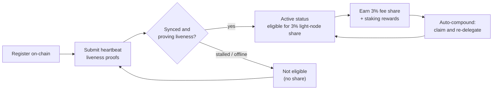

# 보상 및 모니터링

라이트 노드는 **보상을 얻는** 동시에, 보상을 계속 얻기 위해 **건강한 상태를 유지해야** 합니다. 이 페이지에서는 3% 라이트 노드 보상 분배분, 위임 스테이킹과 자동 복리가 어떻게 동작하는지, 그리고 노드를 모니터링하는 방법을 다룹니다.

## 3% 블록 보상 분배분

QoreChain의 수수료 분배는 네트워크 데이터를 제공하는 **라이트 노드에 고정 3% 분배분**을 예약합니다. 이는 프로토콜 보상 분할의 다섯 가지 목적지 중 하나로 — 검증자(37%), 소각(30%), 트레저리(20%), 스테이커(10%), 그리고 **라이트 노드(3%)** — 온체인에서 강제됩니다. 전체 내역은 [토크노믹스](/architecture/tokenomics)를 참고하세요.

이 분배분을 받을 자격을 갖추려면 노드가 **온체인에 등록되어 있고 하트비트 증명을 통해 라이브니스를 능동적으로 증명**하고 있어야 합니다. 등록은 되었지만 오프라인인 노드는 분배분을 받지 못합니다. 등록과 하트비트가 어떻게 동작하는지는 [등록 및 라이선싱](/light-node/registration-and-licensing)을 참고하세요.

*보상 자격: 온체인에 등록하고, 하트비트로 라이브니스를 증명해 활성 상태에 도달하며, 3% 분배분을 얻은 뒤, 이를 스테이크로 자동 복리합니다.*



## 보상이 동작하는 방식

라이트 노드 분배분 외에도, 노드는 위임된 스테이크와 그로부터 발생하는 스테이킹 보상을 관리합니다. 이 동작은 `config.toml`의 `[delegation]` 섹션에 의해 제어됩니다.

### 다중 검증자 분할을 통한 위임 스테이킹

스테이크를 하나에 집중하는 대신 **여러 검증자**에 걸쳐 위임할 수 있습니다. 노드는 각 위임과, 구성 가능한 **분할 가중치**를 사용하여 각 검증자에 할당된 스테이크 비중을 추적하므로, 검증자 집합 전반에 위험을 분산할 수 있습니다.

### 보상 자동 복리

노드는 구성 가능한 간격으로 **보상을 자동으로 청구하고 재위임**할 수 있습니다. 기본적으로 자동 복리는 `1h` 간격으로 활성화되며, 청구가 트리거되기 전에 누적되어야 하는 최소 보상 임계값(`uqor` 단위)이 있습니다. 복리는 수동 개입 없이 획득한 보상을 추가 스테이크로 전환합니다.

### 평판 인식 리밸런싱

리밸런싱이 활성화되면 노드는 구성 가능한 최소 평판 점수를 조건으로 **더 높은 평판의 검증자 쪽으로 위임을 자동으로 이동**할 수 있습니다. 이를 통해 성능이 저하된 검증자에 스테이크를 남겨두는 대신, 잘 수행하고 있는 검증자에서 스테이크가 계속 작동하도록 유지합니다.

### 보상 및 위임 검사

SX 에디션은 이 상태를 검사하는 명령을 제공합니다:

```bash
lightnode-sx delegation   # current delegations and their split
lightnode-sx rewards      # pending staking rewards (uqor)
lightnode-sx validators   # the bonded validator set
```

UX 에디션에서는 **Delegation** 뷰가 브라우저에서 동일한 위임 및 보상 정보를 보여줍니다.

## 모니터링

노드를 건강하게 유지하는 것이 보상 자격을 유지하는 방법입니다. 주시할 가치가 있는 세 가지가 있습니다.

### 텔레메트리

실시간 텔레메트리는 검증자, 컨센서스/네트워크, 브리지, 토크노믹스를 다루며, 각각 자체 간격으로 새로 고쳐집니다(`config.toml`의 `[telemetry]` 아래에서 구성). CLI에서:

```bash
lightnode-sx status    # node and light-client sync status
lightnode-sx network   # recent synced headers and latest height
```

UX 에디션은 **Overview**, **Network**, **Bridge**, **Tokenomics** 뷰 전반에서 동일한 데이터를 실시간으로 표시합니다 — [UX 에디션](/light-node/ux-edition)을 참고하세요.

### 동기화 및 하트비트 상태

`status` 명령은 체인 ID, 최신 블록 높이, 체인이 따라잡는 중인지 여부, 그리고 라이트 클라이언트의 동기화된 높이와 동기화 상태를 보고합니다. 등록되어 동기화되고 실행 중인 노드는 계속해서 **하트비트 라이브니스 증명**을 제출하여 보상 분배 자격을 유지합니다. 이러한 하트비트는 체인의 PQC 필수 기본값과 일관되게 **PQC 공동 서명 트랜잭션 파이프라인**(하이브리드 Dilithium-5 / ML-DSA-87)을 통해 생성됩니다 — 파이프라인이 어떻게 동작하는지와 온체인 하트비트를 활성화하는 방법은 [등록 및 라이선싱](/light-node/registration-and-licensing#pqc-cosigned-heartbeat-pipeline)을 참고하세요. `status`가 노드가 멈췄거나 동기화되지 않음을 표시하면, 라이브니스 증명에 실패하고 있을 수 있으므로 자격에 영향을 미치기 전에 조사하세요.

### 셀프 테스트 상태

암호화 스택에 문제가 있다고 의심되면 언제든지 PQC 셀프 테스트를 실행하세요:

```bash
lightnode-sx selftest
```

이는 keygen → sign → verify → 변조 탐지(다섯 가지 검사)를 실행하며, 어느 하나라도 실패하면 0이 아닌 값으로 종료합니다. 노드 문제를 진단할 때 손상되었거나 누락된 `libqorepqc` 라이브러리를 배제하는 가장 빠른 방법입니다. 전체 셀프 테스트 분석은 [SX 에디션](/light-node/sx-edition)을 참고하세요.

## 다음으로 갈 곳

- [등록 및 라이선싱](/light-node/registration-and-licensing) — 등록하고 라이브 상태를 유지하기.
- [토크노믹스](/architecture/tokenomics) — 전체 보상 및 소각 모델.
