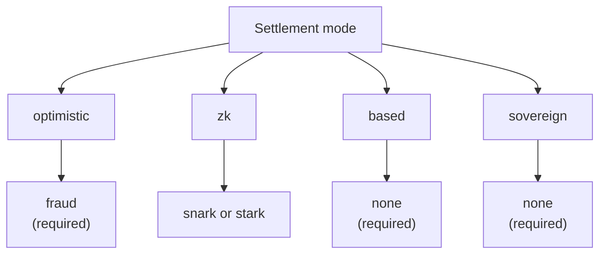

# 롤업 개요

QoreChain **롤업 개발 키트(RDK)** — `x/rdk` 모듈 — 는 개발자가 QoreChain에서 정산되는 애플리케이션별 롤업을 출시할 수 있게 해줍니다. 각 롤업은 자체 블록 시간, 가상 머신, 수수료 모델, 시퀀싱을 갖춘 독립적인 실행 환경이면서도, QoreChain의 보안, 포스트 양자 암호화, 데이터 가용성 보장을 상속받습니다.

:::caution
RDK와 롤업 정산 레이어는 활발히 발전 중인 기능입니다. 이 섹션 전반에 설명된 정산 모드, 증명 시스템, 프리셋, 기능별 성숙도는 변경될 수 있는 설계 의도로 간주하고, 메인넷(**`qorechain-vladi`**, EVM 체인 ID **9801**, 체인 버전 **v3.1.82**)을 대상으로 하기 전에 **`qorechain-diana`** 테스트넷에서 모든 배포를 검증하세요.
:::

저수준 모듈 레퍼런스 — 모듈 파라미터, 라이프사이클 내부 구조, 번 통합, 멀티레이어 앵커링 — 는 아키텍처 섹션의 **[롤업 개발 키트](/architecture/rollup-development-kit)** 페이지를 참고하세요. 이 롤업 섹션은 개발자 대상의 사용 안내서입니다: RDK가 무엇인지, 어떤 패러다임을 선택할지, 어떻게 배포할지, 데이터 가용성이 어떻게 작동하는지, 출금이 L2에서 L1로 어떻게 정산되는지를 다룹니다.

---

## RDK가 제공하는 것

RDK를 통해 생성된 롤업은 네 가지 구성 가능한 관심사를 묶습니다:

| 관심사 | 제어 대상 | 옵션 |
| ------- | ---------------- | ------- |
| **정산 모드** | 롤업의 상태 전이가 QoreChain에서 어떻게 검증되고 최종 확정되는지 | `optimistic`, `zk`, `based`, `sovereign` |
| **증명 시스템** | 정산을 뒷받침하는 암호학적 또는 경제적 메커니즘 | `fraud`, `snark`, `stark`, `none` |
| **시퀀서 모드** | 트랜잭션이 정산되기 전에 누가 순서를 매기는지 | `dedicated`, `shared`, `based` |
| **데이터 가용성** | 누구나 상태를 재구성할 수 있도록 트랜잭션 데이터가 어디에 게시되는지 | `native`, `celestia`, `both` |

각 롤업은 고유한 `rollup-id`로 등록되고, QOR로 된 스테이크 본드로 뒷받침되며, 라이프사이클 상태(`pending`, `active`, `paused`, `stopped`)가 할당됩니다. 전체 생성 및 라이프사이클 흐름은 **[롤업 배포하기](/rollups/deploying-a-rollup)**를 참고하세요.

---

## QoreChain RDK가 다른 점

여느 롤업 키트의 기본 요소를 넘어서, QoreChain RDK는 QoreChain의 레이어 1에 의존하며 포스트 양자가 아니고 AI가 아닌 베이스 레이어 위에 구축된 어떤 키트도 제공할 수 없는 세 가지 기능을 노출합니다 — 여기에 워치타워 자동 챌린저가 더해집니다. RDK는 다섯 가지 언어(TypeScript, Python, Go, Rust, Java)로 제공되며, 모두 현재 **v0.4.0** 버전입니다.

| 차별화 요소 | 기능 |
| -------------- | ------------ |
| **[양자 안전 정산 영수증](/rollups/settlement-receipts)** | 정산 앵커를 포스트 양자(ML-DSA-87 / Dilithium-5) 서명 하에서 **완전 오프라인**으로 검증 가능한 휴대 가능한 영수증으로 전환 — 다섯 개 클라이언트 전반에서 바이트 단위로 동일. |
| **[QCAI 롤업 코파일럿](/rollups/qcai-copilot)** | QoreChain의 온체인 AI/RL 서비스(수수료 정책 에이전트, 추천, 사기 조사, 서킷 브레이커)를 하나의 롤업에 대한 읽기 전용, 평이한 언어의 자문으로 집계. |
| **[멀티 VM 크로스 VM 호출](/rollups/multi-vm)** | 크로스 VM 프리컴파일(`0x…0901`)을 통해 EVM/Solidity 롤업 컨트랙트에서 CosmWasm 컨트랙트를 호출. |
| **[워치타워](/rollups/watchtower)** | 새 배치와 챌린지 윈도우 마감 기한을 드러내고 유효성 술어에 대해 유효하지 않은 배치에 챌린지하는, 옵티미스틱 롤업용 자동 챌린저 프레임워크. |

전체 근거와 코드 샘플은 **[QoreChain RDK를 선택하는 이유](/rollups/why)**를 참고하세요.

---

## 네 가지 정산 패러다임

QoreChain RDK는 각기 다른 신뢰 가정, 최종성 특성, 증명 요구사항을 갖는 네 가지 별개의 정산 모드를 지원합니다. 정산 모드와 증명 시스템의 조합은 온체인에서 검증됩니다 — 호환되지 않는 조합은 생성 시 거부됩니다. 아래 다이어그램은 각 정산 모드를 유효한 증명 시스템에 매핑합니다.

### Optimistic

옵티미스틱 롤업은 제출된 배치가 기본적으로 유효하다고 가정하며 분쟁 해결을 위해 **사기 증명(fraud proof)**에 의존합니다.

* **증명 시스템**: `fraud` — 인터랙티브 사기 증명
* **시퀀서**: `dedicated` 또는 `shared`
* **최종성**: 구성 가능한 챌린지 윈도우가 성공적인 챌린지 없이 만료될 때까지 지연됨
* **분쟁**: 누구나 윈도우 내에 제출된 배치에 대해 사기 증명 챌린지를 제출할 수 있으며, 챌린지가 성공하면 해당 배치가 거부됨

### ZK (영지식)

ZK 롤업은 재실행 없이 상태 전이의 정확성을 증명하는 암호학적 유효성 증명을 각 배치에 첨부합니다.

* **증명 시스템**: `snark` (간결 증명) 또는 `stark` (투명 증명, 신뢰 설정 불필요)
* **시퀀서**: `dedicated` 또는 `shared`
* **최종성**: 유효한 증명 검증 시 — 챌린지 윈도우 불필요
* **성숙도**: ZK 및 STARK 검증은 아직 성숙 단계에 있습니다. ZK 정산은 아직 프로덕션 수준으로 강화되지 않은 것으로 간주하고 테스트넷에서 검증하세요. 자세한 내용은 **[ZK / STARK 및 출금](/rollups/zk-stark-withdrawals)**을 참고하세요.

### Based

Based 롤업은 트랜잭션 시퀀싱을 QoreChain (L1) 제안자에게 위임하여, 호스트 체인의 라이브니스와 검열 저항성을 상속받습니다.

* **증명 시스템**: `none` — L1 제안자가 순서 진실의 출처
* **시퀀서**: `based` (필수 — 온체인 검증에 의해 강제됨)
* **최종성**: 호스트 체인 확정을 따름
* **트레이드오프**: QoreChain 검증자가 시퀀싱을 처리하므로 가장 단순한 운영 모델이지만, 전용 시퀀서의 지연 시간 제어를 포기하는 비용이 따름

### Sovereign

Sovereign 롤업은 자체 합의를 실행하고 스스로 시퀀싱합니다. 검증 가능성을 위해 QoreChain에 상태를 앵커링하지만 최종성에 대해서는 호스트 체인에 의존하지 않습니다.

* **증명 시스템**: `none`
* **시퀀서**: 롤업이 자체 관리
* **최종성**: 독립적 — 롤업 자체 합의에 의해 결정됨
* **상태 앵커링**: 투명성을 위해 상태 루트가 QoreChain에 게시되지만, 호스트 체인이 이를 강제하지는 않음

---

## 증명 시스템 호환성

정산 모드는 어떤 증명 시스템이 유효한지를 제약합니다. 이러한 조합은 롤업이 생성될 때 강제됩니다.

| 정산 모드 | `fraud` | `snark` | `stark` | `none` |
| --------------- | :-----: | :-----: | :-----: | :----: |
| **optimistic**  | 필수 | — | — | — |
| **zk**          | — | 지원 | 지원 | — |
| **based**       | — | — | — | 필수 |
| **sovereign**   | — | — | — | 필수 |

---

## 시퀀서 모드

시퀀서는 정산 전에 롤업 블록 내에서 누가 트랜잭션의 순서를 매기는지를 결정합니다.

| 모드 | 시퀀싱 주체 | 비고 |
| ---- | ------------- | ----- |
| **`dedicated`** | 단일 지정 운영자 주소 | 가장 낮은 지연 시간; 라이브니스와 공정한 순서 매김에 대해 운영자에 대한 신뢰가 필요 |
| **`shared`** | 공유 시퀀서 집합 | 순서 매김이 집합 전반에 분산됨; 약간 더 높은 조정 오버헤드 |
| **`based`** | QoreChain L1 제안자 | 호스트 체인 검증자 보안과 검열 저항성을 상속; `based` 정산에 필수 |

---

## 패러다임 선택하기

| 원하는 것이... | 고려할 것 |
| -------------- | -------- |
| QoreChain 검증자가 시퀀싱하는 가장 단순한 운영 설정 | **based** |
| 암호학적 보장이 있는 빠른 최종성 (성숙 중) | **zk** (`snark` / `stark`) |
| 경제적 분쟁 해결을 갖춘 잘 이해된 모델 | **optimistic** (`fraud`) |
| 검증 가능성을 위해 앵커링된, 자체 합의를 갖춘 완전한 독립성 | **sovereign** |

어디서 시작할지 확신이 서지 않나요? RDK는 일반적인 애플리케이션 카테고리를 위해 이러한 선택지를 묶은 **프리셋 프로필**을 제공하며 — **[프리셋 프로필](/rollups/preset-profiles)**을 참고하세요 — 사용 사례에 대한 평이한 언어 설명으로부터 하나를 추천하는 `suggest-profile` 쿼리도 제공합니다.

개발자를 위해, RDK는 동일한 온체인 모듈을 코드에서 구동하는 공개 TypeScript SDK **`@qorechain/rdk`**와 **`create-qorechain-rollup`** 스캐폴더로도 제공됩니다 — **[롤업 배포하기](/rollups/deploying-a-rollup#deploy-with-the-typescript-rdk-qorechainrdk)**를 참고하세요.

## 관련 문서

* [롤업 배포하기](/rollups/deploying-a-rollup) — CLI 또는 TypeScript RDK에서 롤업을 출시.
* [프리셋 프로필](/rollups/preset-profiles) — 일반적인 애플리케이션 카테고리를 위한 원클릭 번들.
* [데이터 가용성](/rollups/data-availability) — 네이티브 DA 라우터와 블롭 스토리지.
* [ZK / STARK 출금](/rollups/zk-stark-withdrawals) — 증명 기반 출금 흐름.
