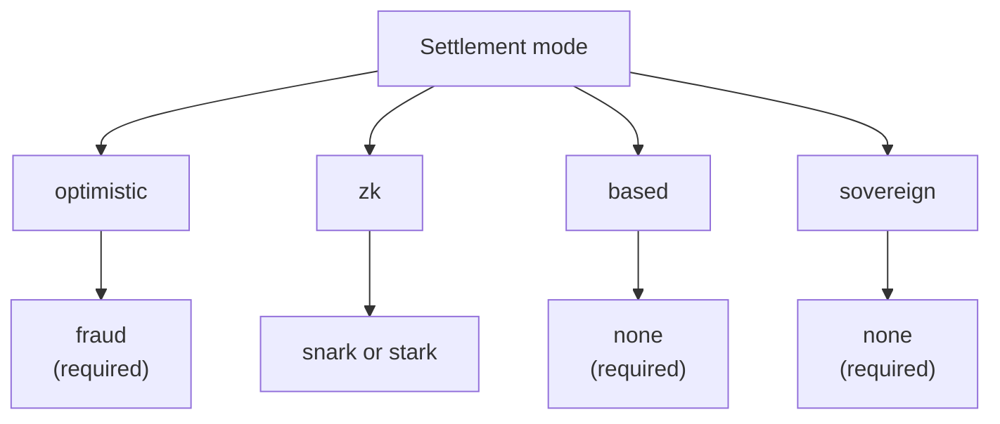

# 롤업 개요

QoreChain **Rollup Development Kit (RDK)** — 즉 `x/rdk` 모듈 — 을 사용하면 개발자가 QoreChain에 정산(settle)되는 애플리케이션 특화 롤업을 출시할 수 있습니다. 각 롤업은 자체 블록 타임, 가상 머신, 수수료 모델, 시퀀싱을 갖춘 독립적인 실행 환경이면서, QoreChain의 보안, 포스트 양자 암호화, 데이터 가용성 보장을 그대로 상속받습니다.

:::caution
RDK와 롤업 정산 레이어는 현재 활발히 진화 중인 기능입니다. 이 섹션 전반에서 설명하는 정산 모드, 증명 시스템, 프리셋, 기능별 성숙도는 변경될 수 있는 설계 의도로 간주하고, 메인넷(**`qorechain-vladi`**, EVM 체인 ID **9801**, 체인 버전 **v3.1.85**)을 대상으로 하기 전에 반드시 **`qorechain-diana`** 테스트넷에서 배포를 검증하세요.
:::

하위 수준의 모듈 레퍼런스 — 모듈 파라미터, 라이프사이클 내부 구조, 소각(burn) 통합, 멀티레이어 앵커링 — 는 Architecture 섹션의 **[Rollup Development Kit](/architecture/rollup-development-kit)** 페이지를 참조하세요. 이 Rollups 섹션은 개발자를 위한 실전 가이드입니다: RDK가 무엇인지, 어떤 패러다임을 선택해야 하는지, 어떻게 배포하는지, 데이터 가용성이 어떻게 동작하는지, 그리고 출금이 L2에서 L1로 어떻게 정산되는지를 다룹니다.

---

## RDK가 제공하는 것

RDK를 통해 생성된 롤업은 네 가지 구성 가능한 요소를 하나로 묶습니다:

| 요소 | 제어 대상 | 옵션 |
| ------- | ---------------- | ------- |
| **정산 모드** | 롤업의 상태 전이가 QoreChain에서 검증되고 최종 확정되는 방식 | `optimistic`, `zk`, `based`, `sovereign` |
| **증명 시스템** | 정산을 뒷받침하는 암호학적 또는 경제적 메커니즘 | `fraud`, `snark`, `stark`, `none` |
| **시퀀서 모드** | 정산 전에 트랜잭션 순서를 정하는 주체 | `dedicated`, `shared`, `based` |
| **데이터 가용성** | 누구나 상태를 재구성할 수 있도록 트랜잭션 데이터가 게시되는 위치 | `native`, `celestia`, `both` |

각 롤업은 고유한 `rollup-id`로 등록되고, QOR 스테이크 본드로 담보되며, 라이프사이클 상태(`pending`, `active`, `paused`, `stopped`)가 할당됩니다. 전체 생성 및 라이프사이클 흐름은 **[Deploying a Rollup](/rollups/deploying-a-rollup)** 을 참조하세요.

---

## QoreChain RDK만의 차별점

여느 롤업 키트가 갖춘 기본기를 넘어, QoreChain RDK는 QoreChain의 Layer 1에 의존하며 포스트 양자·AI 기반이 아닌 베이스 레이어 위에 만들어진 어떤 키트도 제공할 수 없는 세 가지 기능을 제공하고, 여기에 워치타워(watchtower) 자동 챌린저가 더해집니다. RDK는 5개 언어(TypeScript, Python, Go, Rust, Java)로 제공되며, npm, PyPI, Maven Central에서 **v0.4.4**로 버전이 정렬되어 있습니다(crates.io에서는 최신 게시 릴리스를 설치하거나 저장소에서 빌드하세요). v0.4.2부터 `mainnet` 및 `testnet` 프리셋에 공개 `qore.host` 엔드포인트가 기본 내장되어 있어, `createRdkClient({ network })` 호출만으로 수동 엔드포인트 설정 없이 체인에 접속할 수 있습니다.

| 차별화 요소 | 기능 |
| -------------- | ------------ |
| **[양자 안전 정산 영수증](/rollups/settlement-receipts)** | 정산 앵커를 포스트 양자(ML-DSA-87 / Dilithium-5) 서명 하에 **완전히 오프라인으로** 검증 가능한 휴대용 영수증으로 변환 — 5개 클라이언트 전체에서 바이트 단위로 동일합니다. |
| **[QCAI Rollup Copilot](/rollups/qcai-copilot)** | QoreChain의 온체인 AI/RL 서비스(수수료 정책 에이전트, 추천, 사기 조사, 서킷 브레이커)를 하나의 롤업에 대한 읽기 전용 자연어 자문으로 집약합니다. |
| **[멀티 VM 크로스 VM 호출](/rollups/multi-vm)** | 크로스 VM 프리컴파일(`0x…0901`)을 통해 EVM/Solidity 롤업 컨트랙트에서 CosmWasm 컨트랙트를 호출합니다. |
| **[Watchtower](/rollups/watchtower)** | 옵티미스틱 롤업을 위한 자동 챌린저 프레임워크로, 새 배치와 챌린지 윈도우 마감 시한을 표시하고 사용자의 유효성 조건(validity predicate)에 어긋나는 무효 배치에 챌린지를 제기합니다. |

전체 배경 설명과 코드 샘플은 **[Why QoreChain RDK](/rollups/why)** 를 참조하세요.

---

## 네 가지 정산 패러다임

QoreChain RDK는 서로 다른 신뢰 가정, 최종성(finality) 특성, 증명 요구 사항을 갖는 네 가지 정산 모드를 지원합니다. 정산 모드와 증명 시스템의 조합은 온체인에서 검증되며 — 호환되지 않는 조합은 생성 시점에 거부됩니다. 아래 다이어그램은 각 정산 모드를 유효한 증명 시스템에 매핑한 것입니다.

```mermaid
flowchart TD
    S["Settlement mode"]
    S --> O["optimistic"]
    S --> Z["zk"]
    S --> BA["based"]
    S --> SV["sovereign"]
    O --> OF["fraud<br/>(required)"]
    Z --> ZS["snark or stark"]
    BA --> BN["none<br/>(required)"]
    SV --> SN["none<br/>(required)"]
```

### Optimistic

옵티미스틱 롤업은 제출된 배치를 기본적으로 유효한 것으로 가정하고, 분쟁 해결을 위해 **사기 증명(fraud proof)** 에 의존합니다.

* **증명 시스템**: `fraud` — 상호작용형 사기 증명
* **시퀀서**: `dedicated` 또는 `shared`
* **최종성**: 설정 가능한 챌린지 윈도우가 성공적인 챌린지 없이 만료될 때까지 지연됨
* **분쟁**: 누구든지 윈도우 내에 제출된 배치에 대해 사기 증명 챌린지를 제출할 수 있으며, 챌린지가 성공하면 해당 배치는 거부됩니다

### ZK (Zero-Knowledge)

ZK 롤업은 각 배치에 암호학적 유효성 증명을 첨부하여, 재실행 없이 상태 전이의 정확성을 증명합니다.

* **증명 시스템**: `snark`(간결한 증명) 또는 `stark`(투명한 증명, 신뢰 설정 불필요)
* **시퀀서**: `dedicated` 또는 `shared`
* **최종성**: 유효한 증명 검증 시점 — 챌린지 윈도우 불필요
* **성숙도**: ZK 및 STARK 검증은 아직 성숙 단계에 있습니다. ZK 정산은 아직 프로덕션 수준으로 검증되지 않은 것으로 간주하고 테스트넷에서 검증하세요. 자세한 내용은 **[ZK / STARK & Withdrawals](/rollups/zk-stark-withdrawals)** 를 참조하세요.

### Based

베이스드(based) 롤업은 트랜잭션 시퀀싱을 QoreChain(L1) 제안자(proposer)에게 위임하여, 호스트 체인의 라이브니스와 검열 저항성을 그대로 상속받습니다.

* **증명 시스템**: `none` — L1 제안자가 순서의 유일한 진실 공급원
* **시퀀서**: `based`(필수 — 온체인 검증으로 강제됨)
* **최종성**: 호스트 체인 컨펌을 따름
* **트레이드오프**: QoreChain 밸리데이터가 시퀀싱을 담당하므로 운영 모델이 가장 단순하지만, 전용 시퀀서의 지연 시간 제어는 포기하게 됩니다

### Sovereign

소버린(sovereign) 롤업은 자체 합의를 운영하며 스스로 시퀀싱합니다. 검증 가능성을 위해 상태를 QoreChain에 앵커링하지만, 최종성은 호스트 체인에 의존하지 않습니다.

* **증명 시스템**: `none`
* **시퀀서**: 롤업이 자체 관리
* **최종성**: 독립적 — 롤업 자체 합의에 의해 결정
* **상태 앵커링**: 투명성을 위해 상태 루트를 QoreChain에 게시하지만, 호스트 체인이 이를 강제하지는 않습니다

---

## 증명 시스템 호환성

정산 모드는 유효한 증명 시스템의 범위를 제약합니다. 이 조합은 롤업 생성 시점에 강제됩니다.

| 정산 모드 | `fraud` | `snark` | `stark` | `none` |
| --------------- | :-----: | :-----: | :-----: | :----: |
| **optimistic**  | 필수 | — | — | — |
| **zk**          | — | 지원 | 지원 | — |
| **based**       | — | — | — | 필수 |
| **sovereign**   | — | — | — | 필수 |

---

## 시퀀서 모드

시퀀서는 정산 전에 롤업 블록 내에서 트랜잭션 순서를 정하는 주체를 결정합니다.

| 모드 | 시퀀싱 주체 | 비고 |
| ---- | ------------- | ----- |
| **`dedicated`** | 단일 지정 운영자 주소 | 지연 시간이 가장 낮음; 라이브니스와 공정한 순서 결정에 대해 운영자에 대한 신뢰가 필요 |
| **`shared`** | 공유 시퀀서 집합 | 순서 결정이 집합 전체에 분산됨; 조정 오버헤드가 약간 더 높음 |
| **`based`** | QoreChain L1 제안자 | 호스트 체인 밸리데이터의 보안과 검열 저항성을 상속; `based` 정산에는 필수 |

---

## 패러다임 선택하기

| 원하는 것이... | 고려할 모드 |
| -------------- | -------- |
| QoreChain 밸리데이터가 시퀀싱하는 가장 단순한 운영 구성 | **based** |
| 암호학적 보장을 갖춘 빠른 최종성(성숙 단계) | **zk** (`snark` / `stark`) |
| 경제적 분쟁 해결을 갖춘 검증된 모델 | **optimistic** (`fraud`) |
| 자체 합의를 갖춘 완전한 독립성, 검증 가능성을 위한 앵커링 | **sovereign** |

어디서 시작해야 할지 모르겠다면? RDK는 일반적인 애플리케이션 범주에 맞춰 이러한 선택지를 묶어 놓은 **프리셋 프로필**을 제공하며 — **[Preset Profiles](/rollups/preset-profiles)** 참조 — 사용 사례를 자연어로 설명하면 하나를 추천해 주는 `suggest-profile` 쿼리도 제공합니다.

개발자를 위해 RDK는 공개 TypeScript SDK **`@qorechain/rdk`** 와 **`create-qorechain-rollup`** 스캐폴더로도 제공되며, 이들은 동일한 온체인 모듈을 코드에서 구동합니다 — **[Deploying a Rollup](/rollups/deploying-a-rollup#deploy-with-the-typescript-rdk-qorechainrdk)** 을 참조하세요.

## 관련 문서

* [Deploying a Rollup](/rollups/deploying-a-rollup) — CLI 또는 TypeScript RDK로 롤업을 출시합니다.
* [Preset Profiles](/rollups/preset-profiles) — 일반적인 애플리케이션 범주를 위한 원클릭 번들.
* [Data Availability](/rollups/data-availability) — 네이티브 DA 라우터와 블롭 스토리지.
* [ZK / STARK Withdrawals](/rollups/zk-stark-withdrawals) — 증명 기반 출금 흐름.
