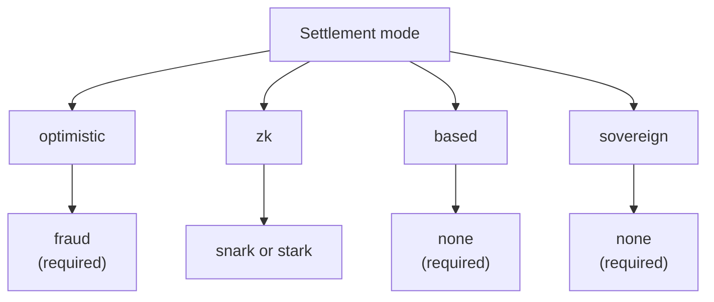

# 롤업 개요

QoreChain **롤업 개발 키트(Rollup Development Kit, RDK)** — `x/rdk` 모듈 — 를 사용하면 개발자는 QoreChain에 정산되는 애플리케이션 전용 롤업을 배포할 수 있습니다. 각 롤업은 자체 블록 타임, 가상 머신, 수수료 모델, 시퀀싱을 갖춘 독립적인 실행 환경이면서, QoreChain의 보안, 포스트 퀀텀 암호화, 데이터 가용성 보증을 상속받습니다.

:::caution
RDK와 롤업 정산 계층은 현재도 활발히 발전 중인 기능입니다. 이 섹션 전반에서 설명하는 정산 모드, 증명 시스템, 프리셋, 기능별 성숙도는 변경될 수 있는 설계 의도로 간주하고, 메인넷(**`qorechain-vladi`**, EVM 체인 ID **9801**, 체인 버전 **v3.1.95**)을 대상으로 하기 전에 **`qorechain-diana`** 테스트넷에서 배포를 검증하세요.
:::

모듈 파라미터, 라이프사이클 내부 동작, 소각 통합, 다계층 앵커링 등 더 낮은 수준의 모듈 레퍼런스는 아키텍처 섹션의 **[롤업 개발 키트](/architecture/rollup-development-kit)** 페이지를 참고하세요. 이 롤업 섹션은 개발자용 실전 가이드로, RDK가 무엇인지, 어떤 패러다임을 선택해야 하는지, 어떻게 배포하는지, 데이터 가용성이 어떻게 동작하는지, L2에서 L1로의 출금이 어떻게 정산되는지를 다룹니다.

---

## RDK가 제공하는 것

RDK를 통해 생성된 롤업은 네 가지 설정 가능한 요소를 하나로 묶습니다.

| 요소 | 제어하는 것 | 옵션 |
| ------- | ---------------- | ------- |
| **정산 모드** | 롤업의 상태 전이가 QoreChain에서 어떻게 검증되고 확정되는지 | `optimistic`, `zk`, `based`, `sovereign` |
| **증명 시스템** | 정산을 뒷받침하는 암호학적 또는 경제적 메커니즘 | `fraud`, `snark`, `stark`, `none` |
| **시퀀서 모드** | 정산 전에 누가 트랜잭션 순서를 정하는지 | `dedicated`, `shared`, `based` |
| **데이터 가용성** | 누구나 상태를 재구성할 수 있도록 트랜잭션 데이터가 게시되는 위치 | `native`, `celestia`, `both` |

각 롤업은 고유한 `rollup-id`로 등록되며, QOR로 된 스테이크 본드로 담보되고, 라이프사이클 상태(`pending`, `active`, `paused`, `stopped`)가 부여됩니다. 생성 및 라이프사이클 전체 흐름은 **[롤업 배포하기](/rollups/deploying-a-rollup)**를 참고하세요.

---

## QoreChain RDK를 다르게 만드는 것

모든 롤업 키트가 갖춘 기본 기능을 넘어, QoreChain RDK는 QoreChain의 레이어 1에 의존하며 포스트 퀀텀이 아니거나 AI 기반이 아닌 베이스 레이어 위에 구축된 어떤 키트도 제공할 수 없는 세 가지 기능, 그리고 워치타워 자동 챌린저를 제공합니다. RDK는 5개 언어(TypeScript, Python, Go, Rust, Java)로 제공되며, npm, PyPI, Maven Central에서 **v0.4.4**로 버전이 일치되어 있습니다(crates.io에서는 최신 배포 릴리스를 설치하거나 저장소에서 직접 빌드하세요). v0.4.2부터 `mainnet` 및 `testnet` 프리셋에는 공개 `qore.host` 엔드포인트가 기본 내장되어 있어, `createRdkClient({ network })`만으로 별도의 엔드포인트 설정 없이 체인에 연결할 수 있습니다.

| 차별점 | 기능 |
| -------------- | ------------ |
| **[퀀텀 세이프 정산 영수증](/rollups/settlement-receipts)** | 정산 앵커를 포스트 퀀텀(ML-DSA-87 / Dilithium-5) 서명으로 **완전히 오프라인 상태에서** 검증 가능한 이동 가능형 영수증으로 변환합니다 — 5개 클라이언트 모두에서 바이트 단위로 동일합니다. |
| **[QCAI 롤업 코파일럿](/rollups/qcai-copilot)** | QoreChain의 온체인 AI/RL 서비스(수수료 정책 에이전트, 추천, 사기 조사, 서킷 브레이커)를 하나의 롤업에 대한 읽기 전용, 평이한 언어 형태의 어드바이저리로 집계합니다. |
| **[멀티 VM 크로스 VM 호출](/rollups/multi-vm)** | 크로스 VM 프리컴파일(`0x…0901`)을 통해 EVM/Solidity 롤업 컨트랙트에서 CosmWasm 컨트랙트를 호출합니다. |
| **[워치타워](/rollups/watchtower)** | 옵티미스틱 롤업을 위한 자동 챌린저 프레임워크로, 새로운 배치와 챌린지 윈도우 마감을 표시하고 여러분의 유효성 술어(validity predicate)에 어긋나는 잘못된 배치에 챌린지를 겁니다. |

전체 근거와 코드 예제는 **[왜 QoreChain RDK인가](/rollups/why)**를 참고하세요.

---

## 네 가지 정산 패러다임

QoreChain RDK는 신뢰 가정, 확정성 특성, 증명 요구 사항이 각기 다른 네 가지 정산 모드를 지원합니다. 정산 모드와 증명 시스템의 조합은 온체인에서 검증되며, 호환되지 않는 조합은 생성 시점에 거부됩니다. 아래 다이어그램은 각 정산 모드를 유효한 증명 시스템에 매핑합니다.

```mermaid
flowchart TD
    S["Settlement mode"]
    S --> O["optimistic"]
    S --> Z["zk"]
    S --> BA["based"]
    S --> SV["sovereign"]
    O --> OF["fraud<br/>(required)"]
    Z --> ZS["snark or stark"]
    BA --> BN["none<br/>(required)"]
    SV --> SN["none<br/>(required)"]
```

### Optimistic

옵티미스틱 롤업은 제출된 배치가 기본적으로 유효하다고 가정하며, 분쟁 해결을 **사기 증명(fraud proofs)**에 의존합니다.

* **증명 시스템**: `fraud` — 인터랙티브 사기 증명
* **시퀀서**: `dedicated` 또는 `shared`
* **확정성**: 설정 가능한 챌린지 윈도우가 성공적인 챌린지 없이 만료될 때까지 지연됨
* **분쟁**: 누구나 윈도우 내에서 제출된 배치에 대해 사기 증명 챌린지를 제기할 수 있으며, 챌린지가 성공하면 해당 배치는 거부됨

### ZK (Zero-Knowledge)

ZK 롤업은 각 배치에 암호학적 유효성 증명을 첨부하여, 재실행 없이 상태 전이의 정확성을 증명합니다.

* **증명 시스템**: `snark`(축약 증명) 또는 `stark`(신뢰된 설정이 필요 없는 투명 증명)
* **시퀀서**: `dedicated` 또는 `shared`
* **확정성**: 유효한 증명 검증 시점 — 챌린지 윈도우 불필요
* **성숙도**: ZK 및 STARK 검증은 아직 발전 중입니다. ZK 정산은 아직 프로덕션 수준으로 검증되지 않은 것으로 간주하고 테스트넷에서 검증하세요. 자세한 내용은 **[ZK / STARK & 출금](/rollups/zk-stark-withdrawals)**을 참고하세요.

### Based

Based 롤업은 트랜잭션 시퀀싱을 QoreChain(L1) 프로포저에게 위임하여, 호스트 체인의 라이브니스와 검열 저항성을 상속받습니다.

* **증명 시스템**: `none` — L1 프로포저가 순서의 원천 진실(source of ordering truth)임
* **시퀀서**: `based`(필수 — 온체인 검증으로 강제됨)
* **확정성**: 호스트 체인의 확정을 따름
* **트레이드오프**: QoreChain 검증인이 시퀀싱을 처리하므로 운영 모델이 가장 단순하지만, 그 대가로 전용 시퀀서 수준의 지연 시간 제어권은 없음

### Sovereign

소버린 롤업은 자체 합의를 운영하며 스스로 시퀀싱합니다. 검증 가능성을 위해 QoreChain에 상태를 앵커링하지만, 확정성을 위해 호스트 체인에 의존하지는 않습니다.

* **증명 시스템**: `none`
* **시퀀서**: 롤업이 자체 관리
* **확정성**: 독립적 — 롤업 자체 합의로 결정됨
* **상태 앵커링**: 상태 루트는 투명성을 위해 QoreChain에 게시되지만, 호스트 체인은 이를 강제하지 않음

---

## 증명 시스템 호환성

정산 모드는 어떤 증명 시스템이 유효한지를 제약합니다. 다음 조합은 롤업 생성 시 강제됩니다.

| 정산 모드 | `fraud` | `snark` | `stark` | `none` |
| --------------- | :-----: | :-----: | :-----: | :----: |
| **optimistic**  | 필수 | — | — | — |
| **zk**          | — | 지원 | 지원 | — |
| **based**       | — | — | — | 필수 |
| **sovereign**   | — | — | — | 필수 |

---

## 시퀀서 모드

시퀀서는 정산 전에 롤업 블록 내 트랜잭션 순서를 누가 정할지를 결정합니다.

| 모드 | 누가 시퀀싱하는지 | 참고 |
| ---- | ------------- | ----- |
| **`dedicated`** | 지정된 단일 운영자 주소 | 지연 시간이 가장 낮음. 라이브니스와 공정한 순서를 위해 운영자에 대한 신뢰가 필요함 |
| **`shared`** | 공유 시퀀서 집합 | 순서 지정이 집합 전체에 분산되며, 조율 오버헤드가 약간 더 높음 |
| **`based`** | QoreChain L1 프로포저 | 호스트 체인 검증인 보안과 검열 저항성을 상속받음. `based` 정산에는 필수임 |

---

## 패러다임 선택하기

| 원하는 것이... | 고려할 것 |
| -------------- | -------- |
| QoreChain 검증인이 시퀀싱하는 가장 단순한 운영 구성 | **based** |
| 암호학적 보증을 갖춘 빠른 확정성(발전 중) | **zk** (`snark` / `stark`) |
| 경제적 분쟁 해결 방식을 갖춘 잘 알려진 모델 | **optimistic** (`fraud`) |
| 자체 합의를 통한 완전한 독립성, 검증 가능성을 위한 앵커링 | **sovereign** |

어디서부터 시작해야 할지 모르시나요? RDK는 일반적인 애플리케이션 카테고리에 대해 이러한 선택을 하나로 묶은 **프리셋 프로필**을 제공합니다 — **[프리셋 프로필](/rollups/preset-profiles)**을 참고하세요 — 그리고 여러분의 사용 사례를 평이한 언어로 설명하면 프로필을 추천해 주는 `suggest-profile` 쿼리도 제공합니다.

개발자를 위해 RDK는 공개 TypeScript SDK **`@qorechain/rdk`**와 **`create-qorechain-rollup`** 스캐폴더로도 제공되며, 둘 다 코드에서 동일한 온체인 모듈을 구동합니다 — **[롤업 배포하기](/rollups/deploying-a-rollup#deploy-with-the-typescript-rdk-qorechainrdk)**를 참고하세요.

## 관련 문서

* [롤업 배포하기](/rollups/deploying-a-rollup) — CLI 또는 TypeScript RDK로 롤업을 배포합니다.
* [프리셋 프로필](/rollups/preset-profiles) — 일반적인 애플리케이션 카테고리를 위한 원클릭 번들.
* [데이터 가용성](/rollups/data-availability) — 네이티브 DA 라우터와 블롭 스토리지.
* [ZK / STARK 출금](/rollups/zk-stark-withdrawals) — 증명 기반 출금 흐름.
