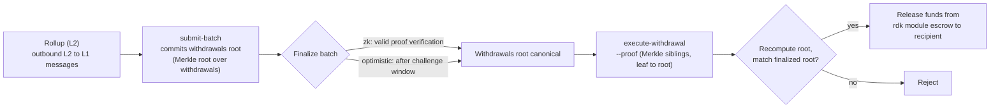

# ZK / STARK 및 출금

이 페이지는 서로 관련된 두 가지 주제를 다룹니다: ZK 정산 롤업이 사용하는 **ZK 증명 시스템**(`snark` 및 `stark`)과, 배치가 최종 확정되면 자금을 롤업에서 QoreChain으로 다시 옮기는 **L2 → L1 출금 흐름**입니다.

:::caution
ZK 및 STARK 검증은 RDK에서 활발히 성숙해 가는 부분입니다. 여기 설명된 증명 시스템과 출금 흐름은 설계 의도로 간주하고, **`qorechain-diana`** 테스트넷에서 검증하며, 메인넷에서 아직 프로덕션 수준으로 강화된 암호학적 보장을 가정하지 마세요.
:::

---

## ZK 증명 시스템

ZK 정산 롤업(`zk` 정산 모드)은 각 정산 배치에 유효성 증명을 첨부하여, 롤업의 트랜잭션을 재실행하지 않고도 상태 전이가 올바름을 증명합니다. ZK 정산은 두 가지 증명 시스템을 지원합니다:

| 증명 시스템 | 특성 |
| ------------ | --------------- |
| **`snark`** | 간결한 증명 |
| **`stark`** | 투명한 증명 — 신뢰된 설정 불필요 |

`zk` 정산 모드는 `snark` 또는 `stark` 중 하나를 요구합니다. 이 페어링은 롤업이 생성될 때 온체인에서 강제됩니다. 이와 대조적으로 `optimistic` 정산은 `fraud` 증명 시스템을 사용하고, `based` 및 `sovereign` 정산은 `none`을 사용합니다. 전체 호환성 매트릭스는 **[롤업 개요](/rollups/overview)**를 참조하세요.

### 최종성

옵티미스틱 롤업은 부정 증명 챌린지 윈도우가 끝날 때까지 기다리지만, ZK 배치는 분쟁 윈도우 없이 **유효한 증명 검증**으로 최종 확정될 수 있습니다. 이것이 ZK 정산의 핵심 트레이드오프입니다: 증명 생성의 비용과 복잡성을 대가로 더 강력하고 빠른 최종성을 얻습니다.

### 성숙도

ZK 및 STARK 증명 검증은 아직 성숙해 가는 중입니다. ZK 정산을 **아직 프로덕션 수준으로 강화되지 않은** 것으로 간주하세요: 테스트넷에서 프로토타입을 만들고 검증하며, 가치를 지닌 메인넷 롤업에 의존하기 전에 RDK의 릴리스 노트에서 전체 증명 검증의 상태를 추적하세요.

---

## 배치가 출금을 운반하는 방식

롤업이 배치를 정산할 때, 그 배치는 롤업의 아웃바운드 크로스 레이어 메시지 — 즉 **L2 → L1 출금** — 도 커밋할 수 있습니다. 개념적으로:

* 최종 확정된 배치는 자신의 출금 집합에 대한 커밋(배치의 출금 메시지에 대한 머클 루트)을 운반할 수 있습니다.
* 각 개별 출금은 그 루트 아래의 리프이며, 배치 인덱스와 출금 인덱스로 식별됩니다.
* 배치가 최종 확정되면, 누구든지 특정 출금 리프가 커밋된 루트 아래에 포함되어 있음을 증명하고 지급을 트리거할 수 있습니다.

이것이 출금이 정산에 의존하는 이유입니다: 출금은 **최종 확정된** 배치에 대해서만 실행될 수 있는데, 커밋된 출금 루트를 정규(canonical)로 만드는 것이 바로 최종 확정이기 때문입니다.

배치가 제출되고 최종 확정되는 방식 — `submit-batch`와 옵티미스틱 롤업을 위한 `challenge-batch` 분쟁 경로 포함 — 은 **[롤업 배포하기](/rollups/deploying-a-rollup)**를 참조하세요.

---

## 출금 실행하기: `execute-withdrawal`

`execute-withdrawal` 명령은 최종 확정된 배치의 출금 루트에 대해 L2 → L1 출금을 마무리합니다. 출금 리프가 그 루트에 커밋되어 있음을 증명하고 rdk 모듈 에스크로에서 수신자에게 지급합니다. 이 작업은 **권한 불필요(permissionless)** 입니다 — 누구든지 유효한 증명을 제출할 수 있습니다.

```bash
qorechaind tx rdk execute-withdrawal \
  [rollup-id] [batch-index] [withdrawal-index] [recipient] [denom] [amount] \
  --proof <sibling-hash-1>,<sibling-hash-2>,... \
  --from mykey \
  --chain-id qorechain-diana \
  --fees 500uqor
```

**위치 인자:**

| 인자 | 설명 |
| -------- | ----------- |
| `rollup-id` | 출금이 속한 롤업 |
| `batch-index` | 이 출금을 커밋하는 출금 루트를 가진, 최종 확정된 배치 |
| `withdrawal-index` | 그 배치 내 출금 리프의 인덱스 |
| `recipient` | 지급 대상 주소 |
| `denom` | 지급할 디노미네이션 |
| `amount` | 지급할 금액 |

**플래그:**

| 플래그 | 설명 |
| ---- | ----------- |
| `--proof` | 출금 리프가 배치의 출금 루트에 커밋되어 있음을 증명하는, 리프에서 루트 순서로 정렬된 쉼표 구분 16진수 머클 형제(sibling) 해시 |

`--proof` 값은 포함 증명입니다: 출금 리프에서 배치의 커밋된 출금 루트까지의 경로를 따라 있는 형제 해시들입니다. 모듈은 리프와 제공된 형제들로부터 루트를 재계산하고, 에스크로된 자금을 해제하기 전에 최종 확정된 배치의 커밋된 루트와 대조하여 확인합니다.

---

## 엔드 투 엔드 출금 흐름

*L2에서 L1로의 경로: 정산 배치가 출금 루트를 커밋하고, 배치가 최종 확정된 다음, 권한 불필요 포함 증명이 QoreChain에서 에스크로된 자금을 해제합니다.*



1. **배치 정산.** 롤업 운영자가 `submit-batch`로 정산 배치를 제출합니다. 배치는 자신의 아웃바운드 L2 → L1 메시지에 대한 출금 루트를 커밋할 수 있습니다.
2. **최종 확정.** 배치는 롤업의 정산 모드에 따라 최종 확정됩니다 — `zk`의 경우 유효한 증명 검증으로, `optimistic`의 경우 챌린지 윈도우 이후(이 기간 동안 `challenge-batch`가 이를 분쟁할 수 있음).
3. **증명 및 실행.** 최종 확정되면, 누구든지 특정 출금 리프에 대한 머클 포함 증명(`--proof`)과 함께 `execute-withdrawal`을 제출합니다. 모듈은 최종 확정된 배치의 출금 루트에 대해 포함을 검증하고 에스크로에서 수신자에게 지급합니다.

3단계가 권한 불필요이며 증명 기반이기 때문에, 출금을 운반하는 배치가 최종 확정되고 나면 출금은 롤업 운영자의 협력에 의존하지 않습니다.

---

## 관련 문서

* **[롤업 개요](/rollups/overview)** — 정산 패러다임과 증명 시스템 호환성 매트릭스.
* **[롤업 배포하기](/rollups/deploying-a-rollup)** — `submit-batch` 및 `challenge-batch` 운영자 명령.
* **[Rollup Development Kit](/architecture/rollup-development-kit)** — 하위 수준 모듈 레퍼런스.
