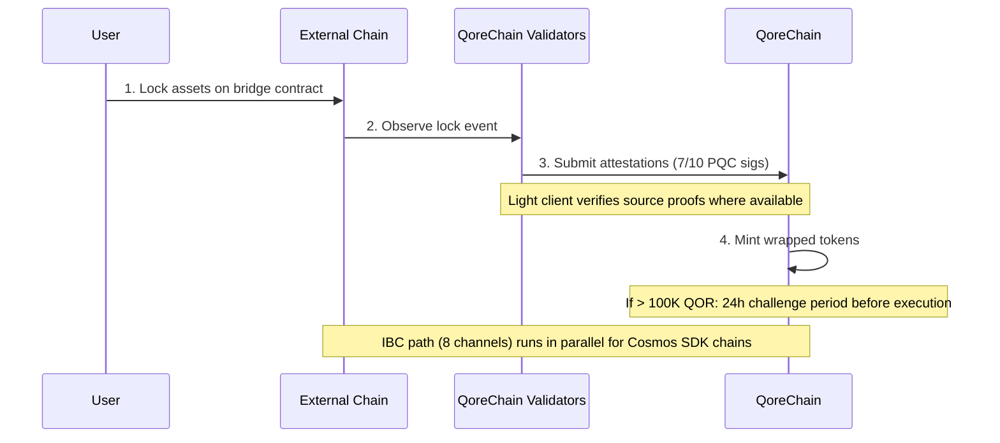

# Arhitectura punții

Modulul `x/bridge` este conceput să conecteze QoreChain la ecosistemul blockchain mai larg prin **37 de configurații de lanț QCB (QoreChain Bridge) și 8 canale IBC (Inter-Blockchain Communication)**. Fiecare operațiune de punte este securizată prin criptografie post-cuantică.

:::caution
Puntea cross-chain este **în prezent pe testnet și în așteptare — nu este încă un sistem de producție**. Configurațiile de lanț, light client-ii și fluxurile descrise mai jos reflectă puntea așa cum a fost proiectată și exersată pe testnet. Conectivitatea externă este lansată progresiv; tratați toate țintele ca intenție de proiectare, nu ca garanții live pe mainnet.
:::

## Prezentare generală a conexiunilor

QoreChain este conceput să suporte două protocoale de punte care operează în paralel:

| Protocol | Conexiuni          | Model de securitate                       | Caz de utilizare                                |
| -------- | -------------------- | ------------------------------------ | --------------------------------------- |
| **IBC**  | 8 canale           | IBC standard + semnături PQC pe pachete | Lanțuri compatibile Cosmos SDK            |
| **QCB**  | 37 de configurații de lanț     | Multisig Dilithium-5 7-din-10         | Lanțuri non-IBC (EVM, Solana, TON etc.) |

Cele **37 de configurații de lanț QCB** includ **36 de lanțuri externe** plus **QoreChain însuși** ca o configurație nativă/de buclă (loopback) (folosită pentru rutarea internă și decontarea auto-referențială). Cele 8 canale IBC se conectează la lanțuri compatibile Cosmos SDK.

## Canale IBC

QoreChain este conceput să mențină conexiuni IBC către următoarele 8 lanțuri, releate prin Hermes v1.x:

| Lanț      | Descriere                    |
| ---------- | ------------------------------ |
| Cosmos Hub | Conexiune principală de hub         |
| Osmosis    | Rutarea lichidității DEX          |
| Noble      | Emisiune nativă USDC            |
| Celestia   | Strat de disponibilitate a datelor        |
| Stride     | Staking lichid                 |
| Akash      | Calcul descentralizat          |
| Babylon    | Protocol de restaking BTC         |
| Injective  | Interoperabilitate DeFi / registru de ordine |

### Configurația releului IBC

* **Software de releu**: Hermes v1.x
* **Actualizări de client**: Reîmprospătare automată a light client-ului
* **Detectarea comportamentului necorespunzător**: Activată — releul monitorizează echivocarea
* **Curățarea pachetelor**: La fiecare 100 de blocuri, pachetele IBC în așteptare sunt curățate
* **Îmbunătățire PQC**: Fiecare pachet IBC originar din QoreChain include o semnătură opțională Dilithium-5 pentru securitate cuantică anticipată. Lanțurile receptoare conștiente de PQC pot verifica această semnătură alături de verificarea IBC standard.

## Protocolul QCB (QoreChain Bridge)

Protocolul QCB folosește o arhitectură hub-and-spoke securizată prin criptografie post-cuantică. QoreChain acționează ca hub, cu configurații spoke pentru fiecare lanț extern plus o configurație nativă/de buclă pentru QoreChain însuși.

### Configurații de lanțuri externe (36)

Protocolul QCB este conceput să țintească următoarele 36 de lanțuri externe. Combinate cu configurația nativă/de buclă proprie a QoreChain, aceasta dă **37 de configurații de lanț QCB în total (incluzând QoreChain însuși)**.

**Lanțuri de bază (10)**

Ethereum, Solana, TON, BSC, Avalanche, Polygon, Arbitrum, Optimism, Base, Sui.

**Lanțuri din familia EVM (14)**

zkSync Era, Linea, Scroll, Blast, Mantle, Hyperliquid, Berachain, Sonic, Sei, Monad, Plasma, Filecoin FVM, Cronos, Kaia.

**Lanțuri non-EVM (5)**

Starknet, XRP Ledger, Stellar, Hedera, Algorand.

**Lanțuri în așteptare (7)**

NEAR, Bitcoin, Cardano, Polkadot, Tezos, Tron, Aptos.

:::note
Verificarea numărului: 10 de bază + 14 din familia EVM + 5 non-EVM + 7 în așteptare = **36 de lanțuri externe**. Adăugarea configurației native/de buclă proprii a QoreChain dă **37 de configurații de lanț QCB**.
:::

### Formate de adresă

Protocolul QCB clasifică lanțurile după tip pentru a valida adresele de destinație:

| Tip de lanț   | Exemple de lanțuri                                                          | Format de adresă                                     |
| ------------ | ----------------------------------------------------------------------- | -------------------------------------------------- |
| `evm`        | Ethereum, BSC, Avalanche, Polygon, Arbitrum, Optimism, Base             | `0x` + 40 de caractere hexazecimale                           |
| `solana`     | Solana                                                                  | Base58, 32-44 de caractere                           |
| `ton`        | TON                                                                     | `EQ` + codificat base64                              |
| `sui_move`   | Sui                                                                     | `0x` + 64 de caractere hexazecimale                           |
| `aptos_move` | Aptos                                                                   | `0x` + 64 de caractere hexazecimale                           |
| `bitcoin`    | Bitcoin                                                                 | Bech32 (`bc1`), P2SH (`3...`) sau moștenit (`1...`)  |
| `near`       | NEAR Protocol                                                           | Sufix `.near` sau implicit                         |
| `cardano`    | Cardano                                                                 | `addr1` (plată) sau `stake1` (staking)            |
| `polkadot`   | Polkadot                                                                | Codificat SS58                                       |
| `tezos`      | Tezos                                                                   | `tz1`/`tz2`/`tz3` (implicit) sau `KT1` (originat) |
| `tron`       | TRON                                                                    | `T` + base58, 34 de caractere                       |

## Light client-i

Pentru a verifica evenimentele lanțurilor externe fără încredere, puntea este concepută să ruleze light client-i on-chain adaptați sistemului de consens și de probă al fiecărui lanț sursă. Acești light client-i permit QoreChain să valideze depuneri și retrageri fără a se baza exclusiv pe atestările validatorilor.

| Light client            | Lanț sursă        | Primitive de verificare                                              |
| ----------------------- | ------------------- | ------------------------------------------------------------------- |
| **Light client Ethereum** | Ethereum / EVM L1 | Verificare semnături BLS12-381, serializare SSZ, probe de stare MPT |
| **Bitcoin SPV**         | Bitcoin             | Simplified Payment Verification pe baza antetelor de bloc                |
| **Starknet STARK**      | Starknet            | Verificare probă STARK a tranzițiilor de stare Starknet              |
| **Sui BLS**             | Sui                 | Verificare semnătură agregată BLS a punctelor de control Sui             |
| **Wormhole / Solana VAA** | Solana (via Wormhole) | Verificare semnătură-gardian Verified Action Approval (VAA)     |

## Fluxul de depunere (extern către QoreChain)

Secvența de mai jos arată o depunere QCB: activele sunt blocate pe un lanț extern, validatorii QoreChain trimit atestări semnate PQC (7-din-10 Dilithium-5), iar token-urile învelite sunt emise (mint). Lanțurile compatibile Cosmos SDK folosesc în schimb calea paralelă IBC (8 canale, cu semnături opționale Dilithium-5 pe pachete). Ambele căi sunt pe testnet/în așteptare.



```
External Chain          QoreChain Validators           QoreChain
     |                         |                          |
     | 1. Lock assets on       |                          |
     |    bridge contract      |                          |
     |------------------------>|                          |
     |                         | 2. Observe & attest      |
     |                         |    (7/10 PQC sigs)       |
     |                         |------------------------->|
     |                         |                          | 3. Mint wrapped
     |                         |                          |    tokens
     |                         |                          |
     |                         |    [If > 100K QOR]       |
     |                         |    24h challenge period   |
     |                         |    before execution       |
```

1. **Blocare** — Utilizatorul blochează activele în contractul de punte pe lanțul extern.
2. **Atestare** — Validatorii punții observă tranzacția de blocare și trimit atestări semnate Dilithium-5. Este necesar un minim de **7 din 10** atestări de validatori. Acolo unde un light client este disponibil pentru lanțul sursă, evenimentul de blocare este suplimentar verificat pe baza propriilor probe ale lanțului.
3. **Emitere** — Odată ce pragul de atestare este atins, token-urile învelite sunt emise pe QoreChain.
4. **Perioadă de contestare** — Pentru transferuri ce depășesc echivalentul a 100.000 QOR, se aplică o **perioadă de contestare de 24 de ore** înainte de execuție. În această fereastră, validatorii pot semnala activitate suspectă.

## Fluxul de retragere (QoreChain către extern)

```
QoreChain               QoreChain Validators           External Chain
     |                         |                          |
     | 1. Burn wrapped tokens  |                          |
     |------------------------>|                          |
     |                         | 2. Attest burn           |
     |                         |    (7/10 PQC sigs)       |
     |                         |------------------------->|
     |                         |                          | 3. Unlock original
     |                         |                          |    assets
```

1. **Ardere** — Utilizatorul arde token-urile învelite pe QoreChain.
2. **Atestare** — Validatorii atestă evenimentul de ardere cu semnături Dilithium-5 (prag 7/10).
3. **Deblocare** — Odată ce pragul este atins, activele originale sunt deblocate pe lanțul extern.

Toate taxele de punte colectate în timpul retragerilor sunt direcționate către modulul `x/burn` prin canalul de ardere `bridge_fee` (100% din taxele de punte sunt arse).

### Fluxul de retragere L2 → L1 (decontare de rollup)

Puntea este de asemenea concepută să deconteze **retragerile de rollup (L2) înapoi către lanțul lor gazdă (L1)**. Rollup-urile implementate prin [Kit-ul de dezvoltare a rollup-urilor](/architecture/rollup-development-kit) își ancorează periodic starea la QoreChain; puntea consumă acele ancore finalizate pentru a autoriza retrageri de la rollup către lanțul gazdă:

1. Un utilizator inițiază o retragere pe rollup (L2), care este inclusă într-un lot de decontare.
2. Lotul este ancorat la QoreChain și dovedit/finalizat conform modului de decontare al rollup-ului (de exemplu, după expirarea ferestrei de contestare optimistă sau la verificarea unei probe valide).
3. Odată ce ancora este finalizată, retragerea devine revendicabilă, iar activele corespunzătoare sunt eliberate pe lanțul gazdă (L1) prin calea standard de ardere-și-atestare.

Acest lucru leagă finalitatea rollup-ului direct de garanțiile de decontare ale lanțului gazdă, astfel încât retragerile L2 să nu poată fi eliberate înainte ca starea L2 corespunzătoare să fie decontată ireversibil.

## Arhitectura de securitate

### Multisig PQC

Toate operațiunile de punte QCB necesită un **prag de 7-din-10** semnături post-cuantice Dilithium-5 de la validatori de punte înregistrați. Fiecare validator de punte se înregistrează cu:

* O adresă de validator QoreChain
* O cheie publică Dilithium-5 (2.592 de octeți)
* O listă de lanțuri suportate
* Un scor de reputație (menținut de `x/reputation`)

### Întrerupătoare de circuit

Fiecare lanț conectat are protecții independente de tip întrerupător de circuit:

| Protecție                | Descriere                                                                          |
| ------------------------- | ------------------------------------------------------------------------------------ |
| **Limită per transfer** | Suma maximă pentru orice operațiune individuală de punte per lanț                         |
| **Limită agregată zilnică** | Plafon de volum total per lanț per fereastră de 24 de ore                                        |
| **Suspendare manuală**          | Oprire de urgență per lanț, declanșată de guvernanță sau validator                           |
| **Detectarea anomaliilor**     | Suspendare automată dacă >50 de operațiuni într-o fereastră scurtă sau volumul depășește de 5x limita zilnică |

Starea întrerupătorului de circuit este urmărită per lanț și include: transfer unic maxim, limită zilnică, utilizare zilnică curentă, ultima înălțime de resetare și statusul de suspendare cu motiv.

### Perioadă de contestare

Pentru transferuri mari (>100.000 echivalent QOR, configurabil prin `large_transfer_threshold`):

* O **perioadă de contestare de 24 de ore** (86.400 de secunde) se aplică după atingerea pragului de atestare.
* În această fereastră, orice validator poate semnala operațiunea.
* Dacă nu este contestată, operațiunea se execută automat după expirarea perioadei.
* Operațiunile contestate sunt înghețate pentru revizuire de guvernanță.

### Optimizarea căii prin AI

Modulul de punte se integrează cu subsistemul AI pentru optimizarea rutelor. Pentru transferurile care pot traversa mai multe căi (de ex., lanțul A către lanțul B printr-un intermediar), optimizatorul de cale evaluează:

* Taxele estimate pe rute
* Timpul estimat de finalizare
* Scorul de securitate per cale
* Nivelul de încredere al estimării

## Endpoint-uri API REST

Începând cu versiunea de lanț **v3.1.77**, starea punții este de asemenea interogabilă **doar pentru citire prin REST** via grpc-gateway sub prefixul `/qorechain/bridge/v1/...` (`config`, `chains`, `chains/{chain_id}`, `validators`, `validators/{address}`, `operations`, `operations/{id}`) — anterior doar prin gRPC. Acestea servesc JSON on-chain real prin HTTP pentru exploratoare și telemetrie de noduri ușoare. Vedeți [Endpoint-uri REST / gRPC](/api-reference/rest-grpc-endpoints#bridge-module) pentru lista completă.

| Metodă | Endpoint                                           | Descriere                                      |
| ------ | -------------------------------------------------- | ------------------------------------------------ |
| GET    | `/bridge/v1/chains`                                | Listează toate configurațiile de lanț suportate          |
| GET    | `/bridge/v1/chains/{chain_id}`                     | Obține configurația pentru un lanț specific           |
| GET    | `/bridge/v1/validators`                            | Listează toți validatorii de punte înregistrați            |
| GET    | `/bridge/v1/operations`                            | Listează toate operațiunile de punte (cele mai recente primele)   |
| GET    | `/bridge/v1/operations/{operation_id}`             | Obține detaliile unei operațiuni specifice              |
| GET    | `/bridge/v1/locked/{chain}/{asset}`                | Obține sumele blocate/emise pentru o pereche lanț/activ |
| GET    | `/bridge/v1/circuit-breakers`                      | Listează toate stările întrerupătoarelor de circuit            |
| GET    | `/bridge/v1/estimate/{from}/{to}/{asset}/{amount}` | Obține estimarea de rută optimizată cu AI                  |

## Evenimente de punte

Modulul de punte emite următoarele evenimente on-chain:

| Tip de eveniment                    | Descriere                                     |
| ----------------------------- | ----------------------------------------------- |
| `bridge_deposit`              | Operațiune nouă de depunere creată                   |
| `bridge_withdraw`             | Operațiune nouă de retragere creată                |
| `bridge_attestation`          | Atestare de validator trimisă                 |
| `bridge_operation_executed`   | Operațiune finalizată și executată                |
| `bridge_circuit_breaker_trip` | Întrerupător de circuit activat sau dezactivat        |
| `bridge_validator_registered` | Validator de punte nou înregistrat                 |
| `bridge_pqc_verification`     | Rezultatul verificării semnăturii PQC (pachete IBC) |

## Conexe

* [Transferul de active prin punte](/user-guide/bridging-assets) — mutați active între lanțuri pas cu pas.
* [Puntea din Dashboard](/dashboard/bridge) — interfața punții pentru utilizatorii de zi cu zi.
* [Restaking BTC via Babylon](/architecture/btc-restaking-babylon) — securitate susținută de Bitcoin.
* [Securitate post-cuantică](/architecture/post-quantum-security) — verificare PQC pe pachetele IBC.
