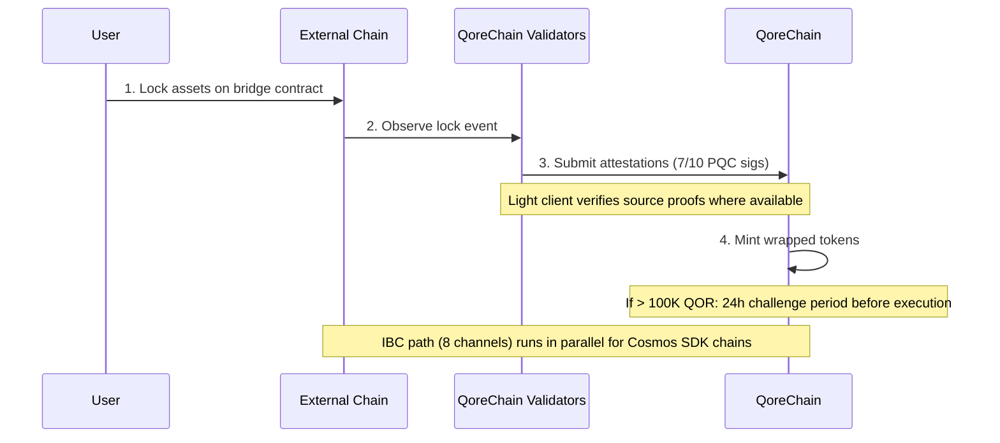

# Arhitectura podului

Modulul `x/bridge` este conceput pentru a conecta QoreChain la ecosistemul blockchain mai larg prin **37 de configurații de lanț QCB (QoreChain Bridge) și 8 canale IBC (Inter-Blockchain Communication)**. Fiecare operațiune a podului este securizată prin criptografie post-cuantică.

:::caution
Podul cross-chain este **în prezent pe testnet și în așteptare — nu este încă un sistem de producție**. Configurațiile de lanț, clienții light și fluxurile descrise mai jos reflectă podul așa cum a fost proiectat și exersat pe testnet. Conectivitatea externă este implementată progresiv; tratați toate țintele ca intenție de proiectare, nu ca garanții live pe mainnet.
:::

## Prezentare generală a conexiunilor

QoreChain este conceput să susțină două protocoale de pod care funcționează în paralel:

| Protocol | Conexiuni            | Model de securitate                  | Caz de utilizare                        |
| -------- | -------------------- | ------------------------------------ | --------------------------------------- |
| **IBC**  | 8 canale             | IBC standard + semnături PQC de pachet | Lanțuri compatibile Cosmos SDK         |
| **QCB**  | 37 configurații de lanț | Multisig Dilithium-5 7-din-10      | Lanțuri non-IBC (EVM, Solana, TON etc.) |

Cele **37 de configurații de lanț QCB** includ **36 de lanțuri externe** plus **QoreChain însuși** ca o configurație nativă/loopback (folosită pentru rutarea internă și decontarea autoreferențială). Cele 8 canale IBC se conectează la lanțuri compatibile Cosmos SDK.

## Canale IBC

QoreChain este conceput să mențină conexiuni IBC către următoarele 8 lanțuri, retransmise prin Hermes v1.x:

| Lanț       | Descriere                      |
| ---------- | ------------------------------ |
| Cosmos Hub | Conexiune principală de hub    |
| Osmosis    | Rutarea lichidității DEX        |
| Noble      | Emisiune nativă USDC           |
| Celestia   | Strat de disponibilitate a datelor |
| Stride     | Liquid staking                 |
| Akash      | Calcul descentralizat          |
| Babylon    | Protocol de restaking BTC      |
| Injective  | Interoperabilitate DeFi / orderbook |

### Configurația releului IBC

* **Software de releu**: Hermes v1.x
* **Actualizări de client**: Reîmprospătare automată a clientului light
* **Detectarea comportamentului necorespunzător**: Activată — releul monitorizează echivocația
* **Curățarea pachetelor**: La fiecare 100 de blocuri, pachetele IBC în așteptare sunt curățate
* **Îmbunătățire PQC**: Fiecare pachet IBC care provine din QoreChain include o semnătură Dilithium-5 opțională pentru securitate cuantică în viitor. Lanțurile receptoare care suportă PQC pot verifica această semnătură alături de verificarea IBC standard.

## Protocolul QCB (QoreChain Bridge)

Protocolul QCB folosește o arhitectură hub-and-spoke securizată prin criptografie post-cuantică. QoreChain acționează ca hub, cu configurații de tip spoke pentru fiecare lanț extern, plus o configurație nativă/loopback pentru QoreChain însuși.

### Configurații de lanțuri externe (36)

Protocolul QCB este conceput să țintească următoarele 36 de lanțuri externe. Combinat cu propria configurație nativă/loopback a QoreChain, aceasta rezultă în **37 de configurații de lanț QCB în total (inclusiv QoreChain însuși)**.

**Lanțuri de bază (10)**

Ethereum, Solana, TON, BSC, Avalanche, Polygon, Arbitrum, Optimism, Base, Sui.

**Lanțuri din familia EVM (14)**

zkSync Era, Linea, Scroll, Blast, Mantle, Hyperliquid, Berachain, Sonic, Sei, Monad, Plasma, Filecoin FVM, Cronos, Kaia.

**Lanțuri non-EVM (5)**

Starknet, XRP Ledger, Stellar, Hedera, Algorand.

**Lanțuri în așteptare (7)**

NEAR, Bitcoin, Cardano, Polkadot, Tezos, Tron, Aptos.

:::note
Verificare a numărului: 10 de bază + 14 din familia EVM + 5 non-EVM + 7 în așteptare = **36 de lanțuri externe**. Adăugând propria configurație nativă/loopback a QoreChain rezultă **37 de configurații de lanț QCB**.
:::

### Formate de adresă

Protocolul QCB clasifică lanțurile după tip pentru a valida adresele de destinație:

| Tip de lanț  | Lanțuri exemplu                                                         | Format de adresă                                   |
| ------------ | ----------------------------------------------------------------------- | -------------------------------------------------- |
| `evm`        | Ethereum, BSC, Avalanche, Polygon, Arbitrum, Optimism, Base             | `0x` + 40 de caractere hex                         |
| `solana`     | Solana                                                                  | Base58, 32-44 de caractere                         |
| `ton`        | TON                                                                     | `EQ` + codificat base64                            |
| `sui_move`   | Sui                                                                     | `0x` + 64 de caractere hex                         |
| `aptos_move` | Aptos                                                                   | `0x` + 64 de caractere hex                         |
| `bitcoin`    | Bitcoin                                                                 | Bech32 (`bc1`), P2SH (`3...`) sau legacy (`1...`)  |
| `near`       | NEAR Protocol                                                           | sufix `.near` sau implicit                         |
| `cardano`    | Cardano                                                                 | `addr1` (plată) sau `stake1` (staking)             |
| `polkadot`   | Polkadot                                                                | codificat SS58                                     |
| `tezos`      | Tezos                                                                   | `tz1`/`tz2`/`tz3` (implicit) sau `KT1` (originat)  |
| `tron`       | TRON                                                                    | `T` + base58, 34 de caractere                      |

## Clienți light

Pentru a verifica evenimentele de pe lanțurile externe fără încredere, podul este conceput să ruleze clienți light on-chain adaptați la sistemul de consens și de probe al fiecărui lanț sursă. Acești clienți light permit QoreChain să valideze depozitele și retragerile fără a se baza exclusiv pe atestările validatorilor.

| Client light            | Lanț sursă          | Primitive de verificare                                             |
| ----------------------- | ------------------- | ------------------------------------------------------------------- |
| **Client light Ethereum** | Ethereum / EVM L1 | Verificare de semnătură BLS12-381, serializare SSZ, probe de stare MPT |
| **Bitcoin SPV**         | Bitcoin             | Simplified Payment Verification față de antetele blocurilor         |
| **Starknet STARK**      | Starknet            | Verificare de probe STARK a tranzițiilor de stare Starknet         |
| **Sui BLS**             | Sui                 | Verificare de semnătură agregată BLS a checkpoint-urilor Sui       |
| **Wormhole / Solana VAA** | Solana (prin Wormhole) | Verificare de semnătură de gardian Verified Action Approval (VAA) |

## Fluxul de depozit (extern către QoreChain)

Secvența de mai jos prezintă un depozit QCB: activele sunt blocate pe un lanț extern, validatorii QoreChain trimit atestări semnate PQC (7-din-10 Dilithium-5), iar token-urile wrapped sunt emise. Lanțurile compatibile Cosmos SDK folosesc în schimb calea IBC paralelă (8 canale, cu semnături de pachet Dilithium-5 opționale). Ambele căi sunt pe testnet/în așteptare.



```
External Chain          QoreChain Validators           QoreChain
     |                         |                          |
     | 1. Lock assets on       |                          |
     |    bridge contract      |                          |
     |------------------------>|                          |
     |                         | 2. Observe & attest      |
     |                         |    (7/10 PQC sigs)       |
     |                         |------------------------->|
     |                         |                          | 3. Mint wrapped
     |                         |                          |    tokens
     |                         |                          |
     |                         |    [If > 100K QOR]       |
     |                         |    24h challenge period   |
     |                         |    before execution       |
```

1. **Blocare** — Utilizatorul blochează activele în contractul podului de pe lanțul extern.
2. **Atestare** — Validatorii podului observă tranzacția de blocare și trimit atestări semnate Dilithium-5. Este necesar un minim de **7 din 10** atestări de validator. Acolo unde un client light este disponibil pentru lanțul sursă, evenimentul de blocare este verificat suplimentar față de propriile probe ale lanțului.
3. **Emitere** — Odată ce pragul de atestare este atins, token-urile wrapped sunt emise pe QoreChain.
4. **Perioadă de contestare** — Pentru transferurile care depășesc echivalentul a 100.000 QOR, se aplică o **perioadă de contestare de 24 de ore** înainte de execuție. În acest interval, validatorii pot semnala activitate suspectă.

## Fluxul de retragere (QoreChain către extern)

```
QoreChain               QoreChain Validators           External Chain
     |                         |                          |
     | 1. Burn wrapped tokens  |                          |
     |------------------------>|                          |
     |                         | 2. Attest burn           |
     |                         |    (7/10 PQC sigs)       |
     |                         |------------------------->|
     |                         |                          | 3. Unlock original
     |                         |                          |    assets
```

1. **Ardere** — Utilizatorul arde token-urile wrapped pe QoreChain.
2. **Atestare** — Validatorii atestă evenimentul de ardere cu semnături Dilithium-5 (prag 7/10).
3. **Deblocare** — Odată ce pragul este atins, activele originale sunt deblocate pe lanțul extern.

Toate taxele de pod colectate în timpul retragerilor sunt direcționate către modulul `x/burn` prin canalul de ardere `bridge_fee` (100% din taxele de pod sunt arse).

### Fluxul de retragere L2 → L1 (decontarea rollup)

Podul este, de asemenea, conceput să deconteze **retragerile rollup (L2) înapoi către lanțul lor gazdă (L1)**. Rollup-urile implementate prin [Rollup Development Kit](/architecture/rollup-development-kit) își ancorează periodic starea în QoreChain; podul consumă acele ancore finalizate pentru a autoriza retragerile din rollup către lanțul gazdă:

1. Un utilizator inițiază o retragere pe rollup (L2), care este inclusă într-un batch de decontare.
2. Batch-ul este ancorat în QoreChain și dovedit/finalizat conform modului de decontare al rollup-ului (de exemplu, după expirarea ferestrei de contestare optimistă, sau la verificarea unei probe valide).
3. Odată ce ancora este finalizată, retragerea devine revendicabilă, iar activele corespunzătoare sunt eliberate pe lanțul gazdă (L1) prin calea standard de ardere-și-atestare.

Aceasta leagă finalitatea rollup-ului direct de garanțiile de decontare ale lanțului gazdă, astfel încât retragerile L2 să nu poată fi eliberate înainte ca starea L2 corespunzătoare să fie decontată ireversibil.

## Arhitectura de securitate

### Multisig PQC

Toate operațiunile podului QCB necesită un **prag de 7-din-10** semnături post-cuantice Dilithium-5 de la validatorii de pod înregistrați. Fiecare validator de pod se înregistrează cu:

* O adresă de validator QoreChain
* O cheie publică Dilithium-5 (2.592 de octeți)
* O listă de lanțuri suportate
* Un scor de reputație (menținut de `x/reputation`)

### Disjunctoare (circuit breakers)

Fiecare lanț conectat are protecții independente de tip disjunctor:

| Protecție                 | Descriere                                                                            |
| ------------------------- | ------------------------------------------------------------------------------------ |
| **Limita per transfer**   | Suma maximă pentru orice operațiune individuală de pod per lanț                      |
| **Limita zilnică agregată** | Plafon de volum total per lanț per fereastră de 24 de ore                          |
| **Pauză manuală**         | Oprire de urgență per lanț declanșată de guvernanță sau validator                    |
| **Detectarea anomaliilor** | Pauză automată dacă >50 de operațiuni într-o fereastră scurtă sau volumul depășește de 5x limita zilnică |

Starea disjunctorului este urmărită per lanț și include: transferul unic maxim, limita zilnică, utilizarea zilnică curentă, înălțimea ultimei resetări și starea de pauză cu motiv.

### Perioada de contestare

Pentru transferurile mari (>100.000 echivalent QOR, configurabil prin `large_transfer_threshold`):

* O **perioadă de contestare de 24 de ore** (86.400 de secunde) se aplică după ce pragul de atestare este atins.
* În acest interval, orice validator poate semnala operațiunea.
* Dacă nu este contestată, operațiunea se execută automat după expirarea perioadei.
* Operațiunile contestate sunt înghețate pentru revizuire de către guvernanță.

### Optimizarea traseelor prin AI

Modulul podului se integrează cu subsistemul AI pentru optimizarea rutelor. Pentru transferurile care pot traversa mai multe căi (de exemplu, lanțul A către lanțul B prin intermediul unui intermediar), optimizatorul de traseu evaluează:

* Taxele estimate pe rute
* Timpul estimat de finalizare
* Scorul de securitate per cale
* Nivelul de încredere al estimării

## Administrarea podului

### Activarea lanțurilor post-implementare (fără guvernanță)

Începând cu versiunea de lanț **v3.1.78**, un lanț de pod poate fi activat și reconfigurat după implementare cu o singură tranzacție semnată — fără propunere de guvernanță și fără upgrade de lanț. O cheie `bridge_admin` (setată în `BridgeConfig.BridgeAdmin` la genesis) sau un deținător al licenței `qcb_bridge` poate:

* **`tx bridge update-chain-config`** — setează adresa de contract, numărul de confirmări, arhitectura și statusul unui lanț (`MsgUpdateChainConfig`).
* **`tx bridge set-verifier-bootstrap`** — selectează verificatorul activ pentru un lanț și instalează rădăcina sa de încredere (`MsgSetVerifierBootstrap`).

Aceasta permite unui operator să aducă online podul unui lanț conectat — sau să-i rotească verificatorul — direct, cu autorizarea verificată față de cheia de administrator al podului.

### Validarea rețelelor conectate

Începând cu versiunea de lanț **v3.1.79**, un validator care deține licența `validator_<chain>` (sau `qcb_bridge`) corespunzătoare poate rula clientul rețelei externe pe același nod, provizionat automat sub orchestrarea QoreChain odată ce licența este activată. Driverele sunt livrate pentru toate cele 37 de rețele de pod, clasificate după modelul de participare (validator permissionless, plafonat/ales/admitere, full-node L2 și non-staking/listă de încredere). Stake-ul și cheile de semnare ale rețelei externe sunt furnizate de operator pentru fiecare rețea. Consultați [Rulează un validator](/developer-guide/running-a-validator#connected-networks) pentru pașii operatorului.

## Endpoint-uri REST API

Începând cu versiunea de lanț **v3.1.77**, starea podului poate fi, de asemenea, interogată **read-only prin REST** via grpc-gateway sub prefixul `/qorechain/bridge/v1/...` (`config`, `chains`, `chains/{chain_id}`, `validators`, `validators/{address}`, `operations`, `operations/{id}`) — anterior disponibilă doar prin gRPC. Acestea servesc JSON real on-chain prin HTTP pentru exploratoare și telemetrie de noduri light. Consultați [Endpoint-uri REST / gRPC](/api-reference/rest-grpc-endpoints#bridge-module) pentru lista completă.

| Metodă | Endpoint                                           | Descriere                                        |
| ------ | -------------------------------------------------- | ------------------------------------------------ |
| GET    | `/bridge/v1/chains`                                | Listează toate configurațiile de lanț suportate  |
| GET    | `/bridge/v1/chains/{chain_id}`                     | Obține configurația pentru un lanț specific      |
| GET    | `/bridge/v1/validators`                            | Listează toți validatorii de pod înregistrați    |
| GET    | `/bridge/v1/operations`                            | Listează toate operațiunile podului (cele mai recente întâi) |
| GET    | `/bridge/v1/operations/{operation_id}`             | Obține detaliile unei operațiuni specifice       |
| GET    | `/bridge/v1/locked/{chain}/{asset}`                | Obține sumele blocate/emise pentru o pereche lanț/activ |
| GET    | `/bridge/v1/circuit-breakers`                      | Listează toate stările disjunctoarelor           |
| GET    | `/bridge/v1/estimate/{from}/{to}/{asset}/{amount}` | Obține o estimare de rută optimizată prin AI     |

## Evenimente ale podului

Modulul podului emite următoarele evenimente on-chain:

| Tip de eveniment              | Descriere                                       |
| ----------------------------- | ----------------------------------------------- |
| `bridge_deposit`              | Operațiune de depozit nouă creată               |
| `bridge_withdraw`             | Operațiune de retragere nouă creată             |
| `bridge_attestation`          | Atestare de validator trimisă                   |
| `bridge_operation_executed`   | Operațiune finalizată și executată              |
| `bridge_circuit_breaker_trip` | Disjunctor activat sau dezactivat               |
| `bridge_validator_registered` | Validator de pod nou înregistrat                |
| `bridge_pqc_verification`     | Rezultatul verificării semnăturii PQC (pachete IBC) |

## Înrudite

* [Transferul activelor prin pod](/user-guide/bridging-assets) — mută activele între lanțuri pas cu pas.
* [Podul din Dashboard](/dashboard/bridge) — interfața podului pentru utilizatorii de zi cu zi.
* [Restaking BTC prin Babylon](/architecture/btc-restaking-babylon) — securitate susținută de Bitcoin.
* [Securitate post-cuantică](/architecture/post-quantum-security) — verificare PQC pe pachetele IBC.
