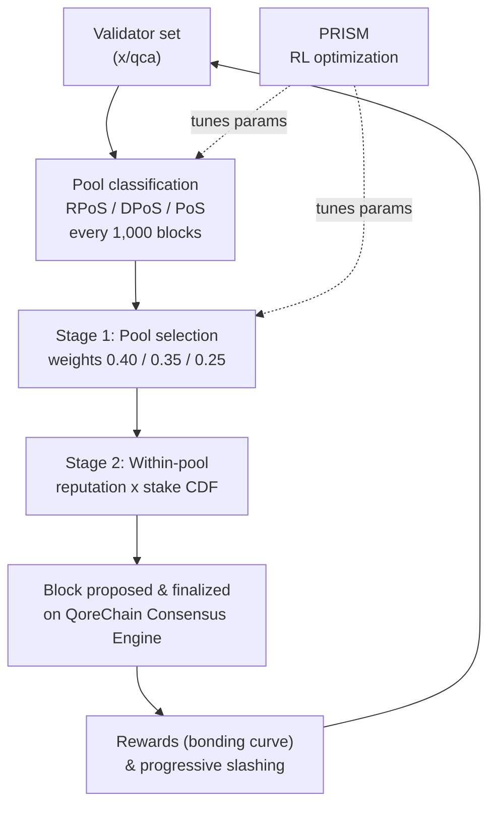

# Mecanismul de consens

QoreChain implementează **Triple-Pool Composite Proof-of-Stake (CPoS)**, un mecanism de consens care clasifică validatorii în trei grupuri specializate și folosește o selecție ponderată cu reputație pentru a echilibra securitatea, descentralizarea și performanța. CPoS este implementat în modulul `x/qca` și operează deasupra **QoreChain Consensus Engine**.

Stratul de optimizare prin învățare prin întărire care reglează parametrii de consens în timpul execuției poartă marca **PRISM** (Policy-driven Reinforcement-learning for Intelligent State Machines). Consultați [PRISM Consensus Engine](/architecture/prism-consensus-engine) pentru detalii.

Diagrama de mai jos rezumă un ciclu de bloc/consens al Triple-Pool CPoS pe QoreChain Consensus Engine și arată unde PRISM realimentează parametrii reglabili `x/qca`.



---

## Arhitectura Triple-Pool

CPoS împarte setul activ de validatori în trei grupuri pe baza reputației, a mizei (stake) și a metricilor de delegare. Fiecare grup are un rol distinct în procesul de consens.

### Clasificarea grupurilor

| Grup                                 | Criterii                                                                | Pondere de selecție |
| ------------------------------------ | ----------------------------------------------------------------------- | ---------------- |
| **RPoS** (Reputation Proof-of-Stake) | Scor de reputație >= percentila 70 **ȘI** miză auto-bondată >= mediană | 40%              |
| **DPoS** (Delegated Proof-of-Stake)  | Delegare totală >= 10,000 QOR                                          | 35%              |
| **PoS** (Standard Proof-of-Stake)    | Toți validatorii activi rămași                                         | 25%              |

Clasificarea este evaluată cu următoarea prioritate: **RPoS > DPoS > PoS**. Un validator care se califică atât pentru RPoS, cât și pentru DPoS este atribuit grupului RPoS.

Reclasificarea are loc la fiecare **1,000 de blocuri**. La fiecare epocă de reclasificare:

1. **Colectarea scorurilor de reputație** — Scorurile de reputație sunt colectate din modulul `x/reputation` pentru toți validatorii activi.
2. **Calcularea pragului de reputație** — Pragul de reputație la percentila 70 este calculat din distribuția sortată a scorurilor.
3. **Calcularea mizei mediane auto-bondate** — Miza mediană auto-bondată este calculată din distribuția sortată a mizelor.
4. **Reatribuirea validatorilor** — Fiecare validator activ este reatribuit grupului cu cea mai mare prioritate pentru care se califică.
5. **Atribuire implicită** — Validatorii neclasificați (cei care nu au fost încă evaluați) sunt atribuiți implicit grupului PoS.

---

## Selecția propunătorului ponderată pe grupuri

Selecția propunătorului de bloc urmează un proces determinist în două etape.

### Etapa 1: Selecția grupului

O valoare aleatorie deterministă selectează care grup propune blocul următor:

```
seed = SHA256(lastBlockHash || height || "pool")
randVal = uint64(seed[:8]) / MaxUint64    // uniform in [0, 1)
```

Grupul este ales prin compararea `randVal` cu pragurile cumulative de pondere:

* `randVal < 0.40` → grupul RPoS
* `0.40 <= randVal < 0.75` → grupul DPoS
* `randVal >= 0.75` → grupul PoS

### Etapa 2: Selecția în cadrul grupului

În cadrul grupului selectat, propunătorul este ales printr-un **CDF ponderat reputație × miză**. Pentru fiecare validator din grup:

1. Scorul de reputație `r` este preluat din `x/reputation`.
2. Ponderea compozită este `w = r * tokens`.
3. O funcție de distribuție cumulativă (CDF) este construită din toate ponderile compozite.
4. Propunătorul este selectat folosind o extragere aleatorie deterministă în raport cu CDF, inițializată cu hash-ul blocului și înălțimea.

### Comportamentul de rezervă

Dacă grupul selectat este gol, sistemul revine la grupul PoS. Dacă și grupul PoS este gol, selecția revine la o selecție ponderată pe reputație în cadrul întregului set activ de validatori.

---

## Curbă de bondare personalizată

Recompensele validatorilor sunt calculate folosind o curbă de bondare multi-factor care stimulează participarea pe termen lung, reputația ridicată și alinierea cu fazele de creștere ale protocolului.

### Formula

```
R(v, t) = beta * S_v * (1 + alpha * ln(1 + L_v)) * Q(r_v) * P(t)
```

### Definiția factorilor

| Factor                 | Simbol   | Descriere                                                 | Implicit   |
| ---------------------- | -------- | ----------------------------------------------------------- | --------- |
| Multiplicator de recompensă de bază | `beta`   | Scalează magnitudinea generală a recompensei                         | 1.0       |
| Miză auto-bondată      | `S_v`    | Token-urile auto-bondate ale validatorului (uqor)                   | --        |
| Sensibilitate la loialitate    | `alpha`  | Controlează cât de mult amplifică durata loialității recompensele        | 0.1       |
| Durata loialității       | `L_v`    | Numărul de blocuri consecutive în care validatorul a fost activ  | --        |
| Calitatea reputației     | `Q(r_v)` | Mapează reputația `r` la un multiplicator de recompensă în \[0.75, 1.25] | --        |
| Faza protocolului         | `P(t)`   | Multiplicator dependent de fază pentru a porni sau modera recompensele | Vezi mai jos |

### Funcția de calitate a reputației

```
Q(r) = 1 + 0.5 * (r - 0.5)
```

Rezultatul este limitat la intervalul **\[0.75, 1.25]**:

| Scor de reputație | Q(r)  |
| ---------------- | ----- |
| 0.0              | 0.75  |
| 0.25             | 0.875 |
| 0.5              | 1.0   |
| 0.75             | 1.125 |
| 1.0              | 1.25  |

### Multiplicatorii fazelor protocolului

| Fază   | P(t) | Descriere                                   |
| ------- | ---- | --------------------------------------------- |
| Genesis | 1.5  | Recompense mai mari pentru a porni setul de validatori |
| Growth  | 1.0  | Recompense standard în timpul expansiunii rețelei     |
| Mature  | 0.8  | Emisie redusă pe măsură ce rețeaua se stabilizează    |

### Matematică deterministă

Calculul `ln(1 + L_v)` folosește o aproximare prin serie Taylor cu reducerea argumentului (`TaylorLn1PlusX`), operând în întregime pe zecimale cu precizie fixă `LegacyDec`. Nu se folosește aritmetică cu virgulă mobilă în calculele de recompensă critice pentru consens.

---

## Slashing progresiv

QoreChain înlocuiește ratele fixe de slashing cu un **model de penalizare progresivă** care escaladează consecințele pentru recidiviști, permițând totodată ca infracțiunile să se diminueze în timp.

### Formula

```
penalty = base_rate * escalation_factor^effective_count * severity_factor
```

### Diminuare temporală

Infracțiunile trecute contribuie cu o pondere descrescătoare la numărul efectiv:

```
effective_count = SUM( 0.5^(blocks_since_i / decay_halflife) )
```

Pentru fiecare infracțiune trecută `i`, contribuția se înjumătățește la fiecare `decay_halflife` blocuri (implicit: 100,000). Aceasta înseamnă că o singură infracțiune veche, comisă cu 200,000 de blocuri în urmă, contribuie cu doar 0.25 la numărul efectiv.

### Factori de severitate

| Tip de infracțiune     | Factor de severitate |
| ------------------- | --------------- |
| Downtime            | 1.0             |
| Double Sign         | 2.0             |
| Light Client Attack | 3.0             |

### Penalizarea maximă

Penalizarea este plafonată la **33%** per eveniment de slash, indiferent de câte infracțiuni trecute a acumulat un validator.

### Exemplu de calcul

Un validator cu 2 infracțiuni anterioare (una cu 50,000 de blocuri în urmă, una cu 150,000 de blocuri în urmă) comite o dublă semnare:

1. **Contribuții de diminuare**:
   * Infracțiunea 1: `0.5^(50000 / 100000) = 0.5^0.5 = 0.707`
   * Infracțiunea 2: `0.5^(150000 / 100000) = 0.5^1.5 = 0.354`
   * `effective_count = 0.707 + 0.354 = 1.061`
2. **Escaladare**: `1.5^1.061 = 1.516`
3. **Penalizare**: `0.01 * 1.516 * 2.0 = 0.0303` (3.03%)

Comparați aceasta cu un infractor pentru prima dată: `0.01 * 1.5^0 * 2.0 = 0.02` (2.0%).

---

## Guvernanță QDRW

Guvernanța QoreChain folosește **Quadratic Delegation with Reputation Weighting (QDRW)** pentru a preveni captura plutocratică, recompensând totodată participanții pe termen lung ai rețelei.

### Formula puterii de vot

```
VP(v) = sqrt(staked + 2 * xQORE) * ReputationMultiplier(r)
```

Unde:

* `staked` = token-urile QOR bondate ale votantului
* `xQORE` = soldul xQORE al votantului (derivat de staking pe termen lung)
* `2` = multiplicatorul de pondere xQORE (configurabil prin guvernanță)
* `r` = scorul de reputație al votantului din `x/reputation`

### Multiplicatorul de reputație

Multiplicatorul de reputație mapează `r` din \[0, 1] la un multiplicator din \[0.5, 2.0] printr-o curbă sigmoidă:

```
ReputationMultiplier(r) = 0.5 + 1.5 * sigmoid(6 * (r - 0.5))
```

| Scor de reputație | Multiplicator |
| ---------------- | ---------- |
| 0.0              | 0.50       |
| 0.1              | 0.52       |
| 0.2              | 0.58       |
| 0.3              | 0.71       |
| 0.4              | 0.93       |
| 0.5              | 1.25       |
| 0.6              | 1.57       |
| 0.7              | 1.79       |
| 0.8              | 1.92       |
| 0.9              | 1.98       |
| 1.0              | 2.00       |

### Scalare pătratică

Funcția radical asigură că puterea de vot crește sub-liniar cu miza. Un votant cu de 4 ori miza altui votant primește doar de 2 ori puterea de vot, nu de 4 ori. Aceasta împiedică deținătorii mari de token-uri să domine deciziile de guvernanță.

### Matematică deterministă

`IntegerSqrt` folosește metoda lui Newton cu precizie `LegacyDec`. `SigmoidApprox` folosește o `ExpApprox` bazată pe serie Taylor cu 12 termeni. Toată matematica de guvernanță este complet deterministă pe toate nodurile de validare.

---

## Parametri QCA

Tabelul de mai jos listează toți parametrii configurabili prin guvernanță din modulul `x/qca`:

### Parametri de bază

| Parametru                  | Tip    | Implicit | Descriere                                       |
| -------------------------- | ------- | ------- | ------------------------------------------------- |
| `use_reputation_weighting` | bool    | `true`  | Activează selecția propunătorului ponderată pe reputație     |
| `min_reputation_score`     | float64 | `0.1`   | Scorul minim de reputație pentru participare activă |

### Configurarea grupurilor

| Parametru                 | Tip      | Implicit          | Descriere                                      |
| ------------------------- | --------- | ---------------- | ------------------------------------------------ |
| `classification_interval` | uint64    | `1000`           | Blocuri între reclasificările grupurilor             |
| `weight_rpos`             | LegacyDec | `0.40`           | Ponderea de selecție a grupului RPoS                       |
| `weight_dpos`             | LegacyDec | `0.35`           | Ponderea de selecție a grupului DPoS                       |
| `min_delegation_dpos`     | uint64    | `10,000,000,000` | Delegarea minimă pentru DPoS (10,000 QOR în uqor) |
| `rep_percentile_rpos`     | uint64    | `70`             | Pragul de percentilă de reputație pentru RPoS         |

### Configurarea curbei de bondare

| Parametru          | Tip      | Implicit | Descriere                                      |
| ------------------ | --------- | ------- | ------------------------------------------------ |
| `alpha`            | LegacyDec | `0.1`   | Coeficientul de sensibilitate la loialitate                  |
| `beta`             | LegacyDec | `1.0`   | Multiplicatorul de recompensă de bază                           |
| `phase_multiplier` | LegacyDec | `1.5`   | Multiplicatorul de recompensă pentru faza protocolului (faza Genesis) |

### Configurarea slashing-ului

| Parametru           | Tip      | Implicit   | Descriere                            |
| ------------------- | --------- | --------- | -------------------------------------- |
| `base_rate`         | LegacyDec | `0.01`    | Rata de slash de bază (1%)                   |
| `escalation_factor` | LegacyDec | `1.5`     | Baza de escaladare progresivă            |
| `max_penalty`       | LegacyDec | `0.33`    | Penalizarea maximă per eveniment (33%)        |
| `decay_halflife`    | uint64    | `100,000` | Blocuri pentru timpul de înjumătățire a ponderii infracțiunii |

### Configurarea guvernanței QDRW

| Parametru            | Tip      | Implicit | Descriere                            |
| -------------------- | --------- | ------- | -------------------------------------- |
| `enabled`            | bool      | `false` | Activează numărarea voturilor de guvernanță QDRW           |
| `xqore_multiplier`   | LegacyDec | `2.0`   | Ponderea xQORE raportată la token-urile mizate |
| `rep_min_multiplier` | LegacyDec | `0.5`   | Multiplicatorul minim de reputație          |
| `rep_max_multiplier` | LegacyDec | `2.0`   | Multiplicatorul maxim de reputație          |

## Resurse conexe

* [PRISM Consensus Engine](/architecture/prism-consensus-engine) — stratul AI care reglează parametrii de consens.
* [Multilayer Architecture](/architecture/multilayer-architecture) — cum se ancorează sidechain-urile la stratul de bază.
* [Running a Validator](/developer-guide/running-a-validator) — operarea unui validator care securizează lanțul.
* [Tokenomics](/architecture/tokenomics) — recompense de staking, inflație și economia slashing-ului.
