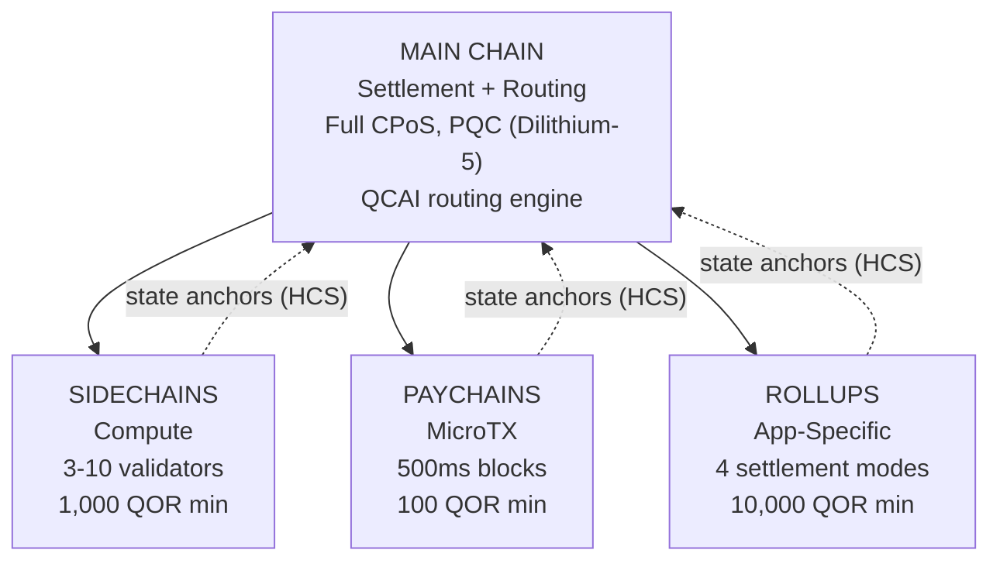

# Arhitectură multistrat

QoreChain implementează o **arhitectură ierarhică de lanțuri pe 4 niveluri** prin modulul `x/multilayer`. Lanțul principal servește drept rădăcină de decontare și de încredere, în timp ce straturile subsidiare (sidechain-uri, paychain-uri și rollup-uri) gestionează sarcini specializate cu compromisuri diferite de performanță și securitate.

---

## Prezentare generală a sistemului

Ierarhia pe 4 niveluri de mai jos arată lanțul principal ca rădăcină de decontare și de încredere, cu trei tipuri de straturi subsidiare care își ancorează rădăcinile de stare înapoi la acesta prin Hierarchical Commitment Schemes (HCS).



```
                    +---------------------------+
                    |       MAIN CHAIN          |
                    |  (Settlement + Routing)   |
                    |  Full CPoS consensus      |
                    |  PQC-secured (Dilithium-5)|
                    |  QCAI routing engine       |
                    +------+------+------+------+
                           |      |      |
              +------------+      |      +------------+
              |                   |                    |
    +---------v--------+ +-------v--------+ +---------v---------+
    |   SIDECHAINS     | |   PAYCHAINS    | |     ROLLUPS       |
    |  (Compute)       | |  (MicroTX)     | |  (App-Specific)   |
    |  3-10 validators | |  500ms blocks  | |  4 settlement     |
    |  1,000 QOR min   | |  100 QOR min   | |    modes          |
    |  Max: 10         | |  Max: 50       | |  10,000 QOR min   |
    +------------------+ +----------------+ |  Max: 100         |
                                            +-------------------+
```

---

## Tipuri de straturi

### Lanțul principal

Lanțul principal este rădăcina de încredere pentru întregul ecosistem QoreChain.

| Proprietate   | Valoare                                                                          |
| ---------- | ------------------------------------------------------------------------------ |
| Consens  | Full Triple-Pool CPoS (consultați [Mecanismul de consens](/architecture/consensus-mechanism)) |
| Securitate   | Securizat PQC cu semnături Dilithium-5                                        |
| Rol       | Stratul de decontare, stocarea ancorelor de stare, motorul de rutare QCAI, rădăcina de încredere        |
| Timpul blocului | \~5 secunde                                                                    |

Toate straturile subsidiare își ancorează periodic rădăcinile de stare la lanțul principal prin Hierarchical Commitment Schemes (HCS).

### Sidechain-uri

Sidechain-urile gestionează **operațiuni intensive în calcul**, cum ar fi protocoalele DeFi, motoarele de jocuri și procesarea datelor IoT.

| Parametru                 | Valoare             |
| ------------------------- | ----------------- |
| Validatori minimi        | 3                 |
| Validatori maximi        | 10                |
| Miza minimă a creatorului     | 1,000 QOR         |
| Sidechain-uri active maxime | 10                |
| Domenii țintă            | DeFi, Gaming, IoT |

### Paychain-uri

Paychain-urile sunt optimizate pentru **microtranzacții de înaltă frecvență** cu latență minimă.

| Parametru                | Valoare                                   |
| ------------------------ | --------------------------------------- |
| Timpul țintă al blocului        | 500 ms                                  |
| Paychain-uri active maxime | 50                                      |
| Miza minimă a creatorului    | 100 QOR                                 |
| Domenii țintă           | Plăți, streaming, micro-tranzacții |

### Rollup-uri

Rollup-urile sunt **lanțuri specifice aplicațiilor** implementate prin Rollup Development Kit (`x/rdk`). Acestea se înregistrează ca tip de strat rollup în cadrul modulului multilayer.

| Parametru              | Valoare                                       |
| ---------------------- | ------------------------------------------- |
| Moduri de decontare       | 4 (optimistic, zk, based, sovereign)        |
| Rollup-uri active maxime | 100                                         |
| Miza minimă a creatorului  | 10,000 QOR                                  |
| Tipul de strat             | `rollup`                                    |
| Domenii țintă         | DeFi, Gaming, NFT, Enterprise               |

Implementarea și configurarea rollup-urilor sunt tratate în detaliu în [Rollup Development Kit](/architecture/rollup-development-kit).

---

## Rutarea tranzacțiilor QCAI

Routerul QCAI evaluează toate straturile active pentru fiecare tranzacție primită și selectează destinația optimă folosind un model de scorare ponderat cu 4 factori.

### Formula de scorare

Fiecare strat candidat primește un scor compozit (mai mare este mai bine):

```
Score = w_congestion * (1 - Congestion) + w_capability * Capability + w_cost * (1 - Cost) + w_latency * (1 - Latency)
```

| Factor     | Pondere | Descriere                                                                 |
| ---------- | ------ | --------------------------------------------------------------------------- |
| Congestion | 0.30   | Nivelul de încărcare curent (inversat: congestie mai mică = scor mai mare)              |
| Capability | 0.40   | Cât de bine corespunde stratul cerințelor tranzacției                     |
| Cost       | 0.20   | Multiplicatorul de taxă raportat la lanțul principal (inversat: cost mai mic = scor mai mare) |
| Latency    | 0.10   | Timpul estimat până la finalitate (inversat: latență mai mică = scor mai mare)          |

### Pragul de încredere

Routerul necesită un scor minim de încredere de **0.6** înainte de a ruta o tranzacție către un strat subsidiar. Dacă niciun strat nu atinge acest prag, tranzacția revine implicit la lanțul principal.

Un indiciu de strat preferat poate fi furnizat de expeditorul tranzacției. Dacă stratul preferat obține un scor de cel puțin 80% din pragul de încredere (adică 0.48), este acceptat ca țintă de rutare.

### Euristici pe baza sarcinii utile

Când metadatele detaliate ale tranzacției nu sunt disponibile, routerul folosește dimensiunea sarcinii utile drept semnal de clasificare:

| Dimensiunea sarcinii utile      | Strat preferat | Justificare                                    |
| ----------------- | --------------- | -------------------------------------------- |
| &lt; 256 octeți    | Paychain        | Probabil un transfer simplu sau o microtranzacție |
| 256 - 1,024 octeți | Lanțul principal      | Complexitate de tranzacție standard              |
| > 1,024 octeți     | Sidechain       | Probabil o interacțiune complexă cu un contract        |

---

## Hierarchical Commitment Schemes (HCS)

Straturile subsidiare își comit periodic starea către lanțul principal prin **ancore de stare**. Fiecare ancoră conține o dovadă criptografică a stării lanțului subsidiar la o anumită înălțime.

### Conținutul ancorei

| Câmp                     | Descriere                                          |
| ------------------------- | ---------------------------------------------------- |
| `layer_id`                | Identificatorul stratului subsidiar                   |
| `layer_height`            | Înălțimea blocului pe lanțul subsidiar                 |
| `state_root`              | Rădăcina Merkle a arborelui de stare al lanțului subsidiar     |
| `validator_set_hash`      | Hash-ul setului de validatori care a semnat comiterea |
| `pqc_aggregate_signature` | Semnătura agregată Dilithium-5 peste datele ancorei |
| `transaction_count`       | Numărul de tranzacții de la ultima ancoră         |
| `compressed_state_proof`  | Dovadă comprimată de tranziție a stării                 |

### Trimiterea ancorei

Ancorele sunt trimise către lanțul principal prin `MsgAnchorState`. Keeper-ul validează ancora conform următorilor pași:

1. **Stratul există și este activ** — Keeper-ul verifică dacă stratul există în stare și are în prezent statusul `active`.
2. **Intervalul minim de ancorare s-a scurs** — Keeper-ul verifică dacă au trecut cel puțin `min_anchor_interval` blocuri (implicit: 100) de la ultima ancoră pentru acest strat.
3. **Semnătura agregată PQC** — Keeper-ul asigură că semnătura agregată PQC este prezentă și validă pentru datele ancorei.

### Perioada de contestare

Fiecare ancoră intră într-o **perioadă de contestare** de **24 de ore** (86,400 de secunde, configurabilă per strat). În această perioadă, orice parte poate contesta ancora prin trimiterea unei dovezi de fraudă prin `MsgChallengeAnchor`. Dacă dovada de fraudă este validă, ancora este invalidată, iar starea lanțului subsidiar este readusă la ancora anterioară.

După expirarea perioadei de contestare fără o contestare reușită, ancora este considerată finalizată.

---

## Cross-Layer Fee Bundling (CLFB)

CLFB permite ca o singură plată de taxă pe stratul sursă să acopere execuția pe mai multe straturi într-o cale de tranzacție inter-strat.

### Calculul taxei

```
avgMultiplier = sum(layer_multiplier_i) / num_layers
bundledFee = (totalGas / 1000) * avgMultiplier
```

Unde:

* `layer_multiplier_i` este multiplicatorul de taxă de bază pentru fiecare strat din calea tranzacției (lanțul principal = 1.0).
* `totalGas` este consumul total estimat de gaz pe toate straturile.
* Rezultatul este exprimat în **uqor** cu o taxă minimă de 1 uqor.

### Exemplu

O tranzacție inter-strat atinge trei straturi: lanțul principal (multiplicator 1.0), un sidechain (multiplicator 0.5) și un paychain (multiplicator 0.1).

```
avgMultiplier = (1.0 + 0.5 + 0.1) / 3 = 0.533
bundledFee = (150,000 / 1000) * 0.533 = 80 uqor
```

CLFB poate fi activat sau dezactivat global prin parametrul `cross_layer_fee_bundling`, iar straturile individuale pot renunța prin indicatorul lor de configurare `cross_layer_fee_bundling_enabled`.

---

## Ciclul de viață al stratului

Fiecare strat subsidiar parcurge un ciclu de viață bine definit:

```
Proposed --> Active --> Suspended --> Decommissioned
                  \                /
                   +-- Active <--+
```

| Status             | Descriere                                                                     | Tranziții permise       |
| ------------------ | ------------------------------------------------------------------------------- | ------------------------- |
| **Proposed**       | Stratul a fost înregistrat, dar nu a fost încă activat                                 | Active, Decommissioned    |
| **Active**         | Stratul este operațional și acceptă tranzacții                                 | Suspended, Decommissioned |
| **Suspended**      | Stratul este suspendat temporar (de ex., pentru întreținere sau din cauza unor probleme de securitate) | Active, Decommissioned    |
| **Decommissioned** | Stratul este oprit definitiv (stare terminală)                                 | Niciuna                      |

Tranzițiile de status sunt impuse de keeper. Tranzițiile nevalide (de ex., de la Decommissioned la Active) sunt respinse.

---

## Parametri

| Parametru                      | Tip   | Implicit         | Descriere                                             |
| ------------------------------ | ------ | --------------- | ------------------------------------------------------- |
| `max_sidechains`               | uint64 | `10`            | Numărul maxim de sidechain-uri active                     |
| `max_paychains`                | uint64 | `50`            | Numărul maxim de paychain-uri active                     |
| `min_anchor_interval`          | uint64 | `100`           | Blocuri minime între ancorele de stare                    |
| `max_anchor_interval`          | uint64 | `1,000`         | Blocuri maxime între ancorele de stare (ancoră forțată)    |
| `default_challenge_period`     | uint64 | `86,400`        | Perioada de contestare implicită în secunde (24 de ore)          |
| `min_sidechain_stake`          | string | `1,000,000,000` | Miza minimă pentru crearea unui sidechain (1,000 QOR în uqor) |
| `min_paychain_stake`           | string | `100,000,000`   | Miza minimă pentru crearea unui paychain (100 QOR în uqor)    |
| `routing_enabled`              | bool   | `true`          | Activează rutarea tranzacțiilor bazată pe QCAI                   |
| `routing_confidence_threshold` | string | `0.6`           | Încrederea minimă pentru deciziile de rutare QCAI           |
| `cross_layer_fee_bundling`     | bool   | `true`          | Activează Cross-Layer Fee Bundling la nivel global                  |
