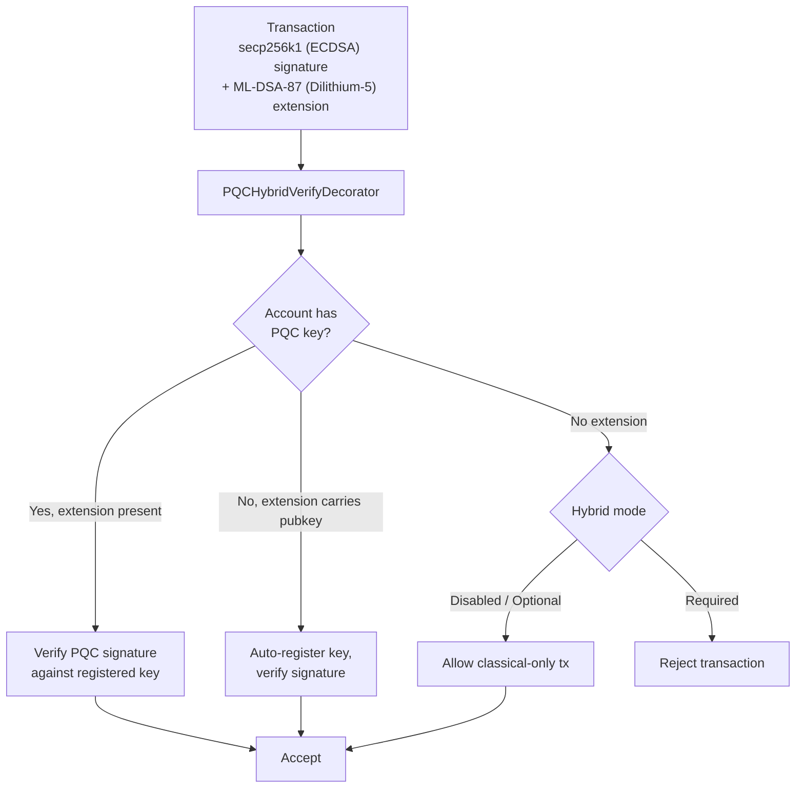

# Securitate post-cuantică

QoreChain este construit cu **criptografie post-cuantică (PQC) de la genesis** — nu adăugată ulterior ca actualizare. Modulul `x/pqc` oferă semnături digitale bazate pe rețele (lattice) și încapsulare de chei drept primitive criptografice principale, cu un cadru de agilitate a algoritmilor controlat prin guvernanță pentru reziliență pe termen lung.

Baza completă PQC — **Dilithium-5 (semnături) + ML-KEM-1024 (KEM) + SHAKE-256 (hash)** — este acum finalizată și reprezintă valoarea implicită a rețelei. Începând cu versiunea curentă a lanțului (**v3.1.80**), semnăturile hibride sunt **obligatorii implicit** pe calea de tranzacții cosmos: `hybrid_signature_mode = required` și `allow_classical_fallback = false`. Fiecare tranzacție de pe calea cosmos trebuie să poarte o semnătură Dilithium-5 alături de semnătura sa clasică secp256k1; tranzacțiile exclusiv clasice de la un cont PQC sunt respinse, iar calea de retrogradare clasică este închisă.

## Principii de proiectare

* **PQC obligatoriu implicit**: Semnăturile post-cuantice sunt obligatorii pe calea cosmos. Semnăturile clasice secp256k1 singure nu mai sunt suficiente — `allow_classical_fallback = false`.
* **Hibrid implicit**: Tranzacțiile cosmos poartă simultan atât o semnătură clasică secp256k1, cât și o semnătură PQC Dilithium-5. Calea de rezervă exclusiv clasică este închisă.
* **Agilitate a algoritmilor**: Registrul de algoritmi criptografici este controlat prin guvernanță, permițând rețelei să adopte algoritmi noi sau să retragă pe cei compromiși fără hard fork-uri.
* **Verificare deterministă**: Toate verificările de semnături sunt deterministe și reproductibile pe toate nodurile de validare.

## Algoritmi suportați

| Algoritm       | Standard             | Categorie          | Nivel NIST | Cheie publică  | Cheie privată | Semnătură / Text cifrat | Secret partajat |
| --------------- | -------------------- | ----------------- | ---------- | ----------- | ----------- | ---------------------- | ------------- |
| **Dilithium-5** | ML-DSA-87 (FIPS 204) | Semnătură         | 5          | 2,592 octeți | 4,896 octeți | 4,627 octeți            | --            |
| **ML-KEM-1024** | FIPS 203             | Încapsulare de chei | 5          | 1,568 octeți | 3,168 octeți | 1,568 octeți            | 32 octeți      |

Ambii algoritmi operează la **NIST Security Level 5**, cea mai înaltă categorie de securitate standardizată, oferind o protecție echivalentă cu AES-256 împotriva adversarilor atât clasici, cât și cuantici.

## Backend criptografic

Operațiunile PQC sunt implementate într-un backend criptografic de înaltă performanță și sigur la nivel de memorie, care expune semnarea, verificarea și încapsularea de chei bazate pe rețele către runtime-ul QoreChain. Backend-ul oferă:

Operațiuni specifice algoritmilor:

* Generarea de chei, semnarea și verificarea Dilithium-5
* Generarea de chei, încapsularea și decapsularea ML-KEM-1024
* Generarea deterministă a balizei aleatorii (`seed`, `epoch`)

Operațiuni conștiente de algoritm:

* `Keygen(algorithmID)` — Generează o pereche de chei pentru orice algoritm înregistrat
* `Sign(algorithmID, privkey, message)` — Creează o semnătură
* `Verify(algorithmID, pubkey, message, signature)` — Verifică o semnătură
* `AlgorithmInfo(algorithmID)` — Interoghează dimensiunile cheilor/ieșirilor
* `ListAlgorithms()` — Enumeră toți algoritmii suportați

Toate operațiunile de semnare și verificare sunt deterministe și produc rezultate identice pe fiecare nod de validare și platformă suportată.

Aceleași primitive — ML-DSA (FIPS-204), ML-KEM (FIPS-203) și SHAKE-256 (FIPS-202) — sunt disponibile pentru portofele și integratori prin biblioteca open-source [**qorechain-pqc**](https://github.com/qorechain/qorechain-pqc), care oferă un API consecvent și compatibil la nivel de octet în șase limbaje (JavaScript/TypeScript, Rust, Go, C, Python, Java). Consultați [Post-Quantum Signing](/developer-guide/post-quantum-signing).

## Înregistrarea cheilor

Conturile înregistrează chei PQC prin `MsgRegisterPQCKey` (legacy, implicit Dilithium-5) sau `MsgRegisterPQCKeyV2` (conștient de algoritm). Fiecare mesaj include:

* **Sender**: Adresa contului care înregistrează cheia.
* **PublicKey**: Octeții cheii publice PQC.
* **AlgorithmID**: Identificatorul algoritmului PQC (doar v2).
* **KeyType**: Unul dintre cele trei moduri de înregistrare:

| Tip de cheie         | Descriere                                                              |
| ---------------- | ------------------------------------------------------------------------ |
| `hybrid`         | Atât chei clasice (ECDSA), cât și PQC. Tranzacțiile poartă semnături duble. |
| `pqc_only`       | Doar cheie PQC. Semnătura clasică nu este necesară.                       |
| `classical_only` | Doar cheie clasică. Fără protecție PQC (nerecomandat).                 |

## Semnături hibride

Sistemul de semnături hibride necesită ca tranzacțiile de pe calea cosmos să poarte **atât** o semnătură clasică, **cât și** o semnătură PQC simultan. Aceasta oferă apărare în profunzime: chiar dacă o schemă este spartă, cealaltă protejează tranzacția.

Cu valoarea implicită a rețelei `hybrid_signature_mode = required`, fiecare tranzacție de pe calea cosmos trebuie să includă extensia Dilithium-5 alături de semnătura secp256k1. Singurele excepții (pentru bootstrap) sunt **gentx-urile de genesis (înălțimea 0)** și **tranzacțiile de înregistrare/migrare a cheilor PQC** (`MsgRegisterPQCKey`, `MsgRegisterPQCKeyV2`, `MsgMigratePQCKey`), cărora li se permite să fie exclusiv clasice pentru ca conturile să își poată înregistra prima cheie PQC.

**Tranzacțiile EVM nu sunt afectate.** Tranzacțiile EVM sunt autentificate pe o cale ante `eth_secp256k1` separată (calea QoreChain EVM Engine) și nu necesită niciodată extensia hibridă PQC. Cerința hibridă se aplică numai căii de tranzacții cosmos.

### Fluxul de cosemnare

Pentru a produce o tranzacție cosmos conformă, semnătura clasică secp256k1 este calculată peste octeții de semnare standard (care exclud extensia PQC), iar o semnătură Dilithium-5 este calculată și atașată ca extensie `PQCHybridSignature`. Instrumentele standard CosmJS / relayer trebuie să producă această extensie pentru a tranzacționa pe calea cosmos. Astăzi acest lucru se face prin:

* `qorechaind tx pqc gen-key` — generează o cheie Dilithium-5.
* `qorechaind tx pqc cosign` — atașează cosemnătura Dilithium-5 la o tranzacție.
* Semnarea hibridă a QoreChain SDK — `buildHybridTx` cu `includePqcPublicKey` (încorporează cheia publică PQC pentru auto-înregistrare la prima utilizare).

*O tranzacție semnată cu secp256k1 (ECDSA) plus ML-DSA-87 (Dilithium-5), verificată de gestionarul ante în modul de impunere la nivel de lanț.*



### Formatul extensiei TX

Semnăturile PQC sunt atașate tranzacțiilor ca **extensie TX** cu URL-ul de tip `/qorechain.pqc.v1.PQCHybridSignature`:

```text
{
  "algorithm_id": 1,
  "pqc_signature": "<4627 bytes for Dilithium-5>",
  "pqc_public_key": "<2592 bytes, optional>"
}
```

Câmpul `pqc_public_key` este opțional. Dacă este prezent și contul nu are o cheie PQC înregistrată, gestionarul ante va **auto-înregistra** cheia la prima utilizare.

### PQCHybridVerifyDecorator

Gestionarul ante `PQCHybridVerifyDecorator` procesează semnăturile hibride cu o logică de verificare în trei direcții:

| Scenariu | Contul are cheie PQC | Extensie prezentă | Cheie publică în extensie | Rezultat                                              |
| -------- | ------------------- | ----------------- | ----------------------- | --------------------------------------------------- |
| Path 1   | Da                 | Da               | --                      | Verifică semnătura PQC în raport cu cheia înregistrată         |
| Path 2   | Nu                  | Da               | Da                     | Auto-înregistrează cheia, verifică semnătura                 |
| Path 3a  | Nu                  | Nu                | --                      | **Modul Optional**: Permite tranzacția exclusiv clasică |
| Path 3b  | Nu                  | Nu                | --                      | **Modul Required**: Respinge tranzacția               |
| Path 4   | Da                 | Nu                | --                      | Gestionat de PQCVerifyDecorator standard          |

### Moduri de semnătură hibridă

Nivelul de impunere a hibridului la nivel de lanț este configurabil prin guvernanță. **Valoarea implicită curentă a rețelei este `required`**:

| Mod         | ID | Implicit | Comportament                                                                                                          |
| ------------ | -- | ------- | ----------------------------------------------------------------------------------------------------------------- |
| **Disabled** | 0  | Nu      | Doar semnături clasice. Extensiile PQC sunt ignorate.                                                            |
| **Optional** | 1  | Nu      | Extensiile PQC sunt verificate dacă sunt prezente. Conturile fără chei PQC pot tranzacționa doar cu semnături clasice.    |
| **Required** | 2  | **Da** | Toate tranzacțiile de pe calea cosmos trebuie să poarte atât semnături clasice, cât și PQC. Tranzacțiile fără o extensie PQC sunt respinse. |

Rețeaua și-a finalizat migrarea: **Optional** (genesis) → **Required** (valoarea implicită curentă de la v3.1.71, cu `allow_classical_fallback = false`). Cele trei moduri rămân controlate prin guvernanță și pot fi ajustate prin propunere.

## Cadrul de agilitate a algoritmilor

Cadrul de agilitate a algoritmilor oferă un registru controlat prin guvernanță pentru algoritmii PQC, permițând rețelei să adauge algoritmi noi, să-i retragă pe cei vulnerabili și să migreze conturile — toate fără hard fork-uri.

### Ciclul de viață al algoritmului

Fiecare algoritm înregistrat are un status de ciclu de viață:

```
active --> migrating --> deprecated --> disabled
```

| Status         | Descriere                                                                                                                                 |
| -------------- | ------------------------------------------------------------------------------------------------------------------------------------------- |
| **Active**     | Complet operațional. Noile înregistrări de chei și verificări sunt acceptate.                                                                    |
| **Migrating**  | Perioada de semnătură dublă este activă. Conturile sunt încurajate să migreze la algoritmul de înlocuire. Atât semnăturile vechi, cât și cele noi sunt acceptate. |
| **Deprecated** | Semnăturile existente pot fi în continuare verificate, dar nu se acceptă noi înregistrări de chei.                                                       |
| **Disabled**   | Comutator de oprire de urgență. Algoritmul nu poate verifica nicio semnătură. Folosit când se descoperă o vulnerabilitate.                                 |

### Migrare cu semnătură dublă

Când un algoritm este retras, începe o **perioadă de migrare** (implicit: 1,000,000 de blocuri, aproximativ 69 de zile la 6s/bloc). În această perioadă:

1. Conturile cu chei care folosesc algoritmul retras trebuie să migreze la cel de înlocuire.
2. Migrarea necesită semnături duble (`MsgMigratePQCKey`): una de la cheia veche și una de la cheia nouă, dovedind deținerea ambelor.
3. Ambii algoritmi sunt acceptați pentru verificare pe toată durata perioadei de migrare.

### Mesaje de guvernanță

| Mesaj                 | Descriere                                                                                                                                                       |
| ----------------------- | ----------------------------------------------------------------------------------------------------------------------------------------------------------------- |
| `MsgAddAlgorithm`       | Propune adăugarea unui nou algoritm PQC în registru. Include `AlgorithmInfo` complet (nume, categorie, nivel NIST, dimensiuni ale cheilor). Trebuie trimis prin guvernanță. |
| `MsgDeprecateAlgorithm` | Începe procesul de retragere a unui algoritm. Specifică algoritmul de înlocuire și perioada de migrare în blocuri.                                              |
| `MsgDisableAlgorithm`   | Dezactivează de urgență un algoritm imediat. Necesită un șir de motiv. Folosit când se descoperă o vulnerabilitate criptografică.                                     |

### Extensibilitate

Adăugarea unui nou algoritm necesită:

1. Implementarea algoritmului în backend-ul criptografic, în spatele interfeței unificate de semnare și verificare.
2. Trimiterea unei propuneri de guvernanță `MsgAddAlgorithm` cu metadatele algoritmului.
3. Odată aprobat, algoritmul devine disponibil pentru înregistrarea și verificarea cheilor.

## Hash SHAKE-256

Începând cu v3.1.73, **SHAKE-256** (funcția SHA-3 cu ieșire extensibilă) este **hash-ul implicit al aplicației** în întreaga QoreChain — oferit de pachetul `qorehash` — completând baza criptografică rezistentă cuantic alături de semnăturile Dilithium-5 și încapsularea de chei ML-KEM-1024. Modulul `x/pqc` oferă utilitare SHAKE-256 pure-Go:

| Funcție                           | Descriere                       | Ieșire           |
| ---------------------------------- | --------------------------------- | ---------------- |
| `SHAKE256Hash(data, outputLen)`    | Rezumat SHAKE-256 de lungime variabilă  | Lungime arbitrară |
| `SHAKE256Hash32(data)`             | Rezumat SHAKE-256 standard pe 256 de biți | 32 octeți         |
| `SHAKE256ConcatHash(left, right)`  | Hash-ul intrărilor concatenate       | 32 octeți         |
| `SHAKE256DomainHash(domain, data)` | Hash separat pe domeniu             | 32 octeți         |

Aceste utilitare stau la baza hash-ului implicit al aplicației și sunt folosite pentru:

* Hash-uirea nodurilor arborelui Merkle
* Angajamente de tip hash în atestările inter-strat
* Separarea pe domenii pentru contexte de hash diferite (de ex., `"leaf:"` vs `"node:"`)

## PQC pentru bridge

Toate atestările de bridge inter-lanț și angajamentele de stare folosesc semnături **Dilithium-5**. Modulul `x/multilayer` necesită semnături agregate PQC la fiecare trimitere `MsgAnchorState`, iar angajamentele ML-KEM securizează canalele de schimb de chei dintre relayer-ele de bridge.

Aceasta asigură că securitatea inter-lanț nu este degradată de utilizarea criptografiei clasice în infrastructura de bridge, menținând rezistența cuantică pe întreaga stivă de protocol.

## Parametrii modulului

| Parametru                  | Tip                | Implicit           | Descriere                                           |
| -------------------------- | ------------------- | ----------------- | ----------------------------------------------------- |
| `pqc_primary`              | bool                | `true`            | PQC este schema principală de semnături                   |
| `allow_classical_fallback` | bool                | `false`           | Rezerva exclusiv clasică este închisă; tranzacțiile cosmos trebuie să fie hibride |
| `min_security_level`       | int32               | `5`               | Nivelul minim de securitate NIST pentru algoritmii acceptați   |
| `default_migration_blocks` | int64               | `1,000,000`       | Perioada implicită de migrare cu semnătură dublă în blocuri     |
| `default_signature_algo`   | AlgorithmID         | `1` (Dilithium-5) | Algoritmul de semnătură implicit pentru noile înregistrări de chei |
| `hybrid_signature_mode`    | HybridSignatureMode | `2` (Required)    | Nivelul de impunere a semnăturii hibride la nivel de lanț         |

## Resurse conexe

* [Post-Quantum Signing](/developer-guide/post-quantum-signing) — biblioteca open-source `qorechain-pqc` (șase limbaje) pentru aceste primitive și semnare hibridă.
* [Wallet Setup](/getting-started/wallet-setup) — creați și gestionați conturi susținute de PQC.
* [SDK Accounts & PQC signing](/sdk/concepts/accounts-pqc) — chei și semnare post-cuantică din cod.
* [Chain Parameters](/appendix/chain-parameters) — algoritmii impliciți și setările de migrare.
* [Bridge Architecture](/architecture/bridge-architecture) — verificarea PQC pe pachetele inter-lanț.
