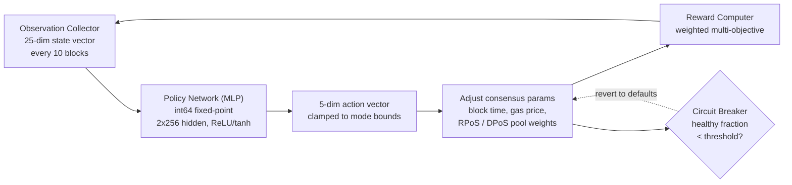

# Motorul de consens PRISM

QoreChain integrează **PRISM** (Policy-driven Reinforcement-learning for Intelligent State Machines), un strat de optimizare prin învățare prin întărire, direct în stratul de consens prin modulul `x/rlconsensus`. PRISM observă metricile lanțului la fiecare N blocuri, rulează inferența printr-o rețea neuronală cu virgulă fixă și propune ajustări ale parametrilor de consens — toate în mod determinist, fără aritmetică cu virgulă mobilă în căile critice pentru consens.

*Bucla de optimizare PRISM: observă starea lanțului, rulează inferența de politică, limitează și aplică modificările de parametri, apoi realimentează rezultatul.*



---

## Prezentare generală a arhitecturii

PRISM constă din patru componente:

1. **Observation Collector** — Adună vectori de stare a lanțului cu 25 de dimensiuni la intervale configurabile.
2. **Policy Network (MLP)** — Un perceptron multistrat nativ Go care mapează observațiile la acțiuni.
3. **Reward Computer** — Evaluează calitatea modificărilor de parametri folosind o funcție ponderată multi-obiectiv.
4. **Circuit Breaker** — Monitorizează sănătatea lanțului și revine la toți parametrii reglați de PRISM dacă se detectează instabilitate.

Toate componentele operează în cadrul ciclului de viață ABCI și produc ieșiri deterministe și verificabile pe toate nodurile de validare.

---

## Rețeaua de politică

Rețeaua de politică este un perceptron multistrat (MLP) de tip feedforward, implementat în întregime în Go cu **aritmetică cu virgulă fixă int64** (scalată cu 10^8).

### Arhitectura rețelei

| Proprietate            | Valoare                              |
| ------------------- | ---------------------------------- |
| Dimensiuni de intrare    | 25                                 |
| Straturi ascunse       | 2                                  |
| Dimensiunile straturilor ascunse  | 256, 256                           |
| Dimensiuni de ieșire   | 5                                  |
| Activare (ascuns) | ReLU                               |
| Activare (ieșire) | tanh                               |
| Parametri totali    | 73,733                             |
| Precizie           | virgulă fixă int64 (scalată cu 10^8) |

### Defalcarea numărului de parametri

```
Layer 1: 25 * 256 + 256   =  6,656  (input -> hidden_1)
Layer 2: 256 * 256 + 256   = 65,792  (hidden_1 -> hidden_2)
Layer 3: 256 * 5 + 5       =  1,285  (hidden_2 -> output)
Total:                       73,733
```

### Aritmetică cu virgulă fixă

Toate calculele MLP folosesc valori `int64` scalate cu `FixedPointScale = 10^8`. Aceasta elimină non-determinismul provenit din diferențele de rotunjire ale virgulei mobile IEEE 754 pe diferite platforme hardware.

* **Înmulțire**: `fixMul(a, b) = (a / SCALE) * b + (a % SCALE) * b / SCALE` (împărțit pentru a preveni depășirea)
* **ReLU**: `relu(x) = max(0, x)`
* **tanh**: aproximantă Padé `tanh(x) ~ x * (3*S - x^2) / (3*S + x^2)` pentru `|x| <= 2.5*SCALE`, limitată la +/- SCALE în rest

Ponderile de politică sunt stocate on-chain ca un vector aplatizat `[]int64` și pot fi actualizate prin propunere de guvernanță.

---

## Vectorul de observație

PRISM colectează un vector de observație cu 25 de dimensiuni la fiecare interval de observație (implicit: la fiecare 10 blocuri).

| Index | Dimensiune              | Descriere                                      |
| ----- | ---------------------- | ------------------------------------------------ |
| 0     | `block_utilization`    | Gaz folosit în bloc / limita de gaz a blocului                 |
| 1     | `tx_count`             | Numărul de tranzacții din bloc              |
| 2     | `avg_tx_size`          | Dimensiunea medie a tranzacției în octeți              |
| 3     | `block_time`           | Timpul de la blocul precedent (ms)                   |
| 4     | `block_time_delta`     | Timpul blocului minus timpul țintă al blocului (ms)          |
| 5     | `gas_price_50th`       | Prețul median al gazului                                 |
| 6     | `gas_price_95th`       | Prețul gazului la percentila 95                        |
| 7     | `mempool_size`         | Numărul de tranzacții în așteptare                   |
| 8     | `mempool_bytes`        | Totalul de octeți ai tranzacțiilor în așteptare              |
| 9     | `validator_count`      | Numărul de validatori activi                           |
| 10    | `validator_gini`       | Coeficientul Gini al distribuției puterii validatorilor |
| 11    | `missed_block_ratio`   | Fracțiunea de validatori care au ratat semnarea       |
| 12    | `avg_commit_latency`   | Latența medie a rundei de comitere (ms)                |
| 13    | `max_commit_latency`   | Latența maximă a rundei de comitere (ms)                |
| 14    | `precommit_ratio`      | Fracțiunea de precommit-uri primite                    |
| 15    | `failed_tx_ratio`      | Fracțiunea de tranzacții eșuate                   |
| 16    | `avg_gas_per_tx`       | Gazul mediu consumat per tranzacție                 |
| 17    | `reward_per_validator` | Recompensa medie per validator (uqor)                 |
| 18    | `slash_count`          | Numărul de evenimente de slashing din fereastra de observație  |
| 19    | `jail_count`           | Numărul de evenimente de încarcerare din fereastra de observație     |
| 20    | `inflation_rate`       | Rata de emisie curentă                            |
| 21    | `bonded_ratio`         | Token-uri bondate / oferta totală                    |
| 22    | `reputation_mean`      | Scorul mediu de reputație al validatorilor activi   |
| 23    | `reputation_stddev`    | Deviația standard a scorurilor de reputație             |
| 24    | `mev_estimate`         | MEV extras estimat (euristic)              |

Toate valorile sunt stocate ca reprezentări string `LegacyDec` și convertite în virgulă fixă int64 înainte de inferență.

---

## Spațiul de acțiuni

Ieșirea MLP este un vector de acțiuni cu 5 dimensiuni, în care fiecare dimensiune reprezintă o modificare propusă a unui parametru de consens. Activarea tanh constrânge ieșirile brute la \[-1, 1], care sunt apoi scalate prin limite specifice modului.

| Index | Dimensiunea acțiunii           | Descriere                                                             |
| ----- | -------------------------- | ----------------------------------------------------------------------- |
| 0     | `block_time_delta`         | Modificarea propusă a timpului țintă al blocului (ms)                               |
| 1     | `gas_price_delta`          | Modificarea propusă a prețului de bază al gazului                                       |
| 2     | `validator_set_size_delta` | Modificarea propusă a dimensiunii țintă a setului de validatori (doar înregistrată, neaplicată) |
| 3     | `pool_weight_rpos_delta`   | Modificarea propusă a ponderii de prioritate a grupului RPoS                            |
| 4     | `pool_weight_dpos_delta`   | Modificarea propusă a ponderii de prioritate a grupului DPoS                            |

Acțiunile sunt **limitate** la limitele maxime de modificare definite de modul PRISM curent înainte de aplicare.

---

## Funcția de recompensă

Semnalul de recompensă evaluează cât de bine au îmbunătățit performanța lanțului modificările recente de parametri. Este calculat ca o sumă ponderată a cinci obiective:

```
R = 0.30 * delta_throughput
  + 0.25 * delta_finality
  + 0.20 * delta_decentralization
  - 0.15 * mev_estimate
  - 0.10 * failed_tx_ratio
```

| Componentă           | Pondere | Direcție | Metrică sursă                                 |
| ------------------- | ------ | --------- | --------------------------------------------- |
| Throughput          | +0.30  | Maximizare  | Modificarea utilizării blocului                   |
| Finalitate            | +0.25  | Maximizare  | Modificarea raportului de precommit                     |
| Descentralizare    | +0.20  | Maximizare  | Modificarea negativă a coeficientului Gini al validatorilor |
| MEV                 | -0.15  | Minimizare  | Estimarea MEV curentă                           |
| Tranzacții eșuate | -0.10  | Minimizare  | Raportul curent de tranzacții eșuate              |

Ponderile de recompensă sunt configurabile prin guvernanță și trebuie să însumeze exact 1.0.

---

## Moduri PRISM

PRISM operează în unul dintre patru moduri, controlabil prin guvernanță:

| Mod             | ID | Modificare max | Comportament                                                                                   |
| ---------------- | -- | ---------- | ------------------------------------------------------------------------------------------ |
| **Shadow**       | 0  | 0%         | Doar observă și înregistrează recomandări. Niciun parametru nu este modificat. Acesta este modul implicit. |
| **Conservative** | 1  | +/- 10%    | Aplică modificări de parametri în limite stricte. Potrivit pentru implementarea live inițială.         |
| **Autonomous**   | 2  | +/- 25%    | Aplică modificări de parametri în limite mai largi. Pentru rețele mature cu politici validate.  |
| **Paused**       | 3  | 0%         | PRISM este complet inactiv. Nu se colectează observații și nu rulează nicio inferență.             |

Tranzițiile de mod necesită o propunere de guvernanță. Calea de implementare recomandată este: Shadow → Conservative → Autonomous.

---

## Circuit Breaker

Circuit breaker-ul este un mecanism de siguranță care monitorizează sănătatea lanțului și revine automat la toți parametrii reglați de PRISM dacă se detectează instabilitate.

### Logica de detecție

Circuit breaker-ul evaluează ultimele **50 de blocuri** (configurabil prin `circuit_breaker_window`):

1. **Calcularea diferențelor de timp ale blocurilor** — Pentru fiecare pereche consecutivă de marcaje temporale ale blocurilor, calculează diferența de timp a blocului.
2. **Clasificarea blocurilor sănătoase** — Un bloc este considerat **sănătos** dacă diferența sa este pozitivă și se încadrează în 2x timpul țintă al blocului.
3. **Calcularea fracțiunii sănătoase** — Calculează **fracțiunea sănătoasă** = blocuri sănătoase / total diferențe.

### Condiția de declanșare

Dacă fracțiunea sănătoasă scade sub prag (implicit: **50%**), circuit breaker-ul se declanșează.

### Răspunsul

Când este declanșat, circuit breaker-ul:

1. **Revine** la toți parametrii aplicați de PRISM (timpul blocului, prețul gazului, ponderile grupurilor) la valorile lor implicite.
2. **Suspendă** PRISM (setează `CircuitBreakerActive = true`).
3. **Șterge** politica din memorie pentru a forța o reîncărcare proaspătă.
4. **Emite** un eveniment `circuit_breaker_triggered`.

Circuit breaker-ul se dezactivează automat când fracțiunea sănătoasă revine peste prag la evaluările ulterioare.

---

## Funcții consultative pentru rollup-uri

PRISM oferă funcții consultative pentru optimizarea parametrilor de rollup:

* **`SuggestRollupProfile`** — Analizează condițiile curente ale lanțului și sugerează parametri optimi de configurare a rollup-ului (timpul blocului, limita de gaz, frecvența de decontare).
* **`OptimizeRollupGas`** — Recomandă ajustări ale prețului gazului pentru tranzacțiile de decontare a rollup-ului pe baza tiparelor de congestie ale lanțului principal.

Aceste funcții sunt doar informaționale și nu modifică starea lanțului.

---

## Bibliotecă de matematică deterministă

Toate calculele PRISM folosesc pachetul `mathutil`, care oferă alternative deterministe la matematica standard cu virgulă mobilă:

| Funcție                  | Descriere                 | Metodă                                                    |
| ------------------------- | --------------------------- | --------------------------------------------------------- |
| `IntegerSqrt(x)`          | Radical                 | Metoda lui Newton pe `LegacyDec`, convergență în 100 de iterații |
| `TaylorLn1PlusX(x)`       | Logaritm natural `ln(1+x)` | Reducerea argumentului + serie Taylor cu 15 termeni                |
| `ExpApprox(x)`            | Exponențială `e^x`           | Serie Taylor cu 12 termeni                                     |
| `SigmoidApprox(x)`        | Sigmoid `1/(1+e^-x)`        | `ExpApprox` cu simetrie pentru intrări negative             |
| `ReputationMultiplier(r)` | Mapează \[0,1] la \[0.5,2.0]   | Sigmoid cu scală și decalaj                                |

Toate funcțiile operează pe valori `cosmossdk.io/math.LegacyDec`, asigurând rezultate identice pe toate platformele hardware și versiunile compilatorului Go.

---

## Parametri

| Parametru                        | Tip      | Implicit      | Descriere                                          |
| -------------------------------- | --------- | ------------ | ---------------------------------------------------- |
| `enabled`                        | bool      | `true`       | Activează PRISM                                          |
| `observation_interval`           | uint64    | `10`         | Blocuri între colectările de observații               |
| `agent_mode`                     | PrismMode | `0` (Shadow) | Modul de operare curent                               |
| `max_change_conservative`        | LegacyDec | `0.10`       | Modificarea maximă a parametrilor în modul Conservative        |
| `max_change_autonomous`          | LegacyDec | `0.25`       | Modificarea maximă a parametrilor în modul Autonomous          |
| `circuit_breaker_window`         | uint64    | `50`         | Numărul de blocuri recente monitorizate de circuit breaker |
| `circuit_breaker_threshold`      | LegacyDec | `0.50`       | Fracțiunea minimă de blocuri sănătoase înainte de declanșare        |
| `default_block_time_ms`          | int64     | `5000`       | Timpul țintă implicit al blocului (ms)                       |
| `default_base_gas_price`         | LegacyDec | `100`        | Prețul de bază implicit al gazului                       |
| `default_validator_set_size`     | uint64    | `100`        | Dimensiunea țintă implicită a setului de validatori                    |
| `reward_weight_throughput`       | LegacyDec | `0.30`       | Ponderea de recompensă pentru îmbunătățirea throughput-ului             |
| `reward_weight_finality`         | LegacyDec | `0.25`       | Ponderea de recompensă pentru îmbunătățirea finalității               |
| `reward_weight_decentralization` | LegacyDec | `0.20`       | Ponderea de recompensă pentru îmbunătățirea descentralizării       |
| `reward_weight_mev`              | LegacyDec | `0.15`       | Ponderea de penalizare pentru extragerea MEV                    |
| `reward_weight_failed_txs`       | LegacyDec | `0.10`       | Ponderea de penalizare pentru tranzacțiile eșuate               |

## Resurse conexe

* [Mecanismul de consens](/architecture/consensus-mechanism) — stratul de consens pe care PRISM îl optimizează.
* [AI Engine](/architecture/ai-engine) — serviciile și endpoint-urile AI on-chain mai ample.
* [Tokenomics](/architecture/tokenomics) — cum semnalele RL alimentează recompensele și ajustările de parametri.
