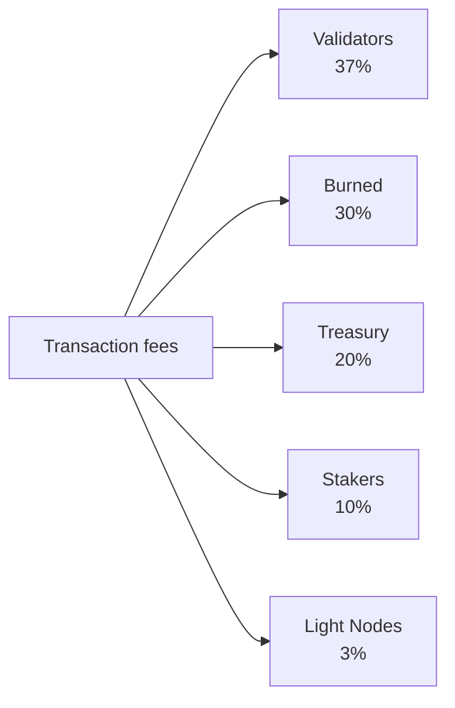

# Tokenomică

QoreChain folosește un model economic cu **ofertă fixă**, centrat pe tokenul nativ **QOR**. În loc să inflateze oferta în timp, rețeaua finanțează recompensele de staking dintr-un buget de emisie finit, prealocat, în timp ce un motor de ardere pe mai multe canale aplică o presiune deflaționistă susținută pe măsură ce utilizarea rețelei crește.

---

## Noțiuni de bază despre token

| Proprietate              | Valoare                                                    |
| --------------------- | -------------------------------------------------------- |
| **Token afișat**     | QOR                                                      |
| **Denominație de bază** | uqor                                                     |
| **Precizie zecimală** | 10^6 (1 QOR = 1.000.000 uqor)                            |
| **Ofertă totală**      | 4.500.000.000 QOR (fixă)                                |
| **Chain ID**          | `qorechain-vladi` (mainnet, EVM chain ID 9801)          |
| **Prefix Bech32**     | `qor` (conturi: `qor1...`, validatori: `qorvaloper...`) |

:::note
Cifrele de pe această pagină descriu **mainnet-ul** (`qorechain-vladi`, EVM chain ID **9801**), live din 7 iunie 2026 pe versiunea de lanț **v3.1.82**. Testnet-ul **`qorechain-diana`** (EVM chain ID **9800**) folosește același model economic.
:::

---

## Modelul de ofertă și emisie

QoreChain are o **ofertă totală fixă de 4.500.000.000 QOR**. QOR nou nu este niciodată emis pentru a inflata oferta. În schimb:

* **80.000.000 QOR (1,78% din ofertă)** au fost arși la Token Generation Event (TGE).
* Recompensele de staking sunt plătite dintr-un **buget de emisie finit de 590.000.000 QOR**, retras în timp pe un program descrescător.

Acesta este un **model cu ofertă fixă și un buget de emisie finit**, nu un model de inflație a ofertei. Odată ce bugetul de emisie este epuizat, nu mai apare nicio emisie de recompense suplimentară dincolo de ceea ce alocă guvernanța din bugetul rămas.

### Programul recompenselor de staking {#staking-reward-schedule}

Recompensele de staking sunt distribuite din bugetul de emisie de 590.000.000 QOR pe un program descrescător:

| Perioadă      | APY țintă              | Buget de emisie                  |
| ----------- | ----------------------- | -------------------------------- |
| Anul 1      | 8–12% APY               | 127.500.000 QOR                  |
| Anul 2      | 6–10% APY               | 106.250.000 QOR                  |
| Anii 3–4   | 5–8% APY                | 85.000.000 QOR pe an          |
| Anul 5+     | Determinat de guvernanță   | ~186.000.000 QOR rămași       |

Intervalele APY sunt ținte care depind de raportul de bonding; cifrele bugetului de emisie sunt plafoanele dure pentru QOR eliberat către stakeri în fiecare perioadă. Din Anul 5 încolo, cei ~186.000.000 QOR rămași sunt eliberați la o rată stabilită de guvernanță.

---

## x/burn — Motor de ardere pe mai multe canale

Modulul `x/burn` implementează un sistem de ardere a tokenurilor cu 10 canale. Fiecare token ars este eliminat permanent din oferta circulantă, creând o presiune deflaționistă susținută pe măsură ce utilizarea rețelei crește.

### Canale de ardere

| #  | Canal            | Sursă                     | Descriere                                   |
| -- | ------------------ | -------------------------- | --------------------------------------------- |
| 1  | `gas_fee`          | Taxe de tranzacție           | 30% din toate taxele de gas sunt arse                |
| 2  | `contract_create`  | Implementare de smart contract  | Taxă fixă de 100 QOR arsă per creare de contract |
| 3  | `ai_service`       | Taxe de utilizare a modulului AI       | 50% din taxele serviciilor AI sunt arse                 |
| 4  | `bridge_fee`       | Taxe de bridge cross-chain    | 100% din taxele de bridge sunt arse                  |
| 5  | `treasury_buyback` | Operațiuni de trezorerie        | Răscumpărare-și-ardere periodică din trezorerie       |
| 6  | `failed_tx`        | Gas din tranzacții eșuate     | 10% din gasul tranzacțiilor eșuate este ars    |
| 7  | `xqore_penalty`    | Penalități de ieșire timpurie xQORE | Sumele de penalitate dirijate prin ardere           |
| 8  | `auto_buyback`     | Program automat de răscumpărare  | Arderi automate la nivel de protocol               |
| 9  | `tge`              | Token generation event     | Arderi unice la genesis (80.000.000 QOR)       |
| 10 | `rollup_create`    | Implementare de rollup          | 1% din stake-ul de creare a rollup-ului ars            |

### Distribuția taxelor

Toate taxele de tranzacție colectate de rețea sunt împărțite între cinci destinații, după cum se arată mai jos. Cotele sunt impuse on-chain și însumează întotdeauna exact 100%.



Toate taxele de tranzacție colectate de rețea sunt împărțite între cinci destinații:

| Destinatar       | Cotă | Descriere                                                          |
| --------------- | ----- | -------------------------------------------------------------------- |
| **Validatori**  | 37%   | Distribuite setului de validatori activi proporțional cu stake-ul        |
| **Arse**      | 30%   | Eliminate permanent din ofertă prin canalul de ardere `gas_fee`       |
| **Trezorerie**    | 20%   | Alocate trezoreriei comunității pentru cheltuieli dirijate de guvernanță |
| **Stakeri**     | 10%   | Distribuite tuturor stakerilor QOR proporțional cu delegarea            |
| **Light Nodes** | 3%    | Distribuite nodurilor light pentru servirea datelor rețelei                  |

Cotele sunt impuse on-chain și trebuie să însumeze întotdeauna exact 100%.

### Parametrii de ardere

| Parametru              | Implicit                    | Descriere                              |
| ---------------------- | -------------------------- | ---------------------------------------- |
| `gas_burn_rate`        | 0.30                       | Fracțiunea din taxele de gas arse (30%)        |
| `contract_create_fee`  | 100.000.000 uqor (100 QOR) | Taxă fixă de ardere pentru crearea de contracte      |
| `ai_service_burn_rate` | 0.50                       | Fracțiunea din taxele serviciilor AI arse (50%) |
| `bridge_burn_rate`     | 1.00                       | Fracțiunea din taxele de bridge arse (100%)    |
| `failed_tx_burn_rate`  | 0.10                       | Fracțiunea din gasul tranzacțiilor eșuate arsă (10%)   |

Fiecare eveniment de ardere este înregistrat on-chain împreună cu sursa sa, suma, înălțimea blocului și hash-ul tranzacției asociate. Statisticile agregate pot fi interogate per canal și în total.

---

## x/xqore — Staking blocat și amplificare a guvernanței

Modulul `x/xqore` introduce **xQORE**, un derivat de staking blocat netransferabil. Utilizatorii blochează QOR pentru a emite xQORE la un raport de 1:1. Deținătorii de xQORE primesc putere de guvernanță amplificată și o cotă din penalitățile de ieșire redistribuite.

### Mecanismul de blocare

* **Blocare**: Trimite QOR către modulul xQORE pentru a emite xQORE la un raport de 1:1.
* **Pondere de guvernanță**: Deținătorii de xQORE primesc **putere de vot de guvernanță 2x** comparativ cu stakerii QOR standard.
* **Netransferabil**: xQORE nu poate fi trimis între conturi. Este legat de adresa de blocare.

### Programul penalităților de ieșire

Retragerea timpurie din xQORE atrage o penalitate care scade cu durata de blocare:

| Durată de blocare  | Rată de penalitate | Descriere                                |
| -------------- | ------------ | ------------------------------------------ |
| &lt; 30 de zile   | **50%**      | Jumătate din QOR blocat este pierdut            |
| 30 -- 90 de zile  | **35%**      | Penalitate semnificativă pentru blocări pe termen scurt   |
| 90 -- 180 de zile | **15%**      | Penalitate redusă pentru angajament pe termen mediu |
| > 180 de zile     | **0%**       | Retragere completă fără penalitate            |

### Redistribuirea prin rebasare PvP

Penalitățile colectate din ieșirile timpurii nu sunt pur și simplu distruse. În schimb, ele urmează un model de rebasare PvP (player-versus-player):

1. **50%** din sumele de penalitate sunt arse (dirijate prin `x/burn` prin canalul `xqore_penalty`).
2. **50%** sunt redistribuite pro-rata tuturor deținătorilor de xQORE rămași.

Acest lucru creează o dinamică cu sumă pozitivă pentru deținătorii pe termen lung: fiecare ieșire timpurie crește valoarea efectivă a pozițiilor xQORE rămase. Rebasările au loc la fiecare **100 de blocuri**.

### Parametrii xQORE

| Parametru               | Implicit                | Descriere                               |
| ----------------------- | ---------------------- | ----------------------------------------- |
| `governance_multiplier` | 2.0                    | Multiplicator de putere de vot pentru deținătorii de xQORE |
| `min_lock_amount`       | 1.000.000 uqor (1 QOR) | QOR minim necesar pentru blocare              |
| `penalty_burn_rate`     | 0.50                   | Fracțiunea din penalitățile de ieșire arsă (50%)   |
| `rebase_interval`       | 100 de blocuri             | Blocuri între evenimentele de rebasare PvP          |
| `enabled`               | true                   | Indicator de activare a modulului                    |

---

## x/inflation — Programul bugetului de emisie

În ciuda numelui său, modulul `x/inflation` **nu** inflatează oferta totală. Acesta guvernează eliberarea recompenselor de staking din bugetul de emisie finit de **590.000.000 QOR** conform [programului descrescător al recompenselor de staking](#staking-reward-schedule). Emisiile sunt calculate per epocă și distribuite stakerilor și validatorilor, retrăgând bugetul prealocat în loc să emită ofertă nouă.

### Mecanica epocilor

* **Lungimea epocii**: 17.280 de blocuri (\~1 zi la timpi de bloc de 5 secunde)
* **Blocuri pe an**: \~6.311.520
* La începutul fiecărei epoci, emisia programată pentru perioada curentă este eliberată din bugetul de emisie și distribuită stakerilor și validatorilor.
* Trackerul de epoci înregistrează numărul epocii curente, anul curent, blocul de start, QOR cumulativ eliberat din bugetul de emisie și bugetul rămas.

### Parametrii de inflație

| Parametru      | Implicit          | Descriere                                                |
| -------------- | ---------------- | ---------------------------------------------------------- |
| `schedule`     | descrescător        | Buget de emisie indexat pe perioade (vezi programul recompenselor de staking) |
| `epoch_length` | 17.280 de blocuri    | Blocuri per epocă de emisie                                  |
| `enabled`      | true             | Indicator de activare a modulului                                    |

---

## Dinamici deflaționiste

Deoarece oferta este fixă, iar emisia este retrasă dintr-un buget finit, dinamica netă a tokenului QoreChain tinde spre deflație pe măsură ce adopția crește:

```
Years 1-2:  Larger scheduled emissions from the budget offset burns → near-neutral supply
Years 3-4:  Scheduled emissions decline; burn volume grows with usage → convergence
Year 5+:    Emission budget is largely drawn down; burn channels (gas, bridge,
            contracts, rollups) scale with transaction volume → net deflationary
```

Cele 10 canale de ardere asigură că fiecare activitate majoră a rețelei elimină tokenuri din ofertă. Pe măsură ce volumul de tranzacții, utilizarea bridge-ului, apelurile către serviciile AI și implementările de rollup cresc, arderile cumulative se accelerează, în timp ce emisiile programate scad spre finalul bugetului finit.

---

## Ordinea ciclului de viață al modulelor

Modulele economice se execută într-o ordine specifică în timpul `EndBlocker`-ului fiecărui bloc:

```
x/burn → x/xqore → x/inflation → x/rlconsensus
```

1. **x/burn** — Procesează înregistrările de ardere în așteptare și actualizează statisticile agregate.
2. **x/xqore** — Execută rebasările PvP (la fiecare `rebase_interval` blocuri) și dirijează penalitățile către ardere.
3. **x/inflation** — Eliberează emisiile programate de recompense de staking din buget la limitele epocilor.
4. **x/rlconsensus** — Ajustează parametrii de consens pe baza semnalelor de învățare prin întărire PRISM.

Această ordonare asigură că arderile sunt finalizate înainte de rebasări, iar rebasările se finalizează înainte ca emisiile programate să fie eliberate, menținând tranziții de stare economică consistente.

## Resurse conexe

* [Parametrii lanțului](/appendix/chain-parameters) — valorile implicite economice și de consens canonice.
* [Staking și delegare](/user-guide/staking-and-delegation) — deleagă QOR și câștigă recompense.
* [Staking xQORE](/user-guide/xqore-staking) — mecanismul de staking cu rebasare PvP.
* [Recompense pentru noduri light](/light-node/rewards-and-monitoring) — cota de recompensă a nodurilor light.
