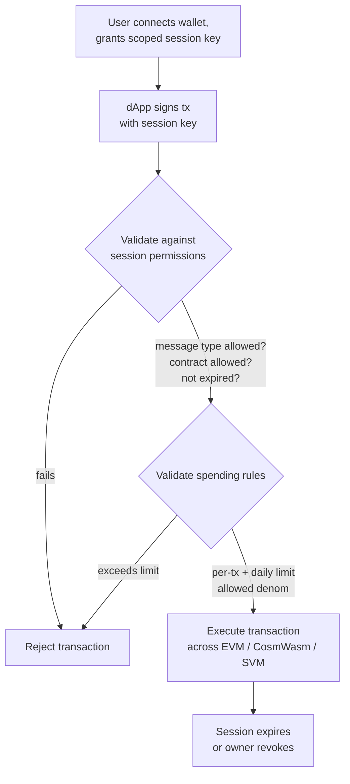

# Abstractizarea conturilor

QoreChain oferă **abstractizare a conturilor la nivel de protocol** prin modulul `x/abstractaccount`. Acest lucru permite conturi programabile cu reguli de autentificare flexibile, chei de sesiune, limite de cheltuieli și recuperare socială — totul fără a necesita o infrastructură externă de contracte inteligente.

:::note
Comenzile de mai jos folosesc mainnet-ul **`qorechain-vladi`**, activ din 7 iunie 2026, rulând versiunea de lanț **v3.1.80**. Înlocuiește cu `--chain-id qorechain-diana` pentru testnet.
:::

## Prezentare generală

Conturile tradiționale de blockchain sunt controlate de o singură cheie privată. Abstractizarea conturilor decuplează conceptul de „cine poate autoriza o tranzacție” de o singură cheie criptografică, permițând:

* **Conturi multisig** cu semnare pe bază de prag configurabil
* **Conturi cu recuperare socială** cu recuperare a cheilor pe bază de gardieni
* **Conturi pe bază de sesiune** cu permisiuni granulare, limitate în timp, pentru dApp-uri

Modulul `x/abstractaccount` implementează aceste capacități la nivelul protocolului, ceea ce înseamnă că funcționează în toate cele trei VM-uri (EVM, CosmWasm, SVM) și beneficiază de eficiență nativă a gazului.

*Un flux dApp pe bază de sesiune: o cheie de sesiune cu domeniu restrâns semnează o tranzacție, modulul o validează în raport cu sesiunea și cu regulile de cheltuieli, apoi o execută.*



## Tipuri de conturi

| Tip               | Descriere                               | Caz de utilizare               |
| ----------------- | --------------------------------------- | ------------------------------ |
| `multisig`        | Semnare pe bază de prag M-din-N         | Trezorerii DAO, portofele partajate |
| `social_recovery` | Recuperare a cheilor asistată de gardieni | Portofele de consumator, onboarding   |
| `session_based`   | Chei de sesiune delegate cu constrângeri | Sesiuni dApp, portofele mobile  |

## Crearea unui cont abstract

### Cont pe bază de sesiune

```bash
qorechaind tx abstractaccount create \
  --account-type session_based \
  --from mykey \
  --gas auto \
  -y
```

### Cont multisig

```bash
qorechaind tx abstractaccount create \
  --account-type multisig \
  --signers qor1alice...,qor1bob...,qor1carol... \
  --threshold 2 \
  --from mykey \
  --gas auto \
  -y
```

### Cont cu recuperare socială

```bash
qorechaind tx abstractaccount create \
  --account-type social_recovery \
  --guardians qor1guardian1...,qor1guardian2...,qor1guardian3... \
  --recovery-threshold 2 \
  --from mykey \
  --gas auto \
  -y
```

## Chei de sesiune

Cheile de sesiune sunt piatra de temelie a tipului de cont `session_based`. Îți permit să acorzi **permisiuni temporare, cu domeniu restrâns** unei chei secundare — perfecte pentru interacțiunile cu dApp-uri în care nu vrei să-ți expui cheia principală.

### Proprietăți cheie

| Proprietate           | Descriere                                            |
| --------------------- | ---------------------------------------------------- |
| **Permisiuni**        | Ce tipuri de mesaje poate semna cheia de sesiune     |
| **Expirare**          | Expirare automată după o durată configurabilă        |
| **Limite de cheltuieli** | Sumele maxime pe care le poate cheltui cheia de sesiune |
| **Contracte permise** | Restricționează interacțiunile la adrese de contract specifice |

### Acordarea unei chei de sesiune

```bash
qorechaind tx abstractaccount grant-session \
  --session-key qor1sessionkey... \
  --permissions "bank/MsgSend,wasm/MsgExecuteContract" \
  --expiry "2026-03-01T00:00:00Z" \
  --allowed-contracts qor1contract1...,0x1234...abcd \
  --from mykey \
  -y
```

### Revocarea unei chei de sesiune

```bash
qorechaind tx abstractaccount revoke-session \
  --session-key qor1sessionkey... \
  --from mykey \
  -y
```

### Listarea sesiunilor active

```bash
qorechaind query abstractaccount sessions <account-address>
```

## Reguli de cheltuieli

Regulile de cheltuieli adaugă bariere financiare conturilor abstracte, indiferent de tipul contului:

| Regulă           | Descriere                                       |
| ---------------- | ----------------------------------------------- |
| `daily_limit`    | Cheltuiala totală maximă pe o fereastră glisantă de 24 de ore |
| `per_tx_limit`   | Cheltuiala maximă per tranzacție individuală    |
| `allowed_denoms` | Restricționează ce denominații de token pot fi cheltuite |

### Setarea regulilor de cheltuieli

```bash
qorechaind tx abstractaccount update-spending-rules \
  --daily-limit 1000000000uqor \
  --per-tx-limit 100000000uqor \
  --allowed-denoms uqor \
  --from mykey \
  -y
```

### Interogarea regulilor curente

```bash
qorechaind query abstractaccount spending-rules <account-address>
```

### Exemplu de răspuns

```json
{
  "daily_limit": {
    "denom": "uqor",
    "amount": "1000000000"
  },
  "per_tx_limit": {
    "denom": "uqor",
    "amount": "100000000"
  },
  "allowed_denoms": ["uqor"],
  "daily_spent": {
    "denom": "uqor",
    "amount": "250000000"
  },
  "window_reset": "2026-02-27T00:00:00Z"
}
```

## Interogarea conturilor abstracte

### CLI

```bash
# Get full account configuration
qorechaind query abstractaccount account <address>

# List all abstract accounts (paginated)
qorechaind query abstractaccount list --limit 10
```

### JSON-RPC

```bash
curl -X POST http://localhost:8545 \
  -H "Content-Type: application/json" \
  -d '{
    "jsonrpc": "2.0",
    "method": "qor_getAbstractAccount",
    "params": ["0xYourAddress"],
    "id": 1
  }'
```

### Exemplu de răspuns pentru cont

```json
{
  "address": "qor1myaccount...",
  "account_type": "session_based",
  "owner": "qor1owner...",
  "active_sessions": 2,
  "spending_rules": {
    "daily_limit": "1000000000uqor",
    "per_tx_limit": "100000000uqor",
    "allowed_denoms": ["uqor"]
  },
  "created_at_height": 54321
}
```

## Fluxul de recuperare socială

Dacă proprietarul contului își pierde accesul la cheia principală, gardienii pot autoriza o rotație a cheilor.

1. **Proprietarul raportează cheia pierdută (sau un gardian inițiază):**

   ```bash
   qorechaind tx abstractaccount initiate-recovery \
     --account <account-address> \
     --new-owner qor1newkey... \
     --from guardian1 \
     -y
   ```

2. **Gardieni suplimentari aprobă** (trebuie atins `recovery_threshold`):

   ```bash
   qorechaind tx abstractaccount approve-recovery \
     --account <account-address> \
     --recovery-id <recovery-id> \
     --from guardian2 \
     -y
   ```

3. **Recuperarea se execută automat** odată ce pragul este atins. O **perioadă de blocare temporală** (implicit: 48 de ore) îi oferă proprietarului inițial șansa de a anula o încercare frauduloasă de recuperare.

## Integrarea cu dApp-uri

Cheile de sesiune permit experiențe dApp fluide:

1. **Utilizatorul își conectează portofelul** și creează o cheie de sesiune cu domeniu restrâns la contractul dApp-ului
2. **dApp-ul folosește cheia de sesiune** pentru a trimite tranzacții în numele utilizatorului
3. **Fără semnare repetată** — cheia de sesiune gestionează autorizarea în limitele permisiunilor sale
4. **Sesiunea expiră** automat sau utilizatorul o revocă oricând

Acest tipar este deosebit de util pentru:

* Portofele mobile, unde solicitările biometrice repetate sunt deranjante
* dApp-uri de gaming care au nevoie de semnare rapidă a tranzacțiilor
* Protocoale DeFi care execută mai multe operațiuni secvențiale

## Pașii următori

* [Rularea unui validator](/developer-guide/running-a-validator) — Configurează și operează un nod validator
* [Dezvoltare EVM](/developer-guide/evm-development) — Integrează conturi abstracte cu dApp-uri Solidity
* [Interoperabilitate între VM-uri](/developer-guide/cross-vm-interoperability) — Mesagerie între VM-uri cu conturi abstracte
