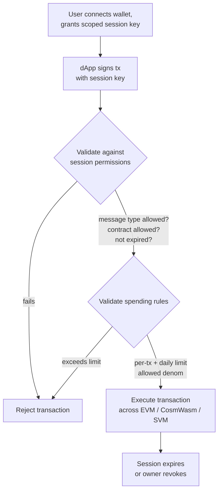

# Abstractizarea conturilor

QoreChain oferă **abstractizare a conturilor la nivel de protocol** prin modulul `x/abstractaccount`. Aceasta permite conturi programabile cu reguli flexibile de autentificare, chei de sesiune, limite de cheltuieli și recuperare socială — toate fără a necesita infrastructură externă de contracte inteligente.

:::note
Comenzile de mai jos folosesc mainnet-ul **`qorechain-vladi`**, activ din 7 iunie 2026 și rulând versiunea de lanț **v3.1.85**. Înlocuiți cu `--chain-id qorechain-diana` pentru testnet.
:::

## Prezentare generală

Conturile blockchain tradiționale sunt controlate de o singură cheie privată. Abstractizarea conturilor decuplează conceptul de „cine poate autoriza o tranzacție" de o singură cheie criptografică, permițând:

* **Conturi multisig** cu semnare cu prag configurabil
* **Conturi cu recuperare socială**, cu recuperarea cheii pe bază de gardieni
* **Conturi bazate pe sesiuni**, cu permisiuni granulare și limitate în timp pentru dApp-uri

Modulul `x/abstractaccount` implementează aceste capabilități la nivelul protocolului, ceea ce înseamnă că funcționează pe toate cele trei VM-uri (EVM, CosmWasm, SVM) și beneficiază de eficiența nativă a gazului.

*Un flux dApp bazat pe sesiune: o cheie de sesiune cu domeniu restrâns semnează o tranzacție, modulul o validează în raport cu sesiunea și regulile de cheltuieli, apoi o execută.*


```mermaid
flowchart TD
    A["User connects wallet,<br/>grants scoped session key"] --> B["dApp signs tx<br/>with session key"]
    B --> C{"Validate against<br/>session permissions"}
    C -- "message type allowed?<br/>contract allowed?<br/>not expired?" --> D{"Validate spending rules"}
    C -- "fails" --> R["Reject transaction"]
    D -- "per-tx + daily limit<br/>allowed denom" --> E["Execute transaction<br/>across EVM / CosmWasm / SVM"]
    D -- "exceeds limit" --> R
    E --> F["Session expires<br/>or owner revokes"]
```

## Tipuri de conturi

| Tip               | Descriere                                 | Caz de utilizare                    |
| ----------------- | ----------------------------------------- | ----------------------------------- |
| `multisig`        | Semnare cu prag M-din-N                   | Trezorerii DAO, portofele partajate |
| `social_recovery` | Recuperarea cheii asistată de gardieni    | Portofele de consum, onboarding     |
| `session_based`   | Chei de sesiune delegate, cu constrângeri | Sesiuni dApp, portofele mobile      |

## Crearea unui cont abstract

### Cont bazat pe sesiuni

```bash
qorechaind tx abstractaccount create \
  --account-type session_based \
  --from mykey \
  --gas auto \
  -y
```

### Cont multisig

```bash
qorechaind tx abstractaccount create \
  --account-type multisig \
  --signers qor1alice...,qor1bob...,qor1carol... \
  --threshold 2 \
  --from mykey \
  --gas auto \
  -y
```

### Cont cu recuperare socială

```bash
qorechaind tx abstractaccount create \
  --account-type social_recovery \
  --guardians qor1guardian1...,qor1guardian2...,qor1guardian3... \
  --recovery-threshold 2 \
  --from mykey \
  --gas auto \
  -y
```

## Chei de sesiune

Cheile de sesiune sunt piatra de temelie a tipului de cont `session_based`. Ele vă permit să acordați **permisiuni temporare, cu domeniu restrâns** unei chei secundare — perfect pentru interacțiunile cu dApp-uri în care nu doriți să vă expuneți cheia principală.

### Proprietăți cheie

| Proprietate              | Descriere                                                      |
| ------------------------ | -------------------------------------------------------------- |
| **Permisiuni**           | Ce tipuri de mesaje poate semna cheia de sesiune               |
| **Expirare**             | Expirare automată după o durată configurabilă                  |
| **Limite de cheltuieli** | Sumele maxime pe care le poate cheltui cheia de sesiune        |
| **Contracte permise**    | Restricționează interacțiunile la anumite adrese de contracte  |

### Acordarea unei chei de sesiune

```bash
qorechaind tx abstractaccount grant-session \
  --session-key qor1sessionkey... \
  --permissions "bank/MsgSend,wasm/MsgExecuteContract" \
  --expiry "2026-03-01T00:00:00Z" \
  --allowed-contracts qor1contract1...,0x1234...abcd \
  --from mykey \
  -y
```

### Revocarea unei chei de sesiune

```bash
qorechaind tx abstractaccount revoke-session \
  --session-key qor1sessionkey... \
  --from mykey \
  -y
```

### Listarea sesiunilor active

```bash
qorechaind query abstractaccount sessions <account-address>
```

## Reguli de cheltuieli

Regulile de cheltuieli adaugă garduri de protecție financiară conturilor abstracte, indiferent de tipul contului:

| Regulă           | Descriere                                                   |
| ---------------- | ----------------------------------------------------------- |
| `daily_limit`    | Cheltuiala totală maximă pe fereastră glisantă de 24 de ore |
| `per_tx_limit`   | Cheltuiala maximă per tranzacție individuală                |
| `allowed_denoms` | Restricționează ce denominări de tokenuri pot fi cheltuite  |

### Setarea regulilor de cheltuieli

```bash
qorechaind tx abstractaccount update-spending-rules \
  --daily-limit 1000000000uqor \
  --per-tx-limit 100000000uqor \
  --allowed-denoms uqor \
  --from mykey \
  -y
```

### Interogarea regulilor curente

```bash
qorechaind query abstractaccount spending-rules <account-address>
```

### Exemplu de răspuns

```json
{
  "daily_limit": {
    "denom": "uqor",
    "amount": "1000000000"
  },
  "per_tx_limit": {
    "denom": "uqor",
    "amount": "100000000"
  },
  "allowed_denoms": ["uqor"],
  "daily_spent": {
    "denom": "uqor",
    "amount": "250000000"
  },
  "window_reset": "2026-02-27T00:00:00Z"
}
```

## Autentificatori de portofele conectate — cheltuieli delegate {#authenticators}

Începând cu versiunea de lanț **v3.1.85** (construită pe modelul de permisiuni din v3.1.84), o **cheie de portofel extern conectată** — o cheie Phantom (ed25519) sau un cont MetaMask (secp256k1) — poate **cheltui din contul canonic post-cuantic** în condiții de privilegii minime, cu limite de cheltuieli și revocabile. Cheia externă nu produce niciodată o semnătură ML-DSA; un **relayer** trimite și plătește pentru anvelopa tranzacției (propria semnătură PQC hibridă a relayer-ului satisface cerințele de semnare ale lanțului), în timp ce semnătura autentificatorului asupra **octeților de semnat separați pe domenii și protejați împotriva reluării** constituie autorizarea.

### Înregistrarea unui autentificator {#register-authenticator}

Proprietarul contului înregistrează cheia externă cu `MsgRegisterAuthenticator` (o tranzacție obișnuită cu cheia rădăcină), atribuindu-i o schemă, permisiuni, o dată de expirare și limite opționale de cheltuieli:

```js
import { registerEthAuthenticatorMsg } from "@qorechain/wallet-adapter";

// Link a MetaMask account by its 20-byte address (EIP-191 verification):
const msg = registerEthAuthenticatorMsg({
  account: "qor1owner...",            // the canonical account
  ethAddress: "0xAbC...123",          // the MetaMask address to link
  permissions: ["evm"],               // least privilege — see the taxonomy below
  expirySeconds: 30 * 24 * 3600,      // ≤ 30 days recommended
  spendingRule: { perTxLimit: "100000000uqor", dailyLimit: "1000000000uqor" },
});
// Sign & broadcast this msg with the OWNER's normal hybrid-PQC signer.
```

O cheie Phantom se înregistrează în același mod cu `scheme: "ed25519"` și cheia publică Phantom. Revocarea este instantanee prin `MsgRevokeAuthenticator`.

### Taxonomia permisiunilor {#permission-taxonomy}

Unsprezece permisiuni canonice controlează ce poate face un autentificator înregistrat. Harta este de tip **fail-closed** (refuz implicit): un tip de mesaj fără mapare este refuzat.

| Permisiune | Acordă |
| --- | --- |
| `send` | Transferuri bank pe banda nativă |
| `delegate` / `withdraw` / `vote` | Staking, retragerea recompenselor, guvernanță |
| `evm` / `wasm` / `svm` | Execuție pe banda VM respectivă |
| `amm` / `ibc` / `deploy` | Operațiuni AMM, transferuri IBC, implementarea contractelor |
| `all` | Orice mesaj *delegabil* |

**Mesajele de gestionare a cheilor nu sunt niciodată delegabile** — `MsgRegisterAuthenticator`, `MsgRevokeAuthenticator`, înregistrarea/migrarea cheilor PQC și `MsgRotatePQCKey` necesită întotdeauna cheia rădăcină, astfel încât o cheie conectată nu își poate escalada niciodată propriile privilegii.

Citiți taxonomia live (cu `schema_version` pentru detectarea derivei) în loc să o codificați rigid:

```bash
curl -s https://api.qore.host/qorechain/abstractaccount/v1/permission_schema | jq
# or: qorechaind query abstractaccount permission-schema
```

### Cheltuirea printr-o cheie conectată {#execute-messages}

Două mesaje transportă acțiuni autorizate de autentificator. În ambele, relayer-ul este semnatarul/plătitorul de taxe al tranzacției; semnătura autentificatorului călătorește în interiorul mesajului.

**`MsgExecuteEVM`** — un apel sau transfer EVM **de la adresa `0x…` a contului canonic**. Autentificatorul semnează `sha256("qorechain-evm-auth-v1" ‖ chainId ‖ account ‖ pubkey ‖ to ‖ value ‖ data ‖ nonce)` (toate câmpurile cu prefix de lungime). Protecția împotriva reluării este propriul nonce EVM al contului.

**`MsgExecuteCosmos`** — un bank send pe banda nativă de la contul canonic. Autentificatorul semnează `sha256("qorechain-cosmos-auth-v1" ‖ chainId ‖ account ‖ pubkey ‖ to ‖ amount ‖ nonce)`. Protecția împotriva reluării este o **secvență per-autentificator** menținută de modul (un bank send nu incrementează nonce-ul contului). Trimiterile către sine sunt respinse.

:::caution Reguli pentru nonce
* `MsgExecuteEVM.nonce` = nonce-ul EVM **curent** al contului (`eth_getTransactionCount(account0x, "latest")`). În producție relayer-ul este un cont *diferit*, deci **nu** adăugați +1. Semnarea unui nonce învechit returnează codul `11`.
* `MsgExecuteCosmos.nonce` = secvența per-autentificator (interogați starea autentificatorului contului), **nu** secvența Cosmos a contului.
:::

**Exemplu Phantom** (browser: Phantom semnează, backend-ul dumneavoastră retransmite):

```js
import { buildPhantomExecuteCosmos } from "@qorechain/wallet-adapter";

// In the dApp: Phantom signs the digest with ed25519 signMessage.
const msg = await buildPhantomExecuteCosmos({
  provider: window.solana,            // Phantom
  chainId: "qorechain-vladi",
  account: "qor1owner...",            // canonical account being spent from
  to: "qor1recipient...",
  amount: { denom: "uqor", amount: "900000" },
  nonce: authSequence,                // per-authenticator sequence
});
// Send `msg` to your relayer; the relayer wraps it in a tx it signs
// (hybrid PQC) and broadcasts. The transfer moves the OWNER's funds.
```

**Exemplu MetaMask** (`personal_sign` EIP-191 de la adresa de 20 de octeți conectată):

```js
import { buildMetaMaskExecuteEvm } from "@qorechain/wallet-adapter";

const msg = await buildMetaMaskExecuteEvm({
  provider: window.ethereum,          // MetaMask (EIP-1193)
  chainId: "qorechain-vladi",
  account: "qor1owner...",
  to: "0xRecipient...",
  valueWei: 10n ** 16n,               // 0.01 QOR (18-dec EVM view)
  nonce: currentEvmNonce,             // eth_getTransactionCount(owner0x, "latest")
});
// Relay as above. The chain verifies the signature via EIP-191 + ecrecover
// against the registered 20-byte address.
```

Aceiași constructori există în [SDK-ul QoreChain](/sdk/guides/authenticators) pentru toate cele cinci limbaje, plus echivalente CLI:

```bash
# Produce the exact sign bytes the chain verifies (for custom signers):
qorechaind query abstractaccount auth-sign-cosmos <account> <to> <amount> <nonce>
qorechaind query abstractaccount auth-sign-evm <account> <to> <value> <data-hex> <nonce>

# Relay a pre-signed authorization:
qorechaind tx abstractaccount execute-cosmos <account> <to> <amount> <auth-pubkey> <auth-sig> <nonce> --from relayer -y
qorechaind tx abstractaccount execute-evm    <account> <to> <value> <data-hex> <auth-pubkey> <auth-sig> <nonce> --from relayer -y
```

### Coduri de eroare {#authenticator-errors}

Eșecurile de aplicare returnează coduri distincte (codespace `abstractaccount`), astfel încât portofelele să poată afișa mesajul potrivit:

| Cod | Semnificație | UX în portofel |
| --- | --- | --- |
| `5` | Limita de cheltuieli depășită (per tranzacție sau zilnică) | Afișați suma rămasă disponibilă |
| `6` | Autentificator expirat | „Expirat — reconectați-vă portofelul" |
| `10` | Permisiune refuzată (domeniu sau mesaj nedelegabil) | Afișați permisiunea lipsă |
| `11` | Reluare respinsă (nonce/secvență învechită) | Reinterogați nonce-ul și semnați din nou |

(Codespace `pqc`, codul `21` = verificarea semnăturii hibride a eșuat — o problemă de semnare pe partea relayer-ului, nu una de autorizare.)

### Interogări REST {#abstractaccount-rest}

Începând cu **v3.1.85**, interogările de citire ale modulului sunt servite și prin REST:

```
GET /qorechain/abstractaccount/v1/config
GET /qorechain/abstractaccount/v1/accounts
GET /qorechain/abstractaccount/v1/accounts/{address}
GET /qorechain/abstractaccount/v1/permission_schema
```

## Interogarea conturilor abstracte

### CLI

```bash
# Get full account configuration
qorechaind query abstractaccount account <address>

# List all abstract accounts (paginated)
qorechaind query abstractaccount list --limit 10
```

### JSON-RPC

```bash
curl -X POST http://localhost:8545 \
  -H "Content-Type: application/json" \
  -d '{
    "jsonrpc": "2.0",
    "method": "qor_getAbstractAccount",
    "params": ["0xYourAddress"],
    "id": 1
  }'
```

### Exemplu de răspuns pentru cont

```json
{
  "address": "qor1myaccount...",
  "account_type": "session_based",
  "owner": "qor1owner...",
  "active_sessions": 2,
  "spending_rules": {
    "daily_limit": "1000000000uqor",
    "per_tx_limit": "100000000uqor",
    "allowed_denoms": ["uqor"]
  },
  "created_at_height": 54321
}
```

## Fluxul de recuperare socială

Dacă proprietarul contului pierde accesul la cheia sa principală, gardienii pot autoriza o rotație a cheii.

1. **Proprietarul raportează cheia pierdută (sau un gardian inițiază):**

   ```bash
   qorechaind tx abstractaccount initiate-recovery \
     --account <account-address> \
     --new-owner qor1newkey... \
     --from guardian1 \
     -y
   ```

2. **Gardieni suplimentari aprobă** (trebuie atins `recovery_threshold`):

   ```bash
   qorechaind tx abstractaccount approve-recovery \
     --account <account-address> \
     --recovery-id <recovery-id> \
     --from guardian2 \
     -y
   ```

3. **Recuperarea se execută automat** odată ce pragul este atins. O **perioadă de blocare temporală** (implicit: 48 de ore) oferă proprietarului inițial șansa de a anula o tentativă frauduloasă de recuperare.

## Integrarea cu dApp-uri

Cheile de sesiune permit experiențe dApp fluide:

1. **Utilizatorul conectează portofelul** și creează o cheie de sesiune restrânsă la contractul dApp-ului
2. **dApp-ul folosește cheia de sesiune** pentru a trimite tranzacții în numele utilizatorului
3. **Fără semnări repetate** — cheia de sesiune gestionează autorizarea în limita permisiunilor sale
4. **Sesiunea expiră** automat sau utilizatorul o revocă în orice moment

Acest tipar este util în special pentru:

* Portofele mobile, unde solicitările biometrice repetate sunt deranjante
* dApp-uri de gaming care au nevoie de semnarea rapidă a tranzacțiilor
* Protocoale DeFi care execută mai multe operațiuni secvențiale

## Pașii următori

* [Rularea unui validator](/developer-guide/running-a-validator) — Configurați și operați un nod validator
* [Dezvoltare EVM](/developer-guide/evm-development) — Integrați conturi abstracte cu dApp-uri Solidity
* [Interoperabilitate cross-VM](/developer-guide/cross-vm-interoperability) — Mesagerie cross-VM cu conturi abstracte
