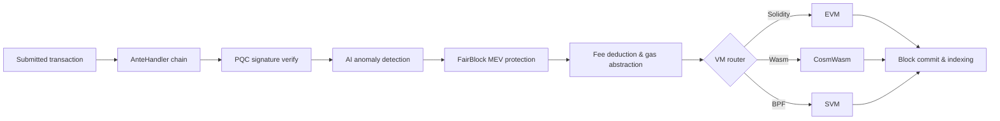

# Prezentare generală a arhitecturii

QoreChain este un nod blockchain modular compus din trei procese principale — nodul de lanț, sidecar-ul AI și indexatorul de blocuri — susținute de o bază de date Postgres și monitorizate prin Prometheus și Grafana. Rețeaua principală (`qorechain-vladi`, EVM chain ID **9801**) este activă din 7 iunie 2026 pe versiunea de lanț **v3.1.77**, alături de o rețea de test paralelă (`qorechain-diana`, EVM chain ID **9800**). Lanțul este construit pe Cosmos SDK v0.53. Diagrama următoare prezintă structura componentelor la nivel înalt.

Ciclul de viață al tranzacției de mai jos rezumă modul în care o tranzacție trimisă circulă prin nod — de la lanțul de decoratori AnteHandler (verificări de securitate și taxe) la execuția VM și decontarea pe lanț:



```
┌────────────────────────────────────────────────────────────────────────────┐
│                            QoreChain Node                                  │
│                                                                            │
│  ┌──────────────────── Virtual Machines ──────────────────────┐           │
│  │  ┌───────┐    ┌──────────┐    ┌───────┐                   │           │
│  │  │  EVM  │    │ CosmWasm │    │  SVM  │                   │           │
│  │  │(Sol.) │◄──►│ (Wasm)   │◄──►│ (BPF) │                   │           │
│  │  └───┬───┘    └────┬─────┘    └───┬───┘                   │           │
│  │      └─────────┬───┘──────────────┘                       │           │
│  │           x/crossvm (bridge)                               │           │
│  └────────────────────────────────────────────────────────────┘           │
│                                                                            │
│  ┌────────────────────── Tokenomics ─────────────────────────┐           │
│  │  ┌──────┐   ┌───────┐   ┌───────────┐                    │           │
│  │  │x/burn│   │x/xqore│   │x/inflation│                    │           │
│  │  │10 ch.│   │lock/  │   │finite     │                    │           │
│  │  │37/30/│   │unlock │   │emission   │                    │           │
│  │  │20/10/│   │PvP    │   │590M       │                    │           │
│  │  │3     │   │       │   │budget     │                    │           │
│  │  └──────┘   └───────┘   └───────────┘                    │           │
│  └────────────────────────────────────────────────────────────┘           │
│                                                                            │
│  ┌──────────── IBC / Bridges ────────────────────────────────┐           │
│  │  ┌──────────┐  ┌──────────┐  ┌───────────┐  ┌──────────┐ │           │
│  │  │x/bridge  │  │x/babylon │  │x/abstract │  │x/gas     │ │           │
│  │  │37 QCB +  │  │BTC re-   │  │ account   │  │abstract. │ │           │
│  │  │8 IBC     │  │staking   │  │session key│  │multi-tok │ │           │
│  │  └────┬─────┘  └────┬─────┘  └───────────┘  └──────────┘ │           │
│  │  QCB Bridge     Babylon IBC   ERC-4337-like   ibc/USDC    │           │
│  │  PQC-signed     BTC finality  social recov.   ibc/ATOM    │           │
│  │  36 ext chains  checkpoint    spending rules  fee convert  │           │
│  │  ┌──────────┐                                              │           │
│  │  │x/fair    │  5-Lane Prioritization: PQC|MEV|AI|Def|Free │           │
│  │  │ block    │  tIBE encrypted mempool framework           │           │
│  │  └──────────┘                                              │           │
│  └────────────────────────────────────────────────────────────┘           │
│                                                                            │
│  ┌──── Rollup Development Kit ───────────────────────────────┐           │
│  │  ┌──────────┐  ┌──────────┐  ┌───────────┐  ┌──────────┐ │           │
│  │  │ x/rdk    │  │Settlement│  │ DA Router │  │ Profiles │ │           │
│  │  │ 4 modes: │  │Optimistic│  │ Native    │  │ defi     │ │           │
│  │  │ opt/zk/  │  │ZK/Based/ │  │ Celestia* │  │ gaming   │ │           │
│  │  │ based/   │  │Sovereign │  │ Both      │  │ nft      │ │           │
│  │  │ sovereign│  │          │  │           │  │ social/  │ │           │
│  │  │          │  │          │  │           │  │ general  │ │           │
│  │  └────┬─────┘  └────┬─────┘  └───────────┘  └──────────┘ │           │
│  │  Bank escrow    Auto-finalize  SHA-256 commit  AI-assisted │           │
│  │  Burn on create EndBlocker     Blob pruning    PRISM sugg. │           │
│  │  → x/multilayer (RegisterSidechain + AnchorState)          │           │
│  └────────────────────────────────────────────────────────────┘           │
│                                                                            │
│  ┌──────────────┐ ┌──────┐ ┌────────────┐ ┌─────┐                       │
│  │x/rlconsensus │ │ x/ai │ │x/reputation│ │x/qca│                       │
│  │  PRISM (RL)  │ │      │ │            │ │     │                       │
│  └──────┬───────┘ └──┬───┘ └────┬──────┘ └──┬──┘                       │
│   PPO MLP         AI Engine   Scoring    CPoS Pools                      │
│   Obs/Action      Fraud Det.  Decay      Bonding                         │
│   Circuit Brk     Fee Opt.    Sigmoid    Slashing                        │
│   Rollup Adv.     TEE/FL                 QDRW Gov                        │
│                                                                            │
│  ┌──────┐ ┌──────────┐                                                   │
│  │x/pqc │ │ x/multi  │                                                   │
│  └──┬───┘ └────┬─────┘                                                   │
│  Dilithium    Layer Router                                                │
│  ML-KEM       Sidechains                                                  │
│  Hybrid Sig   + Rollups                                                   │
│  SHAKE-256                                                                │
│                                                                            │
│  ┌──────┐ ┌───────┐                                                      │
│  │x/svm │ │x/cross│                                                      │
│  └──┬───┘ └───┬───┘                                                      │
│  BPF Exec   CrossVM Msg                                                   │
└────────┬──────┬───────────────────────────────────────┬───────────────────┘
         │      │                                       │
   ┌─────┴─────┐│                              ┌───────┴──────┐
   │libqorepqc ││                              │  Indexer     │
   │(Rust PQC) ││                              │  (Postgres)  │
   └───────────┘│                              └──────────────┘
   ┌───────────┐│  ┌──────────┐
   │libqoresvm ││  │AI Sidecar│
   │(Rust BPF) │└──│ (gRPC)   │
   └───────────┘   └──────────┘
```

## Componentele nodului

QoreChain rulează ca trei procese cooperante, fiecare cu propriul modul Go și binar:

| Componentă         | Descriere                                                                                                                                                                                                                                                                                                                                                                                              | Locație                   |
| ------------------ | ---------------------------------------------------------------------------------------------------------------------------------------------------------------------------------------------------------------------------------------------------------------------------------------------------------------------------------------------------------------------------------------------------- | ------------------------- |
| **qorechain-node** | Nodul blockchain principal. Rulează QoreChain Consensus Engine, execută toate modulele personalizate, gestionează toate cele trei runtime-uri VM și expune puncte finale RPC, REST, gRPC și JSON-RPC.                                                                                                                                                                                                  | `qorechain-core/`         |
| **ai-sidecar**     | Un serviciu gRPC care oferă capabilități avansate de inferență AI susținute de QCAI Backend. Sidecar-ul gestionează cereri de inferență care depășesc domeniul de aplicare al agentului RL pe lanț, cum ar fi analiza limbajului natural și recunoașterea de tipare complexe. Comunică cu nodul prin gRPC pe portul 50051.                                                                            | `qorechain-core/sidecar/` |
| **block-indexer**  | Un ascultător WebSocket care se abonează la blocuri și tranzacții noi de la punctul final RPC al nodului, analizează evenimentele și scrie date structurate într-o bază de date Postgres pentru interogare rapidă de către exploratoare și API-uri.                                                                                                                                                    | `qorechain-core/indexer/` |

## Porturi

| Port  | Protocol       | Serviciu                                                                          |
| ----- | -------------- | --------------------------------------------------------------------------------- |
| 26657 | HTTP/WebSocket | QoreChain Consensus Engine RPC (blocuri, tranzacții, stare de consens)            |
| 1317  | HTTP           | REST API (puncte finale de interogare, difuzare tranzacții)                       |
| 9090  | gRPC           | Puncte finale gRPC de interogare și tranzacții                                    |
| 8545  | HTTP           | EVM JSON-RPC (spațiile de nume `eth_`, `web3_`, `net_`, `txpool_`, `qor_`)        |
| 8546  | WebSocket      | EVM JSON-RPC (abonamente WebSocket)                                               |
| 8899  | HTTP           | SVM JSON-RPC (compatibil Solana: `getAccountInfo`, `getBalance`, `getSlot`, etc.) |
| 50051 | gRPC           | AI Sidecar (cereri de inferență de la nod)                                        |
| 5432  | TCP            | Postgres (stocarea indexatorului de blocuri)                                      |
| 9091  | HTTP           | Metrici Prometheus                                                                |
| 3000  | HTTP           | Tablouri de bord Grafana                                                          |

## Harta modulelor

QoreChain înregistrează **peste 45 de module de geneză, inclusiv peste 20 de module personalizate**, grupate după funcție:

**Securitate**

* `x/pqc` — Criptografie post-cuantică: Dilithium-5, ML-KEM-1024, hibrid secp256k1 (ECDSA) + ML-DSA-87, SHAKE-256, agilitate algoritmică

**AI și învățare automată**

* `x/ai` — Rutarea tranzacțiilor, detectarea anomaliilor, detectarea fraudei, optimizarea taxelor, atestarea TEE, învățare federată
* `x/reputation` — Scorarea reputației validatorilor pe baza mai multor factori cu decădere temporală
* `x/rlconsensus` — Agent RL pe lanț (PPO MLP), reglarea dinamică a consensului, întrerupător de circuit, consultanță pentru rollup-uri — stratul de optimizare PRISM

**Consens**

* `x/qca` — Triple-Pool Composite PoS (RPoS/DPoS/PoS) pe QoreChain Consensus Engine, curbă de legare personalizată, slashing progresiv, guvernanță QDRW

**Mașini virtuale**

* `x/vm` — Rutarea VM și gestionarea ciclului de viață
* `x/svm` — Runtime SVM: implementare/execuție BPF, colectare de chirie, RPC compatibil Solana
* `x/crossvm` — Comunicare între VM-uri: precompilare EVM-CosmWasm + evenimente asincrone SVM

**Tokenomică și lichiditate**

* `x/burn` — 10 canale de ardere, distribuția taxelor prin EndBlocker (împărțire 37/30/20/10/3)
* `x/xqore` — Staking impulsionat de guvernanță: lock/unlock, penalizări de ieșire graduale, rebase PvP
* `x/inflation` — Emisie cu ofertă fixă dintr-un buget finit de recompense pentru staking pe un program multianual
* `x/amm` — Lichiditate pe lanț / formator automat de piață

**Punți și interoperabilitate**

* `x/bridge` — 37 de configurații QCB (36 de lanțuri externe + buclă internă QoreChain) pe fiecare tip major de lanț, atestări semnate PQC, întrerupătoare de circuit
* `x/babylon` — Restaking BTC prin Babylon Protocol, puncte de control pe epoci
* `x/multilayer` — Gestionarea straturilor de sidechain/paychain/rollup, ancorarea stării

**Extensii de guvernanță și licențiere**

* `x/abstractaccount` — Conturi inteligente: multisig, recuperare socială, chei de sesiune, reguli de cheltuire
* `x/fairblock` — Protecție MEV: cadru de mempool criptat cu IBE de prag
* `x/gasabstraction` — Plata taxelor de gaz cu mai multe token-uri: conversie de taxe ibc/USDC, ibc/ATOM
* `x/license` — Licențiere de lanț

**Rollup-uri**

* `x/rdk` — Rollup Development Kit: 4 moduri de decontare (optimistic, zk, based, sovereign), profiluri presetate, DA nativ, escrow bancar

## Lanțul AnteHandler

Fiecare tranzacție trece prin următorul lanț de decoratori înainte de execuție. Decoratorii rulează în ordine; orice decorator poate respinge tranzacția.

```
SetUpContext
  → CircuitBreaker
    → PQCVerify
      → PQCHybridVerify
        → AIAnomaly
          → FairBlock
            → SVMComputeBudget
              → SVMDeductFee
                → Extension
                  → ValidateBasic
                    → TxTimeout
                      → Memo
                        → MinGasPrice
                          → ConsumeTxSize
                            → GasAbstraction
                              → DeductFee
                                → SetPubKey
                                  → ValidateSigCount
                                    → SigGasConsume
                                      → SigVerify
                                        → IncrementSequence
```

Decoratorii cheie rulează în următoarea secvență (fiecare decorator rulează în ordine și poate respinge o tranzacție):

1. **PQCVerify** — Modulul `x/pqc`. Verifică semnăturile Dilithium-5 pe tranzacțiile marcate PQC.
2. **PQCHybridVerify** — Modulul `x/pqc`. Verifică semnăturile hibride duale secp256k1 (ECDSA) + ML-DSA-87.
3. **AIAnomaly** — Modulul `x/ai`. Rulează detectarea anomaliilor prin isolation forest și scorarea riscului.
4. **FairBlock** — Modulul `x/fairblock`. Procesează tranzacțiile criptate tIBE pentru protecția MEV.
5. **SVMComputeBudget** — Modulul `x/svm`. Validează și alocă unități de calcul pentru programele SVM.
6. **SVMDeductFee** — Modulul `x/svm`. Deduce taxele de execuție specifice SVM.
7. **GasAbstraction** — Modulul `x/gasabstraction`. Convertește token-urile de taxă non-native (USDC, ATOM) înainte de deducere.

## Stiva Docker Compose

Stiva completă de dezvoltare rulează ca o implementare Docker Compose cu șase servicii pe o rețea bridge partajată (`qorechain-net`):

| Serviciu         | Imagine                    | Scop                                                  |
| ---------------- | -------------------------- | ----------------------------------------------------- |
| `qorechain-node` | `qorechain-core:latest`    | Nod de lanț cu toate modulele, VM-urile și punctele finale RPC |
| `ai-sidecar`     | `qorechain-sidecar:latest` | Serviciu de inferență AI (gRPC + QCAI Backend)        |
| `block-indexer`  | `qorechain-indexer:latest` | Indexator de blocuri/tranzacții (WebSocket + Postgres) |
| `postgres`       | `postgres:16-alpine`       | Bază de date pentru indexatorul de blocuri            |
| `prometheus`     | `prom/prometheus:latest`   | Colectarea și stocarea metricilor                     |
| `grafana`        | `grafana/grafana:latest`   | Tablouri de bord de monitorizare și alertare          |

Porniți stiva completă:

```bash
docker compose up -d
```

Toate datele persistente sunt stocate în volume Docker denumite: `node-data`, `postgres-data`, `prometheus-data` și `grafana-data`.

## Conexe

* [Arhitectura multistrat](/architecture/multilayer-architecture) — înregistrarea sidechain-urilor și ancorarea stării.
* [Mecanismul de consens](/architecture/consensus-mechanism) — producția de blocuri, finalitatea și slashing.
* [PRISM Consensus Engine](/architecture/prism-consensus-engine) — optimizarea parametrilor bazată pe AI.
* [Securitate post-cuantică](/architecture/post-quantum-security) — semnături Dilithium-5 în întreaga stivă.
