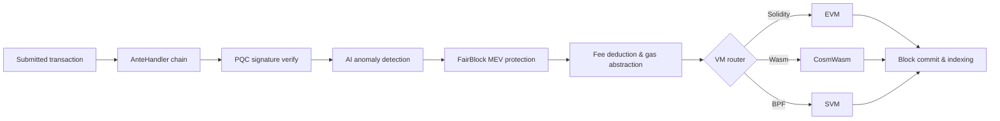

# Prezentare generală a arhitecturii

QoreChain este un nod blockchain modular compus din trei procese principale — nodul de chain, sidecar-ul AI și indexerul de blocuri — susținute de o bază de date Postgres și monitorizate prin Prometheus și Grafana. Mainnet-ul (`qorechain-vladi`, EVM chain ID **9801**) rulează live din 7 iunie 2026 pe versiunea de chain **v3.1.92**, alături de un testnet paralel (`qorechain-diana`, EVM chain ID **9800**). Chain-ul este construit pe Cosmos SDK v0.53. Diagrama de mai jos arată dispunerea componentelor la nivel înalt.

Ciclul de viață al tranzacției de mai jos rezumă modul în care o tranzacție trimisă traversează nodul — de la lanțul de decoratori AnteHandler (verificări de securitate și taxe) până la execuția în VM și decontarea on-chain:


```mermaid
flowchart LR
    Tx[Submitted transaction] --> Ante[AnteHandler chain]
    Ante --> PQC[PQC signature verify]
    PQC --> AI[AI anomaly detection]
    AI --> Fair[FairBlock MEV protection]
    Fair --> Fee[Fee deduction & gas abstraction]
    Fee --> Router{VM router}
    Router -->|Solidity| EVM[EVM]
    Router -->|Wasm| Wasm[CosmWasm]
    Router -->|BPF| SVM[SVM]
    EVM --> Commit[Block commit & indexing]
    Wasm --> Commit
    SVM --> Commit
```

```
┌────────────────────────────────────────────────────────────────────────────┐
│                            QoreChain Node                                  │
│                                                                            │
│  ┌──────────────────── Virtual Machines ──────────────────────┐           │
│  │  ┌───────┐    ┌──────────┐    ┌───────┐                   │           │
│  │  │  EVM  │    │ CosmWasm │    │  SVM  │                   │           │
│  │  │(Sol.) │◄──►│ (Wasm)   │◄──►│ (BPF) │                   │           │
│  │  └───┬───┘    └────┬─────┘    └───┬───┘                   │           │
│  │      └─────────┬───┘──────────────┘                       │           │
│  │           x/crossvm (bridge)                               │           │
│  └────────────────────────────────────────────────────────────┘           │
│                                                                            │
│  ┌────────────────────── Tokenomics ─────────────────────────┐           │
│  │  ┌──────┐   ┌───────┐   ┌───────────┐                    │           │
│  │  │x/burn│   │x/xqore│   │x/inflation│                    │           │
│  │  │10 ch.│   │lock/  │   │finite     │                    │           │
│  │  │37/30/│   │unlock │   │emission   │                    │           │
│  │  │20/10/│   │PvP    │   │590M       │                    │           │
│  │  │3     │   │       │   │budget     │                    │           │
│  │  └──────┘   └───────┘   └───────────┘                    │           │
│  └────────────────────────────────────────────────────────────┘           │
│                                                                            │
│  ┌──────────── IBC / Bridges ────────────────────────────────┐           │
│  │  ┌──────────┐  ┌──────────┐  ┌───────────┐  ┌──────────┐ │           │
│  │  │x/bridge  │  │x/babylon │  │x/abstract │  │x/gas     │ │           │
│  │  │37 QCB +  │  │BTC re-   │  │ account   │  │abstract. │ │           │
│  │  │8 IBC     │  │staking   │  │session key│  │multi-tok │ │           │
│  │  └────┬─────┘  └────┬─────┘  └───────────┘  └──────────┘ │           │
│  │  QCB Bridge     Babylon IBC   ERC-4337-like   ibc/USDC    │           │
│  │  PQC-signed     BTC finality  social recov.   ibc/ATOM    │           │
│  │  36 ext chains  checkpoint    spending rules  fee convert  │           │
│  │  ┌──────────┐                                              │           │
│  │  │x/fair    │  5-Lane Prioritization: PQC|MEV|AI|Def|Free │           │
│  │  │ block    │  tIBE encrypted mempool framework           │           │
│  │  └──────────┘                                              │           │
│  └────────────────────────────────────────────────────────────┘           │
│                                                                            │
│  ┌──── Rollup Development Kit ───────────────────────────────┐           │
│  │  ┌──────────┐  ┌──────────┐  ┌───────────┐  ┌──────────┐ │           │
│  │  │ x/rdk    │  │Settlement│  │ DA Router │  │ Profiles │ │           │
│  │  │ 4 modes: │  │Optimistic│  │ Native    │  │ defi     │ │           │
│  │  │ opt/zk/  │  │ZK/Based/ │  │ Celestia* │  │ gaming   │ │           │
│  │  │ based/   │  │Sovereign │  │ Both      │  │ nft      │ │           │
│  │  │ sovereign│  │          │  │           │  │ social/  │ │           │
│  │  │          │  │          │  │           │  │ general  │ │           │
│  │  └────┬─────┘  └────┬─────┘  └───────────┘  └──────────┘ │           │
│  │  Bank escrow    Auto-finalize  SHA-256 commit  AI-assisted │           │
│  │  Burn on create EndBlocker     Blob pruning    PRISM sugg. │           │
│  │  → x/multilayer (RegisterSidechain + AnchorState)          │           │
│  └────────────────────────────────────────────────────────────┘           │
│                                                                            │
│  ┌──────────────┐ ┌──────┐ ┌────────────┐ ┌─────┐                       │
│  │x/rlconsensus │ │ x/ai │ │x/reputation│ │x/qca│                       │
│  │  PRISM (RL)  │ │      │ │            │ │     │                       │
│  └──────┬───────┘ └──┬───┘ └────┬──────┘ └──┬──┘                       │
│   PPO MLP         AI Engine   Scoring    CPoS Pools                      │
│   Obs/Action      Fraud Det.  Decay      Bonding                         │
│   Circuit Brk     Fee Opt.    Sigmoid    Slashing                        │
│   Rollup Adv.     TEE/FL                 QDRW Gov                        │
│                                                                            │
│  ┌──────┐ ┌──────────┐                                                   │
│  │x/pqc │ │ x/multi  │                                                   │
│  └──┬───┘ └────┬─────┘                                                   │
│  Dilithium    Layer Router                                                │
│  ML-KEM       Sidechains                                                  │
│  Hybrid Sig   + Rollups                                                   │
│  SHAKE-256                                                                │
│                                                                            │
│  ┌──────┐ ┌───────┐                                                      │
│  │x/svm │ │x/cross│                                                      │
│  └──┬───┘ └───┬───┘                                                      │
│  BPF Exec   CrossVM Msg                                                   │
└────────┬──────┬───────────────────────────────────────┬───────────────────┘
         │      │                                       │
   ┌─────┴─────┐│                              ┌───────┴──────┐
   │libqorepqc ││                              │  Indexer     │
   │(Rust PQC) ││                              │  (Postgres)  │
   └───────────┘│                              └──────────────┘
   ┌───────────┐│  ┌──────────┐
   │libqoresvm ││  │AI Sidecar│
   │(Rust BPF) │└──│ (gRPC)   │
   └───────────┘   └──────────┘
```

## Componentele nodului

QoreChain rulează sub forma a trei procese care cooperează, fiecare cu propriul modul Go și binar propriu:

| Componentă          | Descriere                                                                                                                                                                                                                                                                                          | Locație                  |
| ------------------ | ---------------------------------------------------------------------------------------------------------------------------------------------------------------------------------------------------------------------------------------------------------------------------------------------------- | ------------------------- |
| **qorechain-node** | Nodul central al blockchain-ului. Rulează motorul de consens QoreChain, execută toate modulele custom, gestionează toate cele trei runtime-uri de VM și expune endpoint-uri RPC, REST, gRPC și JSON-RPC.                                                                                                                      | `qorechain-core/`         |
| **ai-sidecar**     | Un serviciu gRPC care oferă capabilități avansate de inferență AI, susținute de QCAI Backend. Sidecar-ul gestionează cererile de inferență care depășesc scopul agentului RL de pe chain, cum ar fi analiza limbajului natural și recunoașterea de tipare complexe. Comunică cu nodul prin gRPC pe portul 50051. | `qorechain-core/sidecar/` |
| **block-indexer**  | Un listener WebSocket care se abonează la blocurile și tranzacțiile noi de la endpoint-ul RPC al nodului, parsează evenimentele și scrie date structurate într-o bază de date Postgres pentru interogare rapidă de către explorere și API-uri.                                                                                                          | `qorechain-core/indexer/` |

## Porturi

| Port  | Protocol       | Serviciu                                                                           |
| ----- | -------------- | --------------------------------------------------------------------------------- |
| 26657 | HTTP/WebSocket | RPC-ul motorului de consens QoreChain (blocuri, tranzacții, stare consens)            |
| 1317  | HTTP           | API REST (endpoint-uri de interogare, broadcast tranzacții)                                 |
| 9090  | gRPC           | Endpoint-uri gRPC pentru interogări și tranzacții                                              |
| 8545  | HTTP           | EVM JSON-RPC (namespace-uri `eth_`, `web3_`, `net_`, `txpool_`, `qor_`)              |
| 8546  | WebSocket      | EVM JSON-RPC (subscripții WebSocket)                                            |
| 8899  | HTTP           | SVM JSON-RPC (compatibil Solana: `getAccountInfo`, `getBalance`, `getSlot` etc.) |
| 50051 | gRPC           | Sidecar AI (cereri de inferență de la nod)                                     |
| 5432  | TCP            | Postgres (stocare pentru indexerul de blocuri)                                                  |
| 9091  | HTTP           | Metrici Prometheus                                                                |
| 3000  | HTTP           | Dashboard-uri Grafana                                                                |

## Harta modulelor

QoreChain înregistrează **45+ module la genesis, dintre care 20+ module custom**, grupate după funcție:

**Securitate**

* `x/pqc` — Criptografie post-cuantică: Dilithium-5, ML-KEM-1024, hibrid secp256k1 (ECDSA) + ML-DSA-87, SHAKE-256, agilitate a algoritmilor

**AI și Machine Learning**

* `x/ai` — Rutare tranzacții, detecție anomalii, detecție fraudă, optimizare taxe, atestare TEE, învățare federată
* `x/reputation` — Scoring de reputație a validatorilor pe bază de factori multipli, cu decădere temporală
* `x/rlconsensus` — Agent RL on-chain (PPO MLP), ajustare dinamică a consensului, circuit breaker, consultanță pentru rollup-uri — stratul de optimizare PRISM

**Consens**

* `x/qca` — Composite PoS cu trei pool-uri (RPoS/DPoS/PoS) pe motorul de consens QoreChain, curbă de bonding custom, slashing progresiv, guvernanță QDRW

**Mașini virtuale**

* `x/vm` — Rutare și gestionare a ciclului de viață al VM-urilor
* `x/svm` — Runtime SVM: deployment/execuție BPF, colectare de rent, RPC compatibil Solana
* `x/crossvm` — Comunicare cross-VM: precompile EVM-CosmWasm + evenimente asincrone SVM

**Tokenomics și lichiditate**

* `x/burn` — 10 canale de burn, distribuție a taxelor în EndBlocker (împărțire 37/30/20/10/3)
* `x/xqore` — Staking cu bonus de guvernanță: lock/unlock, penalități de ieșire graduale, rebase PvP
* `x/inflation` — Emisiune cu ofertă fixă dintr-un buget finit de recompense de staking, pe un calendar multianual
* `x/amm` — Lichiditate on-chain / automated market maker

**Punți și interoperabilitate**

* `x/bridge` — 37 de configurații QCB (36 de chain-uri externe + loopback QoreChain) acoperind fiecare tip major de chain, atestări semnate PQC, circuit breaker-e
* `x/babylon` — Restaking BTC prin Babylon Protocol, checkpoint-uri de epocă
* `x/multilayer` — Gestionare a stratului de sidechain/paychain/rollup, ancorare de stare

**Guvernanță și extensii de licențiere**

* `x/abstractaccount` — Conturi inteligente: multisig, recuperare socială, chei de sesiune, reguli de cheltuire
* `x/fairblock` — Protecție MEV: framework de mempool criptat prin IBE cu prag
* `x/gasabstraction` — Plată de gas cu token multiplu: conversie taxe ibc/USDC, ibc/ATOM
* `x/license` — Licențiere chain

**Rollup-uri**

* `x/rdk` — Rollup Development Kit: 4 moduri de decontare (optimistic, zk, based, sovereign), profile presetate, DA nativ, escrow în bank

## Lanțul AnteHandler

Fiecare tranzacție trece prin următorul lanț de decoratori înainte de execuție. Decoratorii rulează în ordine; oricare dintre ei poate respinge tranzacția.

```
SetUpContext
  → CircuitBreaker
    → PQCVerify
      → PQCHybridVerify
        → AIAnomaly
          → FairBlock
            → SVMComputeBudget
              → SVMDeductFee
                → Extension
                  → ValidateBasic
                    → TxTimeout
                      → Memo
                        → MinGasPrice
                          → ConsumeTxSize
                            → GasAbstraction
                              → DeductFee
                                → SetPubKey
                                  → ValidateSigCount
                                    → SigGasConsume
                                      → SigVerify
                                        → IncrementSequence
```

Decoratorii cheie rulează în următoarea secvență (fiecare decorator rulează în ordine și poate respinge o tranzacție):

1. **PQCVerify** — Modulul `x/pqc`. Verifică semnăturile Dilithium-5 pe tranzacțiile marcate PQC.
2. **PQCHybridVerify** — Modulul `x/pqc`. Verifică semnăturile hibride duale secp256k1 (ECDSA) + ML-DSA-87.
3. **AIAnomaly** — Modulul `x/ai`. Rulează detecția de anomalii prin isolation forest și scoring de risc.
4. **FairBlock** — Modulul `x/fairblock`. Procesează tranzacțiile criptate tIBE pentru protecție MEV.
5. **SVMComputeBudget** — Modulul `x/svm`. Validează și alocă unități de calcul pentru programele SVM.
6. **SVMDeductFee** — Modulul `x/svm`. Deduce taxele de execuție specifice SVM.
7. **GasAbstraction** — Modulul `x/gasabstraction`. Convertește token-urile de taxă non-native (USDC, ATOM) înainte de deducere.

## Stack-ul Docker Compose

Stack-ul complet de dezvoltare rulează ca un deployment Docker Compose cu șase servicii, pe o rețea bridge partajată (`qorechain-net`):

| Serviciu          | Imagine                      | Scop                                             |
| ---------------- | -------------------------- | --------------------------------------------------- |
| `qorechain-node` | `qorechain-core:latest`    | Nodul de chain cu toate modulele, VM-urile și endpoint-urile RPC |
| `ai-sidecar`     | `qorechain-sidecar:latest` | Serviciu de inferență AI (gRPC + QCAI Backend)          |
| `block-indexer`  | `qorechain-indexer:latest` | Indexer de blocuri/tranzacții (WebSocket + Postgres)    |
| `postgres`       | `postgres:16-alpine`       | Baza de date pentru indexerul de blocuri                      |
| `prometheus`     | `prom/prometheus:latest`   | Colectare și stocare de metrici                       |
| `grafana`        | `grafana/grafana:latest`   | Dashboard-uri de monitorizare și alertare               |

Pornește stack-ul complet:

```bash
docker compose up -d
```

Toate datele persistente sunt stocate în volume Docker denumite: `node-data`, `postgres-data`, `prometheus-data` și `grafana-data`.

## Legături

* [Arhitectură multilayer](/architecture/multilayer-architecture) — înregistrarea sidechain-urilor și ancorarea stării.
* [Mecanism de consens](/architecture/consensus-mechanism) — producția de blocuri, finalitatea și slashing-ul.
* [Motorul de consens PRISM](/architecture/prism-consensus-engine) — optimizarea parametrilor asistată de AI.
* [Securitate post-cuantică](/architecture/post-quantum-security) — semnături Dilithium-5 pe tot stack-ul.
