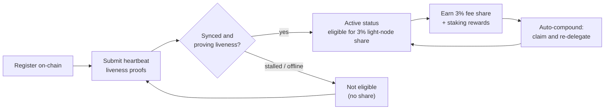

# Recompense și monitorizare

Un nod light atât **câștigă recompense**, cât și **trebuie să rămână sănătos** pentru a continua să le câștige. Această pagină descrie cota de recompensă de 3% pentru nodurile light, cum funcționează staking-ul delegat și auto-compunerea și cum să monitorizezi nodul.

## Cota de 3% din recompensa de bloc

Distribuția taxelor în QoreChain rezervă o **cotă fixă de 3% pentru nodurile light** care servesc date de rețea. Aceasta este una dintre cele cinci destinații din împărțirea recompenselor protocolului — validatori (37%), ars (30%), trezorerie (20%), stakeri (10%) și **noduri light (3%)** — impusă on-chain. Vezi [Tokenomics](/architecture/tokenomics) pentru defalcarea completă.

Pentru a fi eligibil pentru această cotă, un nod trebuie să fie **înregistrat on-chain și să demonstreze activ liveness** prin dovezi de heartbeat. Un nod care este înregistrat, dar offline nu câștigă cota. Vezi [Înregistrare și licențiere](/light-node/registration-and-licensing) pentru cum funcționează înregistrarea și heartbeat-urile.

*Eligibilitate pentru recompense: înregistrează-te on-chain, demonstrează liveness prin heartbeat-uri pentru a ajunge la statusul activ, câștigă cota de 3%, apoi compune-o automat în stake.*



## Cum funcționează recompensele

Dincolo de cota pentru nodurile light, nodul gestionează stake-ul delegat și recompensele de staking pe care acesta le produce. Comportamentul este determinat de secțiunea `[delegation]` din `config.toml`.

### Staking delegat cu împărțire pe mai mulți validatori

Poți delega către **mai mulți validatori** în loc să concentrezi stake-ul pe unul singur. Nodul urmărește fiecare delegare și cota de stake atribuită fiecărui validator folosind **ponderi de împărțire** configurabile, astfel încât să poți distribui riscul în întreg setul.

### Auto-compunerea recompenselor

Nodul poate **revendica recompense și le poate re-delega automat** la un interval configurabil. În mod implicit, auto-compunerea este activată la un interval de `1h`, cu un prag minim de recompensă (în `uqor`) care trebuie să se acumuleze înainte de a fi declanșată o revendicare. Compunerea transformă recompensele câștigate în stake suplimentar fără intervenție manuală.

### Reechilibrare conștientă de reputație

Când reechilibrarea este activată, nodul poate **muta delegarea către validatori cu reputație mai mare** automat, sub rezerva unui scor minim de reputație configurabil. Astfel, stake-ul rămâne la lucru cu validatori care performează bine, în loc să fie lăsat la unii care s-au degradat.

### Inspectarea recompenselor și delegărilor

Ediția SX expune comenzi pentru a inspecta această stare:

```bash
lightnode-sx delegation   # current delegations and their split
lightnode-sx rewards      # pending staking rewards (uqor)
lightnode-sx validators   # the bonded validator set
```

În ediția UX, vizualizarea **Delegation** afișează aceleași informații despre delegări și recompense în browser.

## Monitorizare

Menținerea nodului sănătos este ceea ce îl păstrează eligibil pentru recompense. Există trei lucruri pe care merită să le urmărești.

### Telemetrie

Telemetria în timp real acoperă validatorii, consensul/rețeaua, bridge-ul și tokenomics, fiecare reîmprospătat la propriul interval (configurat sub `[telemetry]` în `config.toml`). Din CLI:

```bash
lightnode-sx status    # node and light-client sync status
lightnode-sx network   # recent synced headers and latest height
```

Ediția UX afișează aceleași date în direct în vizualizările sale **Overview**, **Network**, **Bridge** și **Tokenomics** — vezi [Ediția UX](/light-node/ux-edition).

### Sănătatea sincronizării și a heartbeat-ului

Comanda `status` raportează ID-ul chain-ului, ultima înălțime a blocului, dacă chain-ul recuperează (catching up) și înălțimea sincronizată a light client-ului, precum și starea de sincronizare. Un nod care este înregistrat, sincronizat și în funcțiune continuă să trimită **dovezi de liveness prin heartbeat** și astfel rămâne eligibil pentru cota de recompensă. Aceste heartbeat-uri sunt produse printr-un **pipeline de tranzacții co-semnat PQC** (hibrid Dilithium-5 / ML-DSA-87), în concordanță cu setarea implicită PQC obligatorie a chain-ului — vezi [Înregistrare și licențiere](/light-node/registration-and-licensing#pqc-cosigned-heartbeat-pipeline) pentru cum funcționează pipeline-ul și cum să activezi heartbeat-urile on-chain. Dacă `status` arată că nodul este blocat sau nu se sincronizează, este posibil să nu reușească să demonstreze liveness — investighează înainte ca eligibilitatea să fie afectată.

### Sănătate prin self-test

Dacă suspectezi o problemă cu stiva criptografică, rulează self-test-ul PQC oricând:

```bash
lightnode-sx selftest
```

Acesta rulează keygen → semnare → verificare → detectarea modificărilor (cinci verificări) și iese cu cod diferit de zero la orice eșec. Acesta este cel mai rapid mod de a exclude o bibliotecă `libqorepqc` defectă sau lipsă atunci când diagnostichezi probleme ale nodului. Vezi [Ediția SX](/light-node/sx-edition) pentru defalcarea completă a self-test-ului.

## Unde să mergi mai departe

- [Înregistrare și licențiere](/light-node/registration-and-licensing) — înregistrează-te și rămâi activ.
- [Tokenomics](/architecture/tokenomics) — modelul complet de recompense și ardere.
