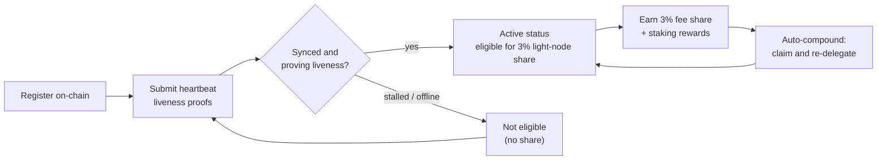

# Recompense și monitorizare

Un light node atât **câștigă recompense**, cât și **trebuie să rămână sănătos** pentru a continua să le câștige. Această pagină acoperă cota de 3% din recompensele pentru light nodes, modul în care funcționează delegarea stake-ului și auto-compunerea, precum și modul de monitorizare a nodului.

## Cota de 3% din recompensa pe bloc

Distribuția comisioanelor din QoreChain rezervă o cotă fixă de **3% pentru light nodes** care furnizează date de rețea. Aceasta este una dintre cele cinci destinații din împărțirea recompenselor protocolului — validatori (37%), arse (30%), trezorerie (20%), stakeri (10%) și **light nodes (3%)** — impusă on-chain. Consultați [Tokenomics](/architecture/tokenomics) pentru detalierea completă.

Pentru a fi eligibil pentru această cotă, un nod are nevoie de trei lucruri, verificate on-chain, nu auto-declarate: o licență activă `lightnode_operator`, un minimum de **1.000 QOR delegați** — calculat ca total pe toți validatorii cărora le delegați, nu per validator — și o taxă de înregistrare on-chain de **1 QOR**. Participarea este de asemenea plafonată la nivel de rețea la **10.000 de light nodes**. Consultați [Registration and Licensing](/light-node/registration-and-licensing) pentru modul în care funcționează înregistrarea și licențierea, inclusiv stadiul actual al înscrierii în programul de recompense.

Odată înregistrat și cu stake delegat, menținerea eligibilității ține de a rămâne activ. Un nod are nevoie de cel puțin **80% uptime** și trebuie să continue să trimită dovezi de liveness prin heartbeat la un interval de aproximativ **1.000 de blocuri (~39 de minute)**.

**Fereastra de trimitere este îngustă la ambele capete, nu doar în partea de întârziere.** Un heartbeat este acceptat doar între aproximativ **ultimul heartbeat acceptat + 1.000 de blocuri și +1.100 de blocuri** (aproximativ 4 minute, o dată la fiecare ~39 de minute) — dacă trimiteți prea devreme, este respins la fel ca atunci când trimiteți prea târziu.

**Ratarea ferestrei costă uptime, nu înregistrarea.** Un nod care ratează fereastra este marcat inactiv și încetează să mai câștige cota, dar chiar următorul heartbeat reușit îl reactivează — nu este nevoie de re-înregistrare. De reținut și că propriul contor intern al daemonului către următorul heartbeat continuă să avanseze chiar dacă o încercare de trimitere eșuează și se resetează la restart, astfel încât un nod poate ajunge marcat inactiv fără nicio vină a operatorului; verificați `status` în loc să presupuneți că o marcare inactivă înseamnă că ceva este configurat greșit.

:::note Ce dovedește de fapt un heartbeat
Un heartbeat reușit dovedește că cheia operatorului a semnat la timp — nu dovedește că un nod rulează continuu software-ul complet. Tratați-l ca pe o semnătură de liveness, nu ca pe o „verificare a unui nod activ”.
:::

:::note `last_heartbeat` este o înălțime de bloc, nu un timestamp
Dacă interogați direct înregistrarea on-chain a unui nod, `last_heartbeat` este o înălțime de bloc, iar o valoare de `0` înseamnă că nodul nu a trimis niciodată încă unul — lanțul raportează în acest caz înălțimea sa `registered_at` ca înlocuitor. Citirea acesteia ca un calcul naiv de timp scurs face ca un nod proaspăt înregistrat să pară cu milioane de blocuri întârziat.
:::

*Eligibilitate pentru recompense: dețineți o licență activă on-chain și stake-ul minim delegat, înregistrați-vă, apoi continuați să dovediți liveness prin heartbeat-uri pentru a rămâne peste pragurile de uptime și de interval al heartbeat-ului care mențin cota activă.*


```mermaid
flowchart LR
    A["Register on-chain"] --> B["Submit heartbeat<br/>liveness proofs"]
    B --> C{"Synced and<br/>proving liveness?"}
    C -- "yes" --> D["Active status<br/>eligible for 3% light-node share"]
    C -- "stalled / offline" --> E["Not eligible<br/>(no share)"]
    E --> B
    D --> F["Earn 3% fee share<br/>+ staking rewards"]
    F --> G["Auto-compound:<br/>claim and re-delegate"]
    G --> D
```

## Cum funcționează recompensele

Pe lângă cota light-node, nodul gestionează stake-ul delegat și recompensele de staking pe care acesta le produce. Comportamentul este controlat de secțiunea `[delegation]` din `config.toml`.

### Staking delegat cu împărțire pe mai mulți validatori

Puteți delega către **mai mulți validatori** în loc să concentrați stake-ul pe unul singur. Nodul urmărește fiecare delegare și cota de stake alocată fiecărui validator folosind **ponderi de împărțire (split weights)** configurabile, astfel încât să puteți distribui riscul pe întregul set.

### Auto-compunerea recompenselor

Nodul poate **revendica recompensele și le poate re-delega automat** la un interval configurabil. Implicit, auto-compunerea este activată la un interval de `1h`, cu un prag minim de recompensă (în `uqor`) care trebuie acumulat înainte ca o revendicare să fie declanșată. Compunerea transformă recompensele câștigate în stake suplimentar fără intervenție manuală.

### Rebalansare bazată pe reputație

Când rebalansarea este activată, nodul poate **muta delegarea automat către validatori cu reputație mai mare**, sub rezerva unui scor minim de reputație configurabil. Astfel stake-ul continuă să lucreze cu validatori care performează bine, în loc să rămână la cei a căror performanță a scăzut.

### Inspectarea recompenselor și a delegărilor

Ediția SX expune comenzi pentru a inspecta această stare:

```bash
lightnode-sx delegation   # current delegations and their split
lightnode-sx rewards      # pending staking rewards (uqor)
lightnode-sx validators   # the bonded validator set
```

În ediția UX, vizualizarea **Delegation** afișează aceleași informații despre delegări și recompense în browser.

## Monitorizare

Menținerea nodului sănătos este ceea ce îl păstrează eligibil pentru recompense. Există trei lucruri care merită urmărite.

### Telemetrie

Telemetria în timp real acoperă validatorii, consensul/rețeaua, bridge-ul și tokenomics, fiecare fiind reîmprospătat la propriul interval (configurat sub `[telemetry]` în `config.toml`). Din CLI:

```bash
lightnode-sx status    # node and light-client sync status
lightnode-sx network   # recent synced headers and latest height
```

Ediția UX afișează aceleași date live în vizualizările **Overview**, **Network**, **Bridge** și **Tokenomics** — consultați [UX Edition](/light-node/ux-edition).

### Starea de sincronizare și de heartbeat

Comanda `status` raportează ID-ul lanțului, înălțimea celui mai recent bloc, dacă lanțul este în curs de recuperare (catching up) și înălțimea sincronizată, respectiv starea de sincronizare a light client-ului. Un nod care este înregistrat, sincronizat și în funcțiune continuă să trimită **dovezi de liveness prin heartbeat** și astfel rămâne eligibil pentru cota de recompense. Aceste heartbeat-uri sunt produse printr-un **pipeline de tranzacții co-semnate PQC** (hibrid Dilithium-5 / ML-DSA-87), în concordanță cu setarea implicită a lanțului care impune PQC — consultați [Registration and Licensing](/light-node/registration-and-licensing#pqc-cosigned-heartbeat-pipeline) pentru modul în care funcționează pipeline-ul și cum se activează heartbeat-urile on-chain. Dacă `status` arată nodul blocat sau nesincronizat, este posibil să nu reușească să dovedească liveness — investigați înainte ca eligibilitatea să fie afectată.

### Starea autotestării

Dacă suspectați o problemă cu stiva criptografică, rulați oricând autotestul PQC:

```bash
lightnode-sx selftest
```

Acesta rulează keygen → sign → verify → tamper-detection (cinci verificări) și iese cu cod diferit de zero la orice eșec. Este cea mai rapidă modalitate de a exclude o problemă la stiva de semnare post-cuantică atunci când diagnosticați probleme ale nodului. Consultați [SX Edition](/light-node/sx-edition) pentru detalierea completă a autotestului.

## Unde continuați

- [Registration and Licensing](/light-node/registration-and-licensing) — înregistrați-vă și rămâneți activ.
- [Tokenomics](/architecture/tokenomics) — modelul complet de recompense și ardere.
