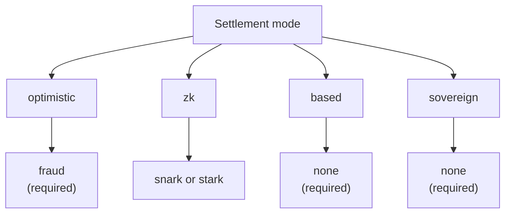

# Prezentare generală a rollup-urilor

**Rollup Development Kit (RDK)** al QoreChain — modulul `x/rdk` — le permite dezvoltatorilor să lanseze rollup-uri specifice aplicației care se decontează pe QoreChain. Fiecare rollup este un mediu de execuție independent, cu propriul timp de bloc, mașină virtuală, model de comisioane și secvențiere, moștenind în același timp garanțiile QoreChain privind securitatea, criptografia post-cuantică și disponibilitatea datelor.

:::caution
RDK și stratul de decontare a rollup-urilor reprezintă o capabilitate în plină evoluție. Tratează modurile de decontare, sistemele de dovezi, presetările și maturitatea per funcționalitate descrise în această secțiune ca intenție de proiectare supusă schimbării și validează orice implementare pe testnet-ul **`qorechain-diana`** înainte de a viza mainnet-ul (**`qorechain-vladi`**, EVM chain ID **9801**, versiunea de lanț **v3.1.77**).
:::

Pentru referința modulului la nivel mai jos — parametrii modulului, detaliile interne ale ciclului de viață, integrarea burn și ancorarea multistrat — vezi pagina **[Rollup Development Kit](/architecture/rollup-development-kit)** din secțiunea Arhitectură. Această secțiune Rollup-uri este ghidul practic orientat către dezvoltator: ce este RDK, ce paradigmă să alegi, cum să faci deploy, cum funcționează disponibilitatea datelor și cum se decontează retragerile de pe L2 înapoi pe L1.

---

## Ce îți oferă RDK

Un rollup creat prin RDK grupează patru aspecte configurabile:

| Aspect | Ce controlează | Opțiuni |
| ------- | ---------------- | ------- |
| **Mod de decontare** | Cum sunt verificate și finalizate pe QoreChain tranzițiile de stare ale rollup-ului | `optimistic`, `zk`, `based`, `sovereign` |
| **Sistem de dovezi** | Mecanismul criptografic sau economic care susține decontarea | `fraud`, `snark`, `stark`, `none` |
| **Mod secvențiator** | Cine ordonează tranzacțiile înainte de decontare | `dedicated`, `shared`, `based` |
| **Disponibilitatea datelor** | Unde sunt publicate datele tranzacțiilor astfel încât oricine să poată reconstrui starea | `native`, `celestia`, `both` |

Fiecare rollup este înregistrat cu un `rollup-id` unic, susținut de o garanție (stake bond) în QOR și i se atribuie un status de ciclu de viață (`pending`, `active`, `paused`, `stopped`). Vezi **[Deploying a Rollup](/rollups/deploying-a-rollup)** pentru fluxul complet de creare și ciclu de viață.

---

## Ce face RDK-ul QoreChain diferit

Dincolo de elementele de bază ale oricărui kit de rollup, RDK-ul QoreChain expune trei capabilități care depind de Layer 1 al QoreChain și pe care niciun kit construit pe un strat de bază non-post-cuantic și non-AI nu le poate oferi — plus un auto-challenger de tip watchtower. RDK este livrat în cinci limbaje (TypeScript, Python, Go, Rust, Java), toate aflate în prezent la **v0.4.0**.

| Element diferențiator | Ce face |
| -------------- | ------------ |
| **[Bonuri de decontare rezistente cuantic](/rollups/settlement-receipts)** | Transformă o ancoră de decontare într-un bon portabil verificabil **complet offline** sub o semnătură post-cuantică (ML-DSA-87 / Dilithium-5) — identic octet cu octet în toate cele cinci clienturi. |
| **[QCAI Rollup Copilot](/rollups/qcai-copilot)** | Agregă serviciile AI/RL on-chain ale QoreChain (agent de politică de comisioane, recomandări, investigații de fraudă, întrerupătoare de circuit) într-o consultanță read-only, în limbaj simplu, pentru un singur rollup. |
| **[Apeluri Multi-VM cross-VM](/rollups/multi-vm)** | Apelează un contract CosmWasm dintr-un contract de rollup EVM/Solidity prin precompilul cross-VM (`0x…0901`). |
| **[Watchtower](/rollups/watchtower)** | Un cadru de auto-challenger pentru rollup-uri optimiste care scoate la suprafață batch-uri noi și termenele ferestrei de contestare și contestă batch-urile invalide față de predicatul tău de validitate. |

Vezi **[Why QoreChain RDK](/rollups/why)** pentru raționamentul complet și exemplele de cod.

---

## Cele patru paradigme de decontare

RDK-ul QoreChain acceptă patru moduri distincte de decontare, fiecare cu ipoteze de încredere, caracteristici de finalitate și cerințe de dovadă diferite. Combinația dintre modul de decontare și sistemul de dovezi este validată on-chain — o pereche incompatibilă este respinsă la creare. Diagrama de mai jos asociază fiecare mod de decontare cu sistemul său de dovezi valid.

### Optimistic

Rollup-urile optimiste presupun implicit că batch-urile trimise sunt valide și se bazează pe **dovezi de fraudă** pentru soluționarea disputelor.

* **Sistem de dovezi**: `fraud` — dovezi de fraudă interactive
* **Secvențiator**: `dedicated` sau `shared`
* **Finalitate**: Întârziată până când o fereastră de contestare configurabilă expiră fără o contestare reușită
* **Dispute**: Oricine poate trimite o contestare prin dovadă de fraudă împotriva unui batch trimis în interiorul ferestrei; o contestare reușită respinge batch-ul

### ZK (Zero-Knowledge)

Rollup-urile ZK atașează o dovadă criptografică de validitate fiecărui batch, demonstrând corectitudinea tranziției de stare fără reexecuție.

* **Sistem de dovezi**: `snark` (dovezi succinte) sau `stark` (dovezi transparente, fără setup de încredere)
* **Secvențiator**: `dedicated` sau `shared`
* **Finalitate**: La verificarea unei dovezi valide — nu este necesară o fereastră de contestare
* **Maturitate**: Verificarea ZK și STARK este încă în curs de maturizare. Tratează decontarea ZK ca nefiind încă întărită pentru producție și validează pe testnet. Vezi **[ZK / STARK & Withdrawals](/rollups/zk-stark-withdrawals)** pentru detalii.

### Based

Rollup-urile based deleagă secvențierea tranzacțiilor către proposerii QoreChain (L1), moștenind liveness-ul și rezistența la cenzură ale lanțului gazdă.

* **Sistem de dovezi**: `none` — proposerii L1 sunt sursa de adevăr pentru ordonare
* **Secvențiator**: `based` (obligatoriu — impus prin validare on-chain)
* **Finalitate**: Urmează confirmarea lanțului gazdă
* **Compromis**: Cel mai simplu model operațional, întrucât validatorii QoreChain se ocupă de secvențiere, în detrimentul controlului latenței de secvențiator dedicat

### Sovereign

Rollup-urile sovereign rulează propriul consens și se autosecvențiază. Ele ancorează starea pe QoreChain pentru verificabilitate, dar nu depind de lanțul gazdă pentru finalitate.

* **Sistem de dovezi**: `none`
* **Secvențiator**: gestionat de rollup
* **Finalitate**: Independentă — determinată de consensul propriu al rollup-ului
* **Ancorarea stării**: Rădăcinile de stare sunt postate pe QoreChain pentru transparență, dar lanțul gazdă nu le impune

---

## Compatibilitatea sistemelor de dovezi

Modul de decontare restricționează ce sisteme de dovezi sunt valide. Aceste perechi sunt impuse la crearea unui rollup.

| Mod de decontare | `fraud` | `snark` | `stark` | `none` |
| --------------- | :-----: | :-----: | :-----: | :----: |
| **optimistic**  | Obligatoriu | — | — | — |
| **zk**          | — | Acceptat | Acceptat | — |
| **based**       | — | — | — | Obligatoriu |
| **sovereign**   | — | — | — | Obligatoriu |

---

## Moduri de secvențiator

Secvențiatorul determină cine ordonează tranzacțiile într-un bloc de rollup înainte de decontare.

| Mod | Cine secvențiază | Note |
| ---- | ------------- | ----- |
| **`dedicated`** | O singură adresă de operator desemnată | Cea mai mică latență; necesită încredere în operator pentru liveness și ordonare corectă |
| **`shared`** | Un set partajat de secvențiatori | Ordonarea distribuită în cadrul setului; supraîncărcare de coordonare ușor mai mare |
| **`based`** | Proposerii L1 ai QoreChain | Moștenește securitatea validatorilor lanțului gazdă și rezistența la cenzură; obligatoriu pentru decontarea `based` |

---

## Alegerea unei paradigme

| Dacă vrei... | Ia în calcul |
| -------------- | -------- |
| Cea mai simplă configurare operațională, cu validatorii QoreChain secvențiind | **based** |
| Finalitate rapidă cu garanții criptografice (în curs de maturizare) | **zk** (`snark` / `stark`) |
| Un model bine înțeles, cu soluționare economică a disputelor | **optimistic** (`fraud`) |
| Independență deplină cu propriul consens, ancorată pentru verificabilitate | **sovereign** |

Nu ești sigur de unde să începi? RDK include **profiluri presetate** care grupează aceste alegeri pentru categorii comune de aplicații — vezi **[Preset Profiles](/rollups/preset-profiles)** — și o interogare `suggest-profile` care recomandă unul pornind de la o descriere în limbaj simplu a cazului tău de utilizare.

Pentru dezvoltatori, RDK este livrat și ca SDK public TypeScript **`@qorechain/rdk`** plus generatorul de schelet **`create-qorechain-rollup`**, care acționează același modul on-chain din cod — vezi **[Deploying a Rollup](/rollups/deploying-a-rollup#deploy-with-the-typescript-rdk-qorechainrdk)**.

## Conexe

* [Deploying a Rollup](/rollups/deploying-a-rollup) — lansează un rollup din CLI sau din RDK-ul TypeScript.
* [Preset Profiles](/rollups/preset-profiles) — pachete cu un singur clic pentru categorii comune de aplicații.
* [Data Availability](/rollups/data-availability) — routerul DA nativ și stocarea de blob-uri.
* [ZK / STARK Withdrawals](/rollups/zk-stark-withdrawals) — fluxuri de retragere susținute de dovezi.
