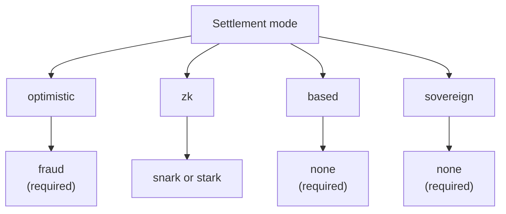

# Prezentare generală a rollup-urilor

**Rollup Development Kit (RDK)** de la QoreChain — modulul `x/rdk` — le permite dezvoltatorilor să lanseze rollup-uri specifice aplicațiilor, care se decontează pe QoreChain. Fiecare rollup este un mediu de execuție independent, cu propriul timp de bloc, propria mașină virtuală, propriul model de comisioane și propria secvențiere, moștenind în același timp garanțiile QoreChain privind securitatea, criptografia post-cuantică și disponibilitatea datelor.

:::caution
RDK și stratul de decontare a rollup-urilor reprezintă o capabilitate în evoluție activă. Tratați modurile de decontare, sistemele de dovezi, preseturile și maturitatea per funcționalitate descrise în această secțiune ca intenție de proiectare supusă schimbării și validați orice implementare pe testnetul **`qorechain-diana`** înainte de a viza mainnetul (**`qorechain-vladi`**, EVM chain ID **9801**, versiunea lanțului **v3.1.95**).
:::

Pentru referința de nivel inferior a modulului — parametrii modulului, mecanismele interne ale ciclului de viață, integrarea burn și ancorarea multistrat — consultați pagina **[Rollup Development Kit](/architecture/rollup-development-kit)** din secțiunea Arhitectură. Această secțiune Rollups este ghidul practic orientat către dezvoltatori: ce este RDK, ce paradigmă să alegeți, cum să implementați, cum funcționează disponibilitatea datelor și cum se decontează retragerile de la L2 înapoi la L1.

---

## Ce vă oferă RDK

Un rollup creat prin RDK grupează patru aspecte configurabile:

| Aspect | Ce controlează | Opțiuni |
| ------- | ---------------- | ------- |
| **Modul de decontare** | Cum sunt verificate și finalizate pe QoreChain tranzițiile de stare ale rollup-ului | `optimistic`, `zk`, `based`, `sovereign` |
| **Sistemul de dovezi** | Mecanismul criptografic sau economic care susține decontarea | `fraud`, `snark`, `stark`, `none` |
| **Modul de secvențiere** | Cine ordonează tranzacțiile înainte de a fi decontate | `dedicated`, `shared`, `based` |
| **Disponibilitatea datelor** | Unde sunt publicate datele tranzacțiilor, astfel încât oricine să poată reconstrui starea | `native`, `celestia`, `both` |

Fiecare rollup este înregistrat cu un `rollup-id` unic, susținut de o garanție de miză (stake bond) în QOR și primește un statut de ciclu de viață (`pending`, `active`, `paused`, `stopped`). Consultați **[Deploying a Rollup](/rollups/deploying-a-rollup)** pentru fluxul complet de creare și ciclu de viață.

---

## Ce diferențiază QoreChain RDK

Dincolo de elementele standard ale oricărui kit de rollup, QoreChain RDK expune trei capabilități care depind de Layer 1-ul QoreChain și pe care niciun kit construit pe un strat de bază fără criptografie post-cuantică și fără AI nu le poate oferi — plus un auto-contestatar de tip watchtower. RDK este livrat în cinci limbaje (TypeScript, Python, Go, Rust, Java), aliniate la versiunea **v0.4.4** pe npm, PyPI și Maven Central (pe crates.io, instalați cea mai recentă versiune publicată sau compilați din repo). Începând cu v0.4.2, preseturile `mainnet` și `testnet` includ din fabrică endpoint-urile publice `qore.host`, astfel încât `createRdkClient({ network })` ajunge la lanț fără nicio configurare manuală a endpoint-urilor.

| Diferențiator | Ce face |
| -------------- | ------------ |
| **[Quantum-safe settlement receipts](/rollups/settlement-receipts)** | Transformă o ancoră de decontare într-o chitanță portabilă, verificabilă **complet offline** sub o semnătură post-cuantică (ML-DSA-87 / Dilithium-5) — identică octet cu octet în toți cei cinci clienți. |
| **[QCAI Rollup Copilot](/rollups/qcai-copilot)** | Agregă serviciile AI/RL on-chain ale QoreChain (agentul de politici de comisioane, recomandări, investigații de fraudă, întrerupătoare de circuit) într-un raport consultativ read-only, în limbaj natural, pentru un singur rollup. |
| **[Multi-VM cross-VM calls](/rollups/multi-vm)** | Apelați un contract CosmWasm dintr-un contract de rollup EVM/Solidity prin precompilarea cross-VM (`0x…0901`). |
| **[Watchtower](/rollups/watchtower)** | Un cadru de auto-contestare pentru rollup-uri optimiste, care semnalează batch-urile noi și termenele ferestrei de contestare și contestă batch-urile invalide pe baza predicatului vostru de validitate. |

Consultați **[Why QoreChain RDK](/rollups/why)** pentru argumentația completă și exemple de cod.

---

## Cele patru paradigme de decontare

QoreChain RDK acceptă patru moduri de decontare distincte, fiecare cu ipoteze de încredere, caracteristici de finalitate și cerințe de dovezi diferite. Combinația dintre modul de decontare și sistemul de dovezi este validată on-chain — o pereche incompatibilă este respinsă la creare. Diagrama de mai jos asociază fiecare mod de decontare cu sistemul de dovezi valid corespunzător.

```mermaid
flowchart TD
    S["Settlement mode"]
    S --> O["optimistic"]
    S --> Z["zk"]
    S --> BA["based"]
    S --> SV["sovereign"]
    O --> OF["fraud<br/>(required)"]
    Z --> ZS["snark or stark"]
    BA --> BN["none<br/>(required)"]
    SV --> SN["none<br/>(required)"]
```

### Optimistic

Rollup-urile optimiste presupun implicit că batch-urile trimise sunt valide și se bazează pe **dovezi de fraudă** pentru soluționarea disputelor.

* **Sistem de dovezi**: `fraud` — dovezi de fraudă interactive
* **Secvențiator**: `dedicated` sau `shared`
* **Finalitate**: Întârziată până când o fereastră de contestare configurabilă expiră fără nicio contestare reușită
* **Dispute**: Oricine poate depune o contestare cu dovadă de fraudă împotriva unui batch trimis, în interiorul ferestrei; o contestare reușită respinge batch-ul

### ZK (Zero-Knowledge)

Rollup-urile ZK atașează fiecărui batch o dovadă criptografică de validitate, demonstrând corectitudinea tranziției de stare fără re-execuție.

* **Sistem de dovezi**: `snark` (dovezi succinte) sau `stark` (dovezi transparente, fără trusted setup)
* **Secvențiator**: `dedicated` sau `shared`
* **Finalitate**: La verificarea unei dovezi valide — nu este necesară o fereastră de contestare
* **Maturitate**: Verificarea ZK și STARK este încă în curs de maturizare. Tratați decontarea ZK ca nefiind încă întărită pentru producție și validați pe testnet. Consultați **[ZK / STARK & Withdrawals](/rollups/zk-stark-withdrawals)** pentru detalii.

### Based

Rollup-urile de tip based deleagă secvențierea tranzacțiilor către proponenții QoreChain (L1), moștenind liveness-ul și rezistența la cenzură ale lanțului gazdă.

* **Sistem de dovezi**: `none` — proponenții L1 sunt sursa de adevăr pentru ordonare
* **Secvențiator**: `based` (obligatoriu — impus prin validare on-chain)
* **Finalitate**: Urmează confirmarea lanțului gazdă
* **Compromis**: Cel mai simplu model operațional, întrucât validatorii QoreChain se ocupă de secvențiere, cu prețul renunțării la controlul latenței oferit de un secvențiator dedicat

### Sovereign

Rollup-urile suverane rulează propriul consens și se auto-secvențiază. Ele își ancorează starea pe QoreChain pentru verificabilitate, dar nu depind de lanțul gazdă pentru finalitate.

* **Sistem de dovezi**: `none`
* **Secvențiator**: gestionat autonom de rollup
* **Finalitate**: Independentă — determinată de consensul propriu al rollup-ului
* **Ancorarea stării**: Rădăcinile de stare sunt publicate pe QoreChain pentru transparență, dar lanțul gazdă nu le impune

---

## Compatibilitatea sistemelor de dovezi

Modul de decontare restrânge sistemele de dovezi valide. Aceste perechi sunt impuse la crearea unui rollup.

| Mod de decontare | `fraud` | `snark` | `stark` | `none` |
| --------------- | :-----: | :-----: | :-----: | :----: |
| **optimistic**  | Obligatoriu | — | — | — |
| **zk**          | — | Acceptat | Acceptat | — |
| **based**       | — | — | — | Obligatoriu |
| **sovereign**   | — | — | — | Obligatoriu |

---

## Modurile de secvențiere

Secvențiatorul determină cine ordonează tranzacțiile în interiorul unui bloc de rollup înainte de decontare.

| Mod | Cine secvențiază | Observații |
| ---- | ------------- | ----- |
| **`dedicated`** | O singură adresă de operator desemnată | Latență minimă; necesită încredere în operator pentru liveness și ordonare corectă |
| **`shared`** | Un set de secvențiatori partajat | Ordonare distribuită în cadrul setului; supracost de coordonare ușor mai mare |
| **`based`** | Proponenții L1 QoreChain | Moștenește securitatea validatorilor lanțului gazdă și rezistența la cenzură; obligatoriu pentru decontarea `based` |

---

## Alegerea unei paradigme

| Dacă doriți... | Luați în considerare |
| -------------- | -------- |
| Cea mai simplă configurație operațională, cu validatorii QoreChain realizând secvențierea | **based** |
| Finalitate rapidă cu garanții criptografice (în curs de maturizare) | **zk** (`snark` / `stark`) |
| Un model bine înțeles, cu soluționare economică a disputelor | **optimistic** (`fraud`) |
| Independență totală cu propriul consens, ancorat pentru verificabilitate | **sovereign** |

Nu știți de unde să începeți? RDK include **profiluri preset** care grupează aceste alegeri pentru categorii de aplicații uzuale — consultați **[Preset Profiles](/rollups/preset-profiles)** — și o interogare `suggest-profile` care recomandă un profil pe baza unei descrieri în limbaj natural a cazului vostru de utilizare.

Pentru dezvoltatori, RDK este livrat și ca SDK public TypeScript **`@qorechain/rdk`**, împreună cu scaffolder-ul **`create-qorechain-rollup`**, care acționează același modul on-chain din cod — consultați **[Deploying a Rollup](/rollups/deploying-a-rollup#deploy-with-the-typescript-rdk-qorechainrdk)**.

## Pagini conexe

* [Deploying a Rollup](/rollups/deploying-a-rollup) — lansați un rollup din CLI sau din RDK-ul TypeScript.
* [Preset Profiles](/rollups/preset-profiles) — pachete gata configurate pentru categorii de aplicații uzuale.
* [Data Availability](/rollups/data-availability) — routerul nativ de DA și stocarea blob-urilor.
* [ZK / STARK Withdrawals](/rollups/zk-stark-withdrawals) — fluxuri de retragere susținute de dovezi.
