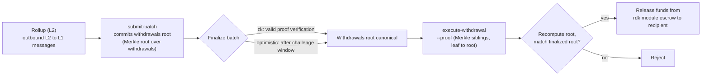

# ZK / STARK și retrageri

Această pagină acoperă două subiecte conexe: **sistemele de demonstrații ZK** (`snark` și `stark`) folosite de rollup-urile decontate prin ZK și **fluxul de retragere L2 → L1** care mută fondurile dintr-un rollup înapoi în QoreChain odată ce un lot este finalizat.

:::caution
Verificarea ZK și STARK este o parte aflată în plină maturizare a RDK. Tratează sistemele de demonstrații și fluxul de retragere descrise aici ca intenție de proiectare, validează pe testnet-ul **`qorechain-diana`** și nu presupune garanții criptografice consolidate pentru producție pe mainnet deocamdată.
:::

---

## Sisteme de demonstrații ZK

Un rollup decontat prin ZK (modul de decontare `zk`) atașează o demonstrație de validitate fiecărui lot de decontare, dovedind că tranziția de stare este corectă fără a re-executa tranzacțiile rollup-ului. Decontarea ZK suportă două sisteme de demonstrații:

| Sistem de demonstrații | Caracteristici |
| ------------ | --------------- |
| **`snark`** | Demonstrații succinte |
| **`stark`** | Demonstrații transparente — fără setup de încredere (trusted setup) |

Modul de decontare `zk` necesită fie `snark`, fie `stark`; asocierea este impusă on-chain atunci când rollup-ul este creat. Prin contrast, decontarea `optimistic` folosește sistemul de demonstrații `fraud`, iar decontările `based` și `sovereign` folosesc `none`. Vezi **[Prezentare generală a rollup-urilor](/rollups/overview)** pentru întreaga matrice de compatibilitate.

### Finalitate

Spre deosebire de rollup-urile optimiste — care așteaptă scurgerea unei ferestre de contestare prin demonstrație de fraudă — un lot ZK poate fi finalizat la **verificarea unei demonstrații valide**, fără o fereastră de dispută. Acesta este compromisul de bază al decontării ZK: finalitate mai puternică și mai rapidă în schimbul costului și complexității generării demonstrațiilor.

### Maturitate

Verificarea demonstrațiilor ZK și STARK este încă în maturizare. Tratează decontarea ZK ca **neconsolidată încă pentru producție**: prototipează și validează pe testnet și urmărește notele de lansare ale RDK pentru starea verificării complete a demonstrațiilor înainte de a te baza pe ea pentru rollup-uri de valoare pe mainnet.

---

## Cum transportă loturile retragerile

Când un rollup decontează un lot, acel lot poate, de asemenea, angaja mesajele inter-strat de ieșire ale rollup-ului — **retragerile sale L2 → L1**. Conceptual:

* Un lot finalizat poate transporta un angajament către setul său de retrageri (o rădăcină Merkle peste mesajele de retragere ale lotului).
* Fiecare retragere individuală este o frunză sub acea rădăcină, identificată prin indexul lotului și un index de retragere.
* Odată ce lotul este finalizat, orice parte poate dovedi că o anumită frunză de retragere este inclusă sub rădăcina angajată și poate declanșa plata.

Acesta este motivul pentru care retragerile depind de decontare: o retragere poate fi executată doar față de un lot **finalizat**, deoarece finalizarea este cea care face canonică rădăcina de retrageri angajată.

Pentru modul în care loturile sunt trimise și finalizate — inclusiv `submit-batch` și calea de dispută `challenge-batch` pentru rollup-urile optimiste — vezi **[Implementarea unui rollup](/rollups/deploying-a-rollup)**.

---

## Executarea unei retrageri: `execute-withdrawal`

Comanda `execute-withdrawal` finalizează o retragere L2 → L1 față de rădăcina de retrageri a unui lot finalizat. Aceasta dovedește că o frunză de retragere este angajată în acea rădăcină și plătește destinatarul din escrow-ul modulului rdk. Acțiunea este **fără permisiuni (permissionless)** — oricine poate trimite o demonstrație validă.

```bash
qorechaind tx rdk execute-withdrawal \
  [rollup-id] [batch-index] [withdrawal-index] [recipient] [denom] [amount] \
  --proof <sibling-hash-1>,<sibling-hash-2>,... \
  --from mykey \
  --chain-id qorechain-diana \
  --fees 500uqor
```

**Argumente poziționale:**

| Argument | Descriere |
| -------- | ----------- |
| `rollup-id` | Rollup-ul căruia îi aparține retragerea |
| `batch-index` | Lotul finalizat a cărui rădăcină de retrageri angajează această retragere |
| `withdrawal-index` | Indexul frunzei de retragere în cadrul acelui lot |
| `recipient` | Adresa către care se face plata |
| `denom` | Denominația de plătit |
| `amount` | Suma de plătit |

**Flag:**

| Flag | Descriere |
| ---- | ----------- |
| `--proof` | Hash-uri Merkle de frați (siblings) în format hex, separate prin virgulă, ordonate de la frunză la rădăcină, care dovedesc că frunza de retragere este angajată în rădăcina de retrageri a lotului |

Valoarea `--proof` este demonstrația de incluziune: hash-urile de frați de-a lungul căii de la frunza de retragere până la rădăcina de retrageri angajată a lotului. Modulul recalculează rădăcina din frunză și frații furnizați și o verifică față de rădăcina angajată a lotului finalizat înainte de a elibera fondurile din escrow.

---

## Fluxul de retragere de la cap la cap

*Calea L2 către L1: un lot de decontare angajează o rădăcină de retrageri, lotul se finalizează, apoi o demonstrație de incluziune fără permisiuni eliberează fondurile din escrow pe QoreChain.*



1. **Decontează un lot.** Operatorul rollup-ului trimite un lot de decontare cu `submit-batch`. Lotul poate angaja o rădăcină de retrageri peste mesajele sale de ieșire L2 → L1.
2. **Finalizează.** Lotul se finalizează conform modului de decontare al rollup-ului — la verificarea unei demonstrații valide pentru `zk` sau după fereastra de contestare pentru `optimistic` (în timpul căreia `challenge-batch` îl poate disputa).
3. **Dovedește și execută.** Odată finalizat, oricine trimite `execute-withdrawal` cu demonstrația de incluziune Merkle (`--proof`) pentru frunza de retragere specifică. Modulul verifică incluziunea față de rădăcina de retrageri a lotului finalizat și plătește destinatarul din escrow.

Deoarece pasul 3 este fără permisiuni și bazat pe demonstrație, o retragere nu depinde de cooperarea operatorului rollup-ului odată ce lotul care o transportă este finalizat.

---

## Conexe

* **[Prezentare generală a rollup-urilor](/rollups/overview)** — paradigmele de decontare și matricea de compatibilitate a sistemelor de demonstrații.
* **[Implementarea unui rollup](/rollups/deploying-a-rollup)** — comenzile de operator `submit-batch` și `challenge-batch`.
* **[Rollup Development Kit](/architecture/rollup-development-kit)** — referința modulului de nivel inferior.
