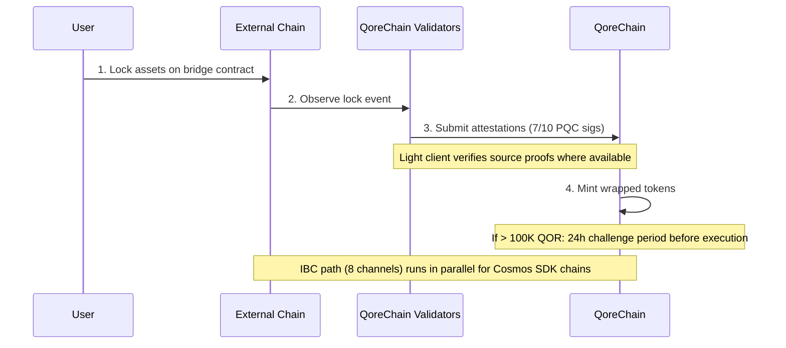

# Köprü Mimarisi

`x/bridge` modülü, QoreChain'i **37 QCB (QoreChain Bridge) zincir yapılandırması ve 8 IBC (Inter-Blockchain Communication) kanalı** aracılığıyla daha geniş blok zinciri ekosistemine bağlamak için tasarlanmıştır. Her köprü işlemi, kuantum sonrası kriptografi ile güvence altına alınır.

:::caution
Zincirler arası köprü **şu anda testnet aşamasında ve beklemededir — henüz bir üretim sistemi değildir**. Aşağıda açıklanan zincir yapılandırmaları, hafif istemciler ve akışlar, köprünün tasarlandığı ve testnet üzerinde denendiği haliyle yansıtılmaktadır. Harici bağlantı kademeli olarak devreye alınmaktadır; tüm hedefleri canlı mainnet garantileri olarak değil, tasarım amacı olarak değerlendirin.
:::

## Bağlantıya Genel Bakış

QoreChain, paralel olarak çalışan iki köprü protokolünü desteklemek üzere tasarlanmıştır:

| Protokol | Bağlantılar          | Güvenlik Modeli                       | Kullanım Senaryosu                      |
| -------- | -------------------- | ------------------------------------ | --------------------------------------- |
| **IBC**  | 8 kanal              | Standart IBC + PQC paket imzaları    | Cosmos SDK uyumlu zincirler             |
| **QCB**  | 37 zincir yapılandırması | 7/10 Dilithium-5 çoklu imza       | IBC olmayan zincirler (EVM, Solana, TON, vb.) |

**37 QCB zincir yapılandırması**, **36 harici zincir** ile QoreChain'in kendisini bir yerel/geri döngü (loopback) yapılandırması olarak (dahili yönlendirme ve kendine referanslı uzlaşma için kullanılır) içerir. 8 IBC kanalı, Cosmos SDK uyumlu zincirlere bağlanır.

## IBC Kanalları

QoreChain, Hermes v1.x aracılığıyla aktarılan aşağıdaki 8 zincire IBC bağlantıları sürdürmek üzere tasarlanmıştır:

| Zincir     | Açıklama                       |
| ---------- | ------------------------------ |
| Cosmos Hub | Birincil hub bağlantısı        |
| Osmosis    | DEX likidite yönlendirmesi     |
| Noble      | USDC yerel ihracı              |
| Celestia   | Veri kullanılabilirliği katmanı |
| Stride     | Likit staking                  |
| Akash      | Merkeziyetsiz hesaplama        |
| Babylon    | BTC restaking protokolü        |
| Injective  | DeFi / emir defteri birlikte çalışabilirliği |

### IBC Aktarıcı (Relayer) Yapılandırması

* **Aktarıcı yazılımı**: Hermes v1.x
* **İstemci güncellemeleri**: Otomatik hafif istemci yenileme
* **Kötü davranış tespiti**: Etkin — aktarıcı, çift imzalamayı (equivocation) izler
* **Paket temizleme**: Her 100 blokta bir, bekleyen IBC paketleri temizlenir
* **PQC geliştirmesi**: QoreChain'den kaynaklanan her IBC paketi, ileriye dönük kuantum güvenliği için isteğe bağlı bir Dilithium-5 imzası içerir. PQC farkındalığına sahip alıcı zincirler, bu imzayı standart IBC doğrulamasıyla birlikte doğrulayabilir.

## QCB (QoreChain Bridge) Protokolü

QCB protokolü, kuantum sonrası kriptografi ile güvence altına alınmış bir hub-and-spoke (merkez ve uçlar) mimarisi kullanır. QoreChain hub görevi görür; her harici zincir için spoke (uç) yapılandırmaları ve QoreChain'in kendisi için bir yerel/geri döngü yapılandırması bulunur.

### Harici Zincir Yapılandırmaları (36)

QCB protokolü, aşağıdaki 36 harici zinciri hedeflemek üzere tasarlanmıştır. QoreChain'in kendi yerel/geri döngü yapılandırmasıyla birlikte bu, **toplamda 37 QCB zincir yapılandırması (QoreChain'in kendisi dahil)** verir.

**Temel zincirler (10)**

Ethereum, Solana, TON, BSC, Avalanche, Polygon, Arbitrum, Optimism, Base, Sui.

**EVM ailesi zincirler (14)**

zkSync Era, Linea, Scroll, Blast, Mantle, Hyperliquid, Berachain, Sonic, Sei, Monad, Plasma, Filecoin FVM, Cronos, Kaia.

**EVM olmayan zincirler (5)**

Starknet, XRP Ledger, Stellar, Hedera, Algorand.

**Bekleyen zincirler (7)**

NEAR, Bitcoin, Cardano, Polkadot, Tezos, Tron, Aptos.

:::note
Sayı kontrolü: 10 temel + 14 EVM ailesi + 5 EVM olmayan + 7 bekleyen = **36 harici zincir**. QoreChain'in kendi yerel/geri döngü yapılandırması eklendiğinde **37 QCB zincir yapılandırması** elde edilir.
:::

### Adres Biçimleri

QCB protokolü, hedef adresleri doğrulamak için zincirleri türe göre sınıflandırır:

| Zincir Türü  | Örnek Zincirler                                                         | Adres Biçimi                                       |
| ------------ | ----------------------------------------------------------------------- | -------------------------------------------------- |
| `evm`        | Ethereum, BSC, Avalanche, Polygon, Arbitrum, Optimism, Base             | `0x` + 40 onaltılık karakter                       |
| `solana`     | Solana                                                                  | Base58, 32-44 karakter                             |
| `ton`        | TON                                                                     | `EQ` + base64 kodlu                                |
| `sui_move`   | Sui                                                                     | `0x` + 64 onaltılık karakter                       |
| `aptos_move` | Aptos                                                                   | `0x` + 64 onaltılık karakter                       |
| `bitcoin`    | Bitcoin                                                                 | Bech32 (`bc1`), P2SH (`3...`) veya eski (`1...`)   |
| `near`       | NEAR Protocol                                                           | `.near` soneki veya örtük                          |
| `cardano`    | Cardano                                                                 | `addr1` (ödeme) veya `stake1` (staking)            |
| `polkadot`   | Polkadot                                                                | SS58 kodlu                                         |
| `tezos`      | Tezos                                                                   | `tz1`/`tz2`/`tz3` (örtük) veya `KT1` (türetilmiş)  |
| `tron`       | TRON                                                                    | `T` + base58, 34 karakter                          |

## Hafif İstemciler

Harici zincir olaylarını güvene dayanmadan doğrulamak için köprü, her kaynak zincirin uzlaşma ve kanıt sistemine uyarlanmış zincir üstü hafif istemciler çalıştırmak üzere tasarlanmıştır. Bu hafif istemciler, QoreChain'in yalnızca doğrulayıcı tasdiklerine dayanmadan yatırma ve çekme işlemlerini doğrulamasını sağlar.

| Hafif İstemci           | Kaynak Zincir       | Doğrulama İlkelleri                                                  |
| ----------------------- | ------------------- | ------------------------------------------------------------------- |
| **Ethereum hafif istemcisi** | Ethereum / EVM L1 | BLS12-381 imza doğrulaması, SSZ serileştirme, MPT durum kanıtları |
| **Bitcoin SPV**         | Bitcoin             | Blok başlıklarına karşı Basitleştirilmiş Ödeme Doğrulaması          |
| **Starknet STARK**      | Starknet            | Starknet durum geçişlerinin STARK kanıt doğrulaması                 |
| **Sui BLS**             | Sui                 | Sui kontrol noktalarının BLS toplu imza doğrulaması                 |
| **Wormhole / Solana VAA** | Solana (Wormhole aracılığıyla) | Verified Action Approval (VAA) muhafız imzası doğrulaması |

## Yatırma Akışı (Harici Zincirden QoreChain'e)

Aşağıdaki dizi bir QCB yatırma işlemini gösterir: varlıklar harici bir zincirde kilitlenir, QoreChain doğrulayıcıları PQC imzalı tasdikler gönderir (7/10 Dilithium-5) ve sarmalanmış (wrapped) tokenlar basılır. Cosmos SDK uyumlu zincirler bunun yerine paralel IBC yolunu kullanır (8 kanal, isteğe bağlı Dilithium-5 paket imzalarıyla). Her iki yol da testnet/beklemededir.



```
External Chain          QoreChain Validators           QoreChain
     |                         |                          |
     | 1. Lock assets on       |                          |
     |    bridge contract      |                          |
     |------------------------>|                          |
     |                         | 2. Observe & attest      |
     |                         |    (7/10 PQC sigs)       |
     |                         |------------------------->|
     |                         |                          | 3. Mint wrapped
     |                         |                          |    tokens
     |                         |                          |
     |                         |    [If > 100K QOR]       |
     |                         |    24h challenge period   |
     |                         |    before execution       |
```

1. **Kilitleme** — Kullanıcı, harici zincirdeki köprü sözleşmesinde varlıkları kilitler.
2. **Tasdik** — Köprü doğrulayıcıları kilitleme işlemini gözlemler ve Dilithium-5 imzalı tasdikler gönderir. En az **10 doğrulayıcıdan 7'sinin** tasdiki gereklidir. Kaynak zincir için bir hafif istemci mevcut olduğunda, kilitleme olayı ek olarak zincirin kendi kanıtlarına karşı doğrulanır.
3. **Basım** — Tasdik eşiği karşılandığında, QoreChain üzerinde sarmalanmış tokenlar basılır.
4. **İtiraz dönemi** — 100.000 QOR eşdeğerini aşan transferler için, yürütmeden önce **24 saatlik bir itiraz dönemi** uygulanır. Bu pencere boyunca doğrulayıcılar şüpheli etkinlikleri işaretleyebilir.

## Çekme Akışı (QoreChain'den Harici Zincire)

```
QoreChain               QoreChain Validators           External Chain
     |                         |                          |
     | 1. Burn wrapped tokens  |                          |
     |------------------------>|                          |
     |                         | 2. Attest burn           |
     |                         |    (7/10 PQC sigs)       |
     |                         |------------------------->|
     |                         |                          | 3. Unlock original
     |                         |                          |    assets
```

1. **Yakma** — Kullanıcı, QoreChain üzerinde sarmalanmış tokenları yakar.
2. **Tasdik** — Doğrulayıcılar, yakma olayını Dilithium-5 imzalarıyla tasdik eder (7/10 eşiği).
3. **Kilit açma** — Eşik karşılandığında, orijinal varlıkların kilidi harici zincirde açılır.

Çekme işlemleri sırasında toplanan tüm köprü ücretleri, `bridge_fee` yakma kanalı aracılığıyla `x/burn` modülüne yönlendirilir (köprü ücretlerinin %100'ü yakılır).

### L2 → L1 Çekme Akışı (Rollup Uzlaşması)

Köprü ayrıca **rollup (L2) çekme işlemlerini ana zincirlerine (L1) geri uzlaştırmak** üzere de tasarlanmıştır. [Rollup Development Kit](/architecture/rollup-development-kit) aracılığıyla dağıtılan rollup'lar durumlarını periyodik olarak QoreChain'e bağlar (anchor); köprü, rollup'tan ana zincire çekme işlemlerini yetkilendirmek için bu kesinleşmiş bağlantıları (anchor) tüketir:

1. Bir kullanıcı, rollup (L2) üzerinde bir çekme işlemi başlatır ve bu işlem bir uzlaşma toplu işine (batch) dahil edilir.
2. Toplu iş QoreChain'e bağlanır ve rollup'ın uzlaşma moduna göre kanıtlanır/kesinleştirilir (örneğin, iyimser itiraz penceresi sona erdikten sonra veya geçerli kanıt doğrulaması üzerine).
3. Bağlantı (anchor) kesinleştiğinde, çekme işlemi talep edilebilir hale gelir ve ilgili varlıklar standart yak-ve-tasdik yolu aracılığıyla ana zincirde (L1) serbest bırakılır.

Bu, rollup kesinliğini doğrudan ana zincir uzlaşma garantilerine bağlar; böylece L2 çekme işlemleri, ilgili L2 durumu geri döndürülemez biçimde uzlaşmadan önce serbest bırakılamaz.

## Güvenlik Mimarisi

### PQC Çoklu İmza

Tüm QCB köprü işlemleri, kayıtlı köprü doğrulayıcılarından Dilithium-5 kuantum sonrası imzaların **7/10 eşiğini** gerektirir. Her köprü doğrulayıcısı şunlarla kaydolur:

* Bir QoreChain doğrulayıcı adresi
* Bir Dilithium-5 açık anahtarı (2.592 bayt)
* Desteklenen zincirlerin listesi
* Bir itibar puanı (`x/reputation` tarafından sürdürülür)

### Devre Kesiciler (Circuit Breakers)

Bağlı her zincirin bağımsız devre kesici korumaları vardır:

| Koruma                    | Açıklama                                                                              |
| ------------------------- | ------------------------------------------------------------------------------------ |
| **Tekil transfer limiti** | Zincir başına herhangi bir bireysel köprü işlemi için maksimum tutar                  |
| **Günlük toplam limit**   | 24 saatlik pencere başına zincir başına toplam hacim üst sınırı                       |
| **Manuel duraklatma**     | Zincir başına yönetişim veya doğrulayıcı tarafından tetiklenen acil durdurma          |
| **Anomali tespiti**       | Kısa bir pencerede >50 işlem olması veya hacmin günlük limitin 5 katını aşması durumunda otomatik duraklatma |

Devre kesici durumu zincir başına izlenir ve şunları içerir: maksimum tekil transfer, günlük limit, mevcut günlük kullanım, son sıfırlama yüksekliği ve sebebiyle birlikte duraklatma durumu.

### İtiraz Dönemi

Büyük transferler için (>100.000 QOR eşdeğeri, `large_transfer_threshold` aracılığıyla yapılandırılabilir):

* Tasdik eşiği karşılandıktan sonra **24 saatlik bir itiraz dönemi** (86.400 saniye) uygulanır.
* Bu pencere boyunca herhangi bir doğrulayıcı işlemi işaretleyebilir.
* İtiraz edilmezse, işlem dönem sona erdikten sonra otomatik olarak yürütülür.
* İtiraz edilen işlemler, yönetişim incelemesi için dondurulur.

### AI Yol Optimizasyonu

Köprü modülü, rota optimizasyonu için AI alt sistemiyle entegre olur. Birden fazla yol kat edebilen transferler için (örneğin, bir aracı aracılığıyla A zincirinden B zincirine), yol optimize edici şunları değerlendirir:

* Rotalar arasında tahmini ücretler
* Tahmini tamamlanma süresi
* Yol başına güvenlik puanı
* Tahminin güven düzeyi

## Köprü Yönetimi

### Dağıtım sonrası zincir etkinleştirme (yönetişim olmadan)

Zincir sürümü **v3.1.78** itibarıyla, bir köprü zinciri dağıtımdan sonra tek bir imzalı işlemle etkinleştirilebilir ve yeniden yapılandırılabilir — yönetişim önerisi ve zincir yükseltmesi olmadan. Bir `bridge_admin` anahtarı (genesis'te `BridgeConfig.BridgeAdmin` içinde ayarlanır) veya bir `qcb_bridge` lisansı sahibi şunları yapabilir:

* **`tx bridge update-chain-config`** — bir zincirin sözleşme adresini, onay sayısını, mimarisini ve durumunu ayarlar (`MsgUpdateChainConfig`).
* **`tx bridge set-verifier-bootstrap`** — bir zincir için etkin doğrulayıcıyı seçer ve güven kökünü kurar (`MsgSetVerifierBootstrap`).

Bu, bir operatörün bağlı bir zincirin köprüsünü doğrudan çevrimiçi getirmesine — veya doğrulayıcısını döndürmesine — olanak tanır; yetkilendirme köprü yönetici anahtarına karşı kontrol edilir.

### Bağlı ağları doğrulama

Zincir sürümü **v3.1.79** itibarıyla, eşleşen `validator_<chain>` (veya `qcb_bridge`) lisansını elinde bulunduran bir doğrulayıcı, harici ağın istemcisini aynı düğümde çalıştırabilir; bu istemci, lisans etkinleştirildikten sonra QoreChain'in orkestrasyonu altında otomatik olarak hazırlanır. Sürücüler 37 köprü ağının tümü için sunulur ve katılım modeline göre sınıflandırılır (izin gerektirmeyen doğrulayıcı, sınırlı/seçilmiş/kabul, L2 tam düğüm ve staking yapmayan/güven listesi). Harici ağın stake ve imzalama anahtarları, ağ başına operatör tarafından sağlanır. Operatör adımları için [Bir Doğrulayıcı Çalıştırma](/developer-guide/running-a-validator#connected-networks) bölümüne bakın.

## REST API Uç Noktaları

Zincir sürümü **v3.1.77** itibarıyla, köprü durumu `/qorechain/bridge/v1/...` öneki altında grpc-gateway aracılığıyla **REST üzerinden salt okunur** olarak da sorgulanabilir (`config`, `chains`, `chains/{chain_id}`, `validators`, `validators/{address}`, `operations`, `operations/{id}`) — daha önce yalnızca gRPC idi. Bunlar, gezginler ve hafif düğüm telemetrisi için HTTP üzerinden gerçek zincir üstü JSON sunar. Tam liste için [REST / gRPC Uç Noktaları](/api-reference/rest-grpc-endpoints#bridge-module) bölümüne bakın.

| Yöntem | Uç Nokta                                           | Açıklama                                         |
| ------ | -------------------------------------------------- | ------------------------------------------------ |
| GET    | `/bridge/v1/chains`                                | Desteklenen tüm zincir yapılandırmalarını listeler |
| GET    | `/bridge/v1/chains/{chain_id}`                     | Belirli bir zincirin yapılandırmasını getirir    |
| GET    | `/bridge/v1/validators`                            | Kayıtlı tüm köprü doğrulayıcılarını listeler      |
| GET    | `/bridge/v1/operations`                            | Tüm köprü işlemlerini listeler (en yeni önce)     |
| GET    | `/bridge/v1/operations/{operation_id}`             | Belirli bir işlemin ayrıntılarını getirir         |
| GET    | `/bridge/v1/locked/{chain}/{asset}`                | Bir zincir/varlık çifti için kilitli/basılmış tutarları getirir |
| GET    | `/bridge/v1/circuit-breakers`                      | Tüm devre kesici durumlarını listeler             |
| GET    | `/bridge/v1/estimate/{from}/{to}/{asset}/{amount}` | AI ile optimize edilmiş rota tahminini getirir    |

## Köprü Olayları

Köprü modülü, aşağıdaki zincir üstü olayları yayar:

| Olay Türü                     | Açıklama                                         |
| ----------------------------- | ----------------------------------------------- |
| `bridge_deposit`              | Yeni yatırma işlemi oluşturuldu                  |
| `bridge_withdraw`             | Yeni çekme işlemi oluşturuldu                    |
| `bridge_attestation`          | Doğrulayıcı tasdiki gönderildi                   |
| `bridge_operation_executed`   | İşlem kesinleştirildi ve yürütüldü               |
| `bridge_circuit_breaker_trip` | Devre kesici etkinleştirildi veya devre dışı bırakıldı |
| `bridge_validator_registered` | Yeni köprü doğrulayıcısı kaydedildi              |
| `bridge_pqc_verification`     | PQC imza doğrulama sonucu (IBC paketleri)        |

## İlgili

* [Varlıkları Köprüleme](/user-guide/bridging-assets) — varlıkları zincirler arasında adım adım taşıyın.
* [Panel Köprüsü](/dashboard/bridge) — günlük kullanıcılar için köprü arayüzü.
* [Babylon ile BTC Restaking](/architecture/btc-restaking-babylon) — Bitcoin destekli güvenlik.
* [Kuantum Sonrası Güvenlik](/architecture/post-quantum-security) — IBC paketlerinde PQC doğrulaması.
