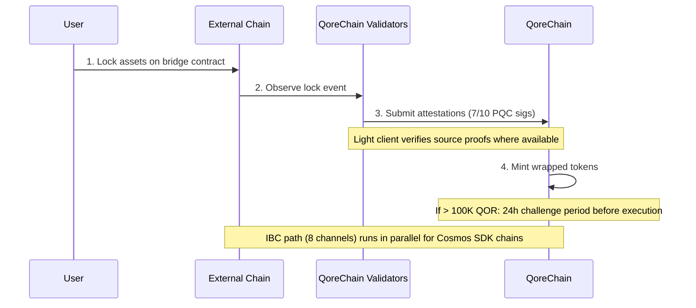

# Köprü Mimarisi

`x/bridge` modülü, QoreChain'i daha geniş blok zinciri ekosistemine **37 QCB (QoreChain Bridge) zincir yapılandırması ve 8 IBC (Inter-Blockchain Communication) kanalı** aracılığıyla bağlamak için tasarlanmıştır. Her köprü işlemi post-kuantum kriptografiyle güvence altına alınır.

:::caution
Çapraz zincir köprüsü **şu anda test ağındadır ve beklemededir — henüz bir üretim sistemi değildir**. Aşağıda açıklanan zincir yapılandırmaları, hafif istemciler ve akışlar, köprünün tasarlandığı ve test ağında uygulandığı haliyle yansıtılmaktadır. Harici bağlantı kademeli olarak kullanıma sunulmaktadır; tüm hedefleri canlı ana ağ garantileri olarak değil, tasarım niyeti olarak değerlendirin.
:::

## Bağlantıya Genel Bakış

QoreChain, paralel olarak çalışan iki köprü protokolünü desteklemek üzere tasarlanmıştır:

| Protokol | Bağlantılar          | Güvenlik Modeli                       | Kullanım Durumu                                |
| -------- | -------------------- | ------------------------------------ | --------------------------------------- |
| **IBC**  | 8 kanal           | Standart IBC + PQC paket imzaları | Cosmos SDK uyumlu zincirler            |
| **QCB**  | 37 zincir yapılandırması     | 10'da 7 Dilithium-5 çoklu imza         | IBC olmayan zincirler (EVM, Solana, TON, vb.) |

**37 QCB zincir yapılandırması**, **36 harici zincir** artı yerel/geri döngü yapılandırması olarak **QoreChain'in kendisini** içerir (dahili yönlendirme ve öz-referanslı uzlaşma için kullanılır). 8 IBC kanalı, Cosmos SDK uyumlu zincirlere bağlanır.

## IBC Kanalları

QoreChain, Hermes v1.x aracılığıyla aktarılan aşağıdaki 8 zincire IBC bağlantıları tutmak üzere tasarlanmıştır:

| Zincir      | Açıklama                    |
| ---------- | ------------------------------ |
| Cosmos Hub | Birincil hub bağlantısı         |
| Osmosis    | DEX likidite yönlendirmesi          |
| Noble      | USDC yerel ihracı            |
| Celestia   | Veri kullanılabilirlik katmanı        |
| Stride     | Likit stake                 |
| Akash      | Merkezi olmayan hesaplama          |
| Babylon    | BTC yeniden stake protokolü         |
| Injective  | DeFi / emir defteri birlikte çalışabilirliği |

### IBC Aktarıcı Yapılandırması

* **Aktarıcı yazılımı**: Hermes v1.x
* **İstemci güncellemeleri**: Otomatik hafif istemci yenileme
* **Yanlış davranış tespiti**: Etkin — aktarıcı eşdeğerlik (equivocation) için izleme yapar
* **Paket temizleme**: Her 100 blokta bir, bekleyen IBC paketleri temizlenir
* **PQC geliştirmesi**: QoreChain'den kaynaklanan her IBC paketi, ileriye dönük kuantum güvenliği için isteğe bağlı bir Dilithium-5 imzası içerir. PQC farkındalığı olan alıcı zincirler, bu imzayı standart IBC doğrulamasının yanında doğrulayabilir.

## QCB (QoreChain Bridge) Protokolü

QCB protokolü, post-kuantum kriptografiyle güvence altına alınmış bir hub-and-spoke mimarisi kullanır. QoreChain hub görevi görür, her harici zincir için spoke yapılandırmaları ve QoreChain'in kendisi için bir yerel/geri döngü yapılandırması bulunur.

### Harici Zincir Yapılandırmaları (36)

QCB protokolü, aşağıdaki 36 harici zinciri hedeflemek üzere tasarlanmıştır. QoreChain'in kendi yerel/geri döngü yapılandırmasıyla birleştiğinde, bu **toplamda 37 QCB zincir yapılandırması (QoreChain'in kendisi dahil)** verir.

**Temel zincirler (10)**

Ethereum, Solana, TON, BSC, Avalanche, Polygon, Arbitrum, Optimism, Base, Sui.

**EVM ailesi zincirler (14)**

zkSync Era, Linea, Scroll, Blast, Mantle, Hyperliquid, Berachain, Sonic, Sei, Monad, Plasma, Filecoin FVM, Cronos, Kaia.

**EVM olmayan zincirler (5)**

Starknet, XRP Ledger, Stellar, Hedera, Algorand.

**Bekleyen zincirler (7)**

NEAR, Bitcoin, Cardano, Polkadot, Tezos, Tron, Aptos.

:::note
Sayı kontrolü: 10 temel + 14 EVM ailesi + 5 EVM olmayan + 7 bekleyen = **36 harici zincir**. QoreChain'in kendi yerel/geri döngü yapılandırması eklendiğinde **37 QCB zincir yapılandırması** elde edilir.
:::

### Adres Biçimleri

QCB protokolü, hedef adresleri doğrulamak için zincirleri türlerine göre sınıflandırır:

| Zincir Türü   | Örnek Zincirler                                                          | Adres Biçimi                                     |
| ------------ | ----------------------------------------------------------------------- | -------------------------------------------------- |
| `evm`        | Ethereum, BSC, Avalanche, Polygon, Arbitrum, Optimism, Base             | `0x` + 40 hex karakter                           |
| `solana`     | Solana                                                                  | Base58, 32-44 karakter                           |
| `ton`        | TON                                                                     | `EQ` + base64 kodlu                              |
| `sui_move`   | Sui                                                                     | `0x` + 64 hex karakter                           |
| `aptos_move` | Aptos                                                                   | `0x` + 64 hex karakter                           |
| `bitcoin`    | Bitcoin                                                                 | Bech32 (`bc1`), P2SH (`3...`) veya eski (`1...`)  |
| `near`       | NEAR Protocol                                                           | `.near` soneki veya örtük                         |
| `cardano`    | Cardano                                                                 | `addr1` (ödeme) veya `stake1` (stake)            |
| `polkadot`   | Polkadot                                                                | SS58 kodlu                                       |
| `tezos`      | Tezos                                                                   | `tz1`/`tz2`/`tz3` (örtük) veya `KT1` (oluşturulmuş) |
| `tron`       | TRON                                                                    | `T` + base58, 34 karakter                        |

## Hafif İstemciler

Harici zincir olaylarını güven gerektirmeden doğrulamak için köprü, her kaynak zincirin konsensüsüne ve kanıt sistemine göre uyarlanmış zincir üstü hafif istemciler çalıştırmak üzere tasarlanmıştır. Bu hafif istemciler, QoreChain'in yalnızca doğrulayıcı onaylamalarına güvenmeden yatırma ve çekme işlemlerini doğrulamasına olanak tanır.

| Hafif İstemci            | Kaynak Zincir        | Doğrulama Temelleri                                              |
| ----------------------- | ------------------- | ------------------------------------------------------------------- |
| **Ethereum hafif istemci** | Ethereum / EVM L1 | BLS12-381 imza doğrulaması, SSZ serileştirme, MPT durum kanıtları |
| **Bitcoin SPV**         | Bitcoin             | Blok başlıklarına karşı Basitleştirilmiş Ödeme Doğrulaması                |
| **Starknet STARK**      | Starknet            | Starknet durum geçişlerinin STARK kanıt doğrulaması              |
| **Sui BLS**             | Sui                 | Sui kontrol noktalarının BLS toplu imza doğrulaması             |
| **Wormhole / Solana VAA** | Solana (Wormhole aracılığıyla) | Verified Action Approval (VAA) koruyucu imza doğrulaması     |

## Yatırma Akışı (Harici'den QoreChain'e)

Aşağıdaki sıra bir QCB yatırmasını gösterir: varlıklar harici bir zincirde kilitlenir, QoreChain doğrulayıcıları PQC imzalı onaylamalar gönderir (10'da 7 Dilithium-5) ve sarmalanmış tokenlar basılır. Cosmos SDK uyumlu zincirler bunun yerine paralel IBC yolunu kullanır (8 kanal, isteğe bağlı Dilithium-5 paket imzalarıyla). Her iki yol da test ağında/beklemededir.



```
External Chain          QoreChain Validators           QoreChain
     |                         |                          |
     | 1. Lock assets on       |                          |
     |    bridge contract      |                          |
     |------------------------>|                          |
     |                         | 2. Observe & attest      |
     |                         |    (7/10 PQC sigs)       |
     |                         |------------------------->|
     |                         |                          | 3. Mint wrapped
     |                         |                          |    tokens
     |                         |                          |
     |                         |    [If > 100K QOR]       |
     |                         |    24h challenge period   |
     |                         |    before execution       |
```

1. **Kilitle** — Kullanıcı, harici zincirdeki köprü sözleşmesinde varlıkları kilitler.
2. **Onayla** — Köprü doğrulayıcıları kilitleme işlemini gözlemler ve Dilithium-5 imzalı onaylamalar gönderir. **10'da 7** doğrulayıcı onaylaması minimum olarak gereklidir. Kaynak zincir için bir hafif istemci mevcut olduğunda, kilitlenen olay ek olarak zincirin kendi kanıtlarına karşı doğrulanır.
3. **Bas** — Onaylama eşiği karşılandığında, sarmalanmış tokenlar QoreChain'de basılır.
4. **Meydan okuma süresi** — 100.000 QOR eşdeğerini aşan transferler için, yürütmeden önce bir **24 saatlik meydan okuma süresi** geçerlidir. Bu pencere sırasında, doğrulayıcılar şüpheli faaliyetleri işaretleyebilir.

## Çekme Akışı (QoreChain'den Harici'ye)

```
QoreChain               QoreChain Validators           External Chain
     |                         |                          |
     | 1. Burn wrapped tokens  |                          |
     |------------------------>|                          |
     |                         | 2. Attest burn           |
     |                         |    (7/10 PQC sigs)       |
     |                         |------------------------->|
     |                         |                          | 3. Unlock original
     |                         |                          |    assets
```

1. **Yak** — Kullanıcı, QoreChain'de sarmalanmış tokenları yakar.
2. **Onayla** — Doğrulayıcılar, yakma olayını Dilithium-5 imzalarıyla onaylar (10'da 7 eşiği).
3. **Kilidi aç** — Eşiğe ulaşıldığında, orijinal varlıkların kilidi harici zincirde açılır.

Çekme işlemleri sırasında toplanan tüm köprü ücretleri, `bridge_fee` yakma kanalı aracılığıyla `x/burn` modülüne yönlendirilir (köprü ücretlerinin %100'ü yakılır).

### L2 → L1 Çekme Akışı (Rollup Uzlaşması)

Köprü ayrıca **rollup (L2) çekme işlemlerini ana zincirlerine (L1) geri uzlaştırmak** üzere tasarlanmıştır. [Rollup Geliştirme Kiti](/architecture/rollup-development-kit) aracılığıyla dağıtılan rollup'lar, durumlarını periyodik olarak QoreChain'e bağlar; köprü, rollup'tan ana zincire çekme işlemlerini yetkilendirmek için bu sonlandırılmış bağlantı noktalarını tüketir:

1. Bir kullanıcı, rollup'ta (L2) bir uzlaşma yığınına dahil edilen bir çekme işlemi başlatır.
2. Yığın, QoreChain'e bağlanır ve rollup'un uzlaşma moduna göre kanıtlanır/sonlandırılır (örneğin, iyimser meydan okuma penceresi sona erdikten sonra veya geçerli kanıt doğrulaması üzerine).
3. Bağlantı noktası sonlandırıldığında, çekme işlemi talep edilebilir hale gelir ve ilgili varlıklar standart yak-ve-onayla yolu aracılığıyla ana zincirde (L1) serbest bırakılır.

Bu, rollup sonlandırmasını doğrudan ana zincir uzlaşma garantilerine bağlar, böylece L2 çekme işlemleri ilgili L2 durumu geri döndürülemez şekilde uzlaştırılmadan önce serbest bırakılamaz.

## Güvenlik Mimarisi

### PQC Çoklu İmza

Tüm QCB köprü işlemleri, kayıtlı köprü doğrulayıcılarından **10'da 7 eşiği** Dilithium-5 post-kuantum imza gerektirir. Her köprü doğrulayıcısı şunlarla kayıt olur:

* Bir QoreChain doğrulayıcı adresi
* Bir Dilithium-5 açık anahtarı (2.592 bayt)
* Desteklenen zincirlerin bir listesi
* Bir itibar puanı (`x/reputation` tarafından tutulur)

### Devre Kesiciler

Bağlı her zincirin bağımsız devre kesici korumaları vardır:

| Koruma                | Açıklama                                                                          |
| ------------------------- | ------------------------------------------------------------------------------------ |
| **Tek transfer limiti** | Zincir başına herhangi bir bireysel köprü işlemi için maksimum tutar                         |
| **Günlük toplam limit** | 24 saatlik pencere başına zincir başına toplam hacim üst sınırı                                        |
| **Manuel duraklatma**          | Zincir başına yönetişim veya doğrulayıcı tetikli acil durdurma                           |
| **Anomali tespiti**     | Kısa bir pencerede >50 işlem veya hacim günlük limitin 5 katını aşarsa otomatik duraklatma |

Devre kesici durumu zincir başına izlenir ve şunları içerir: maksimum tek transfer, günlük limit, mevcut günlük kullanım, son sıfırlama yüksekliği ve nedenli duraklatma durumu.

### Meydan Okuma Süresi

Büyük transferler için (>100.000 QOR eşdeğeri, `large_transfer_threshold` ile yapılandırılabilir):

* Onaylama eşiği karşılandıktan sonra bir **24 saatlik meydan okuma süresi** (86.400 saniye) geçerlidir.
* Bu pencere sırasında, herhangi bir doğrulayıcı işlemi işaretleyebilir.
* Meydan okunmazsa, işlem süre sona erdikten sonra otomatik olarak yürütülür.
* Meydan okunan işlemler yönetişim incelemesi için dondurulur.

### Yapay Zeka Yol Optimizasyonu

Köprü modülü, yol optimizasyonu için yapay zeka alt sistemiyle entegre olur. Birden fazla yoldan geçebilen transferler için (örneğin, bir aracı aracılığıyla zincir A'dan zincir B'ye), yol optimize edici şunları değerlendirir:

* Yollar genelinde tahmini ücretler
* Tahmini tamamlanma süresi
* Yol başına güvenlik puanı
* Tahminin güven seviyesi

## REST API Uç Noktaları

Zincir sürümü **v3.1.77** itibarıyla, köprü durumu ayrıca `/qorechain/bridge/v1/...` öneki altında grpc-gateway aracılığıyla **REST üzerinden salt okunur** olarak sorgulanabilir (`config`, `chains`, `chains/{chain_id}`, `validators`, `validators/{address}`, `operations`, `operations/{id}`) — önceden yalnızca gRPC idi. Bunlar, gezginler ve hafif düğüm telemetrisi için HTTP üzerinden gerçek zincir üstü JSON sunar. Tam liste için [REST / gRPC Uç Noktaları](/api-reference/rest-grpc-endpoints#bridge-module) sayfasına bakın.

| Yöntem | Uç Nokta                                           | Açıklama                                      |
| ------ | -------------------------------------------------- | ------------------------------------------------ |
| GET    | `/bridge/v1/chains`                                | Desteklenen tüm zincir yapılandırmalarını listele          |
| GET    | `/bridge/v1/chains/{chain_id}`                     | Belirli bir zincir için yapılandırmayı al           |
| GET    | `/bridge/v1/validators`                            | Kayıtlı tüm köprü doğrulayıcılarını listele            |
| GET    | `/bridge/v1/operations`                            | Tüm köprü işlemlerini listele (en yenisi önce)   |
| GET    | `/bridge/v1/operations/{operation_id}`             | Belirli bir işlemin ayrıntılarını al              |
| GET    | `/bridge/v1/locked/{chain}/{asset}`                | Bir zincir/varlık çifti için kilitli/basılmış tutarları al |
| GET    | `/bridge/v1/circuit-breakers`                      | Tüm devre kesici durumlarını listele                  |
| GET    | `/bridge/v1/estimate/{from}/{to}/{asset}/{amount}` | Yapay zeka ile optimize edilmiş yol tahmini al                  |

## Köprü Olayları

Köprü modülü aşağıdaki zincir üstü olayları yayar:

| Olay Türü                    | Açıklama                                     |
| ----------------------------- | ----------------------------------------------- |
| `bridge_deposit`              | Yeni yatırma işlemi oluşturuldu                   |
| `bridge_withdraw`             | Yeni çekme işlemi oluşturuldu                |
| `bridge_attestation`          | Doğrulayıcı onaylaması gönderildi                 |
| `bridge_operation_executed`   | İşlem sonlandırıldı ve yürütüldü                |
| `bridge_circuit_breaker_trip` | Devre kesici etkinleştirildi veya devre dışı bırakıldı        |
| `bridge_validator_registered` | Yeni köprü doğrulayıcısı kaydedildi                 |
| `bridge_pqc_verification`     | PQC imza doğrulama sonucu (IBC paketleri) |

## İlgili

* [Varlık Köprüleme](/user-guide/bridging-assets) — varlıkları zincirler arasında adım adım taşıyın.
* [Kontrol Paneli Köprüsü](/dashboard/bridge) — günlük kullanıcılar için köprü arayüzü.
* [Babylon ile BTC Yeniden Stake](/architecture/btc-restaking-babylon) — Bitcoin destekli güvenlik.
* [Post-Kuantum Güvenlik](/architecture/post-quantum-security) — IBC paketlerinde PQC doğrulaması.
