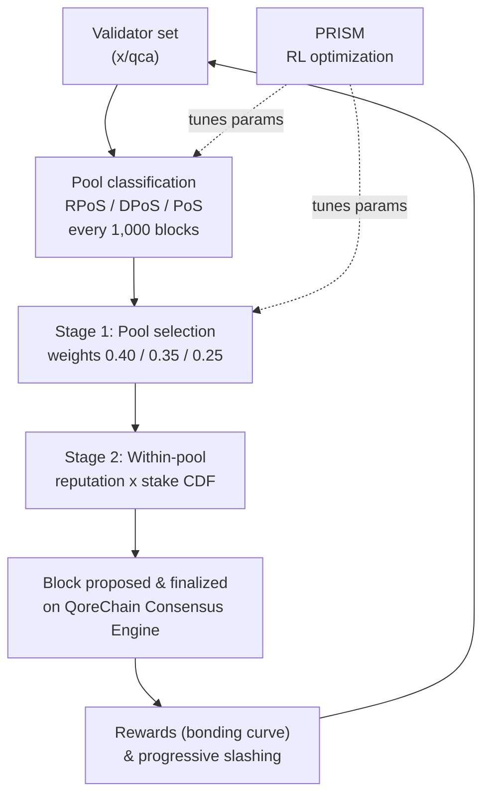

# Konsensüs Mekanizması

QoreChain, doğrulayıcıları üç uzmanlaşmış havuza ayıran ve güvenlik, merkeziyetsizlik ile performansı dengelemek için itibar ağırlıklı seçim kullanan bir konsensüs mekanizması olan **Üçlü Havuz Bileşik Hisse Kanıtı'nı (Triple-Pool Composite Proof-of-Stake, CPoS)** uygular. CPoS, `x/qca` modülünde uygulanır ve **QoreChain Konsensüs Motoru** üzerinde çalışır.

Konsensüs parametrelerini çalışma zamanında ayarlayan pekiştirmeli öğrenme optimizasyon katmanı **PRISM** (Policy-driven Reinforcement-learning for Intelligent State Machines) markasıyla anılır. Ayrıntılar için [PRISM Konsensüs Motoru](/architecture/prism-consensus-engine) sayfasına bakın.

Aşağıdaki diyagram, QoreChain Konsensüs Motoru üzerinde Üçlü Havuz CPoS'un bir blok/konsensüs döngüsünü özetler ve PRISM'in ayarlanabilir `x/qca` parametrelerine nerede geri besleme yaptığını gösterir.



---

## Üçlü Havuz Mimarisi

CPoS, aktif doğrulayıcı kümesini itibar, hisse ve delegasyon metriklerine dayanarak üç havuza böler. Her havuz, konsensüs sürecinde ayrı bir rol üstlenir.

### Havuz Sınıflandırması

| Havuz                                | Kriter                                                                   | Seçim Ağırlığı   |
| ------------------------------------ | ----------------------------------------------------------------------- | ---------------- |
| **RPoS** (İtibar Hisse Kanıtı)       | İtibar puanı >= 70. yüzdelik dilim **VE** öz-bağlanmış hisse >= medyan   | %40              |
| **DPoS** (Delege Edilmiş Hisse Kanıtı) | Toplam delegasyon >= 10,000 QOR                                        | %35              |
| **PoS** (Standart Hisse Kanıtı)      | Kalan tüm aktif doğrulayıcılar                                           | %25              |

Sınıflandırma şu önceliğe göre değerlendirilir: **RPoS > DPoS > PoS**. Hem RPoS hem de DPoS için uygun olan bir doğrulayıcı RPoS'a atanır.

Yeniden sınıflandırma her **1,000 blokta** bir gerçekleşir. Her yeniden sınıflandırma döneminde:

1. **İtibar puanlarını topla** — Tüm aktif doğrulayıcılar için itibar puanları `x/reputation` modülünden toplanır.
2. **İtibar eşiğini hesapla** — 70. yüzdelik dilim itibar eşiği, sıralanmış puan dağılımından hesaplanır.
3. **Medyan öz-bağlanmış hisseyi hesapla** — Medyan öz-bağlanmış hisse, sıralanmış hisse dağılımından hesaplanır.
4. **Doğrulayıcıları yeniden ata** — Her aktif doğrulayıcı, uygun olduğu en yüksek öncelikli havuza yeniden atanır.
5. **Varsayılan atama** — Sınıflandırılmamış doğrulayıcılar (henüz değerlendirilmemiş olanlar) varsayılan olarak PoS havuzuna girer.

---

## Havuz Ağırlıklı Öneren Seçimi

Blok önereni seçimi, iki aşamalı deterministik bir süreci izler.

### Aşama 1: Havuz Seçimi

Deterministik bir rastgele değer, sonraki bloğu hangi havuzun önereceğini seçer:

```
seed = SHA256(lastBlockHash || height || "pool")
randVal = uint64(seed[:8]) / MaxUint64    // uniform in [0, 1)
```

Havuz, `randVal` değerinin kümülatif ağırlık eşikleriyle karşılaştırılmasıyla seçilir:

* `randVal < 0.40` → RPoS havuzu
* `0.40 <= randVal < 0.75` → DPoS havuzu
* `randVal >= 0.75` → PoS havuzu

### Aşama 2: Havuz İçi Seçim

Seçilen havuz içinde öneren, bir **itibar × hisse ağırlıklı CDF** aracılığıyla seçilir. Havuzdaki her doğrulayıcı için:

1. İtibar puanı `r`, `x/reputation` modülünden alınır.
2. Bileşik ağırlık `w = r * tokens` şeklindedir.
3. Tüm bileşik ağırlıklardan bir kümülatif dağılım fonksiyonu (CDF) oluşturulur.
4. Öneren, blok hash'i ve yüksekliği ile tohumlanan deterministik bir rastgele çekiliş kullanılarak CDF'ye karşı seçilir.

### Yedek Davranış

Seçilen havuz boşsa, sistem PoS havuzuna geri döner. PoS havuzu da boşsa, seçim tüm aktif doğrulayıcı kümesi genelinde itibar ağırlıklı seçime geri döner.

---

## Özel Bağlanma Eğrisi

Doğrulayıcı ödülleri, uzun vadeli katılımı, yüksek itibarı ve protokol büyüme aşamalarıyla uyumu teşvik eden çok faktörlü bir bağlanma eğrisi kullanılarak hesaplanır.

### Formül

```
R(v, t) = beta * S_v * (1 + alpha * ln(1 + L_v)) * Q(r_v) * P(t)
```

### Faktör Tanımları

| Faktör                 | Sembol   | Açıklama                                                     | Varsayılan |
| ---------------------- | -------- | ----------------------------------------------------------- | ---------- |
| Temel Ödül Çarpanı     | `beta`   | Genel ödül büyüklüğünü ölçeklendirir                         | 1.0        |
| Öz-Bağlanmış Hisse     | `S_v`    | Doğrulayıcının öz-bağlanmış token'ları (uqor)               | --         |
| Sadakat Duyarlılığı    | `alpha`  | Sadakat süresinin ödülleri ne kadar artırdığını kontrol eder | 0.1       |
| Sadakat Süresi         | `L_v`    | Doğrulayıcının aktif olduğu ardışık blok sayısı             | --         |
| İtibar Kalitesi        | `Q(r_v)` | İtibar `r` değerini \[0.75, 1.25] aralığında bir ödül çarpanına eşler | -- |
| Protokol Aşaması       | `P(t)`   | Ödülleri başlatmak veya yumuşatmak için aşamaya bağlı çarpan | Aşağıya bakın |

### İtibar Kalitesi Fonksiyonu

```
Q(r) = 1 + 0.5 * (r - 0.5)
```

Sonuç **\[0.75, 1.25]** aralığına sıkıştırılır:

| İtibar Puanı     | Q(r)  |
| ---------------- | ----- |
| 0.0              | 0.75  |
| 0.25             | 0.875 |
| 0.5              | 1.0   |
| 0.75             | 1.125 |
| 1.0              | 1.25  |

### Protokol Aşaması Çarpanları

| Aşama   | P(t) | Açıklama                                          |
| ------- | ---- | ------------------------------------------------- |
| Genesis | 1.5  | Doğrulayıcı kümesini başlatmak için daha yüksek ödüller |
| Growth  | 1.0  | Ağ genişlemesi sırasında standart ödüller          |
| Mature  | 0.8  | Ağ kararlı hale geldikçe azaltılan emisyon         |

### Deterministik Matematik

`ln(1 + L_v)` hesaplaması, tamamen `LegacyDec` sabit hassasiyetli ondalıklar üzerinde çalışan argüman indirgemeli bir Taylor serisi yaklaşımı (`TaylorLn1PlusX`) kullanır. Konsensüs açısından kritik ödül hesaplamalarında kayan nokta aritmetiği kullanılmaz.

---

## Aşamalı Kesme (Progressive Slashing)

QoreChain, sabit kesme oranlarını, tekrar eden ihlalciler için sonuçları artıran ve ihlallerin zamanla azalmasına izin veren bir **aşamalı ceza modeliyle** değiştirir.

### Formül

```
penalty = base_rate * escalation_factor^effective_count * severity_factor
```

### Zamansal Azalma

Geçmiş ihlaller, etkin sayıma azalan bir ağırlık katar:

```
effective_count = SUM( 0.5^(blocks_since_i / decay_halflife) )
```

Geçmiş her ihlal `i` için katkı, her `decay_halflife` blokta bir yarıya iner (varsayılan: 100,000). Bu, 200,000 blok önce gerçekleşen tek bir eski ihlalin etkin sayıma yalnızca 0.25 katkı verdiği anlamına gelir.

### Şiddet Faktörleri

| İhlal Türü          | Şiddet Faktörü  |
| ------------------- | --------------- |
| Downtime            | 1.0             |
| Double Sign         | 2.0             |
| Light Client Attack | 3.0             |

### Azami Ceza

Ceza, bir doğrulayıcının ne kadar geçmiş ihlal biriktirdiğine bakılmaksızın, kesme olayı başına **%33** ile sınırlandırılmıştır.

### Örnek Hesaplama

2 önceki ihlali olan (biri 50,000 blok önce, biri 150,000 blok önce) bir doğrulayıcı çift imza (double-sign) yapar:

1. **Azalma katkıları**:
   * İhlal 1: `0.5^(50000 / 100000) = 0.5^0.5 = 0.707`
   * İhlal 2: `0.5^(150000 / 100000) = 0.5^1.5 = 0.354`
   * `effective_count = 0.707 + 0.354 = 1.061`
2. **Artış**: `1.5^1.061 = 1.516`
3. **Ceza**: `0.01 * 1.516 * 2.0 = 0.0303` (%3.03)

Bunu ilk kez ihlal eden biriyle karşılaştırın: `0.01 * 1.5^0 * 2.0 = 0.02` (%2.0).

---

## QDRW Yönetişimi

QoreChain yönetişimi, plütokratik ele geçirmeyi önlerken uzun vadeli ağ katılımcılarını ödüllendirmek için **İtibar Ağırlıklı Kuadratik Delegasyon'u (Quadratic Delegation with Reputation Weighting, QDRW)** kullanır.

### Oy Gücü Formülü

```
VP(v) = sqrt(staked + 2 * xQORE) * ReputationMultiplier(r)
```

Burada:

* `staked` = oy verenin bağlanmış QOR token'ları
* `xQORE` = oy verenin xQORE bakiyesi (uzun vadeli staking türevi)
* `2` = xQORE ağırlık çarpanı (yönetişimle yapılandırılabilir)
* `r` = oy verenin `x/reputation` modülünden alınan itibar puanı

### İtibar Çarpanı

İtibar çarpanı, bir sigmoid eğrisi aracılığıyla \[0, 1] aralığındaki `r` değerini \[0.5, 2.0] aralığında bir çarpana eşler:

```
ReputationMultiplier(r) = 0.5 + 1.5 * sigmoid(6 * (r - 0.5))
```

| İtibar Puanı     | Çarpan     |
| ---------------- | ---------- |
| 0.0              | 0.50       |
| 0.1              | 0.52       |
| 0.2              | 0.58       |
| 0.3              | 0.71       |
| 0.4              | 0.93       |
| 0.5              | 1.25       |
| 0.6              | 1.57       |
| 0.7              | 1.79       |
| 0.8              | 1.92       |
| 0.9              | 1.98       |
| 1.0              | 2.00       |

### Kuadratik Ölçeklendirme

Karekök fonksiyonu, oy gücünün hisseyle alt-doğrusal olarak ölçeklenmesini sağlar. Başka bir oy verenin 4 katı hisseye sahip bir oy veren, 4 kat değil yalnızca 2 kat oy gücü alır. Bu, büyük token sahiplerinin yönetişim kararlarına hâkim olmasını önler.

### Deterministik Matematik

`IntegerSqrt`, `LegacyDec` hassasiyetiyle Newton yöntemini kullanır. `SigmoidApprox`, 12 terimli bir Taylor serisi `ExpApprox` kullanır. Tüm yönetişim matematiği, tüm doğrulayıcı düğümlerinde tamamen deterministiktir.

---

## QCA Parametreleri

Aşağıdaki tablo, `x/qca` modülündeki yönetişimle yapılandırılabilen tüm parametreleri listeler:

### Temel Parametreler

| Parametre                  | Tür     | Varsayılan | Açıklama                                          |
| -------------------------- | ------- | ---------- | ------------------------------------------------- |
| `use_reputation_weighting` | bool    | `true`     | İtibar ağırlıklı öneren seçimini etkinleştir      |
| `min_reputation_score`     | float64 | `0.1`      | Aktif katılım için asgari itibar puanı            |

### Havuz Yapılandırması

| Parametre                 | Tür       | Varsayılan       | Açıklama                                         |
| ------------------------- | --------- | ---------------- | ------------------------------------------------ |
| `classification_interval` | uint64    | `1000`           | Havuz yeniden sınıflandırması arasındaki bloklar |
| `weight_rpos`             | LegacyDec | `0.40`           | RPoS havuz seçim ağırlığı                         |
| `weight_dpos`             | LegacyDec | `0.35`           | DPoS havuz seçim ağırlığı                         |
| `min_delegation_dpos`     | uint64    | `10,000,000,000` | DPoS için asgari delegasyon (uqor cinsinden 10,000 QOR) |
| `rep_percentile_rpos`     | uint64    | `70`             | RPoS için itibar yüzdelik eşiği                   |

### Bağlanma Eğrisi Yapılandırması

| Parametre          | Tür       | Varsayılan | Açıklama                                         |
| ------------------ | --------- | ---------- | ------------------------------------------------ |
| `alpha`            | LegacyDec | `0.1`      | Sadakat duyarlılığı katsayısı                    |
| `beta`             | LegacyDec | `1.0`      | Temel ödül çarpanı                               |
| `phase_multiplier` | LegacyDec | `1.5`      | Protokol aşaması ödül çarpanı (Genesis aşaması)  |

### Kesme Yapılandırması

| Parametre           | Tür       | Varsayılan | Açıklama                               |
| ------------------- | --------- | ---------- | -------------------------------------- |
| `base_rate`         | LegacyDec | `0.01`     | Temel kesme oranı (%1)                 |
| `escalation_factor` | LegacyDec | `1.5`      | Aşamalı artış tabanı                   |
| `max_penalty`       | LegacyDec | `0.33`     | Olay başına azami ceza (%33)           |
| `decay_halflife`    | uint64    | `100,000`  | İhlal ağırlığı yarı ömrü için bloklar  |

### QDRW Yönetişim Yapılandırması

| Parametre            | Tür       | Varsayılan | Açıklama                               |
| -------------------- | --------- | ---------- | -------------------------------------- |
| `enabled`            | bool      | `false`    | QDRW yönetişim sayımını etkinleştir    |
| `xqore_multiplier`   | LegacyDec | `2.0`      | Bağlanmış token'lara göre xQORE ağırlığı |
| `rep_min_multiplier` | LegacyDec | `0.5`      | Asgari itibar çarpanı                  |
| `rep_max_multiplier` | LegacyDec | `2.0`      | Azami itibar çarpanı                   |

## İlgili

* [PRISM Konsensüs Motoru](/architecture/prism-consensus-engine) — konsensüs parametrelerini ayarlayan yapay zeka katmanı.
* [Çok Katmanlı Mimari](/architecture/multilayer-architecture) — yan zincirlerin temel katmana nasıl bağlandığı.
* [Doğrulayıcı Çalıştırma](/developer-guide/running-a-validator) — zinciri güvence altına alan bir doğrulayıcıyı işletin.
* [Tokenomik](/architecture/tokenomics) — staking ödülleri, enflasyon ve kesme ekonomisi.
