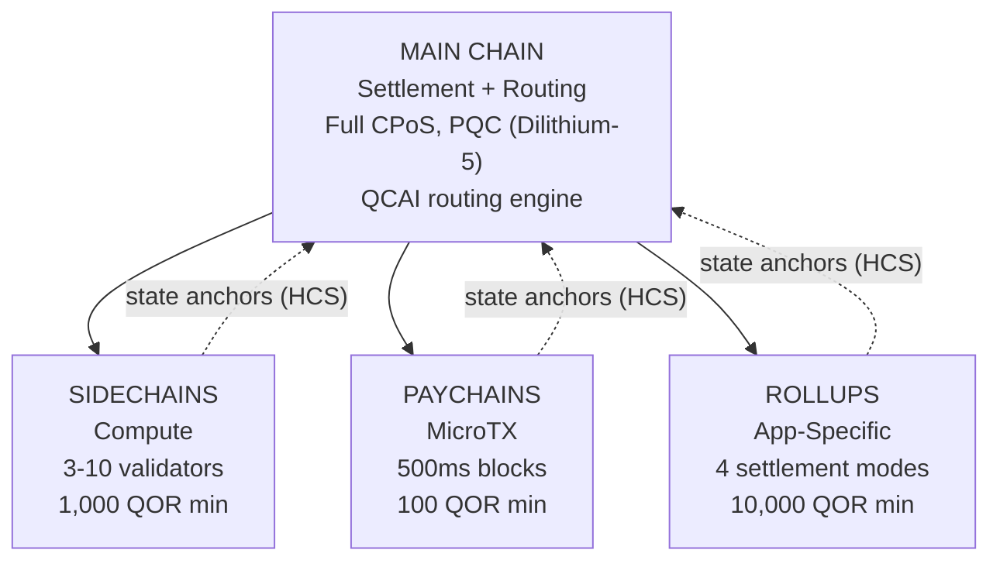

# Çok Katmanlı Mimari

QoreChain, `x/multilayer` modülü aracılığıyla **4 katmanlı hiyerarşik zincir mimarisi** uygular. Ana zincir, uzlaştırma ve güven kökü olarak hizmet ederken, alt katmanlar (yan zincirler, ödeme zincirleri ve rollup'lar) farklı performans ve güvenlik dengeleriyle özelleşmiş iş yüklerini ele alır.

---

## Sistem Genel Bakışı

Aşağıdaki 4 katmanlı hiyerarşi, ana zinciri uzlaştırma ve güven kökü olarak gösterir; üç alt katman türü, durum köklerini Hiyerarşik Bağlılık Şemaları (HCS) aracılığıyla ana zincire bağlar.



```
                    +---------------------------+
                    |       MAIN CHAIN          |
                    |  (Settlement + Routing)   |
                    |  Full CPoS consensus      |
                    |  PQC-secured (Dilithium-5)|
                    |  QCAI routing engine       |
                    +------+------+------+------+
                           |      |      |
              +------------+      |      +------------+
              |                   |                    |
    +---------v--------+ +-------v--------+ +---------v---------+
    |   SIDECHAINS     | |   PAYCHAINS    | |     ROLLUPS       |
    |  (Compute)       | |  (MicroTX)     | |  (App-Specific)   |
    |  3-10 validators | |  500ms blocks  | |  4 settlement     |
    |  1,000 QOR min   | |  100 QOR min   | |    modes          |
    |  Max: 10         | |  Max: 50       | |  10,000 QOR min   |
    +------------------+ +----------------+ |  Max: 100         |
                                            +-------------------+
```

---

## Katman Türleri

### Ana Zincir

Ana zincir, tüm QoreChain ekosisteminin güven köküdür.

| Özellik    | Değer                                                                          |
| ---------- | ------------------------------------------------------------------------------ |
| Uzlaşma    | Tam Üçlü Havuz CPoS (bkz. [Uzlaşma Mekanizması](/architecture/consensus-mechanism)) |
| Güvenlik   | Dilithium-5 imzalarıyla PQC güvenceli                                          |
| Rol        | Uzlaştırma katmanı, durum bağlantısı (anchor) depolama, QCAI yönlendirme motoru, güven kökü |
| Blok süresi | \~5 saniye                                                                    |

Tüm alt katmanlar, durum köklerini Hiyerarşik Bağlılık Şemaları (HCS) aracılığıyla periyodik olarak ana zincire bağlar.

### Yan Zincirler

Yan zincirler, DeFi protokolleri, oyun motorları ve IoT veri işleme gibi **yoğun hesaplama gerektiren işlemleri** ele alır.

| Parametre                  | Değer             |
| -------------------------- | ----------------- |
| Minimum doğrulayıcı sayısı | 3                 |
| Maksimum doğrulayıcı sayısı | 10               |
| Minimum oluşturucu teminatı | 1,000 QOR        |
| Maksimum aktif yan zincir  | 10                |
| Hedef alanlar              | DeFi, Gaming, IoT |

### Ödeme Zincirleri

Ödeme zincirleri, minimum gecikmeyle **yüksek frekanslı mikro işlemler** için optimize edilmiştir.

| Parametre                     | Değer                                   |
| ----------------------------- | --------------------------------------- |
| Hedef blok süresi             | 500 ms                                  |
| Maksimum aktif ödeme zinciri  | 50                                      |
| Minimum oluşturucu teminatı   | 100 QOR                                 |
| Hedef alanlar                 | Ödemeler, akış, mikro işlemler          |

### Rollup'lar

Rollup'lar, Rollup Geliştirme Kiti (`x/rdk`) aracılığıyla dağıtılan **uygulamaya özel zincirlerdir**. Çok katmanlı modül içinde bir rollup katman türü olarak kaydolurlar.

| Parametre                  | Değer                                       |
| -------------------------- | ------------------------------------------- |
| Uzlaştırma modları         | 4 (optimistic, zk, based, sovereign)        |
| Maksimum aktif rollup      | 100                                         |
| Minimum oluşturucu teminatı | 10,000 QOR                                 |
| Katman türü                | `rollup`                                    |
| Hedef alanlar              | DeFi, Gaming, NFT, Enterprise               |

Rollup dağıtımı ve yapılandırması, [Rollup Geliştirme Kiti](/architecture/rollup-development-kit) bölümünde ayrıntılı olarak ele alınmıştır.

---

## QCAI İşlem Yönlendirme

QCAI yönlendiricisi, gelen her işlem için tüm aktif katmanları değerlendirir ve 4 faktörlü ağırlıklı puanlama modeli kullanarak en uygun hedefi seçer.

### Puanlama Formülü

Her aday katman bileşik bir puan alır (yüksek olan daha iyidir):

```
Score = w_congestion * (1 - Congestion) + w_capability * Capability + w_cost * (1 - Cost) + w_latency * (1 - Latency)
```

| Faktör     | Ağırlık | Açıklama                                                                     |
| ---------- | ------- | --------------------------------------------------------------------------- |
| Tıkanıklık | 0.30    | Mevcut yük seviyesi (ters çevrilmiş: daha düşük tıkanıklık = daha yüksek puan) |
| Yetenek    | 0.40    | Katmanın işlem gereksinimleriyle ne kadar uyumlu olduğu                      |
| Maliyet    | 0.20    | Ana zincire göre ücret çarpanı (ters çevrilmiş: daha düşük maliyet = daha yüksek puan) |
| Gecikme    | 0.10    | Kesinliğe ulaşma için beklenen süre (ters çevrilmiş: daha düşük gecikme = daha yüksek puan) |

### Güven Eşiği

Yönlendirici, bir işlemi bir alt katmana yönlendirmeden önce minimum **0.6** güven puanı gerektirir. Hiçbir katman bu eşiği karşılamazsa, işlem varsayılan olarak ana zincire gider.

İşlem göndereni tarafından tercih edilen bir katman ipucu sağlanabilir. Tercih edilen katman, güven eşiğinin en az %80'i kadar puan alırsa (yani 0.48), yönlendirme hedefi olarak kabul edilir.

### Yük Sezgileri (Heuristics)

Ayrıntılı işlem meta verileri mevcut olmadığında, yönlendirici sınıflandırma sinyali olarak yük boyutunu kullanır:

| Yük Boyutu        | Tercih Edilen Katman | Gerekçe                                       |
| ----------------- | -------------------- | --------------------------------------------- |
| &lt; 256 bayt     | Ödeme Zinciri        | Muhtemelen basit bir transfer veya mikro işlem |
| 256 - 1,024 bayt  | Ana Zincir           | Standart işlem karmaşıklığı                    |
| > 1,024 bayt      | Yan Zincir           | Muhtemelen karmaşık bir sözleşme etkileşimi    |

---

## Hiyerarşik Bağlılık Şemaları (HCS)

Alt katmanlar, durumlarını **durum bağlantıları (state anchors)** aracılığıyla periyodik olarak ana zincire taahhüt eder. Her bağlantı, alt zincirin belirli bir yükseklikteki durumunun kriptografik bir kanıtını içerir.

### Bağlantı İçerikleri

| Alan                      | Açıklama                                              |
| ------------------------- | ---------------------------------------------------- |
| `layer_id`                | Alt katmanın tanımlayıcısı                           |
| `layer_height`            | Alt zincirdeki blok yüksekliği                       |
| `state_root`              | Alt zincirin durum ağacının Merkle kökü             |
| `validator_set_hash`      | Taahhüdü imzalayan doğrulayıcı setinin karması       |
| `pqc_aggregate_signature` | Bağlantı verileri üzerindeki Dilithium-5 toplu imzası |
| `transaction_count`       | Son bağlantıdan bu yana işlem sayısı                 |
| `compressed_state_proof`  | Sıkıştırılmış durum geçiş kanıtı                     |

### Bağlantı Gönderimi

Bağlantılar, `MsgAnchorState` aracılığıyla ana zincire gönderilir. Keeper, bağlantıyı aşağıdaki adımlara göre doğrular:

1. **Katman mevcut ve aktif** — Keeper, katmanın durumda mevcut olduğunu ve şu anda `active` durumuna sahip olduğunu doğrular.
2. **Minimum bağlantı aralığı geçti** — Keeper, bu katman için son bağlantıdan bu yana en az `min_anchor_interval` blok (varsayılan: 100) geçtiğini kontrol eder.
3. **PQC toplu imzası** — Keeper, PQC toplu imzasının mevcut olduğundan ve bağlantı verileri için geçerli olduğundan emin olur.

### İtiraz Süresi

Her bağlantı, **24 saatlik** (86.400 saniye, katman başına yapılandırılabilir) bir **itiraz süresine** girer. Bu süre boyunca herhangi bir taraf, `MsgChallengeAnchor` aracılığıyla bir dolandırıcılık kanıtı sunarak bağlantıya itiraz edebilir. Dolandırıcılık kanıtı geçerliyse, bağlantı geçersiz kılınır ve alt zincirin durumu önceki bağlantıya geri alınır.

İtiraz süresi başarılı bir itiraz olmadan sona erdikten sonra, bağlantı kesinleşmiş kabul edilir.

### Bağlantıları Okuma

Zincir sürümü **v3.1.80** itibarıyla, bağlantılar çok katmanlı sorgu hizmeti aracılığıyla **okunabilir** hale gelmiştir. İki sorgu, hem gRPC hem de REST üzerinden bağlantı durumunu sunar:

* **`Anchor`** (`/qorechain/multilayer/v1/anchor/{layer_id}`) — bir katman için en son kesinleşmiş durum bağlantısını döndürür.
* **`Anchors`** (`/qorechain/multilayer/v1/anchors/{layer_id}`) — bir katman için bağlantı geçmişini döndürür.

Her bağlantı, kanonik `layer_id || layer_height || state_root || validator_set_hash` mesajı üzerinde bir Dilithium-5 imzası taşıdığından (katman oluşturucusunun kayıtlı PQC anahtarına karşı doğrulanır), bir istemci bir bağlantıyı getirebilir ve hizmet veren düğüme güvenmeden **çevrimdışı** olarak doğrulayabilir. Bu, Rollup Geliştirme Kiti'nin [kuantum güvenli uzlaştırma makbuzlarının](/rollups/settlement-receipts) arkasındaki zincir üstü ilkeldir.

---

## Katmanlar Arası Ücret Paketleme (CLFB)

CLFB, kaynak katmandaki tek bir ücret ödemesinin, katmanlar arası bir işlem yolundaki birden çok katmandaki yürütmeyi kapsamasına olanak tanır.

### Ücret Hesaplama

```
avgMultiplier = sum(layer_multiplier_i) / num_layers
bundledFee = (totalGas / 1000) * avgMultiplier
```

Burada:

* `layer_multiplier_i`, işlem yolundaki her katman için temel ücret çarpanıdır (ana zincir = 1.0).
* `totalGas`, tüm katmanlardaki tahmini toplam gaz tüketimidir.
* Sonuç, minimum 1 uqor ücretle **uqor** cinsinden ifade edilir.

### Örnek

Katmanlar arası bir işlem üç katmana dokunur: ana zincir (çarpan 1.0), bir yan zincir (çarpan 0.5) ve bir ödeme zinciri (çarpan 0.1).

```
avgMultiplier = (1.0 + 0.5 + 0.1) / 3 = 0.533
bundledFee = (150,000 / 1000) * 0.533 = 80 uqor
```

CLFB, `cross_layer_fee_bundling` parametresi aracılığıyla genel olarak etkinleştirilebilir veya devre dışı bırakılabilir ve bireysel katmanlar, kendi `cross_layer_fee_bundling_enabled` yapılandırma bayrağı aracılığıyla katılmamayı seçebilir.

---

## Katman Yaşam Döngüsü

Her alt katman, iyi tanımlanmış bir yaşam döngüsünden geçer:

```
Proposed --> Active --> Suspended --> Decommissioned
                  \                /
                   +-- Active <--+
```

| Durum              | Açıklama                                                                        | İzin Verilen Geçişler     |
| ------------------ | ------------------------------------------------------------------------------- | ------------------------- |
| **Proposed**       | Katman kaydedilmiş ancak henüz etkinleştirilmemiş                               | Active, Decommissioned    |
| **Active**         | Katman çalışır durumda ve işlemleri kabul ediyor                                | Suspended, Decommissioned |
| **Suspended**      | Katman geçici olarak duraklatılmış (örn. bakım için veya güvenlik endişeleri nedeniyle) | Active, Decommissioned |
| **Decommissioned** | Katman kalıcı olarak kapatılmış (terminal durum)                                | Yok                       |

Durum geçişleri keeper tarafından zorunlu kılınır. Geçersiz geçişler (örn. Decommissioned'dan Active'e) reddedilir.

---

## Parametreler

| Parametre                      | Tür    | Varsayılan      | Açıklama                                                |
| ------------------------------ | ------ | --------------- | ------------------------------------------------------- |
| `max_sidechains`               | uint64 | `10`            | Maksimum aktif yan zincir sayısı                        |
| `max_paychains`                | uint64 | `50`            | Maksimum aktif ödeme zinciri sayısı                     |
| `min_anchor_interval`          | uint64 | `100`           | Durum bağlantıları arasındaki minimum blok sayısı       |
| `max_anchor_interval`          | uint64 | `1,000`         | Durum bağlantıları arasındaki maksimum blok sayısı (zorunlu bağlantı) |
| `default_challenge_period`     | uint64 | `86,400`        | Saniye cinsinden varsayılan itiraz süresi (24 saat)     |
| `min_sidechain_stake`          | string | `1,000,000,000` | Bir yan zincir oluşturmak için minimum teminat (uqor cinsinden 1,000 QOR) |
| `min_paychain_stake`           | string | `100,000,000`   | Bir ödeme zinciri oluşturmak için minimum teminat (uqor cinsinden 100 QOR) |
| `routing_enabled`              | bool   | `true`          | QCAI tabanlı işlem yönlendirmeyi etkinleştir            |
| `routing_confidence_threshold` | string | `0.6`           | QCAI yönlendirme kararları için minimum güven           |
| `cross_layer_fee_bundling`     | bool   | `true`          | Genel Katmanlar Arası Ücret Paketlemeyi etkinleştir     |
